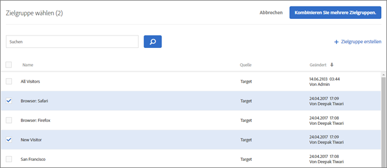
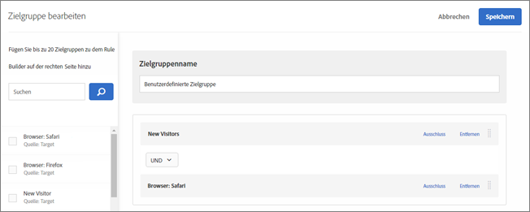
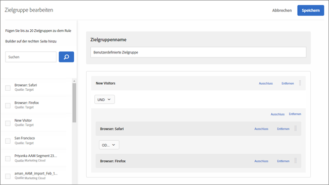
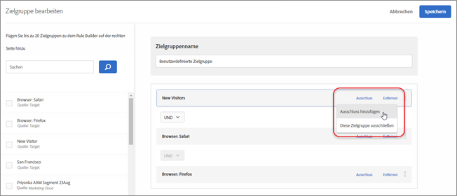
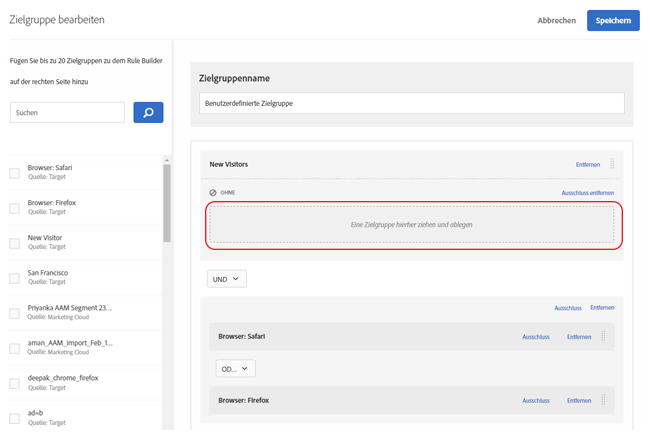
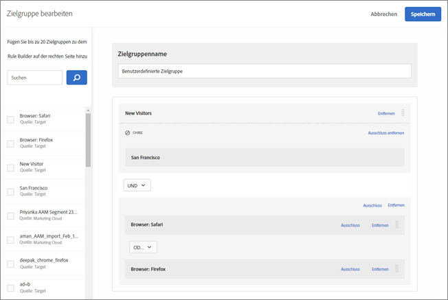
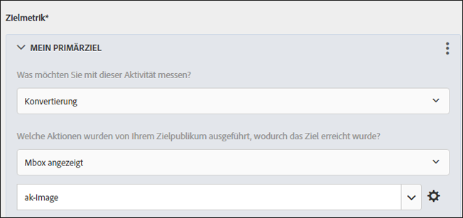
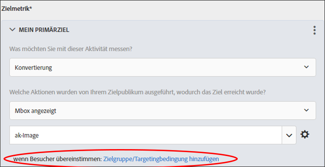
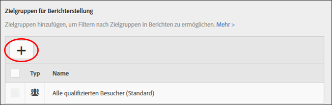

# Kombinieren mehrerer Zielgruppen{#combine-multiple-audiences}

Kombinieren mehrerer Zielgruppen (einschließlich Adobe Experience Cloud- und Target-Zielgruppen) ohne Zwischenschritte zur Erstellung von Ad-hoc-Zielgruppen. Sie können auch Ausschlussregeln erstellen und darüber Zielgruppen ausschließen.

Nehmen wir einmal an, Sie hätten die Zielgruppen „Neue Besucher“ und „Chrome-Anwender“ erstellt. Im Falle einer bestimmten Aktivität möchten Sie diese beiden Zielgruppen möglicherweise miteinander kombinieren, um neue Besucher mit dem Browser Chrome anzusprechen. Anstatt eine neue Zielgruppe zu erstellen und sie in der [!UICONTROL Zielgruppenbibliothek] zu speichern, können Sie die beiden Zielgruppen im Zuge der Aktivitätserstellung oder bei der Bearbeitung einer bereits bestehenden Aktivität miteinander kombinieren.

Außerdem können Sie beispielsweise Stammkunden hinzufügen, indem Sie ein bestimmtes Segment für den Treuestatus in [!DNL Audience Manager] hinzufügen und es mit einem [!DNL Target]-Segment, bestehend aus aktuell für das Treueprogramm angemeldeten Benutzern, kombinieren, anstatt eine dritte, permanente Zielgruppe zu erstellen.

Sie können mit den Operatoren AND und OR bis zu zehn Zielgruppen miteinander kombinieren.

Sie können kombinierte Zielgruppen an verschiedenen Stellen der [!DNL Target]-Oberfläche verwenden.

## Create a combined audience while creating an activity {#section_2F1CE9434CC04174B4BA2BFC89B85D77}

Sie können auf der [!UICONTROL Target]-Seite der Aktivität eine kombinierte Ad-hoc-Zielgruppe erstellen, während Sie durch den dreistufigen Prozess geleitet werden.

1. While creating an [activity](../c-activities/activities.md#concept_D317A95A1AB54674BA7AB65C7985BA03), on the **[!UICONTROL Target]** page, click the three vertical ellipses, then click **[!UICONTROL Replace Audience]**.

   

1. Aktivieren Sie auf der Seite [!UICONTROL Zielgruppe auswählen] diejenigen Kontrollkästchen neben den gewünschten Zielgruppen, die als Teil der kombinierten Zielgruppe dienen sollen.

   

1. Klicken Sie oben rechts auf **[!UICONTROL Kombinieren Sie mehrere Zielgruppen].**

   

1. (Bedingt) Bearbeiten Sie die neue kombinierte Zielgruppe nach Wunsch.

   Im Dialogfeld [!UICONTROL Zielgruppe bearbeiten] können Sie weitere Zielgruppenblöcke von der linken Seite in die neu kombinierte Zielgruppe ziehen und Ausschlussregeln und ausgeschlossene Zielgruppen hinzufügen.

   1. Sie können per Drag-and-drop Zielgruppen eines bereits bestehenden Abschnitts als Bausteine der Stufe 2 hinzufügen. Möchten Sie Bausteine der Stufe 1 hinzufügen, aktivieren Sie das Kontrollkästchen neben der gewünschten Zielgruppe und klicken Sie auf **[!UICONTROL Zu Regeln hinzufügen]**.

      Nehmen wir beispielsweise an, dass Sie jetzt Safari-Benutzer in die kombinierte Zielgruppe aufnehmen möchten. Suchen Sie nach der Zielgruppe &quot;Safari Browser&quot; und ziehen Sie sie auf der rechten Seite in das Feld&quot; Firefox Browser&quot; , wie im folgenden Beispiel:

      

      In diesem Fall lautet der Operator für die beiden Browsertypen „AND“. Wählen Sie die Dropdownliste Und aus und ändern Sie sie in &quot;OR&quot; , um eine neue kombinierte Zielgruppe für neue Besucher mit Firefox oder Safari zu erstellen. Achten Sie darauf, dass Ihre Regeln nicht alle Mitglieder der Zielgruppe ausschließen. Beispielsweise kann es nicht passieren, dass Benutzer eine Seite gleichzeitig mit Firefox und Safari besuchen.

      >[!NOTE]
      >
      >Der Operator (AND oder OR) muss beim Kombinieren von Zielgruppen gleich bleiben. Sie können Operatoren nicht mischen und passend machen.

   1. Um einer Regel einen Ausschluss hinzuzufügen, klicken Sie auf **[!UICONTROL Ausschluss]** &gt; **[!UICONTROL Ausschluss hinzufügen]**.

      

      Ziehen Sie eine Zielgruppe in das Feld:

      

      Um beispielsweise die US-Besucher aus neuen Besuchern auszuschließen, könnten Sie den Markt ziehen: Die US-Zielgruppe in das Feld, wie unten dargestellt:

      

      Diese kombinierte Zielgruppe enthält alle neuen Besucher Ihrer Site (außer denen aus San Francisco), die Safari oder Firefox verwenden.

   1. Um eine Zielgruppe aus einer Regel auszuschließen, klicken Sie auf **[!UICONTROL Ausschluss]** &gt; **[!UICONTROL Diese Zielgruppe ausschließen]**.

      Sie können z. B. eine kombinierte Zielgruppe erstellen, die alle neuen Besucher Ihrer Site enthält, ausgenommen diejenigen, die Firefox verwenden. Das Ausschließen der Besucher, die Firefox verwenden, ist leichter, als das Erstellen einer kombinierten Zielgruppe, die explizit mehrere Browser, außer Firefox, einschließt (Safari, Chrome und Internet Explorer).

1. Geben Sie einen beschreibenden Namen für die kombinierte Zielgruppe ein und klicken Sie auf **[!UICONTROL Speichern]**.

## Create a combined audience for use in metric targeting {#section_A42E795AFCBD4575809C5942039910F0}

Sie können eine kombinierte Ad-hoc-Zielgruppe, die Sie im Metrik-Targeting verwenden möchten, auf der Seite [!UICONTROL Ziele und Einstellungen] der Aktivität erstellen. So erstellen Sie beispielsweise ein Targeting basierend auf Konversionen mithilfe einer kombinierten Zielgruppe:

1. Wählen Sie beim Bearbeiten oder Erstellen einer [Aktivität](../c-activities/activities.md#concept_D317A95A1AB54674BA7AB65C7985BA03) auf der Seite **[!UICONTROL Ziele &amp; Einstellungen]** **[!UICONTROL Konversion]** für die Erfolgsmetrik aus und wählen Sie anschließend **[!UICONTROL Mbox angezeigt]** als Aktion aus.
1. Wählen Sie die gewünschte Mbox aus dem Feld **[!UICONTROL Mbox suchen]aus.**

   

1. Klicken Sie auf das Zahnradsymbol und anschließend auf **[!UICONTROL Zielgruppen-Targeting hinzufügen]**.
1. Klicken Sie auf den Link **[!UICONTROL Zielgruppe/Targetingbedingung hinzufügen]**, um das Dialogfeld [!UICONTROL Zielgruppe wählen] zu öffnen.

   

1. Fahren Sie mit [Schritt 2](../c-target/combining-multiple-audiences.md#section_2F1CE9434CC04174B4BA2BFC89B85D77) unter „Erstellen einer kombinierten Zielgruppe bei Erstellung einer Aktivität“ fort, um die kombinierte Zielgruppe zu erstellen.

## Erstellen einer kombinierten Zielgruppe zur Verwendung für die Berichterstellung {#section_4682D342EFBB43C38E54B99B3A1E14CD}

Sie können eine kombinierte Ad-hoc-Zielgruppe auch auf der Seite [!UICONTROL Ziele und Einstellungen] der Aktivität erstellen, um sie für Berichterstellungen zu nutzen.

1. Klicken Sie beim Bearbeiten oder Erstellen einer [Aktivität](../c-activities/activities.md#concept_D317A95A1AB54674BA7AB65C7985BA03) auf der Seite **[!UICONTROL Ziele &amp; Einstellungen]** auf das Symbol **[!UICONTROL Zielgruppe hinzufügen]** unter [!UICONTROL Zielgruppen für Berichterstellung], um die Seite [!UICONTROL Zielgruppe auswählen] anzuzeigen.

   

1. Fahren Sie mit [Schritt 2](../c-target/combining-multiple-audiences.md#section_2F1CE9434CC04174B4BA2BFC89B85D77) unter „Erstellen einer kombinierten Zielgruppe bei Erstellung einer Aktivität“ fort, um die kombinierte Zielgruppe zu erstellen.

## Create a combined audience while editing an activity {#section_364A12CE96E04B61B7C18113AA586C2C}

Sie können eine kombinierte Ad-hoc-Zielgruppe erstellen, während Sie eine bestehende Aktivität bearbeiten.

1. Fahren Sie auf der Seite [!UICONTROL Aktivitäten] mit dem Mauszeiger über die gewünschte Aktivität und klicken Sie anschließend auf das **[!UICONTROL Bearbeitungssymbol].**

   Oder

   Klicken Sie auf die gewünschte Aktivität, um sie zu öffnen, und klicken Sie anschließend auf **[!UICONTROL Aktivität bearbeiten]**.

1. Click the **[!UICONTROL Configure]** &gt; **[!UICONTROL Audiences]** &gt; **[!UICONTROL Multiple Audiences]**.

   

1. Klicken Sie auf das Symbol für weitere Optionen (drei vertikale Ellipsen) neben der aktuellen Zielgruppe der Aktivität und anschließend auf **[!UICONTROL Zielgruppe ändern]**.

   

1. Fahren Sie mit [Schritt 2](../c-target/combining-multiple-audiences.md#section_2F1CE9434CC04174B4BA2BFC89B85D77) unter „Erstellen einer kombinierten Zielgruppe bei Erstellung einer Aktivität“ fort, um die kombinierte Zielgruppe zu erstellen.