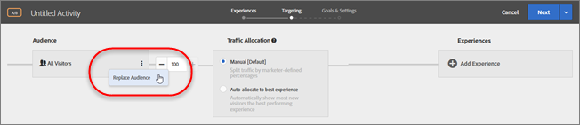

# Erstellen einer Zielgruppe „Nur Aktivität“{#create-an-activity-only-audience}

Erstellen Sie Zielgruppen „Nur Aktivität“ innerhalb des geleiteten Arbeitsablaufs mit drei Schritten, während Sie eine Aktivität erstellen. Diese Ad-hoc-Zielgruppen können an anderen Orten innerhalb derselben Aktivität verwendet werden, werden aber nicht in der Zielgruppenbibliothek gespeichert und können nicht in anderen Aktivitäten verwendet werden.

Zielgruppen „Nur Aktivität“ bieten die folgenden Vorteile:

* Sie können Zielgruppen „Nur Aktivität“ verwenden, um eine Zielgruppe zu erstellen, die Sie nur einmal verwenden und nicht in der Zielgruppenbibliothek speichern möchten. Somit sammeln sich keine Zielgruppen in der Zielgruppenbibliothek, die Sie nie wieder verwenden möchten.
* Zielgruppen „Nur Aktivität“ werden in der Zielgruppenbibliothek nicht angezeigt. Gleichzeitig sind sie so auch vor Änderungen durch andere Personen in Ihrer Organisation geschützt.

## Erstellen einer Zielgruppe „Nur Aktivität“

1. Klicken Sie beim Erstellen einer Aktivität im Feld **[!UICONTROL Zielgruppe]** auf das **[!UICONTROL Bearbeitungssymbol]** (drei vertikale Auslassungszeichen) und anschließend auf **[!UICONTROL Zielgruppe ersetzen]**.

   

1. Klicken Sie auf der Seite „Zielgruppe auswählen“ auf **[!UICONTROL Zielgruppe „Nur Aktivität“]**.

   

1. Klicken Sie auf **[!UICONTROL Zielgruppe erstellen]**.
1. Geben Sie einen beschreibenden Namen für die Zielgruppe ein.
1. Klicken Sie auf **[!UICONTROL + Regel hinzufügen]**.

   Regeln ermöglichen es, die Zielgruppe auf eine Untergruppe der Site-Besucher einzuschränken.

1. Wählen Sie einen Regeltyp aus.

   Jeder Regeltyp hat eigene Parameter. Weitere Informationen zum Konfigurieren der einzelnen Typen von Zielgruppenregeln finden Sie unter [Kategorien für Zielgruppen](../c-target/c-audiences/c-target-rules/target-rules.md#concept_E3A77E42F1644503A829B5107B20880D).

1. Definieren Sie die Regelparameter.
1. Klicken Sie auf **[!UICONTROL Speichern]**.

## Zu beachten

Berücksichtigen Sie beim Arbeiten mit Zielgruppen „Nur Aktivität“ folgende Informationen:

* Sie können Zielgruppen „Nur Aktivität“ im Visual Experience Composer (VEC) oder im Form-Based Experience Composer erstellen. Diese Funktionalität ersetzt Verfeinerungsregeln in früheren Versionen von Target.
* Sie können eine Aktivität erstellen und für die spätere Verwendung in anderen Aktivitäten in der Zielgruppenbibliothek speichern oder eine Zielgruppe „Nur Aktivität“ erstellen. Wenn Sie die Zielgruppe gespeichert haben, können Sie den Zielgruppentyp nicht mehr ändern.
* Verfeinerungen für vorhandene Aktivitäten werden in Zielgruppen „Nur Aktivität“ migriert.
* Der Status von Zielgruppen „Nur Aktivität“ kann „Verwendet“ oder „Nicht verwendet“ sein. Nicht verwendete Zielgruppen „Nur Aktivität“ werden angezeigt, bis die Aktivität gespeichert wird. Wenn Sie sie nicht verwenden und versuchen, die Aktivität zu speichern, wird Ihnen ein Warnhinweis angezeigt, der Sie darauf hinweist, dass die nicht verwendete Zielgruppe „Nur Aktivität“ gelöscht wird.
* Sie können die Details zur Zielgruppendefinition über Pop-up-Karten in der Zielgruppenauswahl anzeigen, ohne die Zielgruppe zu öffnen.
* Sie können [mehrere Zielgruppen kombinieren](../c-target/combining-multiple-audiences.md#concept_A7386F1EA4394BD2AB72399C225981E5), um „Nur Aktivität“-Zielgruppen zu erstellen.

