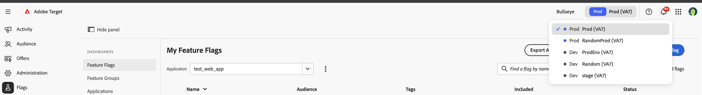

# Umgebungen – Übersicht {#environments-overview}

Flags wird auf Adobe Experience Platform erstellt. Wählen Sie vor dem Arbeiten mit Feature Flags die Sandbox aus, die Ihrer aktuellen Umgebung entspricht, genau wie bei jeder anderen Adobe Experience Platform-Anwendung.

## Auswählen einer Sandbox {#how-to}

Verwenden Sie den Sandbox-Umschalter in der oberen Navigationsleiste der Konsole „Flags“, um die richtige Sandbox auszuwählen, bevor Sie Feature Flags erstellen oder ändern.

## Siehe auch {#see-also}

* [Melden Sie sich bei der Konsole an](log-in-to-the-console.md)
* [Zugriff anfordern](request-access.md)

<!-- -->
