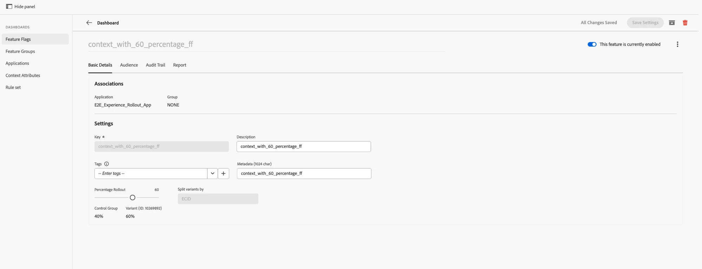

# Berichterstellung {#reporting}

Flags ermöglicht Berichte über **Customer Journey Analytics (CJA)**. Eine **Bericht**-Registerkarte ist auf jeder Detailseite für Feature Flag und Feature Group verfügbar. Damit können Sie einen CJA-Bericht anzeigen, der sich auf diese bestimmte Markierung oder Gruppe bezieht und direkt in die Seite eingebettet ist.

>[!NOTE]
>
>Berichte werden standardmäßig mit einem **30 Tage** Berichtsfenster geöffnet. Sie können den Bereich in der Panel-Kopfzeile anpassen.

## Voraussetzungen {#prerequisites}

Bevor Sie Berichte anzeigen können, stellen Sie Folgendes sicher:

1. Das Reporting ist für Ihre Anwendung eingerichtet - siehe [Einrichten von CJA für Feature Flags-Reporting](set-up-cja-reporting.md).
1. Das Feature Flag oder die Feature Group ist aktiv und enthält gesammelte Daten.

## Anzeigen eines Berichts {#view-report}

### Öffnen Sie die Registerkarte Bericht und wählen Sie eine Datenansicht {#open-report-tab}

1. Öffnen Sie ein Feature Flag oder eine Feature Group und wählen Sie die Registerkarte **Bericht** aus.
1. Ein **Datenansicht auswählen** wird geöffnet, in dem die für Sie verfügbaren CJA-Datenansichten aufgelistet sind. Die erste ist standardmäßig ausgewählt.
1. Wählen Sie die gewünschte Datenansicht aus und klicken Sie auf **Bericht anzeigen**. Klicken Sie **Abbrechen**, um das Dialogfeld zu schließen, ohne einen Bericht zu laden.
1. Der Bericht wird innerhalb der Registerkarte geladen und umfasst die Entitäts-ID dieses Flags oder dieser Gruppe.

>[!NOTE]
>
>Im Dialogfeld werden nur die Datenansichten aufgelistet, auf die Sie in der aktuellen Sandbox Zugriff haben. Wenn keine verfügbar sind, wird im Dialogfeld eine Meldung angezeigt und **Bericht anzeigen** bleibt deaktiviert - Überprüfen Sie Ihre Datenansichtsberechtigungen oder wechseln Sie die Sandbox.

### Anzeigen des Leistungsberichts {#view-performance-report}

Das eingebettete Dashboard **Übersicht über Flags** wird angezeigt:

* **Personen insgesamt**, **Personenbeteiligung nach Tag** und **Personenbeteiligung nach Variante** (Kontrollgruppe vs. Varianten-IDs)
* Eine **Übersicht**-Tabelle, in der jede Variante mit der Personenzahl und dem Beteiligungsprozentsatz aufgelistet ist

Passen Sie den Datumsbereich in der Kopfzeile des Bedienfelds an, um ihn für ein anderes Fenster erneut darzustellen (standardmäßig 30 Tage).

### Experimentergebnisse anzeigen {#explore-experimentation-results}

1. Im Bedienfeld **Experimentieren** werden **Experiment** (Flag- oder Gruppenentitäts-ID) und **Kontrollvariante** vorausgewählt.
1. Fügen Sie **Erfolgsmetrik** mit **Metrik hinzufügen** hinzu und wählen Sie eine **Normalisierungsmetrik** (Standard **Personen**), basierend auf dem Diagramm, das Sie plotten möchten.
1. Aktivieren Sie optional **Obere/Untere Konfidenzgrenzen einschließen**.
1. Wählen Sie **Erstellen**, um **Steigerung**, **Konfidenz** und **Konversionsrate** für die ausgewählte Metrik zu berechnen.

Weitere Informationen [ Berechnung dieser Metriken finden ](https://experienceleague.adobe.com/de/docs/analytics-platform/using/cja-workspace/panels/experimentation) in der Dokumentation zum Experimentier Bedienfeld .

## Siehe auch {#see-also}

* [Einrichten von CJA für Feature Flags-Berichte](set-up-cja-reporting.md)
* [Erstellen des ersten Feature Flags](create-your-first-feature-flag.md)
* [A/B-Tests mit Feature Flags](a-b-testing.md)
* [Erstellen einer Funktionsgruppe](create-a-feature-group.md)

<!-- -->
