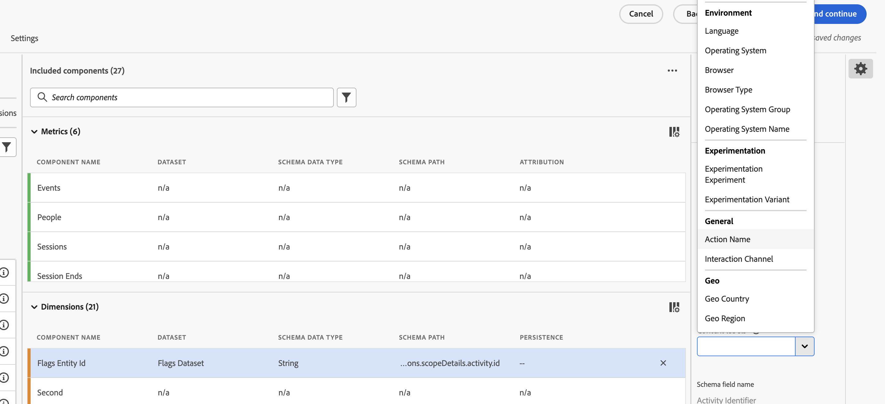

# Einrichten von CJA für Feature Flags-Berichte {#set-up-cja-reporting}

Die Integration zwischen Flags und Adobe Customer Journey Analytics (CJA) bietet eine einheitliche Möglichkeit, die geschäftlichen Auswirkungen von Feature-Flag-Varianten zu messen. Sie können jederzeit Erfolgsmetriken von CJA auf Berichte anwenden und Customer Journey Analytics-Funktionen wie das [Experimentier-Bedienfeld](https://experienceleague.adobe.com/de/docs/analytics-platform/using/cja-workspace/panels/experimentation) nutzen, um die Experimentleistung zu bewerten und zu verstehen, wie sich Funktionsvarianten auf das Kundenverhalten auswirken.

## Zu beachten {#considerations}

Beachten Sie die folgenden Informationen, bevor Sie die Integration von Customer Journey Analytics und Flags verwenden:

* Sie und Ihr Unternehmen müssen Zugriff auf Adobe Customer Journey Analytics (CJA) haben.
* Der **AJO ExD-Entscheidungsereignis-Datensatz** muss in der Sandbox für Markierungsereignisse bereitgestellt werden.
* Es muss ein Datensatz mit den Erfolgskonversionsereignissen verfügbar sein, die Sie als Erfolgsmetriken verwenden möchten.

## Einrichten eines Datenstroms {#set-up-datastream}

>[!NOTE]
>
>In diesem Handbuch wird ein Commerce Experience Event-Datensatz verwendet und nur als Beispiel `commerce.purchases.value`. Wählen Sie das Schema und das zugeordnete Erfolgsmetrikfeld aus, die für Ihren Anwendungsfall geeignet sind.

1. Wechseln Sie in „Datenerfassung“ zu **Datenströme** und erstellen oder öffnen Sie den Datenstrom zur Belichtung mit Flags.
1. Legen Sie sein Zuordnungsschema auf **AJO ExD Decision Event Schema** fest.
1. Öffnen Sie den Datenstrom und wählen Sie **Service hinzufügen** aus.
1. Wählen Sie den vorhandenen **AJO ExD Decision Event-** als Ereignisdatensatz aus und speichern Sie ihn.

>[!NOTE]
>
>Die soeben erstellte Datenstrom-ID wird verwendet, um die Flags-Erweiterung in Datenerfassungs-Tags zu konfigurieren.

## Einrichten einer Customer Journey Analytics-Verbindung {#set-up-connection}

Wenn Sie bereits eine Verbindung eingerichtet haben, können Sie Ihre bestehende Verbindung verwenden und mit Schritt 3 unten fortfahren. Über die -Verbindung kann Customer Journey Analytics mit dem Abrufen von Daten aus dem Datensatz für das Reporting beginnen.

1. Wählen Sie in Customer Journey Analytics auf der Seite **Verbindungen** die Option **Neue Verbindung erstellen** aus.
1. Konfigurieren Sie [Verbindungs- und Dateneinstellungen](https://experienceleague.adobe.com/en/docs/analytics-platform/using/cja-connections/overview) mit den richtigen Informationen.
1. Fügen Sie den ExD-Ereignisdatensatz hinzu, den Sie beim Konfigurieren Ihres Datenstroms verwendet haben.
1. Fügen Sie den Datensatz hinzu, den Sie als Konversionsereignisse verwenden möchten, und klicken Sie dann auf **Weiter**.
1. Konfigurieren Sie [Einstellungen für jeden ausgewählten Datensatz](https://experienceleague.adobe.com/en/docs/analytics-platform/using/cja-connections/create-connection#dataset-settings) einzeln im Dialogfeld **Datensätze hinzufügen**.

## Datenansicht einrichten {#set-up-data-view}

Einrichten einer Datenansicht in Customer Journey Analytics. Eine Datenansicht stellt sicher, dass die Daten aus Ihrer Verbindung ordnungsgemäß verwendet werden können.

1. Richten Sie Ihre Datenansicht ein und vergewissern Sie sich, dass sie auf die oben erstellte Verbindung verweist. Weitere Informationen finden Sie unter [Datenansicht erstellen oder bearbeiten](https://experienceleague.adobe.com/en/docs/analytics-platform/using/cja-dataviews/create-dataview) im *Adobe Customer Journey Analytics-Handbuch*.
1. Navigieren Sie **Daten-Management** > **Datenansichten**.
1. Wählen Sie **Neue Datenansicht erstellen** und wählen Sie die CJA-Verbindungsflags aus.
1. Geben Sie einen Namen für die Datenansicht und eine stabile externe ID ein.
1. Bestätigen Sie die Zeitzonen- und Kalendereinstellungen und fahren Sie dann mit **Komponenten** fort.

### Konfigurieren von Experiment- und Variantendimensionen {#configure-experiment-variant-dimensions}

1. Fügen Sie `_experience.decisioning.propositions.scopeDetails.activity.id` (zugeordnet zu **Kennzeichnet Entitäts-ID**) zu Dimensionen hinzu und benennen Sie sie in „Kennzeichnet Entitäts-ID“ oder einen anderen analysefreundlichen Namen um.
1. Setzen Sie die Kontextbeschriftung auf „Experimentierexperiment“.
1. Fügen Sie `_experience.decisioning.propositions.scopeDetails.experience.id` (der Variante der Feature Flags oder der Feature Group zugeordnet) zu Dimensionen hinzu.
1. Setzen Sie die Kontextbeschriftung auf „Experimentvariante“.

>[!WARNING]
>
>Ohne beide Experimentierkontextbeschriftungen kann das CJA-Experimentier-Bedienfeld keine Markierungen für Experimente und Varianten identifizieren.

### Konfigurieren von Persistenz und Attribution {#configure-persistence-attribution}

Konfigurieren Sie die Dimensionen und Metriken, damit eine Risikoposition für eine spätere Konversion angerechnet werden kann. Ohne angemessene Persistenz oder Attribution kann CJA nur Ergebnisse zuordnen, die am selben Ereignis wie die Exposition auftreten.

1. Fügen Sie unter Metriken das erforderliche Konversionsfeld hinzu, z. B. `commerce.purchases.value`.
1. Geben Sie der Metrik einen eindeutigen Namen, z. B **„Kaufwert**.
1. Aktivieren Sie die Attribution und wählen Sie das für die Analyse erforderliche Modell aus: Letztkontakt, Erstkontakt, Teilnahme oder Selber Kontakt. Weitere [ zu Attributionsmodellen](https://experienceleague.adobe.com/en/docs/analytics-platform/using/cja-workspace/attribution/models) Containern und Lookback-Fenstern finden Sie unter Attributionskomponenten .
1. Wählen Sie einen Container und ein Lookback-Fenster aus, die der Experimentstrategie entsprechen. Ein Personen-Container mit einem besuchs- oder sitzungsabhängigen Lookback ist ein häufiger Ausgangspunkt, validieren ihn jedoch für Ihren Anwendungsfall.
1. Speichern Sie die Datenansicht.

## Siehe auch {#see-also}

* [Berichterstellung](reporting.md)

<!-- -->
