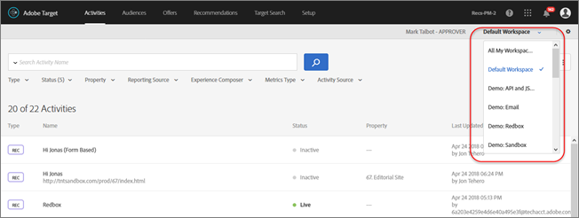

# Berechtigungen für Unternehmensbenutzer

Berechtigungen für Unternehmensbenutzer sind eine Möglichkeit, unternehmensweiten Benutzerzugriff auf [!DNL Adobe Target] formal zu verwalten. Fügen Sie Benutzer zu [!DNL Target] hinzu, weisen Sie Berechtigungen basierend auf ihren Rollen zu und erstellen Sie Arbeitsbereiche für Teams basierend auf verschiedenen Abteilungen, globalen Standorten, Kanälen und anderen logischen Gruppierungen. Sie können Benutzern die Rollen [!UICONTROL Observer], [!UICONTROL Editor], [!UICONTROL Approver] oder [!UICONTROL Publisher] zuweisen.

## Bestimmen, ob Sie Zugriff auf Unternehmensbenutzerberechtigungen haben

>[!NOTE]
>
>Die Funktion [!UICONTROL Properties and Permissions] ist als Bestandteil der Lösung [!DNL Target] Premium verfügbar. Für [!DNL Target] Standard sind sie nicht ohne [!DNL Target] Premium-Lizenz verfügbar.
>
>Ihre [!DNL Target] -Implementierung kann eine beliebige Version von at.js oder [!DNL Adobe Experience Platform Web SDK] verwenden.

Sie können feststellen, ob Ihre Organisation über eine Standard- oder Premium-Lizenz verfügt, indem Sie oben in der Benutzeroberfläche von [!DNL Target] auf den Link [!UICONTROL Administration] klicken.

* **[!DNL Target Standard]Kunden**: Wenn die Registerkarte [!UICONTROL Users] ([!UICONTROL Administration > Users]) angezeigt wird (und nicht die Registerkarte [!UICONTROL Properties]), verfügt Ihr Unternehmen über eine [!DNL Target Standard] -Lizenz. [!DNL Target Standard] -Kunden sollten die Anweisungen in [Benutzer](/help/main/administrating-target/c-user-management/c-user-management/user-management.md) befolgen, um Benutzer hinzuzufügen und Berechtigungen in der [!DNL Adobe Admin Console] zuzuweisen.

* **[!DNL Target Premium]Kunden**: Wenn die Registerkarte [!UICONTROL Properties] ([!UICONTROL Administration > Properties]) und die Registerkarte [!UICONTROL Users] angezeigt werden, verfügt Ihr Unternehmen über eine [!DNL Target Premium] -Lizenz. [!DNL Target Premium]-Kunden sollten die Anweisungen in diesem Artikel und in [Konfigurieren von Unternehmensberechtigungen](/help/main/administrating-target/c-user-management/property-channel/properties-overview.md) folgen.

## Erste Schritte mit Unternehmensberechtigungen

>[!IMPORTANT]
>
>Lesen Sie unbedingt den Abschnitt [Einschränkungen](/help/main/administrating-target/c-user-management/property-channel/property-channel.md#section_9714311B1CD9497A86F4910F8AE635E2) weiter unten, bevor Sie mit den Unternehmensberechtigungen fortfahren.

## In diesem Abschnitt verwendete Begriffe und Definitionen {#section_F8D229544FEA41C3BC2EFD1F95AA0116}

Die folgenden Begriffe werden in diesem Abschnitt verwendet und sind möglicherweise für Benutzer neu, die die Funktion für Eigenschaften und Berechtigungen in [!DNL Target] Premium verwenden möchten.

### Eigenschaft

Eigenschaften ähneln den Eigenschaften in [!DNL Adobe Experience Platform] insofern, als sie einen eindeutigen Codeausschnitt verwenden, um sie zu unterscheiden.

Eine Webeigenschaft besteht aus einer Bibliothek von Regeln und einem Einbettungscode. Es kann sich bei einer Webeigenschaft um eine beliebige Gruppierung einer oder mehrerer Domänen bzw. Subdomänen handeln.

Eigenschaften werden aktiviert, indem ein bestimmtes Name/Wert-Paar als Parameter mit jedem Aufruf (Target-Aufruf, API-Aufruf usw.) zu [!DNL Target] hinzugefügt wird.

Eigenschaften sind bestimmten Kanälen (Web, mobil, E-Mail oder API/Sonstige) zugeordnet.

### Arbeitsbereich (Produktprofil) {#workspace}

Mithilfe eines Arbeitsbereichs können Organisationen bestimmte Benutzergruppen bestimmten Eigenschaftsgruppen zuweisen. Arbeitsbereiche ähneln auf vielerlei Weise den Report Suites in [!DNL Adobe Analytics].

Hinweis: Arbeitsbereiche werden im [!DNL Adobe Admin Console for Enterprise] als [!UICONTROL Product Profiles] bezeichnet.

Wenn Sie Teil einer multinationalen Organisation sind, besitzen Sie eventuell einen Arbeitsbereich für Ihre europäischen Webseiten, Eigenschaften oder Sites und einen weiteren Arbeitsbereich für Ihre amerikanischen Webseiten, Eigenschaften oder Sites. Wenn Sie einer Organisation angehören, die mehrere Marken besitzt, haben Sie eventuell für jede Marke einen eigenen Arbeitsbereich.

Benutzer können mehreren Arbeitsbereichen angehören und in den verschiedenen Arbeitsbereichen sogar unterschiedliche Rollen einnehmen.

Benutzer können unterschiedliche Ansichten von [!DNL Adobe Target] haben, indem sie zwischen Arbeitsbereichen wechseln, ähnlich wie [!DNL Analytics] Benutzer unterschiedliche Ansichten von [!DNL Analytics] haben, indem sie zwischen Report Suites wechseln.

Arbeitsbereiche können völlig verschiedene Zielgruppen, Codeangebote und Aktivitäten umfassen.

Alle Zielgruppen und Aktivitäten, die vor der neuen Migration des Unternehmensberechtigungsmodells erstellt wurden, werden in der &quot;Standard-Workspace&quot;gruppiert, die nachfolgend beschrieben wird.

Alle mit [!DNL Adobe Experience Manager] (AEM), [!DNL Adobe Mobile Services] und [!DNL Adobe Target Classic] erstellten Aktivitäten sind Teil der &quot;Standard-Workspace&quot;.

### Standardarbeitsbereich

Alle vorhandenen Arbeitsbereiche (Produktprofile) innerhalb von [!DNL Admin Console] werden während der Migration Ihres Unternehmens auf das neue Unternehmensberechtigungsmodell in einem Arbeitsbereich namens &quot;Standard-Workspace&quot;zusammengeführt.

>[!IMPORTANT]
>
>Löschen Sie den Standardarbeitsbereich nicht.

Alle Benutzerrollen und der Zugriff auf alle Funktionen von [!DNL Target] bleiben dieselben wie vor der Migration zum neuen Unternehmensberechtigungsmodell.

### Benutzergruppen

Sie können Benutzergruppen wie Entwickler, Analysten, Marketingexperten und Führungskräfte erstellen. Anschließend können Sie Berechtigungen für mehrere Adobe-Produkte und -Arbeitsbereiche zuweisen. Das Zuweisen der passenden Berechtigungen für ein Team-Mitglied für zwei Adobe-Produkte kann oft einfach durch Zuweisung zu einer einzigen Benutzergruppe vorgenommen werden.

### Rollen und Berechtigungen {#roles-permissions}

Rollen und Berechtigungen bestimmen, welche Zugriffsebene Benutzer haben, um Aktivitäten in Ihrer [!DNL Target] -Implementierung zu erstellen und zu verwalten. In [!DNL Target] umfassen die Rollen Folgendes:

| Rolle | Beschreibung |
|--- |--- |
| [!UICONTROL Approver] | Kann Aktivitäten erstellen, bearbeiten, aktivieren oder stoppen. |
| [!UICONTROL Editor] | Kann Aktivitäten erstellen und bearbeiten, bevor sie live sind, kann aber nicht den Start einer Aktivität genehmigen. |
| [!UICONTROL Observer] | Kann Aktivitäten anzeigen, aber nicht erstellen oder bearbeiten. |
| [!UICONTROL Publisher] | Ähnlich wie die Rolle [!UICONTROL Observer] (kann Aktivitäten anzeigen, aber nicht erstellen oder bearbeiten). Die Rolle &quot;[!UICONTROL Publisher]&quot;verfügt jedoch über die zusätzliche Berechtigung zum Aktivieren von Aktivitäten. |

### Kanal

Der Kanal bezieht sich auf den Inhaltstyp der Bereitstellung Ihrer [!DNL Target] -Aktivitäten: Webseiten, mobile Apps, E-Mail-Nachrichten usw.

Wenn Sie eine Aktivität erstellen, wird sie im derzeit ausgewählten Arbeitsbereich erstellt. Im ersten Dialogfeld, in dem Sie den gewünschten Aktivitätskanal auswählen können, werden Kanalauswahloptionen angezeigt: Web, mobile App, E-Mail oder Sonstige/API.

## Übersicht über Berechtigungen {#section_DC2172520DA84605B218A5E9FB6D187A}

Die folgenden Informationen erläutern, wie Berechtigungen zuvor in [!DNL Target] umgesetzt wurden und wie sie mit den Funktionen [!UICONTROL Properties] und [!UICONTROL Permissions] umgesetzt werden.

Mit der neuen Funktion &quot;[!UICONTROL Permissions]&quot; können Sie verschiedene Projekte erstellen (in der Datei &quot;[!DNL Adobe Admin Console for Enterprise]&quot; als &quot;Produktprofile&quot;bezeichnet). Projekte ermöglichen es Ihnen, einem einzelnen Benutzer verschiedene Berechtigungen zuzuweisen, die die Zugriffsrechte dieses Benutzers für jedes Projekt vorschreiben. Diese voneinander unabhängigen Projekte funktionieren ähnlich wie Report Suites in [!DNL Adobe Analytics]. Jedes Projekt verfügt über bestimmte Benutzer mit bestimmten Rollen, die einer bestimmten Reihe Berechtigungen entsprechen. Das Ergebnis ist, dass Kunden den Ansichts-, Bearbeitungs- und Genehmigungszugriff auf ihre Benutzer anhand von Regionen, Umgebungen (Entwicklung/Staging/Produktion), Kanälen oder anderen benutzerdefinierten Kriterien einschränken können, wie unten dargestellt:

Ein bestimmter Benutzer verfügt beispielsweise über Genehmigungszugriff auf die Websites für Nord- und Südamerika, jedoch nur auf Ansichtszugriff auf die mobile App für Europa. Dieser Benutzer verfügt möglicherweise nicht über die nötigen Rechte, die in Web- und Mobileigenschaften angebotenen Aktivitäten der APAC-Region einzusehen.

Das Modell [!DNL Target] [!UICONTROL Permissions] verfügt über die folgenden Berechtigungsrollen (Beobachter, Bearbeiter, Genehmiger und Beobachter). Die Beobachterrolle wird in den Abbildungen in diesem Artikel nicht angezeigt.

Jede Rolle verfügt über eigene Zugriffsniveaus:

| Rolle | Beschreibung |
|--- |--- |
| Genehmiger | Kann Aktivitäten erstellen, bearbeiten, aktivieren oder stoppen. |
| Bearbeiter | Kann Aktivitäten erstellen und bearbeiten, bevor sie live sind, kann aber nicht den Start einer Aktivität genehmigen. |
| Beobachter | Kann Aktivitäten anzeigen, aber nicht erstellen oder bearbeiten. |
| Publisher | Ähnlich wie die Beobachterrolle (kann Aktivitäten anzeigen, aber nicht erstellen oder bearbeiten). Jedoch verfügt die Publisher-Rolle zusätzlich über die Berechtigung zum Aktivieren von Aktivitäten. |

Es muss dabei berücksichtigt werden, dass die Benutzerrolle für alle Seiten, Eigenschaften oder Sites Ihres Kontos gilt, die über [!DNL Target]-Tags verfügen, wie unten dargestellt:

Das neue Modell [!DNL Target] [!UICONTROL Permissions] verfügt über die gleichen drei Berechtigungsrollen (Beobachter, Bearbeiter und Genehmiger). Sie können einem Benutzer jedoch verschiedene Rollen für einzelne Seiten, Eigenschaften oder Sites zuweisen, wie unten dargestellt:

In diesem Beispiel besitzt Jan Genehmigerrechte für die US-Homepage und die US-Site und Beobachterrechte für die französische Site.

Darüber hinaus kann Jan keine Seiten, Eigenschaften oder Sites in [!DNL Target] sehen, die sie nicht sehen kann, wie unten dargestellt:

In diesem Beispiel kann Jan die Produktseiten, die russische Site und die Karriere-Site nicht sehen.

## Anwendungsszenarien {#section_F3CE8576959E4F4CB13BEEED38311DD8}

Die folgenden Anwendungsfälle zeigen wie Eigenschaften, Projekte, Rollen und Berechtigungen genutzt werden können, um Marketingziele mit [!DNL Target] zu erreichen:

### Multinationale Organisation

Wenn Sie Teil einer multinationalen Organisation sind, besitzen Sie eventuell einen Arbeitsbereich für Ihre europäischen Webseiten, Eigenschaften oder Sites und einen weiteren Arbeitsbereich für Ihre amerikanischen Webseiten, Eigenschaften oder Sites.
Nach einer Umstrukturierung richten Sie für die Personen aus der obigen Abbildung folgende Arbeitsbereiche und Berechtigungen ein:

* **Jan**: Jan leitet die Optimierungsabteilung im Center of Excellence für die US-Webseiten, -Objekte und -Sites ihrer Organisation. Sie besitzt Systemadministratorrechte in der Adobe Experience Cloud.

  In ihrer Rolle hat sie Genehmigerberechtigungen für die US-Homepage und die US-Site. Mit der Berechtigung Genehmiger kann sie Aktivitäten erstellen, bearbeiten, aktivieren oder stoppen.

  Jan berät außerdem das Optimierungsteam in Frankreich und besitzt daher Beobachterrechte für die französische Site, die ihr Leserechte für Aktivitäten gewähren. Jan kann Aktivitäten anzeigen, sie aber nicht erstellen oder bearbeiten.

  Da Jan keine Rolle besitzt, für die sie die Produktseiten, die russische Site oder die Karriere-Site sehen muss, kann sie für diese Sites keine Aktivitäten sehen.

* **Ernie**: Ernie ist Marketingleiter der Organisation und für das Marketing in den USA zuständig.

  Da Ernie recht neu in der Organisation ist und keine Erfahrung mit Target hat, besitzt er Editor-Berechtigungen für die US-Homepage, die US-Site und Produktseiten. Mit Bearbeiterberechtigungen kann Ernie Aktivitäten erstellen und bearbeiten, bevor sie live sind. Er kann den Start einer Aktivität nicht genehmigen - eine Person mit Genehmigungsberechtigung, z. B. Jan, muss die Aktivität genehmigen, bevor sie in die Produktion aufgenommen werden kann.

  Da Ernie keine Rolle besitzt, für die er die russische Site, die französische Site oder die Karriere-Site sehen muss, kann er für diese Sites keine Aktivitäten sehen.

* **Diana**: Diana arbeitet jetzt als Analystin für die Organisation. Ihr wurden Beobachterberechtigungen für die US-Homepage, -Site, -Produktseiten und die russische und die französische Site zugewiesen, mit denen sie reinen Lesezugriff auf Aktivitäten hat. Diana kann Aktivitäten anzeigen, sie aber nicht erstellen oder bearbeiten.

  Da Diana keine Rolle besitzt, für die sie die Karriere-Site sehen muss, kann sie für diese Site keine Aktivitäten sehen.

### Organisation mit mehreren Marken

Wenn Sie zu einer Organisation mit mehreren Marken gehören, besitzen Sie womöglich einen separaten Arbeitsbereich für die Webseiten, Eigenschaften oder Sites der einzelnen Marken.

Nach einer Umstrukturierung richten Sie für die Personen aus der obigen Abbildung folgende Projekte und Berechtigungen ein:

* **Jan**: Jan leitet die Optimierungsabteilung im Center of Excellence für eine Organisation im Gesundheitswesen, die getrennte Produktbereiche für Krankenhäuser und für Endverbraucher betreibt. Sie besitzt Systemadministratorrechte in der Adobe Experience Cloud.

  In ihrer Rolle besitzt sie Genehmigerrechte für die Krankenhaus-Site. Mit der Berechtigung Genehmiger kann sie Aktivitäten erstellen, bearbeiten, aktivieren oder stoppen.

  Jan berät außerdem das Optimierungsteam des Produktbereichs für Endverbraucher und besitzt daher Beobachterrechte für diese Site, die ihr Leserechte für Aktivitäten gewähren. Jan kann Aktivitäten anzeigen, sie aber nicht erstellen oder bearbeiten.

* **Ernie**: Ernie ist Marketingleiter der Organisation für das Marketing des Produktbereichs für Endverbraucher.

  Da Ernie recht neu in der Organisation ist und keine Erfahrung mit Target hat, hat er Editor-Berechtigungen für die Endverbraucher-Site. Mit Bearbeiterberechtigungen kann Ernie Aktivitäten erstellen und bearbeiten, bevor sie live sind. Er kann den Start einer Aktivität nicht genehmigen - jemand mit Genehmigungsberechtigungen für die Endverbraucher-Site, in diesem Szenario jedoch nicht Jan, muss die Aktivität genehmigen, bevor sie in die Produktion aufgenommen werden kann.

  Da Ernie keine Rolle besitzt, für die er die Krankenhaus-Site sehen muss, kann er für diese Site keine Aktivitäten sehen.

* **Diana**: Diana arbeitet jetzt als Analystin für die Organisation. Ihr wurden Beobachterberechtigungen für die Krankenhaus- und die Endverbraucher-Sites zugewiesen, mit denen sie reinen Lesezugriff auf Aktivitäten hat. Diana kann Aktivitäten anzeigen, sie aber nicht erstellen oder bearbeiten.

## Touchpoints der Target-Benutzeroberfläche für Eigenschaften und Berechtigungen {#section_3414371393BB42999A268628B5456EC9}

Die neue Berechtigungsfunktion findet sich in der Benutzeroberfläche von [!DNL Target] gleich an mehreren Orten.

* Dropdownliste **Workspace (Produktprofil):** Die Dropdownliste &quot;Workspace&quot;wird oben auf den Seiten [!UICONTROL Activities], [!UICONTROL Audiences] und [!UICONTROL Offers] angezeigt. Wählen Sie den gewünschten Arbeitsbereich aus, um die Liste zu filtern und nur die Elemente des ausgewählten Arbeitsbereichs anzuzeigen.

  

* **Aktivitätserstellung:** Wenn Sie eine Aktivität erstellen, wird sie im derzeit ausgewählten Arbeitsbereich erstellt. Im ersten Dialogfeld, in dem Sie den gewünschten Aktivitätskanal auswählen können, werden Kanalauswahloptionen angezeigt: Web, mobile App, E-Mail oder Sonstige/API.

  

* **Zielgruppenerstellung:** Wenn Sie eine Zielgruppe erstellen, wird diese im derzeit ausgewählten Arbeitsbereich erstellt.
* **Zielgruppenliste:** Sie können Zielgruppen zwischen Arbeitsbereichen verschieben, indem Sie die Option [!UICONTROL More Actions] > [!DNL Move] auf der Seite [!UICONTROL Audiences] verwenden.
* **Erstellung von Angeboten:** Wenn Sie ein Angebot erstellen, wird es im derzeit ausgewählten Arbeitsbereich erstellt.
* **Eigenschaftenseite (Administration > Eigenschaften):** Sie können das Feld [!UICONTROL Search] verwenden, um die Liste [!UICONTROL Property] zu durchsuchen.

  

## Einschränkungen  {#section_9714311B1CD9497A86F4910F8AE635E2}

Beachten Sie Folgendes bei der Verwendung oder Konfiguration von Eigenschaften und Berechtigungen in [!DNL Target] Premium:

* **Wichtig**: Löschen Sie keine Arbeitsbereiche mit Aktivitäten. Wenn Sie einen Arbeitsbereich mit Aktivitäten löschen, wenden Sie sich an den Kundendienst, um diese Aktivitäten wiederherzustellen.
* Bei der Verwendung der Ansicht „Alle meine Arbeitsbereiche“ gilt Folgendes:

   * Sie können Aktivitäten, Zielgruppen und Angebote für alle Arbeitsbereiche anzeigen, für die Sie über die erforderlichen Rollen und Zugriffsberechtigungen verfügen.
   * Wenn Sie die Ansicht &quot;[!UICONTROL All My Workspaces]&quot;auswählen, wird der Seite &quot;Aktivitäten&quot;, &quot;Zielgruppen&quot;und &quot;Angebote&quot;eine neue Spalte hinzugefügt. In dieser Spalte werden der Arbeitsbereich des Elements und Ihre mit diesem Element verknüpften Benutzerberechtigungen (Beobachter, Bearbeiter oder Genehmiger) aufgelistet.
   * Wenn Sie eine Aktivität, eine Zielgruppe oder ein Angebot in der Ansicht „Alle meine Arbeitsbereiche“ erstellen, müssen Sie den Arbeitsbereich auswählen, in dem das Element erstellt werden soll. Hierbei können Sie nur Arbeitsbereiche auswählen, für die Sie über Editor- oder Genehmiger-Berechtigungen verfügen.
   * Wenn Sie eine Aktivität, eine Zielgruppe oder ein Angebot in der Ansicht „Alle meine Arbeitsbereiche“ kopieren, müssen Sie den Arbeitsbereich auswählen, in den das Element kopiert werden soll. Hierbei können Sie nur Arbeitsbereiche auswählen, für die Sie über Editor- oder Genehmiger-Berechtigungen verfügen.

* Jede Einstellung auf den folgenden [!UICONTROL Administration] -Seiten kann von jedem beliebigen [!UICONTROL Approver] in jedem Arbeitsbereich gesteuert werden:

   * Visual Experience Composer
   * Berichterstellung
   * Scene7-Konfiguration
   * Implementierung
   * Eigenschaften
   * Hosts
   * Umgebungen
   * Antwort-Token
   * Benutzende

* Benutzer können keine Ressourcen zwischen Arbeitsbereichen (Produktprofilen) verschieben. Das Kopieren wird jedoch unterstützt.
* Beim Anzeigen der Zielgruppen über die [!DNL Audiences]-Seite lädt die Seite langsamer als erwartet. Nutzen Sie das Suchfeld, werden die Zielgruppen schneller geladen. Dieses Problem ist bekannt und wird in einem kommenden Update behoben. Das Problem wirkt sich nicht auf die Auswahl von Zielgruppen bei der Erstellung von Aktivitäten aus.
* Die folgenden Ressourcen sind Teil des neuen Unternehmensberechtigungsmodells:

   * Aktivitäten, Zielgruppen und Codeangebote, die in [!DNL Target Standard/Premium] erstellt wurden, stehen zur Verwendung bereit, nachdem der Kunde für Berechtigungen aktiviert wurde. (Hinweis: Kunden müssen eine Berechtigung für [!DNL Target Premium] haben.)
   * Eigenschaften können vorhandenen Aktivitäten in der Standard-Workspace hinzugefügt werden. Dieser Ansatz kann sich jedoch ändern.
   * Für die Beschränkung durch Berechtigungen stehen nur neue Ressourcen (z. B. Aktivitäten, Codeangebote und Zielgruppen) zur Verfügung, die in Target Premium erstellt wurden (nachdem Unternehmensberechtigungen aktiviert wurden).
   * Externe Ressourcen sind nur für Benutzer im Standardarbeitsbereich verfügbar. Die Rolle eines Benutzers im Standardarbeitsbereich ist global gültig (für alle Target-Anfragen und alle Taget-Ressourcen).

* Die folgenden Ressourcen sind *nicht* Teil des neuen Unternehmensberechtigungsmodells:

   * Bildangebote
   * Alle Recommendations-Ressourcen, einschließlich Kriterienbibliothek, Designbibliothek, Katalog, Recommendations-Einrichtung.
   * Vorhandene Ressourcen (wie Aktivitäten, Codeangebote und Zielgruppen), die in Target Premium vor der Aktivierung von Unternehmensberechtigungen erstellt wurden, können zwar kopiert, aber nicht in andere Arbeitsbereiche verschoben werden.
   * Aktivitäten, Zielgruppen, Codeangebote, Bildangebote oder andere Ressourcen, die mit den folgenden Lösungen oder Methoden erstellt wurden, können nicht vom Unternehmensberechtigungsmodell gesteuert werden, sind jedoch Teil der standardmäßigen Workspace: Target Classic, Adobe Experience Manager (AEM), Adobe Mobile Services und Ressourcen, die über API erstellt wurden. Unter über die API erstellte Ressourcen fallen Aktivitäten, Audiences, Codeangebote und Bildangebote).
   * Bildangebote (unter `https://[tenantName].marketing.adobe.com/content/mac/[tenantName]/target/offers.html#image-library` gespeicherte Assets) können derzeit nicht vom Unternehmensberechtigungsmodell gesteuert werden.
   * clickTracking und Umleitungen funktionieren, wenn der Ziellink oder die Zielseite Teil einer Eigenschaft sind, die in der Aktivität enthalten ist. Außerdem funktioniert clickTracking möglicherweise nicht bei Verwendung der Funktion `targetPageParams()` . `targetPageParamsAll()` ist die empfohlene Funktion.

  Für [!DNL Target] ist derzeit ein `at_property` -Token erforderlich, das auf jeder Seite vorhanden ist, auf der Tracking erfolgt. Wenn das Token (1) nicht vorhanden ist, (2) zum Zeitpunkt der Aktivitätseinrichtung (im VEC) nicht erkannt wird oder (3) nicht über die Funktion `targetPageParamsAll()` an den Aufruf &quot;clickTracking Target&quot;weitergegeben wird, wird die Metrik nicht erhöht und als &quot;0&quot;angezeigt.

  Dasselbe gilt für Aktivitäten, die Umleitungen verwenden. Auf der Zielseite muss ein `at_property`-Token vorhanden sein, das beim Einrichten in VEC erkannt wird.

  In einer künftigen Version wird Target auf Seiten, auf denen kein `at_property`-Token existiert, oder auf Seiten, auf denen ein anderes `at_property`-Token vorhanden ist, funktionieren.

* Die Funktionalität &quot;Berechtigungen für Unternehmensbenutzer&quot;wird in Adobe Developer-API-Aufrufen nicht unterstützt.

## Häufig gestellte Fragen   {#faqs}

Häufig gestellte Fragen zu Unternehmensberechtigungen:

### Was passiert, wenn eine Benutzerin oder ein Benutzer über mehrere Rollen und Berechtigungen verfügt? {#multiple-roles}

Wenn ein Benutzer über mehrere Rollen und Berechtigungen verfügt, wird die Rolle mit den Berechtigungen des Herausgebers angewendet. Wenn ein Benutzer beispielsweise über die Rollen [!UICONTROL Observer] und [!UICONTROL Approver] verfügt, wird die Rolle [!UICONTROL Approver] angewendet.

### Kann ich eine Aktivität von einem Arbeitsbereich in einen anderen verschieben?

Leider ist es nicht möglich, Aktivitäten von einem Arbeitsbereich in einen anderen zu verschieben. Sie können jedoch eine Aktivität in einen beliebigen Arbeitsbereich kopieren, um zu wissen, dass die Berichtsdaten nicht übertragen werden. Weitere Informationen finden Sie unter „Kopieren/Bearbeiten einer Aktivität beim Verwenden von Arbeitsbereichen“ in [Kopieren/Bearbeiten einer Aktivität beim Verwenden von Arbeitsbereichen](/help/main/c-activities/edit-activity.md#section_45A92E1DD3934523B07E71EF90C4F8B6).

Aktivitäten, die vor der Migration angelegt wurden, laufen im Standardarbeitsbereich auf die gleiche Weise weiter, es sei denn, sie werden bearbeitet und mit Eigenschaften versehen. Aktivitäten in einem bestimmten Arbeitsbereich berücksichtigen die Eigenschaft, die diesem Arbeitsbereich zugewiesen ist. Daher kann es vorkommen, dass das Verhalten nicht mit dem vor der Migration übereinstimmt.

### Kann ich eine Zielgruppe von einem Arbeitsbereich in einen anderen verschieben? {#move-audience}

Ja, Sie können Zielgruppen zwischen Arbeitsbereichen verschieben, indem Sie die Option [!UICONTROL More Actions] auf der Seite [!UICONTROL Audiences] verwenden.

1. Klicken Sie auf die Schaltfläche **[!UICONTROL More Actions]** (die drei Ellipsen) und dann auf **[!UICONTROL Move]**.

   

1. Wählen Sie den gewünschten Arbeitsbereich aus der Dropdownliste **[!UICONTROL Workspace]** aus und klicken Sie dann auf **[!UICONTROL Move]**.

   

>[!NOTE]
>
>Sie müssen über die entsprechenden Berechtigungen zum Bearbeiten einer Zielgruppe verfügen. Darüber hinaus darf die Zielgruppe nicht in anderen Aktivitäten verwendet werden. Wenn die Zielgruppe in anderen Aktivitäten verwendet wird und Sie die Zielgruppe dennoch an einen anderen Arbeitsplatz verschieben möchten, entfernen Sie die Zielgruppe aus den anderen Aktivitäten, in denen sie verwendet wird.

### Warum wird eine Fehlermeldung angezeigt, die besagt, dass keine Eigenschaft mit dieser Aktivität verknüpft ist, auch wenn eine Eigenschaft zugewiesen ist?

Wenn Sie [!DNL Target] mit Tags in [!DNL Adobe Experience Platform] implementiert haben und eine Fehlermeldung mit dem Hinweis erhalten, dass keine Eigenschaft mit der Aktivität verknüpft ist, übergeben Sie den Parameter `at_property` an die Funktion `targetPageParams` .

### Werden Klick-Track-Konversionen aufgezeichnet, wenn eine umgeleitete Seite und die Aktivitäts-URL zu verschiedenen Eigenschaften gehören?

Klick-Tracking wird nicht auf Seiten aufgezeichnet, wo die Seite und die Aktivitäts-URL zu unterschiedlichen Präsenzen gehören.

Betrachten wir das folgende Szenario:

* Seite 1 gehört zu Präsenz1.
* Seite 2 gehört zu Präsenz2.
* In der Aktivität leitet Seite 1 auf Seite 2 weiter, die Klick-Tracks enthält.

Wenn ein Besucher Seite 1 in einem Browser öffnet, wird der Besucher zu Seite 2 umgeleitet. Da Seite 2 nicht zur Bereitstellung der Aktivität berechtigt ist, enthält der Target-Aufruf keine Klick-Tracks in der Antwort.

Wenn die Weiterleitungsseite und die Aktivitäts-URL zu derselben Eigenschaft gehören, funktionieren die Klick-Tracks erwartungsgemäß. Weitere Informationen finden Sie unter [Klick-Tracking](/help/main/c-activities/r-success-metrics/click-tracking.md).

## Schulungsvideos

In den folgenden Videos erhalten Sie weitere Informationen zu den in diesem Artikel behandelten Konzepten.

### Schulungsvideo: Schulungsvideo für Unternehmensberechtigungen 

Lernziele:

* Die drei möglichen Rollenebenen von Adobe Target-Benutzern
* Die Konzepte von Eigenschaften und Arbeitsbereichen und wie diese Grenzen und Gruppierungen funktionieren, um die Zugangsebenen der Benutzer steuern zu können
* Verschiedene Beispiele für Eigenschaften für Ihre Organisation

>[!VIDEO](https://video.tv.adobe.com/v/19042/)

### Bürozeiten: [!DNL Target] Premium-Arbeitsbereiche

Dieses Video ist eine Aufzeichnung von Office Hours, einer Initiative, die vom Team der Adobe-Kundenunterstützung geleitet wird.

* Erstellen von Arbeitsbereichen (Produktprofilen)
* Erstellen von Eigenschaften
* Hinzufügen von Benutzern
* Aktualisieren der Implementierung

>[!NOTE]
>
>Die Menübenutzeroberfläche [!DNL Target] [!UICONTROL Administration] (ehemals [!UICONTROL Setup]) wurde neu gestaltet, um eine verbesserte Leistung, kürzere Wartungszeiten bei der Veröffentlichung neuer Funktionen und bessere Benutzererfahrung im gesamten Produkt zu erzielen. Die Informationen im folgenden Video sind korrekt. Die Optionen können sich jedoch an etwas anderen Stellen befinden.

>[!VIDEO](https://video.tv.adobe.com/v/23643/)
