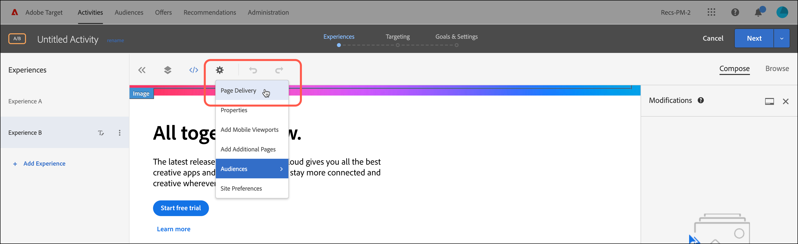
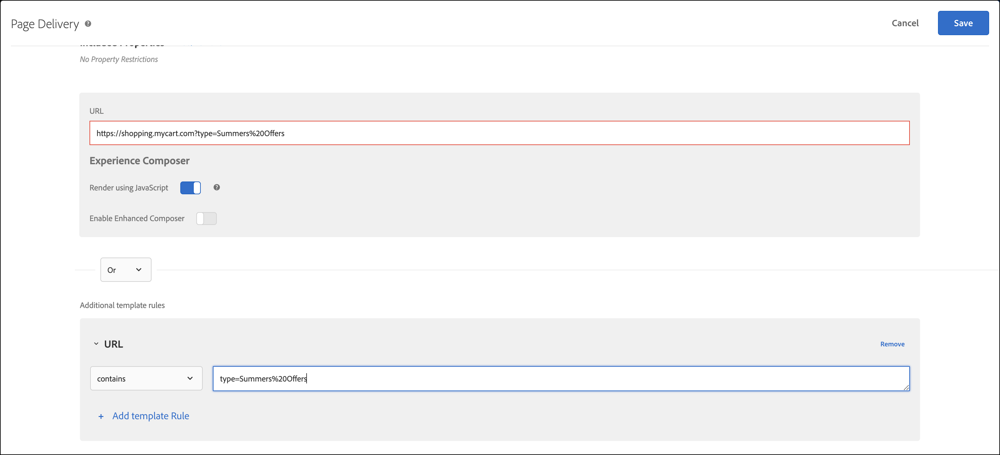

# Fehlerbehebung bei der Inhaltsbereitstellung

Wenn Ihre Seite nicht den erwarteten Inhalt anzeigt, gibt es ein paar Schritte, die Sie unternehmen können, um eine Fehlerdiagnose für die Inhaltsbereitstellung vorzunehmen.

* Prüfen Sie den Code für Ihre Aktivität bzw. Kampagne sorgfältig. Ein Tippfehler oder ein anderweitiger Fehler könnte die Ursache dafür sein, dass der erwartete Inhalt nicht angezeigt wird.
* Verwenden Sie zur Fehlerbehebung bei [!DNL Target]-Anforderungen mboxTrace oder mboxDebug.
* Mit Adobe Experience Cloud Debugger erhalten Sie ein intuitives Tool, das für die Fehlerbehebung von [!DNL Target]-Anforderungen fast die gleichen Informationen wie mboxDebug bereitstellt.

mboxDebug ist insbesondere bei der Einrichtung von [!DNL Target] auf Ihrer Seite hilfreich. Es stellt sicher, dass die Zielgruppen-Anforderung ausgelöst und das Cookie eingerichtet wird. Jedoch ist mboxDebug nicht so detailliert, wie es für die Fehlerdiagnose bei der Inhaltsbereitstellung nützlich wäre. Wenn Ihre Aktivität nicht auf Ihrer Seite erscheint oder unerwünschter Inhalt eingeblendet wird, verwenden Sie mboxTrace, um die Seite ausführlich zu untersuchen und Fehler zu diagnostizieren.

## Abrufen des Autorisierungstokens zur Verwendung mit Debuggingwerkzeugen {#section_BED130298E794D1FA229DB7C3358BA54}

Da mboxTrace und mboxDebug Kampagnen- und Profildaten für Dritte enthüllen können, ist ein Autorisierungstoken erforderlich. Das Autorisierungstoken kann in der [!DNL Target]-Benutzeroberfläche abgerufen werden. Das Token ist sechs Stunden lang gültig.

Für die Generierung eines Authentifizierungstokens benötigen Sie eine der folgenden Benutzerberechtigungen:

* Mindestens [!UICONTROL Editor] Berechtigung (oder [!UICONTROL Approver])

  Weitere Informationen für [!DNL Target Standard]-Kunden finden Sie unter [Festlegen von Rollen und Berechtigungen](/help/main/administrating-target/c-user-management/c-user-management/user-management.md#roles-permissions) für *Benutzer*. Weitere Informationen für [!DNL Target Premium]-Kunden finden Sie unter [Konfigurieren von Enterprise-Berechtigungen](/help/main/administrating-target/c-user-management/property-channel/properties-overview.md).

* Administratorrolle auf der Ebene Arbeitsbereich/Produktprofil

  Arbeitsbereiche stehen nur [!DNL Target Premium]-Kunden zur Verfügung. Weitere Informationen finden Sie unter [Konfigurieren von Enterprise-Berechtigungen](/help/main/administrating-target/c-user-management/property-channel/properties-overview.md).

* Administratorrechte (Berechtigung „Sysadmin“) auf der [!DNL Adobe Target]-Produktebene

So wird das Autorisierungstoken abgerufen:

1. Klicken Sie auf **[!UICONTROL Administration]** > **[!UICONTROL Implementation]**.
1. Klicken Sie im Abschnitt mit den Debuggingwerkzeugen auf **[!UICONTROL Generate New Authentication Token]**.

   

1. Fügen Sie das generierte Token Ihrer URL als Parameter hinzu, um eines der erweiterten Debuggingwerkzeuge zu aktivieren.

   

## mboxTrace {#section_256FCF7C14BB435BA2C68049EF0BA99E}

Mit mboxTrace können Sie an [!DNL Target]-Antworten angehängte Trace-Informationen abrufen. Trace-Informationen spiegeln das Ergebnis eines [!DNL Target]-Aufrufs (z. B. eine Konversion oder eine Impression) sowie alle weiteren Daten wider, die dazu beitragen festzustellen, weshalb es zu diesem Ergebnis gekommen ist, beispielsweise eine Reihe verfügbarer Niederlassungen, zwischen denen während einer Kampagne eine Auswahl getroffen wurde. Verwenden Sie diese Informationen für eine Fehlerdiagnose der Inhaltsbereitstellung.

Die folgenden Parameter stehen zur Verfügung:

| mboxTrace-Optionen | Resultat |
|--- |--- |
| `?mboxTrace=console` | Wird im Konsolenprotokoll als Objekt ausgegeben.<br>Bei „at.js“ können Sie kein neues Browser-Fenster öffnen oder wie bei „mbox.js“ (inzwischen nicht mehr unterstützt) eine Ausgabe in der Konsole veranlassen. Sie müssen stattdessen die Netzwerkanforderung prüfen und unter „Vorschau“ (Chrome) oder „Antwort“ (Firefox) nachsehen. |
| `?mboxTrace=json` | Wird im Konsolenprotokoll als buchstäbliche JSON-Zeichenfolge ausgegeben |
| `?mboxTrace=window` | Wird im Pop-up-Fenster als JSON-Zeichenfolge ausgegeben |
| `?mboxTrace=disable` | Schaltet den Trace-Sitzungsmodus ab |

**Beispiel für mboxTrace-Aufruf**

`https://www.mysite.com/page.html?mboxTrace=window&authorization=f543abf-0111-4061-9619-d41d665c59a6`

Die Ausgabe zeigt detaillierte Informationen über Ihren Inhalt an. mboxTrace zeigt Details über Ihre Kampagne bzw. Aktivität und Ihr Profil an. Außerdem bietet es eine Momentaufnahme des Profils vor der Ausführung sowie eine Momentaufnahme der Änderungen nach der Ausführung. Es zeigt außerdem, welche Kampagnen oder Aktivitäten für jeden Ort ausgewertet wurden.

Ein Teil der Informationen umfasst übereinstimmende und nicht übereinstimmende Segment- und Ziel-IDs:

* **SegmentId**: IDs von Segmenten, entweder aus der Bibliothek mit den wiederverwendbaren Segmenten oder anonyme Segmente, die für die spezifische Kampagne erstellt wurden.
* **TargetId**: IDs von Zielen, entweder aus der Bibliothek mit den Zielausdrücken oder anonyme Ziele für beliebige Segmente aus der Kampagne.
* **Unmatched**: Die Anforderung in diesem Aufruf wurde für diese Segmente oder Ziele nicht zugelassen.
* **Matched**: Die Anforderung wurde für die angegebenen Segmente oder Ziele zugelassen.

**Verwenden von mboxTrace auf Seiten mit Empfehlungen**: Wenn Sie mboxTrace als Abfrageparameter auf Seiten mit Empfehlungen hinzufügen, wird das Recommendations-Design der Seite durch ein mboxTrace-Detailfenster ersetzt. In diesem Fenster werden ausführliche Informationen zu Ihren Empfehlungen angezeigt, darunter:

* Zurückgegebene Empfehlungen im Vergleich zu abgefragten Empfehlungen
* Der verwendete Schlüssel und ob er Empfehlungen generiert
* Nach Kriterien erstellte Empfehlungen im Vergleich zu Backup-Empfehlungen
* Kriterienkonfiguration
* Angewendete Aus- und Einschlüsse
* Auflistungsregeln

Sie müssen `=console`, `=json` oder `=window` nicht in den Abfrageparameter einbeziehen. Wenn Sie mit den mboxTrace-Details fertig sind, fügen Sie `=disable` hinzu und drücken Sie **[!UICONTROL Enter]**, um zum normalen Anzeigemodus zurückzukehren.

Die normale Funktionsweise und Erscheinung Ihrer Website wird durch mboxTrace nicht beeinträchtigt. Besucher sehen Ihr normales Recommendations-Design.

## mboxDebug {#mboxdebug}

Ergänzen Sie zur Verwendung von mboxDebug Ihre URL um einen mboxDebug-Parameter. Die folgende Tabelle enthält Informationen zu URL-Parametern von [!DNL Target] für Antworten.

>[!NOTE]
>
>Einige mboxDebug-Parameter stehen mit oder ohne Authentifizierung zur Verfügung.

| URL-Parameter | Zielsetzung |
|--- |--- |
| `mboxDebug=1` | Debugger<br>Wenn Sie diesen Parameter zu einer URL mit definierten Target-Anforderungen hinzufügen, wird ein Pop-up-Fenster mit hilfreichen Details zur Fehlerbehebung geöffnet. Cookie-Informationen, die PCid und Sitzungs-ID-Werte sind ausgeschrieben und alle URLs sind sichtbar. Klicken Sie auf eine Target-Anforderungs-URL, um die Antwort für diese [!DNL Target]-Anforderung einzublenden. Weitere Details finden Sie unter [mbox_debug.pdf](/help/main/assets/mbox_debug.pdf). |
| `mboxDisable=1` | Deaktivieren von Mboxes auf der Seite |
| `mboxOverride.browserIp=<Insert IP address>` | Geotargeting-Test<br>Mit diesem URL-Parameter wird das Geotargeting getestet. Geben Sie eine IP-Adresse als Wert für dieses Attribut ein. Daraufhin wertet das Test&amp;Target Geotargeting diese IP-Adresse anhand eines Geotargeting- oder Segmentierungssatzes in einer Kampagne aus. |

>[!NOTE]
>
>Geben Sie das URL-Fragment nach den Zeichenfolgeparametern der Abfrage ein. Alles nach dem ersten `#` wird als Fragmentkennung interpretiert und würde dazu führen, dass die Debugging-Parameter nicht korrekt funktionieren.

## Adobe Experience Cloud-Debugger   {#section_A2798ED3A431409690A4BE08A1BFCF17}

Der Adobe Experience Cloud-Debugger ermöglicht die schnelle und einfache Problembehebung in Ihrer Target-Implementierung. Hier können Sie schnell Ihre Bibliothekskonfiguration anzeigen, Anfragen untersuchen, um sicherzustellen, dass Ihre benutzerspezifischen Parameter ordnungsgemäß übergeben werden, die Konsolenprotokollierung aktivieren sowie alle Target-Anfragen deaktivieren. Nach Ihrer Authentifizierung bei der Experience Cloud können Sie das leistungsstarke Tool „MboxTrace“ verwenden, um Ihre Aktivität und Ihre Zielgruppenqualifikationen sowie Ihr Besucherprofil zu untersuchen.

Weitere Informationen finden Sie in den Schulungsvideos unten:

Weitere Informationen finden Sie unter [Debugging von at.js mit Adobe Experience Cloud Debugger](https://experienceleague.adobe.com/docs/target-dev/developer/client-side/at-js-implementation/functions-overview/target-debugging-atjs.html){target=_blank}.

## Topverkäufe werden nicht in Recommendations angezeigt.   {#section_3920C857270A406C80BE6CBAC8221ECD}

Der *`SiteCatalyst: purchase`*-Aufruf kann nicht für Traffic-Daten des Einkaufsalgorithmus verwendet werden. Verwenden Sie stattdessen den Aufruf *`orderConfirmPage`*.

## Aktivitätspriorität prüfen {#section_3D0DD07240F0465BAF655D0804100AED}

Formularbasierte Aktivitäten, die mit [!DNL Target Standard/Premium] erstellt wurden, kollidieren möglicherweise mit Aktivitäten, die in der Benutzeroberfläche von [!DNL Target Classic] erstellt wurden und die gleiche [!DNL Target]-Anforderung verwenden.

## Benutzerdefinierter Code generiert keine erwartungsgemäßen Ergebnisse in Internet Explorer 8. {#section_FAC3651F19144D12A37A3E4F14C06945}

Target unterstützt IE 8 nicht mehr.

## Target-Cookie wird nicht gesetzt {#section_77AFEB541C0B495EB67E29A4475DF960}

Wenn Ihre Site eine Unterdomäne besitzt, z. B. [!DNL us.domain.com], das Target-Cookie aber auf [!DNL domain.com] gesetzt werden muss (anstatt auf [!DNL us.domain.com]), dann müssen Sie die Einstellung `cookieDomain` überschreiben. Weitere Informationen finden Sie unter [targetGlobalSettings()](https://experienceleague.adobe.com/docs/target-dev/developer/client-side/at-js-implementation/functions-overview/targetglobalsettings.html?lang=de){target=_blank}.

## Der Target-Inhalt flackert oder wird nicht angezeigt, wenn ein Element ebenfalls Teil einer Personalisierung von Adobe Experience Manager ist. {#section_9E1DABEB75AB431FB9F09887E6DD07D3}

Wenn ein DOM-Element zum Adobe Experience Manager-(AEM)-Personalisierungstargeting und zu einer Target-Aktivität gehört, flackert der Target-Inhalt möglicherweise, oder er wird nicht angezeigt.

Um dies zu beheben, können Sie die AEM-Personalisierung für Seiten deaktivieren, auf denen Target ausgeführt wird.

## Umleitungs- und Remote-Angebote können aufgrund einer ungültigen URL nicht bereitgestellt werden.   {#section_7D09043B687F43B39DAEDF17D00375AC}

Wenn das Umleitungs- oder Remote-Angebot eine ungültige URL verwendet, kann es möglicherweise nicht bereitgestellt werden.

Bei Umleitungsangeboten kann die [!DNL Target]-Antwort `/* invalid redirect offer URL */` enthalten.

Oder

Bei Remote-Angeboten kann die [!DNL Target]-Antwort `/* invalid remote offer URL */` enthalten.

Sie können die [!DNL Target]-Antwort im Browser oder mit mboxTrace überprüfen. Weitere Informationen zu gültigen URLs finden Sie unter [https://tools.ietf.org/html/std66](https://tools.ietf.org/html/std66).

## [!DNL Target]-Anforderungen werden auf meiner Site nicht ausgelöst.

at. js löst keine Target-Anforderungen aus, wenn Sie einen ungültigen Doctype verwenden. at.js erfordert den Doctype HTML 5.

## Stellen Sie sicher, dass [!DNL Target]-Aktivitäten URLs mit Abfragezeichenfolgen-Parametern korrekt verarbeiten. {#query-strings}

Der [!UICONTROL Activity URL] bestimmt die Seite, die Besucher für die Aktivität qualifiziert, und rendert die Aktivitätserlebnisse für Benutzer. Wenn Sie bei der Aktivitätserstellung dazu aufgefordert werden, stellt das Eingeben der vollständigen URL nicht immer sicher, dass der Inhalt auf dieser Website auch bereitgestellt wird, insbesondere bei URLs, die Abfragezeichenfolgen-Parameter enthalten.

Standardmäßig öffnet der [!UICONTROL Visual Experience Composer] (VEC) die Seite, die in Ihren [Visual Experience Composer-Einstellungen“ ](/help/main/administrating-target/visual-experience-composer-set-up.md) ist. Sie können während der Erstellung der Aktivität eine andere Seite angeben.

Um nach dem Öffnen von VEC eine andere Seite anzuzeigen, klicken Sie auf das **[!UICONTROL Configure gear icon]** > **[!UICONTROL Page Delivery]** auswählen > und geben Sie dann die gewünschte URL in das Feld [!UICONTROL Activity URL] ein.



Was aber, wenn die URL Abfragezeichenfolgen-Parameter enthält? Funktioniert es und zeigt den personalisierten Inhalt an? In diesem Szenario können Sie unabhängig von Ihrer Zielgruppe zusätzlich zur Basis-URL Vorlagenregeln hinzufügen, um Ihre Abfrageparameter zu definieren.

Die folgenden Optionen können verwendet werden, um zusätzliche Vorlagenregeln einzuschließen:

### Option 1: Replizieren Sie die URL und behalten Sie sie in der Vorlagenregel bei - mit der Option „contains“.

Diese Option stellt sicher, dass diese URL für die Aktivität geeignet ist. Beachten Sie jedoch, dass damit Sonderfälle verbunden sind, die Ihre Berichtsdaten mit zusätzlichen Datensätzen zu URLs beeinflussen können, die die Basis-URL enthalten.

In diesem Szenario lautet die URL `https://shopping.mycart.com?type=Summers%20Offers`, und zusätzliche Vorlagenregeln „enthalten“ dieselbe URL, getrennt durch einen OR-Operator:


### Option 2: Beschränken Sie die URL-Bedingung „contains“ auf die Abfragezeichenfolge.

Der in der vorherigen Option beschriebene Sonderfall wird in dieser Option angewendet, aber hier ist die bedingte Einrichtung auf die Abfragezeichenfolge beschränkt.

In diesem Szenario lautet die URL `https://shopping.mycart.com?type=Summers%20Offers` und zusätzliche Vorlagenregeln „enthalten“ nur die Abfragezeichenfolge, getrennt durch einen OR-Operator:



### Option 3: Verwenden Sie anstelle der vollständigen URL einen bestimmten Teil der URL.

In diesem Szenario lautet die URL `https://shopping.mycart.com?type=Summers%20Offers`, und zusätzliche Vorlagenregeln geben einen [!UICONTROL Query] mit [!UICONTROL type] > [!UICONTROL is (case sensitive)] > type=Summers%20Offers an, getrennt durch einen OR-Operator:


## Das Umgehen von Anführungszeichen in [!DNL Target] Profilattributwert funktioniert nicht erwartungsgemäß. {#escape}

Wenn Sie Werte senden, die doppelte Anführungszeichen in einem [!DNL Target] Profilattribut enthalten, müssen Sie sie wie unten dargestellt doppelt ausklammern.

```
adobe.target.trackEvent({
    "mbox": "data-collection",
    "params":    {
        "profile.tagLine": "Escape \\\"Double Quotes\\\" like this."
    }
});
```

## Schulungsvideos

In den folgenden Videos erhalten Sie weitere Informationen zu den in diesem Artikel behandelten Konzepten.

### Fügen Sie die Erweiterung 

>[!VIDEO](https://video.tv.adobe.com/v/23114t2/)

### Grundlegende Fehlerbehebung in Adobe Target 

>[!VIDEO](https://video.tv.adobe.com/v/23115t2/)

### Mbox Trace 

>[!VIDEO](https://video.tv.adobe.com/v/23113t2/)
