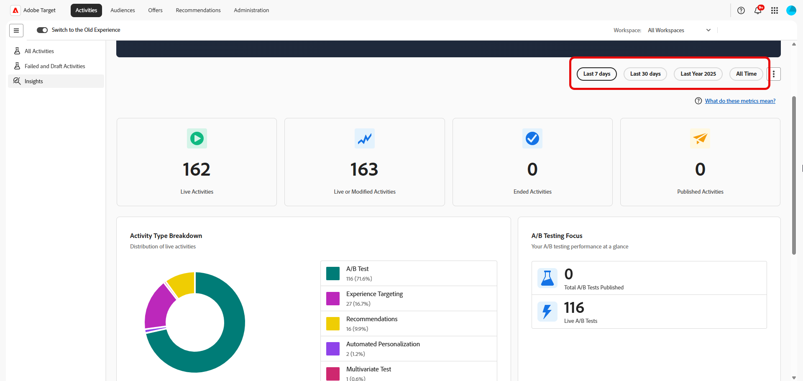

# Adobe Target Insights-Dashboard

Das [!UICONTROL Adobe Target-Dashboard] bietet einen Überblick darüber, wie Ihr Unternehmen [!DNL Adobe Target] im Laufe der Zeit nutzt. Dies hilft Teams, die Akzeptanz, das Aktivitätsvolumen und die Experimentiernutzung auf einen Blick zu verstehen.

Das Dashboard richtet sich sowohl an Fachleute als auch an Stakeholder, die einen schnellen Einblick in die [!DNL Target]-Nutzung wünschen, ohne einzelne Aktivitätsberichte einsehen zu müssen.

Beachten Sie beim Überprüfen dieses Dashboards Folgendes:

* Metriken können Aktivitäten enthalten, die vor oder nach dem ausgewählten Zeitraum begonnen haben oder aufhörten.
* Eine Aktivität kann je nach Lebenszyklus in mehreren Metriken gezählt werden (z. B. sowohl veröffentlicht als auch abgeschlossen).
* Das Dashboard konzentriert sich auf die Nutzung und Akzeptanz, nicht auf Leistungsergebnisse.

Detaillierte Ergebnisse, Steigerungen oder statistische Leistungsdaten finden Sie in den [individuellen Aktivitätsberichten](../c-reports/reports.md) in [!DNL Adobe Target].

## [!UICONTROL Experimentation Accelerator]

Das Banner in Ihrem Dashboard bietet direkten Zugriff auf **[!UICONTROL Experimentation Accelerator]**, einen einfachen Einstiegspunkt zu Tools, die Experimentier-Workflows optimieren und die Einrichtung, Analyse und Entscheidungsfindung von Experimenten vereinfachen.

## Auswahl des Zeitbereichs

Um den Umfang der im Dashboard angezeigten Daten festzulegen, wählen Sie einen Zeitraum aus, z. B. die letzte Woche, das letzte Jahr oder alle Zeiten. Der ausgewählte Zeitbereich gilt konsistent für alle Metriken und Diagramme im Dashboard.

Beachten Sie beim Interpretieren von Metriken über den ausgewählten Zeitraum Folgendes:

* Einige Metriken spiegeln Aktivitäten wider, die zu einem beliebigen Zeitpunkt während des Zeitraums aktiv waren.

* Andere spiegeln Aktivitäten wider, die innerhalb des Zeitraums erstellt, veröffentlicht oder abgeschlossen wurden.

* Daher stimmt die Summe der Metriken möglicherweise nicht genau. Beispielsweise können viele Aktivitäten im selben Zeitrahmen gestartet und abgeschlossen werden.

Sie können auch einen Schnappschuss des Dashboards exportieren, indem Sie **[!UICONTROL Als PNG herunterladen]** im erweiterten Menü auswählen.

## Metrik

Das Dashboard gliedert seine Metriken in vier komplementäre Ansichten, die jeweils eine andere Frage zur [!DNL Target] beantworten: [KPIs](#kpis) geben eine Zusammenfassung der Aktivitätszahlen, die [Aktivitätstypaufschlüsselung](#activity-type-breakdown) zeigt, auf welche Funktionen Sie am meisten angewiesen sind, [A/B-Testmetriken](#ab-testing-metrics) Vergrößerung der Experimentierverwendung und [Aktivitäten im Zeitverlauf](#activities-over-time) zeigt Trends im ausgewählten Zeitraum.

### KPIs

Die KPI-Karten oben auf der Seite fassen die wichtigsten Aktivitätszahlen für den ausgewählten Zeitraum auf einen Blick zusammen. Jede Karte konzentriert sich auf eine andere Phase des Aktivitätslebenszyklus (live, geändert, beendet oder veröffentlicht), sodass Sie die allgemeine Nutzung und Dynamik schnell bewerten können.

Die Metrik **Live-Aktivitäten insgesamt** gibt die Anzahl der Aktivitäten an, die zu einem beliebigen Zeitpunkt im ausgewählten Zeitraum aktiv waren. Eine Aktivität wird als live betrachtet, wenn sie aktiv Traffic verarbeitet hat, selbst wenn sie vor oder nach dem ausgewählten Zeitraum begonnen hat. Verwenden Sie diese Metrik, um:

* Verstehen, wie aktiv [!DNL Target] während des Zeitraums verwendet wurde.
* Messen Sie den Umfang Ihrer Personalisierungs- und Testaktivitäten insgesamt.

Die Metrik **Aktivitäten live oder geändert** stellt die Gesamtzahl der Aktivitäten in Ihrer Organisation dar, die innerhalb des ausgewählten Zeitraums live, erstellt oder geändert wurden. Verwenden Sie diese Metrik, um:

* Machen Sie sich mit der Gesamtgröße Ihrer [!DNL Target]-Aktivitätsbibliothek und der Anzahl der verwendeten Aktivitäten vertraut.

* Verfolgen Sie das langfristige Wachstum Ihrer Experimentier- und Personalisierungsprogramme.

Die Metrik **Beendete Aktivitäten** gibt die Anzahl der Aktivitäten an, die im ausgewählten Zeitraum ein Fertigstellungs- oder Enddatum erreicht haben. Verwenden Sie diese Metrik, um:

* Verstehen, wie viele Aktivitäten während des Zeitraums abgeschlossen wurden.
* Verfolgen des Abschlussvolumens im Zeitverlauf.

Die Metrik **Veröffentlichte Aktivitäten** gibt die Anzahl der Aktivitäten an, die im ausgewählten Zeitraum veröffentlicht wurden. Eine Aktivität gilt als veröffentlicht, wenn sie zum ersten Mal live geschaltet wird. Wenn eine Aktivität als live geschaltet, gestoppt und dann erneut live geschaltet wird, wird in dieser Metrik nur das erste Vorkommen gezählt. Verwenden Sie diese Metrik, um:

* Messen Sie, wie viele neue Aktivitäten gestartet wurden.
* Verstehen der Geschwindigkeit der Erstellung und Veröffentlichung von Aktivitäten

### Aktivitätstyp-Aufschlüsselung

Das [!UICONTROL Aktivitätstyp]-Diagramm zeigt die Verteilung der Live-Aktivitäten nach Typ während des ausgewählten Zeitraums, einschließlich:

* [!UICONTROL A/B-Test]
* [!UICONTROL Erlebnis-Targeting]
* [!UICONTROL Recommendations]
* [!UICONTROL Automatisierte Personalisierung]
* [!UICONTROL Multivarianz-Test]

Anhand dieses Diagramms können Sie erkennen, auf welche [!DNL Target] Ihr Unternehmen am meisten angewiesen ist, und Möglichkeiten erkennen, die Palette der ausgeführten Aktivitätstypen zu erweitern.

### A/B-Testmetriken

{align="center"}

In diesem Abschnitt wird die Verwendung speziell im Zusammenhang mit **[!UICONTROL A/B-Test]**-Aktivitäten beschrieben.

Die Metrik **[!UICONTROL Gesamtzahl der aktiven A/B]** Test-Aktivitäten“ gibt die Anzahl der **[!UICONTROL A/B-Test]**-Aktivitäten an, die zu einem beliebigen Zeitpunkt im ausgewählten Zeitraum aktiv waren.

Die **[!UICONTROL Gesamtzahl der veröffentlichten A/B]** Tests“ gibt die Anzahl der **[!UICONTROL A/B-Test]**-Aktivitäten an, die im ausgewählten Zeitraum veröffentlicht wurden.

Verwenden Sie diese Metriken, um zu verstehen, wie oft A/B-Tests verwendet werden, und um das Experimentiervolumen und die Akzeptanz im Laufe der Zeit zu verfolgen.

### Aktivitäten im Zeitverlauf

{align="center"}

Das Diagramm **[!UICONTROL Aktivitäten im Zeitverlauf]** erfasst die Anzahl der über den ausgewählten Zeitraum erstellten, geänderten und veröffentlichten Aktivitäten, sodass Sie Trends, Spitzen oder ruhige Zeiträume in Ihrem Experimentierprogramm leicht erkennen können.

