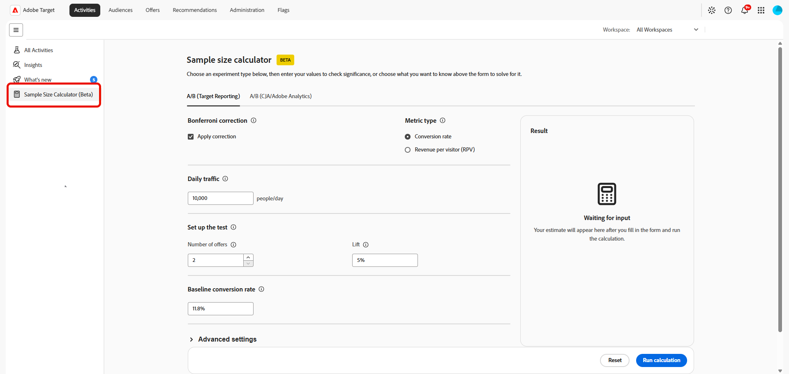

# Stichprobengrößenrechner

>[!CONTEXTUALHELP]
>id="target_sample_size_ab_daily_traffic"
>title="Täglicher Traffic"
>abstract="Wie viele Benutzende pro Tag am Experiment teilnehmen. Wenn Sie diesen Wert nicht kennen, wählen Sie oben „Traffic-Volumen“ aus und der Rechner ermittelt ihn anhand der anderen Eingaben."

>[!CONTEXTUALHELP]
>id="target_sample_size_confidence_level"
>title="Konfidenzniveau"
>abstract="Wie zuversichtlich Sie sein müssen, dass ein Ergebnis nicht bloß Zufall ist, bevor es als signifikant angesehen wird. Ein Konfidenzniveau von 95 % bedeutet, dass höchstens eine Wahrscheinlichkeit von 5 % besteht, dass ein falsch positives Ergebnis vorliegt. Höhere Werte verringern die Anzahl falsch positiver Ergebnisse, erfordern jedoch auch mehr Daten."

>[!CONTEXTUALHELP]
>id="target_sample_size_statistical_power"
>title="Teststärke"
>abstract="Die Wahrscheinlichkeit, eine echte Auswirkung zu erkennen, wenn eine solche vorhanden ist. 80 % Stärke bedeutet, dass eine Wahrscheinlichkeit von 80 % besteht, eine echte Auswirkung zu erkennen. Eine höhere Stärke reduziert falsch negative Ergebnisse, erfordert jedoch mehr Traffic oder eine längere Laufzeit."

>[!CONTEXTUALHELP]
>id="target_sample_size_setup_cja"
>title="Einrichten des Tests"
>abstract="Diese Felder definieren das Experiment, das erwartete Ergebnis und den Konfidenzschwellenwert für das Ergebnis. Das mit dem oben ausgewählten Wert verknüpfte Feld wird automatisch ermittelt. Füllen Sie die verbleibenden Felder mit den erwarteten Werten aus."

>[!AVAILABILITY]
>
>Durch die Verwendung dieses Stichprobengrößenrechners (Beta) erkennen Sie hiermit an, dass die Beta im Istzustand und ohne Gewährleistung jeglicher Art bereitgestellt wird. Adobe ist nicht verpflichtet, die Betaversion zu warten, zu korrigieren, zu aktualisieren, zu ändern, zu modifizieren oder anderweitig zu unterstützen. Wir raten zur Vorsicht und empfehlen Ihnen, sich in keiner Weise auf die ordnungsgemäße Funktion oder Leistung der Betaversion und/oder zugehöriger Materialien zu verlassen. Die Betaversion wird als vertrauliche Information von Adobe erachtet.  Jedes „Feedback“ (Informationen zur Beta, einschließlich, aber nicht beschränkt auf Probleme oder Mängel, auf die Sie bei der Verwendung der Beta stoßen, Vorschläge, Verbesserungen und Empfehlungen), das Sie Adobe zur Verfügung stellen, wird hiermit Adobe zugewiesen, einschließlich aller Rechte, Titel und Interessen an diesem Feedback.

Mit dem **[!UICONTROL Stichprobengrößenrechner]** können Sie die Eingaben schätzen, die für die Planung eines Experiments vor dessen Start erforderlich sind. Mit dem Rechner können Sie bestimmen, wie viel Traffic Sie benötigen, wie lange der Test ausgeführt werden soll, wie viele Erlebnisse einbezogen werden sollen oder welche minimalen Auswirkungen Sie auf der Grundlage der von Ihnen angegebenen Werte zuverlässig erkennen können.

Um auf den **[!UICONTROL Rechner für den Stichprobenumfang]** zuzugreifen, gehen Sie zum Menü **[!UICONTROL Aktivitäten]**.

## A/B (Target-Reporting)

>[!CONTEXTUALHELP]
>id="target_sample_size_bonferroni"
>title="Bonferroni-Korrektur"
>abstract="Passt das Konfidenzniveau an, damit mehr als ein Angebot gleichzeitig mit der Kontrolle verglichen werden kann. Dies ist nur von Bedeutung, wenn die Anzahl der Angebote größer als zwei ist. Dies entspricht der Korrektur, die im öffentlichen Zielrechner-Tool von Adobe verwendet wird."

>[!CONTEXTUALHELP]
>id="target_sample_size_metric_type"
>title="Metriktyp"
>abstract="Welche Art von Metrik Sie messen. Verwenden Sie Prozentsätze für binäre Ergebnisse, wie Klicks oder Konversionen, bei denen eine Person entweder eine Handlung ausführt oder nicht. Verwenden Sie Zahlen für Metriken wie Umsatz oder Seitenansichten, bei denen die Werte von Person zu Person stark variieren können."

>[!CONTEXTUALHELP]
>id="target_sample_size_number_offers"
>title="Anzahl der Angebote"
>abstract="Die Anzahl der Erlebnisse im Experiment, einschließlich der Kontrolle. Wenn mehr als zwei Angebote vorhanden sind, wird automatisch eine Bonferroni-Korrektur angewendet (wenn aktiviert), damit das Gesamtkonfidenzniveau für alle Vergleiche korrekt bleibt."

>[!CONTEXTUALHELP]
>id="target_sample_size_lift"
>title="Steigerung"
>abstract="Die relative Verbesserung im Vergleich zur Baseline, die Sie erkennen möchten. Geben Sie dies als Prozentsatz der Baseline ein. Ein Anstieg von 5 % basierend auf einer Baseline-Konversionsrate von 11,8 % zielt beispielsweise auf 12,39 % ab."

>[!CONTEXTUALHELP]
>id="target_sample_size_baseline_conversion_rate"
>title="Baseline-Konversionsrate"
>abstract="Ihre aktuelle Konversionsrate vor Beginn des Experiments, der Durchschnitt des Kontrollarms. Dieser Wert ist immer erforderlich. Geben Sie für Prozentmetriken einen Prozentsatz ein, z. B. 5 für 5 %. Geben Sie für Zahlmetriken den unformatierten Dezimalwert ein."

Schätzen Sie die Inputs, die für die Planung und Ausführung eines A/B-Tests erforderlich sind. Anhand dieser Werte können Sie entscheiden, wie viel Traffic Sie benötigen, wie lange der Test ausgeführt werden soll und welche Effektgröße Sie realistischerweise erkennen können.

1. Rufen Sie die Registerkarte **[!UICONTROL A/B (Target-Reporting]** auf, um Planungsvorgaben für einen A/B-Test zu berechnen.

1. Aktivieren Sie die Option **[!UICONTROL Korrektur anwenden]**, um Ihr Konfidenzniveau anzupassen, damit mehr als ein Angebot gleichzeitig mit dem Steuerelement verglichen werden kann.

1. Wählen Sie Ihren **[!UICONTROL Metriktyp]**:

   * Konversionsrate: Verwenden Sie diese Option für binäre Ergebnisse wie Klicks oder Käufe, bei denen jeder Besucher die Aktion ausführt oder nicht.
   * Umsatz pro Besucher: Verwenden Sie dies für umsatzähnliche Metriken, bei denen die Werte je nach Besucher stark variieren können.

     

1. Geben Sie den **[!UICONTROL Täglichen Traffic]** und die Anzahl der Benutzenden an, die jeden Tag zum Experiment wechseln.

1. Geben **[!UICONTROL unter „Test einrichten]** die restlichen Werte ein:

   * **[!UICONTROL Anzahl der Angebote]**: Die Anzahl der Erlebnisse in Ihrem Experiment, einschließlich des Kontrollelements. Bei mehr als zwei Angeboten wird eine Bonferroni-Korrektur angewendet, wenn diese aktiviert ist, um das allgemeine Konfidenzniveau aufrechtzuerhalten.

   * **[!UICONTROL Steigerung]**: Die relative Verbesserung gegenüber der Baseline, die Sie erkennen möchten. Geben Sie dies als Prozentsatz der Baseline ein, z. B. eine Steigerung von 5 % bei einer Konversionsrate von 11,8 % bei der Baseline, die auf 12,39 % zielt.

     

1. Geben Sie vor **[!UICONTROL des Experiments die „Baseline]** Konversionsrate für Ihr aktuelles Erlebnis an.

1. Sie können **[!UICONTROL Erweiterte statistische Einstellungen]** erweitern, um zusätzliche statistische Eingaben bereitzustellen, wenn sie für die ausgewählte Berechnung verfügbar sind.

   * **[!UICONTROL Konfidenzniveau]**: Die Wahrscheinlichkeit, dass ein Ergebnis nicht auf einen Zufall zurückzuführen ist. Bei einer 95%igen Grenze besteht eine 5%ige Wahrscheinlichkeit eines falsch positiven Ergebnisses.

   * **[!UICONTROL Statistische Leistung]**: Die Wahrscheinlichkeit, einen echten Effekt zu erkennen. Eine 80%ige Leistung reduziert falsche Negative, erfordert jedoch mehr Traffic oder Zeit.

1. Wählen Sie **[!UICONTROL Berechnung ausführen]**, um die Schätzung zu generieren. Wählen Sie **[!UICONTROL Zurücksetzen]**, um die aktuellen Eingaben zu löschen und neu zu beginnen.

Das **[!UICONTROL Ergebnis]**-Bedienfeld zeigt die Schätzung an, nachdem Sie die erforderlichen Felder ausgefüllt und die Berechnung ausgeführt haben. Wenn die erforderlichen Felder unvollständig sind, werden Sie im Bedienfeld aufgefordert, die fehlenden Werte einzugeben.

Der Rechner liefert eine Schätzung für die Planung eines Experiments. Verwenden Sie das Ergebnis zusammen mit Ihrem Experimentdesign, dem erwarteten Traffic, der Grundleistung und den statistischen Anforderungen, um zu entscheiden, wie lange Sie die Aktivität ausführen möchten.

## A/B (CJA/Adobe Analytics)

>[!CONTEXTUALHELP]
>id="target_sample_size_number_experiences"
>title="Anzahl der Erlebnisse"
>abstract="Anzahl der Varianten in Ihrem Experiment, einschließlich der Kontrolle. Ein A/B-Test hat zwei Arme. Fünf Varianten plus eine Kontrolle ergibt 6. Mehr Arme erfordern proportional mehr Traffic, um die statistische Leistung aufrechtzuerhalten."

>[!CONTEXTUALHELP]
>id="target_sample_size_duration"
>title="Dauer des A/B-Tests"
>abstract="Wie viele Tage Ihr Experiment ausgeführt wird. Bei einer längeren Dauer steht dem Experiment mehr Zeit zum Sammeln von Daten zur Verfügung, wodurch Sie kleinere Auswirkungen zuverlässig erkennen können. Bei einer kürzeren Dauer sind größere Auswirkungen oder mehr täglicher Traffic erforderlich, um ein zuverlässiges Ergebnis zu erhalten."

>[!CONTEXTUALHELP]
>id="target_sample_size_expected_improvement"
>title="Erwartete Verbesserung"
>abstract="Die kleinste erkennenswerte Verbesserung, die minimale Änderung in Ihrer Metrik, auf die Sie reagieren würden. Dies ist die Größe des Anstiegs in Prozentpunkten, nicht die prozentuale Änderung im Verhältnis zur Baseline. Wenn Ihre Baseline beispielsweise 5 % beträgt und ein Anstieg um 1 Prozentpunkt von Bedeutung ist, geben Sie 1 ein."

>[!CONTEXTUALHELP]
>id="target_sample_size_variance"
>title="Variance"
>abstract="Wie verteilt die Werte Ihrer Metrik sind, nicht der Durchschnittswert. Eine Metrik wie eine Klickrate (meistens 0en und 1en) hat in der Regel eine niedrige Varianz, eine Metrik wie der Umsatz pro Person kann eine viel höhere Varianz aufweisen. Wenn Sie sich nicht sicher sind, behalten Sie den Standardwert 1 bei."

Schätzen der Planungseingaben für eine A/B-Aktivität, die auf Adobe Analytics- oder Customer Journey Analytics-Daten basiert. Auf diese Weise können Sie vor dem Start der Aktivität die Experimentgröße, die erwartete Steigerung und die Testdauer definieren.

1. Rufen Sie die Registerkarte **[!UICONTROL A/B (CJA/Adobe Analytics)]** auf, um Planungsvorgaben für einen A/B-Test zu berechnen.

1. Wählen **[!UICONTROL unter „Was möchten Sie wissen?]** den Wert aus, den der Rechner ermitteln soll:

   * **[!UICONTROL Dauer]**: Sie haben ein Experiment im Sinn und möchten wissen, wie lange es dauern würde und ob es sich lohnt, es auszuführen.
   * **[!UICONTROL Anzahl der Erlebnisse]**: Sie haben einen Ort, an dem Sie ein Experiment durchführen können, und möchten herausfinden, wie viele Behandlungen Ihr Traffic unterstützen könnte.
   * **[!UICONTROL Traffic-Volumen]**: Sie haben ein Experiment im Sinn und möchten wissen, wie viele Besucher Sie benötigen, um statistische Signifikanz zu erreichen.
   * **[!UICONTROL Minimaler nachweisbarer Effekt]**: Sie haben ein Experiment, das Sie ausführen möchten, möchten aber wissen, wie viel von einer Steigerung Sie benötigen, um statistische Signifikanz zu erreichen. Auf diese Weise können Sie beurteilen, ob sich das Experiment lohnt, ausgeführt oder geplant zu werden.

   Die Felder im Formular ändern sich je nach ausgewähltem Wert. Der Rechner verwendet die anderen Eingaben, um das ausgewählte Ergebnis zu bestimmen.

   

1. Geben Sie den **[!UICONTROL Täglichen Traffic]** und die Anzahl der Benutzenden an, die jeden Tag zum Experiment wechseln.

1. Geben **[!UICONTROL unter „Test einrichten]** die restlichen Werte ein:

   * **[!UICONTROL Anzahl der Erlebnisse]**: Die Anzahl der Varianten, einschließlich des Kontrollelements. Mehr Varianten erfordern mehr Traffic.

   * **[!UICONTROL Dauer des A/B-]**: Die Anzahl der Tage, die das Experiment ausgeführt wird. Bei längeren Tests können kleinere Effekte festgestellt werden.

   * **[!UICONTROL Erwartete Verbesserung]**: Die Verbesserung, die durch das Experiment erwartet wird.

   * **[!UICONTROL Varianz]**: Wie weit verstreut sind Ihre Metrikwerte? Eine Clickthrough-Rate weist in der Regel eine niedrige Varianz auf, der Umsatz pro Benutzer kann viel höher sein. Wenn Sie sich nicht sicher sind, behalten Sie den Standardwert 1 bei.

     Wie Sie eine **[!UICONTROL Varianz“ berechnen]** erfahren Sie in der [Analytics-Dokumentation](https://experienceleague.adobe.com/de/docs/analytics/components/calculated-metrics/calcmetrics-reference/cm-functions#variance)

     

1. Sie können **[!UICONTROL Erweiterte statistische Einstellungen]** erweitern, um zusätzliche statistische Eingaben bereitzustellen, wenn sie für die ausgewählte Berechnung verfügbar sind.

   * **[!UICONTROL Konfidenzniveau]**: Die Wahrscheinlichkeit, dass ein Ergebnis nicht auf einen Zufall zurückzuführen ist. Bei einer 95%igen Grenze besteht eine 5%ige Wahrscheinlichkeit eines falsch positiven Ergebnisses. Niedrigere Konfidenzniveaus bedeuten, dass weniger Traffic benötigt wird, aber sie erhöhen auch das Risiko eines falsch positiven Ergebnisses.

   * **[!UICONTROL Statistische Leistung]**: Die Wahrscheinlichkeit, einen echten Effekt zu erkennen. Eine 80%ige Leistung reduziert falsche Negative, erfordert jedoch mehr Traffic oder Zeit.

1. Wählen Sie **[!UICONTROL Berechnung ausführen]**, um die Schätzung zu generieren. Wählen Sie **[!UICONTROL Zurücksetzen]**, um die aktuellen Eingaben zu löschen und neu zu beginnen.

Das **[!UICONTROL Ergebnis]**-Bedienfeld zeigt die Schätzung an, nachdem Sie die erforderlichen Felder ausgefüllt und die Berechnung ausgeführt haben. Wenn die erforderlichen Felder unvollständig sind, werden Sie im Bedienfeld aufgefordert, die fehlenden Werte einzugeben.

Der Rechner liefert eine Schätzung für die Planung eines Experiments. Verwenden Sie das Ergebnis zusammen mit Ihrem Experimentdesign, dem erwarteten Traffic, der Grundleistung und den statistischen Anforderungen, um zu entscheiden, wie lange Sie die Aktivität ausführen möchten.
