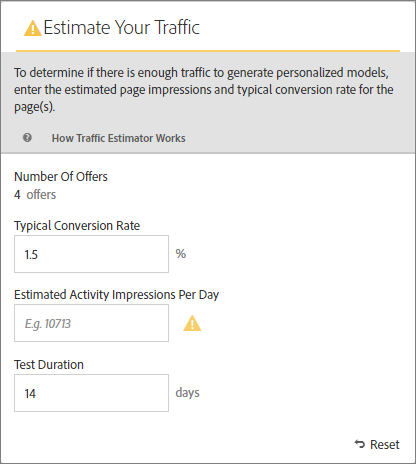

# Schätzen des für einen erfolgreichen Test erforderlichen Traffics

Die [!DNL Adobe Target]Traffic[!UICONTROL Schätzung] liefert Feedback, mit dem Sie wissen, ob Sie über ausreichend Traffic für eine erfolgreiche [!UICONTROL Automated Personalization] (AP)-Aktivität verfügen.

Da [!UICONTROL Automated Personalization]-Aktivitäten mehrere Angebotskombinationen verwenden, ist es wichtig zu wissen, wie viel Traffic erforderlich ist, um aussagekräftige Ergebnisse zu erzielen. Die [!UICONTROL Traffic-Schätzung] nutzt Statistiken zu Ihrer Seite und der Anzahl der getesteten Erlebnisse, um die Menge an Traffic und die Testdauer zu schätzen, die für den Erfolg der Aktivität erforderlich sind.

Die [!UICONTROL Traffic-Schätzung] bestimmt, ob ausreichend Traffic vorhanden ist, um personalisierte Modelle zu generieren, indem die geschätzten Seitenimpressionen und die typische Konversionsrate für die Seiten verglichen werden. Idealerweise gewährleistet die korrekte Stichprobengröße bei einer erfolgreichen Aktivität, dass personalisierter Inhalt innerhalb von 50 % der Dauer der Aktivität oder innerhalb von 14 Tagen bereit ist (je nachdem, welcher Fall zuerst eintritt). Dieser Prozess lässt ausreichend Zeit für den Erhalt personalisierter Inhalte und das Erlernen der bereitzustellenden Inhalte.

Denken Sie daran, dass [!DNL Target] Erlebnisse nach dem Zufallsprinzip bereitstellt, bis die Personalisierungsalgorithmen erstellt werden. Das Häkchensymbol neben jedem Angebot zeigt an, wenn das Modell für dieses Angebot bereit ist und [!DNL Target] mit der Bereitstellung personalisierter Inhalte beginnen kann. Da die Steigerung erst nach Fertigstellung der Modelle erwartet wird, können Sie mit der visuellen Anzeige die richtigen Erwartungen festlegen. Verwenden Sie die [!UICONTROL Traffic-Schätzung] im [!UICONTROL Visual Experience Composer] (VEC), um eine Richtlinie zu erhalten, wann die Modelle bereit sind.

## Traffic-Schätzung verwenden

1. Klicken Sie auf der [!UICONTROL Erlebnisse] des [!UICONTROL Visual Experience Composer] in einer [!UICONTROL Automated Personalization]-Aktivität auf das Symbol **[!UICONTROL Traffic]**.

   

   Die [!UICONTROL Traffic-Schätzung] wird geöffnet. Sie können erneut auf **[!UICONTROL Traffic]** klicken, um die [!UICONTROL Traffic-Schätzung“ &#x200B;].

   

1. Geben Sie die typische Konversionsrate (oder die von dieser Aktivität erwartete Konversionsrate), geschätzte Aktivitätsimpressionen pro Tag und die Testdauer an.

   | Metrik | Beschreibung |
   | --- | --- |
   | **[!UICONTROL Anzahl der Angebote]** | Diese Metrik wird automatisch anhand der Anzahl der Erlebnisse berechnet, die im Rahmen Ihrer Aktivität nach allen Ausschlüssen erstellt werden. |
   | **[!UICONTROL Typische Konversionsrate]** | Diese Metrik wird als Prozentsatz ausgedrückt, basierend auf Ihrer Schätzung oder früheren Daten aus Ihrem Analysesystem. |
   | **[!UICONTROL Geschätzte Besuche pro Tag]** | Diese Metrik stellt die Anzahl der Besuche pro Tag dar, die Besucherinnen und Besucher, die die Aktivität anzeigen können, auf der Grundlage der Targeting-Kriterien verzeichnen. Diese Metrik könnte auf Ihren Analysedaten basieren. Bei dieser Zahl muss es sich um Besuche und nicht um Unique Visitors handeln. |
   | **[!UICONTROL Testdauer]** | Die Anzahl der Tage, binnen derer Sie die Aktivität ausführen möchten. |

   Die [!UICONTROL Traffic-Schätzung] verwendet diese Metriken, um zu bestimmen, welche Anpassungen erforderlich sind, um einen erfolgreichen Test auszuführen.

   In der Nähe des oberen Bereichs der [!UICONTROL Traffic-Schätzung] werden die eingegebenen Werte berechnet und die Ergebnisse angezeigt.

   

   Wenn Sie die Zahlen ändern, ändern sich auch die Schätzwerte. Wenn Sie beispielsweise viele Kombinationen testen und Ihre Konversionsrate und Impressions zu niedrig sind, zeigt die [!UICONTROL Traffic-Schätzung] an, wie lange der Test ausgeführt werden muss, um erfolgreich zu sein. Wenn Ihr Traffic gering ist, kann die [!UICONTROL Traffic-Schätzung] eine niedrigere Anzahl von Angebotskombinationen vorschlagen, sodass Sie den Test über die gewünschte Anzahl von Tagen ausführen können.

   Wenn Sie nicht über ausreichend Traffic verfügen, beachten Sie Folgendes:

   * Erwägen Sie die Verwendung einer [automatischen Targeting](/help/main/c-activities/auto-target/auto-target-to-optimize.md)-Aktivität anstelle von [!UICONTROL Automated Personalization] um Erlebnisse mit mehreren Angebotsänderungen in einer Erlebnisvariante zu erstellen.
   * Verringern Sie die Anzahl der Angebotskombinationen innerhalb Ihrer [!UICONTROL Automated Personalization]-Aktivität.
   * Erhöhen Sie die Dauer der Aktivität.

   Passen Sie die Zahlen an, bis [!UICONTROL Traffic-Schätzung] anzeigt, dass Sie über ausreichend Traffic verfügen, und entwerfen Sie dann Ihren Test entsprechend.

   

   Wenn der Traffic ausreichend ist, wird [!UICONTROL &#x200B; Symbol „Traffic] ein grünes Häkchen angezeigt. Wenn der Traffic nicht ausreicht, wird als Symbol ein roter Warnhinweis angezeigt.

## Häufig gestellte Fragen zur Traffic-Schätzung

Beachten Sie bei der Arbeit mit der Traffic[!UICONTROL Schätzung die folgenden häufig gestellten Fragen]:

### Warum werden keine personalisierten Modelle erstellt, obwohl meine API-Aktivität über ausreichend Traffic verfügt?

Unter bestimmten Umständen ist Ihr Traffic groß genug, um ein personalisiertes Modell zu erstellen, aber dieser Traffic könnte [!DNL Target] darüber informieren, dass es keinen sinnvollen Unterschied zwischen dem personalisierten Modell und dem zufälligen Modell gibt. Obwohl das Modell in [!DNL Target] erstellt und getestet wurde, wird es nicht bereitgestellt, da das Modell nicht besser als zufällig ist.

Ein möglicher Grund dafür, dass das Modell nicht besser als zufällig ist, könnte darin bestehen, dass die Angebote nicht ausreichend voneinander abweichen. In diesem Fall können Sie versuchen, die Angebote visuell zu verändern, wenn die Nachricht ähnlich ist, oder Sie können versuchen, die Nachricht selbst zu ändern.
