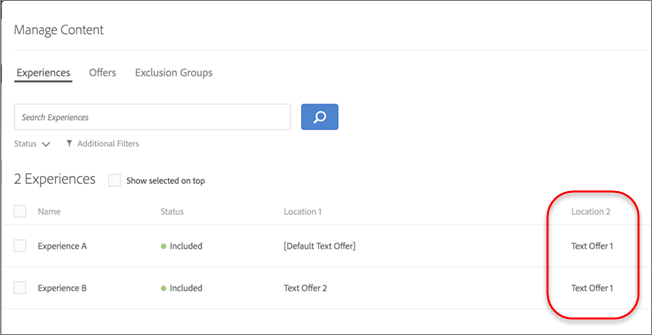
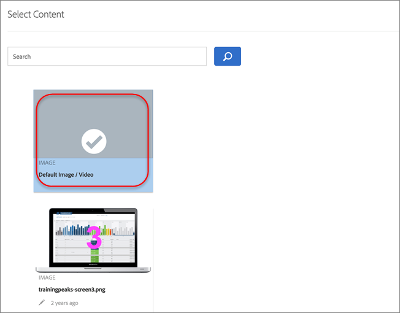
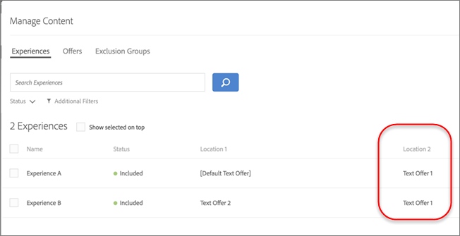

# Verwalten von Ausschlüssen

Verwalten Sie Ausschlüsse, indem Sie Ausschlussgruppen erstellen, doppelte Angebote ausschließen, bestimmte Erlebnisse ausschließen und Standardinhalte in [!UICONTROL Automated Personalization] (AP)-Aktivitäten in [!DNL Adobe Target] ausschließen.

## Ausschlussgruppen erstellen {#task_AAAA6C7239A84F7696C8492F04B575A2}

Erstellen Sie Ausschlussgruppen in [!UICONTROL Automated Personalization]-Aktivitäten (AP), um sicherzustellen, dass Erlebnisse mit den angegebenen Angeboten automatisch ausgeschlossen werden.

Ausschlussgruppen eignen sich hervorragend, um sicherzustellen, dass nicht kompatible Angebote nicht an verschiedenen Stellen in demselben Erlebnis dargestellt werden. Angenommen, Sie haben zwei Angebote: das eine gilt für einen Rabatt von 20 % auf alle Waren und das andere für einen Rabatt von 15 %. Sie möchten nie, dass diese beiden Angebote Besuchern in derselben Umgebung präsentiert werden. Wenn Sie diese beiden Angebote einer Ausschlussgruppe hinzufügen, können Sie sicherstellen, dass dies nie der Fall ist.

Sie können auch einschränken, welche Zielgruppen bestimmte Angebote in den AP-Aktivitäten sehen können. Weitere Informationen finden Sie unter [Targeting von Automated Personalization-Angeboten](/help/main/c-activities/t-automated-personalization/ap-target-offers.md).

**So erstellen Sie eine Ausschlussgruppe:**

1. Klicken Sie [beim Erstellen oder Bearbeiten einer AP-Aktivität in der Header-Leiste ](/help/main/c-activities/t-automated-personalization/create-ap-activity.md)auf **[!UICONTROL Inhalt verwalten]**.

   

1. Klicken Sie [!UICONTROL  Dialogfeld ]Inhalt verwalten“ auf **[!UICONTROL Ausschlussgruppen]**.

   

   Wenn Sie zuvor Ausschlussgruppen erstellt haben, werden sie in der Liste angezeigt. Wenn Sie noch keine Ausschlussgruppe erstellt haben, werden Sie aufgefordert, eine zu erstellen.

1. Klicken Sie **[!UICONTROL Ausschlussgruppe erstellen.]**

   

1. (Erforderlich) Geben Sie einen beschreibenden Namen für die Ausschlussgruppe an.

   Ein beschreibender Name hilft Ihnen oder anderen Benutzern, schnell eine Gruppe zu finden und ihren Zweck zu verstehen.

1. Suchen Sie die gewünschten Angebote, die Sie der Ausschlussgruppe hinzufügen möchten, und wählen Sie sie aus.

   Sie können mehrere Angebote vom selben Standort in einer Ausschlussgruppe auswählen.

1. Klicken Sie auf **[!UICONTROL Speichern]**.

Die Angebote in der Ausschlussgruppe werden automatisch aus denselben Erlebnissen ausgeschlossen.

## Doppelte Angebote ausschließen {#concept_4EF78013F80E48EFA024AE0274C9F037}

Verhindern Sie die Duplizierung von Angeboten aus der Bibliothek, wenn diese bei [!UICONTROL automatischer Personalisierung] an verschiedenen Orten eingesetzt werden.

Möglicherweise verfügen Sie über eine Aktivität mit sechs Orten auf einer Seite mit 12 Angeboten. Hier besteht die Gefahr, dass das gleiche Angebot in einer Aktivität mehrmals angezeigt wird. Dadurch wird verhindert, dass doppelte Angebote gleichzeitig an unterschiedlichen Positionen in derselben Aktivität angezeigt werden.

Klicken Sie auf **[!UICONTROL Konfigurieren]** Zahnradoption > **[!UICONTROL Angebote duplizieren]** und klicken Sie dann auf **[!UICONTROL Duplikate zulassen]** oder **[!UICONTROL Duplikate nicht zulassen]**.

## Ausschließen spezifischer Erlebnisse {#task_C17D36EF58AF4908B17A3D84CA6DE85A}

Schließen Sie bestimmte Erlebnisse aus, wenn Sie bestimmte Angebotskombinationen aus Ihrer [!UICONTROL Automated Personalization]-Aktivität ausschließen möchten.

Möglicherweise gibt es bestimmte Kombinationen, die nicht zusammenarbeiten, oder Sie beschränken die Anzahl der getesteten Erlebnisse, um die Traffic-Anforderungen für Ihre Aktivität zu senken.

1. Klicken Sie [beim Erstellen oder Bearbeiten einer AP-Aktivität in der Header-Leiste ](/help/main/c-activities/t-automated-personalization/create-ap-activity.md)auf **Inhalt verwalten**.

   

   Die Liste [!UICONTROL Erlebnisse] zeigt jedes Erlebnis an, das anhand der Permutationen sämtlicher Inhalts- und Positionsoptionen generiert wurde.

1. Sie können Erlebnisse nach Bedarf ausschließen.

   Sie können spezifische Erlebnisse ausschließen, indem Sie den Mauszeiger über das gewünschte Erlebnis bewegen und dann auf das Ausschlusssymbol klicken.

   

   Alternativ können Sie Erlebnisse im Stapelmodus ausschließen, indem Sie das Kontrollkästchen für die entsprechenden Erlebnisse aktivieren und dann auf **[!UICONTROL Ausschließen]** in der oberen rechten Ecke des Dialogfelds klicken. Das Symbol [!UICONTROL Ausschließen] wird angezeigt, wenn ein oder mehrere Erlebnisse aktiviert sind.

   

   Sie können diese Listenansicht so filtern, dass nur ausgeschlossene oder nur eingeschlossene Aktivitäten angezeigt werden, indem Sie auf [!UICONTROL  Dropdown-Liste ]Status“ klicken.

   Die Erlebnisse sind jetzt von der Aktivität ausgeschlossen und ihr [!UICONTROL Status] wird als &quot;[!UICONTROL &quot; ].

   

## Standardinhalt ausschließen {#task_DCB4528989DF4C05A3A4729E5891D18F}

Manchmal möchten Sie vielleicht nicht Ihren Standardinhalt als Teil Ihrer [!UICONTROL Automated Personalization]-Aktivität einbeziehen. Wie Sie auf diese Einstellung zugreifen, unterscheidet sich vom Erstellen von Ausschlussgruppen. Sie können diese Methode verwenden, um nur über ein Angebot (unterscheidet sich von Ihrem Standardinhalt) an einer Position als Teil Ihrer AP-Aktivität zu verfügen.

Das Ausschließen von Standardinhalt ist eine sehr gute Möglichkeit, um das Erscheinungsbild der restlichen Seite zu ändern, um die von Ihnen mit der AP-Aktivität getesteten Angebote anzupassen. Wenn Sie beispielsweise die Farbpalette der von Ihnen getesteten Angebote abgleichen möchten, können Sie die Hintergrundfarbe Ihrer Seite ändern und die standardmäßige Hintergrundfarbe ausschließen.

**So schließen Sie Standardinhalte mit dem [!UICONTROL Visual Experience Composer] (VEC) aus:**

1. Wählen [ beim Erstellen oder Bearbeiten einer AP](/help/main/c-activities/t-automated-personalization/create-ap-activity.md)Aktivität den zu ersetzenden Inhalt aus und klicken Sie, um auf **[!UICONTROL Text/HTML ändern]**, **[!UICONTROL Bild ändern]** oder **[!UICONTROL Hintergrundfarbe ändern]**.
1. Erstellen Sie im Dialogfeld Ihren neuen Inhalt und deaktivieren Sie **Einschließen** rechts neben dem Standardinhalt (oder deaktivieren Sie das Standardbild/Standardvideo im Bildschirm [!UICONTROL Inhalt auswählen]).

   Je nach Inhalts- oder Angebotstyp befindet sich [!UICONTROL  Kontrollkästchen ]Einschließen“ an einer etwas anderen Stelle.

   Für Text-/HTML-Inhalt:

   

   Für Bild-/Videoinhalt:

   

   Für die Hintergrundfarbe:

   

1. Klicken Sie auf **[!UICONTROL Speichern]**.

   Sie können die Erlebnisse über die von Ihnen angegebenen Angebote unter [!UICONTROL Inhalt verwalten] anzeigen. Sie werden feststellen, dass in [!UICONTROL Inhalt verwalten] keine Erlebnisse mit dem von Ihnen ausgeschlossenen Standardangebot erstellt werden.

   

**So schließen Sie Standardinhalte mit dem [!UICONTROL formularbasierten Experience Composer aus]:**

1. Klicken Sie beim Erstellen oder Bearbeiten einer AP-Aktivität unter **[!UICONTROL Inhalt]** auf **[!UICONTROL Text/HTML ändern]** oder **[!UICONTROL Bildangebot ändern]**.
1. Erstellen Sie im Dialogfeld Ihren neuen Inhalt und deaktivieren Sie **[!UICONTROL Einschließen]** rechts neben dem Standardinhalt (oder deaktivieren Sie das Standardbild/Standardvideo im Bildschirm [!UICONTROL Inhalt auswählen]).

   Je nach Inhalts- oder Angebotstyp befindet sich [!UICONTROL  Kontrollkästchen ]Einschließen“ an einer etwas anderen Stelle.

   Für Text-/HTML-Inhalt:

   

   Für Bild-/Videoinhalt:

   

1. Klicken Sie auf **[!UICONTROL Speichern]**.

   Sie können die Erlebnisse über die von Ihnen angegebenen Angebote unter [!UICONTROL Inhalt verwalten] anzeigen. Sie werden feststellen, dass in [!UICONTROL Inhalt verwalten] keine Erlebnisse mit dem von Ihnen ausgeschlossenen Standardangebot erstellt werden.

   
