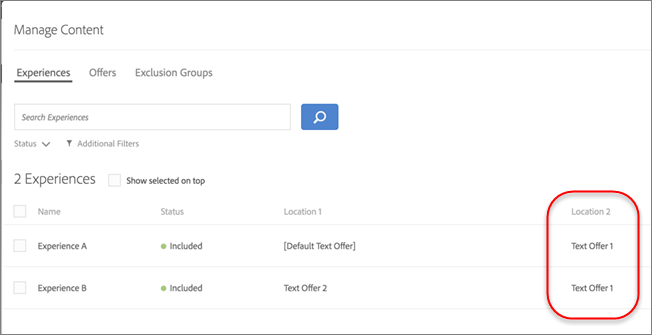
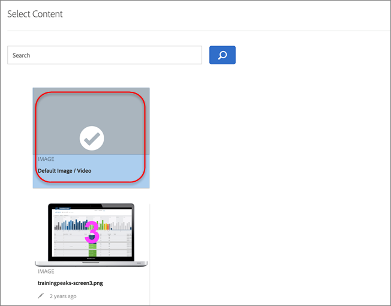

# Verwalten von Ausschlüssen

Übernehmen Sie die Kontrolle über Ihre [!UICONTROL Automated Personalization] (AP)-Strategie, indem Sie Ausschlüsse meistern. Unabhängig davon, ob Sie doppelte Angebote verhindern, Erlebniskombinationen verfeinern oder Standardinhalte entfernen, ermöglichen Ausschlüsse die Bereitstellung saubererer, relevanterer Erlebnisse, die Ihren Zielen und Zielgruppenerwartungen entsprechen.

## Doppelte Angebote zulassen oder nicht zulassen {#concept_4EF78013F80E48EFA024AE0274C9F037}

Verhindern Sie, dass Angebote aus der Angebotsbibliothek dupliziert werden, wenn sie an verschiedenen Stellen in AP-Aktivitäten verwendet werden.

Möglicherweise verfügen Sie über eine Aktivität mit sechs Orten auf einer Seite mit 12 Angeboten. Hier besteht die Gefahr, dass das gleiche Angebot in einer Aktivität mehrmals angezeigt wird. Mit dieser Funktion können Sie verhindern, dass doppelte Angebote gleichzeitig an verschiedenen Stellen innerhalb derselben Aktivität angezeigt werden.

1. Klicken [ beim Erstellen oder Bearbeiten einer AP](/help/main/c-activities/t-automated-personalization/create-ap-activity.md)Aktivität auf das **[!UICONTROL Configure]** (  ) > klicken Sie auf das **[!UICONTROL Allow Duplicate Offers]**, um diese Funktion je nach Bedarf zu aktivieren oder zu deaktivieren.

## Ausschließen spezifischer Erlebnisse {#task_C17D36EF58AF4908B17A3D84CA6DE85A}

Schließen Sie bestimmte Erlebnisse aus, wenn Sie bestimmte Angebotskombinationen aus Ihrer AP-Aktivität ausschließen möchten.

Möglicherweise gibt es bestimmte Kombinationen, die nicht zusammenarbeiten, oder Sie beschränken die Anzahl der getesteten Erlebnisse, um die Traffic-Anforderungen für Ihre Aktivität zu senken.

1. Klicken [ beim Erstellen oder Bearbeiten einer AP](/help/main/c-activities/t-automated-personalization/create-ap-activity.md)Aktivität auf das Symbol **Inhalt verwalten** (  ).

   Die [!UICONTROL Experiences] Liste zeigt jedes Erlebnis, das aus den Permutationen aller Inhalts- und Standortoptionen generiert wurde.

1. Sie können Erlebnisse nach Bedarf ausschließen.

   Sie können bestimmte Erlebnisse ausschließen, indem Sie auf das Symbol [!UICONTROL **Mehr Aktionen**] (Symbol  ) und dann auf [!UICONTROL **Ausschließen**] klicken.

   Alternativ können Sie Erlebnisse im Batch-Modus ausschließen, indem Sie das Kontrollkästchen für die entsprechenden Erlebnisse aktivieren und dann auf **[!UICONTROL Exclude]** klicken. Das [!UICONTROL Exclude] wird angezeigt, wenn mindestens ein Erlebnis aktiviert ist.

   

   Die Erlebnisse sind jetzt von der Aktivität ausgeschlossen und ihre [!UICONTROL Status] werden als [!UICONTROL Excluded] angezeigt.

## Standardinhalt ausschließen {#task_DCB4528989DF4C05A3A4729E5891D18F}

Manchmal möchten Sie vielleicht nicht, dass Ihr Standardinhalt in Ihre API-Aktivität eingeschlossen wird. Mit dieser Methode können Sie im Rahmen Ihrer Aktivität nur ein Angebot an einem Speicherort haben (das sich von Ihrem Standardinhalt unterscheidet).

Das Ausschließen von Standardinhalt ist eine sehr gute Möglichkeit, um das Erscheinungsbild der restlichen Seite zu ändern, um die von Ihnen mit der AP-Aktivität getesteten Angebote anzupassen. Wenn Sie beispielsweise die Farbpalette der von Ihnen getesteten Angebote abgleichen möchten, können Sie die Hintergrundfarbe Ihrer Seite ändern und die standardmäßige Hintergrundfarbe ausschließen.

**So schließen Sie Standardinhalte mithilfe des [!UICONTROL Visual Experience Composer] (VEC) aus:**

1. Wählen [ beim Erstellen oder Bearbeiten einer AP](/help/main/c-activities/t-automated-personalization/create-ap-activity.md)Aktivität den zu ersetzenden Inhalt aus und klicken Sie, um auf **[!UICONTROL Change Text/HTML]**, **[!UICONTROL Change Image Offer]** oder **[!UICONTROL Change Background Color]** zuzugreifen. Die verfügbaren Optionen variieren je nach Inhaltstyp.

   
1. Erstellen neuer Inhalte.

1. Klicken Sie auf das Symbol **[!UICONTROL More Actions]** (  ) und dann auf den Umschalter **Standardangebot ausschließen/Standardangebot einschließen**, um das Standardangebot auszuschließen oder einzuschließen.

   <!-- Depending on the content or offer type, the [!UICONTROL Include] checkbox is in a slightly different place. 

   For Text/HTML content: 

   

   For Image/Video content: 

   

   For background color: 

   -->

<!-- 1. Click **[!UICONTROL Save]**.

   You can see the experiences created from the offers you specified under [!UICONTROL Manage Content]. You notice that no experiences are created in [!UICONTROL Manage Content] using the default offer you excluded. 

   

**To exclude default content using the [!UICONTROL Form-Based Experience Composer]:** 

1. While creating or editing an AP activity, click **[!UICONTROL Change Text/HTML]** or **[!UICONTROL Change Image Offer]** under **[!UICONTROL Content]**. 
1. In the dialog box, create your new content and uncheck **[!UICONTROL Include]** to the right of the default content (or uncheck the Default Image/Video in the [!UICONTROL Select Content] screen). 

   Depending on the content or offer type, the [!UICONTROL Include] checkbox is in a slightly different place. 

   For Text/HTML content: 

   

   For Image/Video content: 

   

1. Click **[!UICONTROL Save]**. 

   You can see the experiences created from the offers you specified under [!UICONTROL Manage Content]. You notice that no experiences are created in [!UICONTROL Manage Content] using the default offer you excluded. 

   -->
