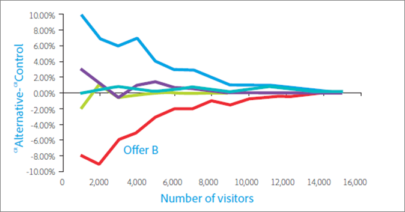

# Zehn häufige Fehler bei A/B-Tests und wie diese vermieden werden

A/B-Tests in [!DNL Adobe Target] bilden das Rückgrat der meisten Programme zur Optimierung des digitalen Marketings. Marketing-Experten können ihren Besuchern und Kunden damit optimierte und zielgerichtete Erlebnisse bereitstellen. In diesem Artikel werden zehn der größten Fallstricke beschrieben, denen Unternehmen bei der Durchführung von A/B-Tests ausgesetzt sind. Darüber hinaus werden Methoden zur Vermeidung dieser Fehler erläutert. So steigert Ihr Unternehmen den ROI durch Tests und kann sich auf die Ergebnisse seiner A/B-Tests verlassen.

## Fehler Nr. 1: Die Auswirkungen des Signifikanzniveaus werden nicht berücksichtigt {#section_55F5577A13C6470BA1417C2B735C6B1D}

Wie wahrscheinlich ist es, dass Ihr Test einen signifikanten Unterschied der Konversionsrate zweier Angebote ergibt, wenn dieser tatsächlich nicht vorhanden ist? Diese Information liefert das *Signifikanzniveau* eines Tests. Solche irreführenden Ergebnisse werden oft als falsch positiv bezeichnet und in der Statistik als Fehler vom Typ I bezeichnet (wenn Sie fälschlicherweise die Nullhypothese ablehnen, die wahr ist).

Wenn Sie das Signifikanzniveau eines A/B-Tests angeben, stecken Sie in einem Zwiespalt zwischen Ihrer Annahme, dass ein Erlebnis besser ist als das andere, obwohl das nicht wirklich zutrifft (Fehler 1. Art oder falsch positiv), und der Tatsache, dass Sie keinen statistischen Unterschied zwischen den Erlebnissen sehen, obwohl es tatsächlich einen echten Unterschied gibt (Fehler 2. Art oder falsch negativ). Das *Konfidenzniveau* wird ermittelt, bevor ein Test durchgeführt wird.

Die *Konfidenzniveau*, die nach Abschluss eines Tests bestimmt wird, wird von drei Schlüsselfaktoren beeinflusst:

* Stichprobengröße des Tests
* Signifikanzniveau
* Populationsstandardabweichung

Da der Marketer das Signifikanzniveau vor dem Entwerfen des Tests ausgewählt hat und die Populationsvarianz nicht beeinflusst werden kann, ist der einzige „kontrollierbare“ Faktor die Stichprobengröße. Der für ein Konfidenzintervall erforderliche Stichprobenumfang und die daraus resultierende Zeit, die benötigt wird, um diesen Stichprobenumfang zu erreichen, ist eine wichtige Entscheidung, die ein Marketer während des Testentwurfs treffen muss.

Ein weiterer, damit unmittelbar zusammenhängender Begriff, das *Konfidenzniveau*, entspricht eher dem Ansatz mit dem halbvollen Glas. Anstatt die Wahrscheinlichkeit anzugeben, dass Sie ein falsch positives Ergebnis erhalten, wie es das Signifikanzniveau tut, stellt das Konfidenzniveau die Wahrscheinlichkeit dar, dass Ihr Test diesen Fehler nicht macht.

Konfidenzniveau und Signifikanzniveau hängen aus folgenden Gründen direkt zusammen:

100-%-Konfidenzniveau = Signifikanzniveau

Marketingexperten verwenden in A/B-Tests häufig ein Konfidenzniveau von 95 %. Gemäß der obigen Gleichung entspricht dies einem Signifikanzniveau von 5 %. Wenn Sie Tests mit einem Konfidenzniveau von 95 % durchführen, heißt dies, dass eine 5-prozentige Chance besteht, dass eine statistisch signifikante Steigerung gefunden wird, während tatsächlich zwischen den Angeboten kein Unterschied vorliegt.

Wie die unten stehende Grafik zeigt, führt mindestens einer dieser Tests je mehr Tests Sie durchführen, zu einem falsch-positiven Ergebnis. Wenn Sie z. B. 10 Tests mit einem Konfidenzniveau von 95 % durchführen, besteht eine Wahrscheinlichkeit von ca. 40 %, dass Sie einen oder mehrere Falsch-Positiv-Werte erkennen (sofern es keine tatsächliche Steigerung gibt: Pr(mindestens ein Falsch-Positiv-Wert) = 1 - Pr(keine Falsch-Positiv-Werte) = 1 - 0,95^10 = 40 %).

In einer Marketing-Organisation stellen 95 % in der Regel einen angemessenen Kompromiss zwischen dem Risiko eines falsch-positiven und eines falsch-negativen Werts dar.

Es gibt jedoch zwei Situationen, in denen es sich lohnt, sehr genau auf das Konfidenzniveau und seine Auswirkungen auf die Testergebnisse zu achten: die Segmentierung nach dem Test und das Testen mehrerer Angebote.

* **Segmentierung nach dem Test:** Marketingexperten bearbeiten die Ergebnisse eines Tests häufig basierend auf Besuchersegmenten, nachdem der A/B-Test beendet ist. Gängige Segmente sind der Browsertyp, der Gerätetyp, geografische Regionen, Tageszeit und neue Besucher im Vergleich zu zurückkehrenden Besuchern. Diese Praxis der Segmentierung nach dem Test liefert ausgezeichnete Einblicke in Besuchersegmente. Marketer können diese Einblicke wiederum verwenden, um zielgerichtetere, relevantere und differenziertere Inhalte zu erstellen.

  Wenn kein realer Unterschied der Konversionsrate vorliegt, entspricht die Wahrscheinlichkeit eines falsch-positiven Ergebnisses bei jedem Test eines Segments dem Signifikanzniveau. Und, wie bereits erwähnt, je mehr Tests Sie durchführen, desto größer ist die Wahrscheinlichkeit, dass bei diesen Tests mindestens ein falsch positives Ergebnis auftritt. Im Grunde entspricht jedes nach dem Test erstellte Segment einem separaten Test. Bei einem Signifikanzniveau von 5 % fallen Sie im Durchschnitt jedes Mal, wenn Sie sich 20 Post-Test-Segmente anschauen, auf einen Falsch-Positiv-Wert. Die obige Abbildung zeigt, wie die Wahrscheinlichkeit ansteigt.

  Je mehr Tests Sie ausführen, desto größer ist die Wahrscheinlichkeit, dass bei diesen Tests mindestens ein falsch positives Ergebnis auftritt. Im Wesentlichen stellt jedes Post-Test-Segment einen separaten Test dar, was die Wahrscheinlichkeit eines falschen Positivs erhöht. Dieser Anstieg kann noch deutlicher ausfallen, wenn die Segmente korreliert werden.

  Sollten Sie keine Segmentierung nach dem Test durchführen? Nein, nach dem Test erstellte Segmente sind wertvoll. Um dieses kumulative Problem mit falsch-positiven Ergebnissen bei der Segmentierung nach dem Test zu vermeiden, sollten Sie ein Segment nach der Identifizierung stattdessen in einem neuen Test testen. Alternativ können Sie die im Folgenden vorgestellte Bonferroni-Korrektur anwenden.

* **Testen mehrerer Angebote:** Marketingexperten testen häufig mehr als zwei Angebote (oder Erlebnisse) gegeneinander. Aus diesem Grund gibt es Lösungen für A/B-Tests, die als A/B/n-Tests bezeichnet werden, wobei n für die Anzahl der gleichzeitig getesteten Angebote steht.

  Es ist wichtig, zu beachten, dass *jedes* getestete Angebot eine Falsch-Positiv-Rate in der Höhe des oben beschriebenen Signifikanzniveaus besitzt. Auch hierbei werden im Grunde mehrere Tests durchgeführt, wenn mehrere Angebote in einer einzigen Testumgebung miteinander verglichen werden. Wenn Sie z. B. fünf Angebote in einem A/B/C/D/E-Test vergleichen, bilden Sie damit vier Vergleiche: Kontrolle mit B, Kontrolle mit C, Kontrolle mit D, Kontrolle mit E. Mit einem Konfidenzniveau von 95 % ergibt sich anstelle einer 5-prozentigen Wahrscheinlichkeit für ein falsch-positives Ergebnis tatsächlich eine Wahrscheinlichkeit von 18,5 %. 

  Um Ihr Konfidenzniveau insgesamt bei 95 % zu halten und dieses Problem zu vermeiden, können Sie die Bonferroni-Korrektur anwenden. Mithilfe dieser Korrektur teilen Sie einfach das Signifikanzniveau durch die Anzahl der Vergleiche, die mit dem Signifikanzniveau erzielt werden sollen, das ein Konfidenzniveau von 95 % erreichen muss.

  Wenn die Bonferroni-Korrektur auf das obige Beispiel angewendet wird, verwenden Sie ein Signifikanzniveau von 5 % / 4 = 1,25 %, was einem Konfidenzniveau von 98,75 % für einen einzelnen Test entspricht (100 % - 1,25 % = 98,75 %). Durch diese Anpassung wird das effektive Konfidenzniveau bei 95 % gehalten, wenn Sie, wie in unserem Beispiel, vier Tests durchführen.

## Fehler Nr. 2: Gewinner von Tests mehrerer Angebote werden bestimmt, obwohl kein statistisch signifikanter Unterschied vorhanden ist {#section_FA83977C71DB4F69B3D438AF850EF3B6}

Beim Testen mehrerer Angebote erklären Marketingexperten häufig das Angebot mit der höchsten Steigerung zum Gewinner des Tests, obwohl es keinen statistisch signifikanten Unterschied zwischen dem Gewinner und dem Zweitplatzierten gibt. Diese Situation tritt auf, wenn der Unterschied zwischen den Alternativen kleiner ist als der Unterschied zwischen den Alternativen und dem Kontrollelement. Die folgende Abbildung zeigt dieses Konzept, wobei die schwarzen Fehlerbalken Konfidenzintervalle mit 95 % Steigerung darstellen. Die tatsächliche Steigerung der einzelnen Angebote relativ zum Kontrollangebot liegt mit einer Wahrscheinlichkeit von 95 % innerhalb des Konfidenzintervalls - dem durch die Fehlerbalken angezeigten Bereich.

Angebote A und B weisen die höchste beobachtete Steigerung während des Tests auf, und es wäre unwahrscheinlich, dass Angebot C diese Angebote bei einem künftigen Test übertrifft, da sich das Konfidenzintervall von C nicht mit den Konfidenzintervallen von A oder B überschneidet. Obwohl Angebot A während des Tests die höchste beobachtete Steigerung aufweist, kann es möglich sein, dass Angebot B in einem künftigen Test bessere Ergebnisse erzielen kann, da sich die Konfidenzintervalle überschneiden.

Im Grunde sollten hier beide Angebote, A und B, als Gewinner des Tests angesehen werden.

Es ist in der Regel nicht umsetzbar, den Test lang genug auszuführen, um die wahre relative Leistung der Alternativen zu erkennen, und häufig ist der Leistungsunterschied zwischen den Alternativen zu gering, um sich substantiell auf die Konversionsrate auszuwirken. In solchen Fällen können Sie das Ergebnis als ein Unentschieden interpretieren und anhand anderer Überlegungen, wie die Strategie oder die Ausrichtung an anderen Elementen der Seite, bestimmen, welches Angebot implementiert wird. Bei mehreren Tests müssen Sie mehr als einem Gewinner offenstehen, was manchmal die Möglichkeiten für die Ausrichtung Ihrer Website-Entwicklung beträchtlich öffnet.

Wenn Sie das Angebot mit der höchsten Konversionsrate identifizieren möchten, vergleichen Sie alle Angebote mit jedem anderen Angebot. Im obigen Beispiel haben Sie n = 5 Angebote. Sie benötigen also n(n-1) / 2 Vergleiche, d. h. 5 &#42; (5-1) / 2 = 10 Vergleiche. In diesem Fall erfordert die Bonferroni-Korrektur ein Signifikanzniveau des Tests von 5 % / 10 = 0,5 %, was einem Konfidenzniveau von 99,5 % entspricht. Bei einem derart hohen Konfidenzniveau kann es jedoch erforderlich sein, den Test über einen unangemessen langen Zeitraum durchzuführen.

## Fehler Nr. 3: Auswirkungen der Teststärke werden nicht berücksichtigt {#section_0D517079B7D547CCAA75F80981CBE12A}

Die Teststärke ist die Wahrscheinlichkeit, mit der ein Test einen echten Unterschied in der Konversionsrate zwischen Angeboten erkennt. Aufgrund der zufälligen oder von Statistikern gern als &quot;stochastisch&quot;bezeichneten Art von Konversionsereignissen zeigt ein Test möglicherweise keinen statistisch signifikanten Unterschied, selbst wenn am Ende ein echter Unterschied in der Konversionsrate zwischen zwei Angeboten besteht. Sie können es Pech oder Zufall nennen. Wenn ein realer Unterschied der Konversionsrate nicht erkannt wird, wird dies als falsch-negatives Ergebnis oder als Fehler der 2. Art bezeichnet.

Es gibt zwei Schlüsselfaktoren, die die Leistungsfähigkeit eines Tests festlegen. Der erste ist die Stichprobenumfang, d. h. die Anzahl der Besucher, die in den Test einbezogen werden. Zweitens ist die Größenordnung der Differenz der Konversionsrate, die der Test erkennen soll. Vielleicht ist dies intuitiv, aber wenn Sie nur große Unterschiede bei der Konversionsrate erkennen möchten, besteht eine höhere Wahrscheinlichkeit, dass der Test tatsächlich so große Unterschiede erkennt. Je kleiner also der Unterschied ist, den Sie feststellen möchten, desto größer muss der Stichprobenumfang sein und desto mehr Zeit benötigen Sie, um den größeren Stichprobenumfang zu erhalten.

Die Marketingexperten von heute erzielen aus einer beachtlichen Anzahl an Tests keine optimale Leistung. Sie verwenden nämlich zu kleine Stichproben. Das führt dazu, dass sie eine kleine Chance haben, richtig-positive Ergebnisse zu erkennen, selbst wenn tatsächlich ein substanzieller Unterschied der Konversionsrate vorhanden ist. Wenn Sie ständig zu schwache Tests ausführen, kann die Anzahl der falsch-positiven Ergebnisse im Bereich oder sogar über der Anzahl der richtig-positiven Ergebnisse liegen. Dies führt häufig zur Implementierung neutraler Änderungen an einer Site (Zeitverschwendung) oder zu Änderungen, die die Konversionsraten sogar verringern.

Damit Ihre Tests die gewünschte Leistung bringen, beachten Sie, dass zu einem gängigen Standard für einen leistungsstarken Test ein Konfidenzniveau von 95 % und eine Teststärke von 80 % gehören. Ein solcher Test bietet eine 95-%-Wahrscheinlichkeit, dass Sie eine Falsch-Positiv-Einstellung vermeiden, und eine 80-%-Wahrscheinlichkeit, dass Sie ein Falsch-Negativ vermeiden.

## Fehler Nr. 4: Verwendung von einseitigen Tests {#section_8BB136D1DD6341FA9772F4C31E9AA37C}

Bei einseitigen Tests wird ein kleinerer beobachteter Unterschied der Konversionsraten von Angeboten benötigt, um einen Gewinner für ein bestimmtes Signifikanzniveau zu bestimmen. Diese Art von Test scheint attraktiv zu sein, da die Gewinner früher und häufiger als bei zweiseitigen Tests aufgerufen werden können. Aber alles hat seinen Preis, auch einseitige Tests.

In einem einseitigen Test wird getestet, ob Angebot B besser ist als Angebot A. Die Richtung des Tests muss vor Testbeginn (a priori) festgelegt werden. Das heißt, dass Sie entscheiden müssen, ob Sie testen möchten, ob B besser als A oder A besser als B ist, *bevor* Sie den Test starten. Wenn Sie jedoch die Ergebnisse des A/B-Tests nehmen und feststellen, dass B besser als A ist und *danach* beschließen, einen einseitigen Test durchzuführen, um zu sehen, ob dieser Unterschied statistisch signifikant ist, dann verstoßen Sie gegen die dem statistischen Test zugrunde liegenden Annahmen. Dies bedeutet, dass Ihre Konfidenzintervalle unzuverlässig sind und dass der Test eine höhere Falsch-Positiv-Rate liefert, als erwartet.

Sie können einen einseitigen Test so betrachten, dass Sie einen Antrag in einem Prozess einem Richter vorlegen, der bereits ein Urteil gefällt hat. In einem einseitigen Test haben Sie bereits entschieden, was das erfolgreichste Angebot ist, und möchten es beweisen, anstatt jedem Erlebnis die gleiche Chance zu geben, sich als Gewinner zu beweisen. Einseitige Tests sollten nur in seltenen Situationen verwendet werden, in denen Sie sich ausschließlich dafür interessieren, ob ein Angebot besser als das andere ist und nicht umgekehrt. Um das Problem des einseitigen Tests zu vermeiden, sollten Sie eine A/B-Test-Lösung nutzen, die immer zweiseitige Tests nutzt, z. B. [!DNL Adobe Target].

## Fehler Nr. 5: Überwachen von Tests {#section_EA42F8D5967B439284D863C46706A1BA}

Marketingexperten überwachen häufig A/B-Tests bis der Test ein signifikantes Ergebnis ermittelt hat. Warum weitertesten, wenn die statistische Signifikanz erreicht wurde?

Leider ist die Sache nicht so einfach. Auch wenn ich Ihnen keinen Strich durch die Rechnung machen möchte, ist es aber so, dass sich die Überwachung der Ergebnisse negativ auf die effektive statistische Signifikanz des Tests auswirkt. Dadurch erhöht sich die Wahrscheinlichkeit falsch-positiver Ergebnisse erheblich und Ihre Konfidenzintervalle sind unzuverlässig.

Das mag verwirrend klingen. Es klingt so, als würde das einfache Betrachten der Ergebnisse in der Mitte des Tests dafür sorgen, dass diese ihre statistische Signifikanz verlieren. Das trifft es nicht genau. Im folgenden Beispiel wird erklärt, warum.

Angenommen Sie simulieren 10.000 Konversionsereignisse für zwei Angebote, die beide eine Konversionsrate von 10 % besitzen. Da die Konversionsraten gleich sind, sollten Sie keinen Unterschied der Konversionssteigerung feststellen, wenn Sie die beiden Angebote gegeneinander testen. Bei der Verwendung eines Konfidenzintervalls von 95 % ergibt der Test die erwartete Falsch-Positiv-Rate von 5 %, nachdem alle 10.000 Beobachtungen erfasst sind. Wenn wir also 100 dieser Tests durchführen, erhalten wir im Durchschnitt fünf Falsch-Positiv-Werte (in diesem Beispiel sind alle Positiv-Werte falsch, da es keinen Unterschied in der Konversionsrate zwischen den beiden Angeboten gibt). Wenn wir den Test jedoch während des Tests zehnmal auswerten - alle 1.000 Beobachtungen -, stellt sich heraus, dass die Falsch-Positiv-Rate auf 16 % steigt. Die Überwachung des Tests hat das Risiko falsch-positiver Ergebnisse mehr als verdreifacht! Wie kann das sein?

Um zu verstehen, warum dies geschieht, müssen Sie die verschiedenen Aktionen berücksichtigen, die durchgeführt werden, wenn ein signifikantes Ergebnis erkannt wird und es nicht erkannt wird. Wenn ein statistisch signifikantes Ergebnis entdeckt wird, wird der Test beendet und ein Gewinner bestimmt. Wenn das Ergebnis jedoch nicht statistisch signifikant ist, lassen wir den Test weiterlaufen. Diese Situation favorisiert das positive Ergebnis enorm und verfälscht daher das effektive Signifikanzniveau des Tests.

Um dieses Problem zu vermeiden, sollten Sie eine angemessene Dauer für die Testausführung festlegen, bevor Sie den Test starten. Obwohl es in Ordnung ist, sich die Testergebnisse während des Tests anzusehen, um sicherzustellen, dass Sie den Test korrekt implementiert haben, sollten Sie keine Schlussfolgerungen ziehen oder den Test beenden, bevor die erforderliche Besucherzahl erreicht wird. Mit anderen Worten: Nicht gucken!

## Fehler Nr. 6. Vorzeitiges Beenden von Tests {#section_DF01A97275E44CA5859D825E0DE2F49F}

Es ist verlockend, einen Test zu stoppen, wenn eines der Angebote in den ersten Tagen des Tests besser oder schlechter abschneidet als die anderen. Wenn jedoch die Anzahl der Beobachtungen gering ist, dann ist die Wahrscheinlichkeit hoch, dass eine positive oder negative Steigerung zufällig beobachtet wurde, da die Konversionsrate als Durchschnitt einer geringen Besucherzahl ermittelt wurde. Wenn der Test mehr Datenpunkte erfasst, nähern sich die Konversionsraten ihren eigentlichen langfristigen Werten an.

Die folgende Abbildung zeigt fünf Angebote, die dieselben langfristigen Konversionsraten besitzen. Angebot B hat für die ersten 2.000 Besucher eine geringe Konversionsrate und es dauert lange, bis die geschätzte Konversionsrate zur tatsächlichen langfristigen Rate zurückkehrt.

Dieses Phänomen wird als &quot;Regression zum Mittelwert&quot;bezeichnet und kann zu Enttäuschung führen, wenn ein Angebot, das während der ersten Tage eines Tests gut ablief, diesen Leistungsstandard am Ende nicht aufrecht erhält. Dies kann auch zu Umsatzverlusten führen, wenn ein gutes Angebot nicht implementiert wird, da es in den Anfangstagen eines Tests nur zufällig unter Leistung lag.

Wie bei den Problemen mit der Überwachung Ihres Tests ist es auch hier am besten, wenn Sie eine angemessene Anzahl Besucher ermitteln, bevor Sie den Test durchführen, und den Test dann laufen lassen, bis dieser Anzahl Besucher die Angebote bereitgestellt wurden.

## Fehler Nr. 7: Die Traffic-Zuordnung wird während des Testzeitraums verändert {#allocation}

Wir empfehlen, die prozentuale Traffic-Zuordnung während des Testzeitraums nicht zu ändern, da dies Ihre Testergebnisse verfälschen kann, bis sich die Daten normalisieren.

Angenommen, Sie haben einen A/B-Test, bei dem 80 % des Traffics Erlebnis A (Kontrolle) und 20 % des Traffics Erlebnis B zugeordnet sind. Während des Testzeitraums ändern Sie die Zuordnung für jedes Erlebnis auf 50 %. Einige Tage später ändern Sie die Traffic-Zuordnung und schreiben Erlebnis B 100 % zu.

Wie werden in diesem Szenario Benutzern Erlebnisse zugeschrieben?

Wenn Sie die Zuordnungsaufteilung für Erlebnis B manuell auf 100 % ändern, bleiben Besucher, die ursprünglich Erlebnis A (Kontrolle) zugewiesen waren, im ursprünglich zugewiesenen Erlebnis A (Erlebnis A). Die Änderung bei der Traffic-Zuordnung betrifft nur neue Besucher.

Wenn Sie die Prozentsätze ändern oder den Besucherfluss in die einzelnen Erlebnisse erheblich beeinflussen möchten, empfehlen wir, eine neue Aktivität zu erstellen oder die Aktivität zu kopieren und dann die Traffic-Zuordnungsprozentsätze zu bearbeiten.

Wenn Sie die Prozentsätze für verschiedene Erlebnisse während des Testzeitraums ändern, dauert es einige Tage, bis sich die Daten normalisieren, insbesondere wenn viele Käufer wiederkehrende Besucher sind.

Wenn die Traffic-Zuordnung Ihres A/B-Tests beispielsweise auf 50/50 aufgeteilt ist und Sie dann die Aufteilung auf 80/20 ändern, können die Ergebnisse in den ersten Tagen nach dieser Änderung verfälscht aussehen. Wenn die durchschnittliche Konversionsdauer hoch ist, d. h. die Durchführung eines Kaufs mehrere Stunden oder sogar Tage in Anspruch nehmen kann, können sich diese verzögerten Konversionen auf die Berichte auswirken. Daher werden für das erste Erlebnis, bei dem der Wert von 50 % in 80 % geändert wurde und die durchschnittliche Konversionszeit 2 Tage beträgt, am ersten Tag des Tests nur Besucher von 50 % der Zielgruppe einkaufen, obwohl an dem Tag 80 % der Zielgruppe das Erlebnis aufrufen. Daher scheint es so, als wäre die Konversionsrate stark gesunken, doch normalisiert sich dies wieder, wenn die 80 % der Besucher nach 2 Tagen einen Kauf getätigt haben.

## Fehler Nr. 8: Der Neuigkeitseffekt wird nicht berücksichtigt {#section_90F0D24C40294A8F801B1A6D6DEF9003}

Wenn ein Test nicht ausreichend lange läuft, können weitere unerwartete Effekte auftreten. Diesmal handelt es sich nicht um ein statistisches Problem, sondern um eine einfache Reaktion der Besucher auf eine Änderung. Wenn Sie einen bewährten Teil Ihrer Website ändern, kann es passieren, dass zurückkehrende Besucher anfangs weniger umfangreich mit dem neuen Angebot interagieren, weil die üblichen Abläufe geändert wurden. Dies kann vorübergehend dazu führen, dass ein überlegener neuer Angebot weniger optimal funktioniert, bis sich wiederkehrende Besucher daran gewöhnt haben - ein kleiner Preis, der angesichts der langfristigen Gewinne, die das überlegene Angebot bietet, zu zahlen ist.

Um festzustellen, ob das neue Angebot aufgrund eines Neuigkeitseffekts oder weil es wirklich schlechter ist, können Sie Ihre Besucher in neue und wiederkehrende Besucher segmentieren und die Konversionsraten vergleichen. Wenn es nur der Neuigkeitseffekt ist, gewinnt das neue Angebot mit neuen Besuchern. Wenn sich wiederkehrende Besucher an die neuen Änderungen gewöhnen, gewinnt das Angebot auch bei ihnen.

Der Neuigkeitseffekt kann auch umgekehrt wirken. Besucher reagieren häufig positiv auf eine Änderungen, nur weil diese etwas Neues bringt. Nach einer Weile, wenn der neue Inhalt auf die Besucher alt und weniger spannend wirkt, geht die Konversionsrate zurück. Dieser Effekt lässt sich schwerer identifizieren, kann aber durch eine sorgfältige Überwachung der Änderungen der Konversionsrate erkannt werden.

## Fehler Nr. 9: Es werden keine Unterschiede im Betrachtungszeitraum berücksichtigt {#section_B166731B5BEE4E578816E351ECDEA992}

Der Betrachtungszeitraum ist der Zeitraum ab dem die A/B-Test-Lösung ein Angebot einem Besucher präsentiert bis zu dessen Konversion durch den Besucher. Dies kann bei Angeboten wichtig sein, die sich erheblich auf den Betrachtungszeitraum auswirken, z. B. bei Angeboten, die einen Termin beinhalten, z. B. &quot;Zeitbegrenztes Angebot&quot;. Kauf bis zum Sonntag.&quot;

Solche Angebote verleiten Besucher dazu, früher zu konvertieren und werden favorisiert, wenn der Test direkt nach dem Ablauf des Angebots gestoppt wird, da das Alternativangebot möglicherweise länger läuft oder nicht befristet ist und daher einen längeren Betrachtungszeitraum besitzt. Die Alternative würde im Zeitraum nach dem Ende des Tests Konversionen erhalten, wenn Sie den Test jedoch nach dem Stichtag beenden, werden weitere Konversionen nicht in Bezug zur Konversionsrate der Tests gesetzt.

Die folgende Abbildung zeigt zwei Angebote, die zwei unterschiedliche Besucher an einem Sonntag zur selben Zeit sehen. Der Betrachtungszeitraum für Angebot A ist kurz und der Besucher konvertiert zu einem späteren Zeitpunkt desselben Tages. Angebot B besitzt jedoch einen längeren Betrachtungszeitraum und der Besucher, der Angebot B gesehen hat, lässt sich das Angebot ein wenig durch den Kopf gehen und konvertiert dann am darauffolgenden Montag. Wenn Sie den Test Sonntagnacht beenden, wird die zu Angebot A gehörende Konversion in der Konversionsmetrik von Angebot A berücksichtigt, wohingegen die zu Angebot B gehörende Konversion in der Konversionsmetrik von Angebot B nicht berücksichtigt wird. Dies stellt für Angebot B einen signifikanten Nachteil dar.

Um dieses Problem zu vermeiden, müssen Sie Besuchern, die das Angebot gesehen haben, ausreichend Zeit für die Konversion lassen, bevor Sie den Test beenden. So erhalten Sie einen fairen Vergleich der Angebote.

## Fehler Nr. 10: Es werden Metriken verwendet, die keine Geschäftsziele abbilden {#section_F0CD6DC7993B4A6F9BEEBB31CD1D9BEE}

Marketingexperten sind möglicherweise versucht, im oberen Trichter Konversionsmetriken mit hohem Traffic und geringer Varianz zu verwenden, wie die Clickthrough-Rate (CTR), um schneller eine passende Anzahl von Testkonversionen zu erzielen. Sie müssen sich jedoch sorgfältig überlegen, ob die CTR eine angemessene Vertreterin für dass Geschäftsziel ist, das Sie erreichen möchten. Angebote mit höheren CTRs können leicht zu geringerem Umsatz führen. Dies kann passieren, wenn Angebote Besucher anziehen, die eine geringere Kaufneigung haben, oder wenn beispielsweise das Angebot selbst zu einem geringeren Umsatz führt.

Sehen Sie sich das folgende Beispiel an. Es generiert eine höhere CTR als das Radfahrangebot. Da Besucher jedoch im Durchschnitt mehr Geld ausgeben, wenn sie dem Radfahrangebot folgen, ist der erwartete Umsatz, der durch die Platzierung des Radfahrangebots vor einem bestimmten Besucher erzielt wird, höher. Daher würde ein A/B-Test mit CTR als Metrik ein Angebot wählen, das nicht den Umsatz maximiert, was das grundlegende Geschäftsziel sein könnte.

Um dieses Problem zu vermeiden, müssen Sie Ihre Geschäftsmetriken sorgfältig überwachen und die Auswirkungen von Angeboten erkennen – oder besser noch möglichst eine Metrik verwenden, die Ihren Geschäftszielen näher kommt.

## Fazit: Erfolgreiche A/B-Tests durch Erkennen und Umgehen der Fehler {#section_54D33248163A481EBD4421A786FE2B15}

Nachdem Sie jetzt die gängigen Fallstricke der A/B-Tests kennen, können Sie hoffentlich erkennen, wann und wo Sie diesen möglicherweise zum Opfer gefallen sind. Wir hoffen außerdem, dass wir Ihnen mehr Wissen zu einigen der Statistik- und Wahrscheinlichkeitskonzepten im Zusammenhang mit A/B-Tests vermitteln konnten, die sich häufig wie eine Domain für Mathematiker anfühlen.

Anhand der folgenden Schritte können Sie diese Fallen vermeiden und bessere Ergebnisse aus Ihren A/B-Tests erzielen:

* Überlegen Sie sorgfältig auf der Grundlage relevanter Geschäftsziele, welche die beste Metrik für den Test ist.
* Legen Sie vor dem Teststart ein Konfidenzniveau fest und beachten Sie diesen Grenzwert, wenn Sie nach dem Ende des Tests die Ergebnisse auswerten.
* Berechnen Sie die Stichprobengröße (Anzahl der Besucher), bevor der Test gestartet wird.
* Warten Sie bis die berechnete Stichprobengröße erreicht wurde, bevor Sie den Test stoppen.
* Passen Sie das Konfidenzniveau an, wenn Sie nach dem Test segmentieren oder mehrere Alternativen auswerten, z. B. durch Verwendung der Bonferroni-Korrektur.
