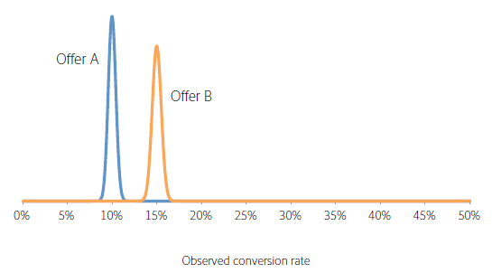
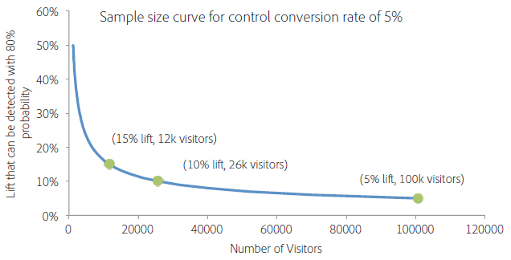

# Wie lange sollten A/B-Tests laufen?

Eine erfolgreiche [!UICONTROL A/B Test] in [!DNL Adobe Target] erfordert genügend Besucher (Stichprobengröße), um die Konversionsrate zu verbessern. Wie weiß man, wie lange man einen A/B-Test durchführt? Dieser Artikel enthält Informationen zu [!UICONTROL Auto-Allocate] Aktivitäten und den Rechner für den [!UICONTROL Adobe Target] Stichprobenumfang , mit dem Sie sicherstellen können, dass Ihre Aktivität über ausreichend Besucher verfügt, um Ihre Ziele zu erreichen.

Es ist verlockend, eine Aktivität zu stoppen, wenn eines der Angebote in den ersten Tagen der Aktivität besser oder schlechter abschneidet als die anderen. Wenn jedoch die Anzahl der Beobachtungen gering ist, ist die Wahrscheinlichkeit hoch, dass eine positive oder negative Steigerung nur zufällig beobachtet wurde, da die Konversionsrate als Durchschnitt einer geringen Besucherzahl ermittelt wurde. Wenn die Aktivität mehr Datenpunkte erfasst, nähern sich die Konversionsraten ihren eigentlichen, langfristigen Werten an.

>[!IMPORTANT]
>
>Das vorzeitige Anhalten einer Aktivität ist eine der zehn signifikanten Fallstricke, die bei der Durchführung von A/B-Tests auftreten können. Weitere Informationen finden Sie unter [10 häufige Fehler bei A/B-Tests und wie diese vermieden werden](/help/main/c-activities/t-test-ab/common-ab-testing-pitfalls.md#concept_578A7947C9554868B30F12DFF9E3F8E3).

[!DNL Adobe Target] bietet Tools, mit denen Sie sicherstellen können, dass Ihre Aktivität über eine ausreichend große Stichprobengröße verfügt, um Ihre Konversionsziele zu erreichen: Automatische Zuordnung.

## Automatische Zuordnung {#auto-allocate}

Eine [automatische Zuordnung](/help/main/c-activities/automated-traffic-allocation/automated-traffic-allocation.md)-Aktivität ist eine Art von A/B-Test, der einen Gewinner aus zwei oder mehr Erlebnissen ermittelt. Ein [!UICONTROL Auto-Allocate] Test ordnet automatisch dem Gewinner mehr Traffic zu, um die Konversionen während der Fortführung des Tests und des Lernens zu erhöhen.

Mit A/B-Standardtests sind Kosten verbunden. Sie müssen Traffic generieren, um die Leistung jedes einzelnen Erlebnisses zu messen und durch Analysen die erfolgreichsten Erlebnisse zu ermitteln. Die Verteilung von Traffic bleibt auch dann festgelegt, wenn Sie erkennen, dass einige Erlebnisse andere übertreffen. Außerdem ist es schwierig, die Stichprobengröße korrekt zu bestimmen, und die Aktivität muss komplett durchlaufen, bevor Sie einen Sieger finden. Und es besteht immer noch eine Chance, dass der identifizierte Gewinner kein wahrer Gewinner ist.

Die Lösung ist [!UICONTROL Auto-Allocate]. [!UICONTROL Auto-Allocate] reduziert diese Kosten und den Mehraufwand für die Ermittlung des erfolgreichsten Erlebnisses. [!UICONTROL Auto-Allocate] überwacht die Leistung aller Erlebnisse anhand der Zielmetrik und sendet proportional mehr neue Teilnehmer zu den besonders leistungsstarken Erlebnissen. Es wird ausreichend Traffic für die Erkundung der anderen Erlebnisse reserviert. Sie können die Vorteile der Aktivität auf Ihren Ergebnissen sehen, auch während die Aktivität noch ausgeführt wird: Die Optimierung erfolgt parallel zum Lernen.

[!UICONTROL Auto-Allocate] bewegt Besucher schrittweise in Richtung erfolgreicher Erlebnisse, anstatt zu warten, bis eine Aktivität beendet wird, um einen Gewinner zu bestimmen. Sie profitieren schneller von Steigerungen, da den Aktivitätsteilnehmern, die zu weniger erfolgreichen Erlebnissen geleitet worden wären, nun potenziell erfolgreiche Erlebnisse angezeigt werden.

Bei Verwendung von [!UICONTROL Auto-Allocate] zeigt [!DNL Target] oben auf der Seite der Aktivität ein Badge mit der Bezeichnung „Noch kein Gewinner“ an, bis die Aktivität die Mindestanzahl an Konversionen mit ausreichender Konfidenz erreicht. [!DNL Target] gibt dann das erfolgreichste Erlebnis aus, indem oben auf der Seite der Aktivität ein Abzeichen angezeigt wird.

Weitere Informationen finden Sie unter [Automatische Zuordnung - Übersicht](/help/main/c-activities/automated-traffic-allocation/automated-traffic-allocation.md).

## Adobe [!DNL Target] Stichprobengrößenrechner {#section_6B8725BD704C4AFE939EF2A6B6E834E6}

Wenn Sie statt der [!UICONTROL A/B Test] eine manuelle [!UICONTROL Auto-Allocate] verwenden, hilft Ihnen der Rechner für den [!DNL Target] Stichprobenumfang bei der Bestimmung der für einen erfolgreichen Test erforderlichen Stichprobengröße. Ein manueller A/B-Test ist ein Test mit festem Horizont, daher ist der Rechner hilfreich. Die Verwendung des Taschenrechners für eine [!UICONTROL Auto-Allocate] ist optional, da [!UICONTROL Auto-Allocate] einen Gewinner für Sie bestimmt. Der Rechner liefert eine grobe Schätzung der benötigten Stichprobengröße. Im Folgenden finden Sie weiter Informationen zur Verwendung des Rechners.

Rufen Sie vor der Einrichtung Ihres A/B-Tests den [!DNL Adobe Target] [Rechner für den Stichprobenumfang](https://experienceleague.adobe.com/tools/calculator/testcalculator.html?lang=de) auf.

Es ist wichtig, vor der Durchführung von A/B-Tests eine angemessene Stichprobengröße (Anzahl der Besucher) zu bestimmen, um festzustellen, wie lange die Aktivität laufen soll, bevor die Ergebnisse ausgewertet werden. Wird die Aktivität einfach so lange überwacht, bis eine statistische Signifikanz erreicht ist, wird das Konfidenzintervall deutlich unterschätzt, was den Test unzuverlässig macht. Die Intuition hinter diesem Ergebnis ist, dass im Falle eines statistisch signifikanten Ergebnisses der Test gestoppt und ein Gewinner bestimmt wird. Ist das Ergebnis jedoch statistisch nicht signifikant, so darf der Test fortgesetzt werden. Diese Vorgehensweise begünstigt das positive Ergebnis erheblich, wodurch die Falsch-Positiv-Rate zunimmt und das effektive Signifikanzniveau des Tests verzerrt wird.

Dieses Verfahren kann zu vielen falsch positiven Ergebnissen führen, was letztendlich zur Implementierung von Angeboten führt, die nicht den prognostizierten Anstieg liefern. Eine schwache Steigerung an sich ist ein unbefriedigendes Ergebnis, aber eine noch schwerwiegendere Folge ist, dass die Unfähigkeit, diese Steigerung genau vorherzusagen, mit der Zeit das Vertrauen der Organisation in Tests als Praxis untergräbt.

In diesem Artikel werden die Faktoren erläutert, die bei der Bestimmung einer Stichprobengröße abgewogen werden müssen, und ein Rechner zur Schätzung einer angemessenen Stichprobengröße eingeführt. Die Berechnung des Stichprobenumfangs mithilfe des Stichprobengrößenrechners (Link oben) vor Beginn von A/B-Tests hilft sicherzustellen, dass Sie immer qualitativ hochwertige A/B-Tests durchführen, die statistischen Standards entsprechen.

Es gibt fünf benutzerdefinierte Parameter zur Definition eines A/B-Tests. Diese Parameter sind miteinander verknüpft, sodass sich der fünfte berechnen lässt, wenn vier der Parameter festgelegt wurden:

* Statistische Bedeutung
* Teststärke
* Zuverlässig bestimmbare Mindeststeigerung
* Baseline-Konversionsrate
* Anzahl der Besucher

>[!IMPORTANT]
>
>Um genaue Ergebnisse zu erhalten, müssen Sie die Seite neu laden, bevor Sie Parameter-Nummern ändern. Wiederholen Sie diesen Vorgang jedes Mal, wenn Sie eine der Parameternummern ändern.

Bei einem A/B-Test werden die statistische Bedeutung, Teststärke, zuverlässig bestimmbare Mindeststeigerung und Baseline-Konversionsrate durch einen Analysten festgelegt. Anschließend wird die erforderliche Anzahl der Besucher aus diesen Zahlen berechnet. In diesem Artikel werden diese Elemente erläutert und Richtlinien zur Bestimmung dieser Metriken für einen bestimmten Test gegeben.

Die unten stehende Abbildung veranschaulicht die vier möglichen Ergebnisse eines A/B-Tests.

Es ist wünschenswert, keine Falsch-Positiv-Werte bzw. Falsch-Negativ-Werte zu erhalten. Das Erzielen von Null-Falsch-Positiven kann jedoch niemals durch einen statistischen Test garantiert werden. Es ist immer möglich, dass beobachtete Trends nicht repräsentativ für die zugrundeliegenden Konversionsraten sind. So könnte man z. B. bei einem Test, um zu sehen, ob Kopf oder Zahl beim Münzwurf wahrscheinlicher war, selbst bei einer fairen Münze, zehn Kopf auf zehn Würfe reinen Zufalls bekommen. Die statistische Bedeutung und die Teststärke tragen zur Quantifizierung der Falsch-Positiv- und Falsch-Negativ-Raten bei und ermöglichen es, diese für einen gegebenen Test auf einem vertretbaren Niveau zu halten.

### Statistische Bedeutung {#section_8230FB9C6D1241D8B1786B72B379C3CD}

Das Signifikanzniveau eines Tests bestimmt, wie wahrscheinlich es ist, dass der Test einen signifikanten Unterschied bei den Konversionsraten zwischen zwei verschiedenen Angeboten meldet, obwohl es tatsächlich keinen echten Unterschied gibt. Diese Situation wird als falsch positiv oder als Fehler vom Typ I bezeichnet. Das Signifikanzniveau ist ein vom Benutzer angegebener Schwellenwert und ein Kompromiss zwischen der Toleranz für falsch positive Ergebnisse und der Anzahl der Besucher, die in den Test einbezogen werden müssen.

Bei einem A/B-Test wird zunächst angenommen, dass beide Angebote dieselbe Konversionsrate aufweisen. Anschließend wird die Wahrscheinlichkeit des beobachteten Ergebnisses auf Basis dieser Annahme berechnet. Wenn diese Wahrscheinlichkeit (der p-Wert) kleiner ist als ein vordefinierter Schwellenwert (das Signifikanzniveau), kommt [!DNL Target] zu dem Schluss, dass die ursprüngliche Annahme - dass beide Angebote dieselbe Konversionsrate haben - falsch ist. Daher sind die Konversionsraten von A und B auf dem gegebenen Signifikanzniveau statistisch unterschiedlich.

Ein allgemein übliches Signifikanzniveau bei A/B-Tests beträgt 5 %, was einem Konfidenzniveau von 95 % entspricht (Konfidenzniveau = 100 % - Signifikanzniveau). Ein Konfidenzniveau von 95 % bedeutet, dass Sie jedes Mal, wenn Sie einen Test durchführen, mit einer Wahrscheinlichkeit von 5 % eine statistisch signifikante Steigerung beobachten werden, auch wenn kein Unterschied zwischen den Angeboten besteht.

Typische Interpretationen des Konfidenzniveaus werden in der unten stehenden Tabelle zusammengefasst:

| Konfidenzniveau | Interpretation |
|--- |--- |
| &lt; 90% | Kein Beweis, dass es einen Unterschied zwischen den Konversionsraten gibt |
| 90-95 % | Schwacher Beweis, dass es einen Unterschied zwischen den Konversionsraten gibt |
| 95-99 % | Moderater Beweis, dass es einen Unterschied zwischen den Konversionsraten gibt |
| 99-99,9 % | Starker Beweis, dass es einen Unterschied zwischen den Konversionsraten gibt |
| +99,9 % | Sehr starker Beweis, dass es einen Unterschied zwischen den Konversionsraten gibt |

Es wird empfohlen, immer ein Konfidenzniveau von 95 % oder neuer zu verwenden.

Es ist wünschenswert, den höchstmöglichen Konfidenzwert zu verwenden, damit der Test wenige falsch positive Ergebnisse liefert. Ein höheres Konfidenzniveau erfordert jedoch eine höhere Besucheranzahl, wodurch sich der Zeitbedarf für den Test erhöht. Darüber hinaus bewirkt eine Steigerung des Konfidenzniveaus eine Senkung der Teststärke.

### Teststärke {#section_1169C27F8E4643719D38FB9D6EBEB535}

Die Teststärke eines A/B-Tests ist die Wahrscheinlichkeit der Aufdeckung eines echten Unterschieds der Konversionsrate in einer bestimmten Größenordnung. Aufgrund der zufälligen (stochastischen) Natur von Konversionsereignissen ist es möglich, dass ein statistisch signifikanter Unterschied nicht - nur zufällig - beobachtet wird, obwohl es einen realen Unterschied in der Konversionsrate zwischen den beiden Angeboten gibt. Dieses Szenario wird als falsch negativ oder als Fehler vom Typ II bezeichnet.

Die Teststärke wird oft ignoriert, weil ihre Ermittlung im Gegensatz zur statistischen Bedeutung für die Durchführung eines A/B-Tests nicht erforderlich ist. Wird die statistische Aussagekraft jedoch außer Acht gelassen, besteht eine beträchtliche Wahrscheinlichkeit, dass echte Unterschiede zwischen den Konversionsraten verschiedener Angebote vom Test nicht erkannt werden, da die Stichprobengröße zu klein ist. Dies führt dazu, dass die Tests von falsch positiven Ergebnissen dominiert werden.

Eine hohe Teststärke ist wünschenswert, damit der Test mit großer Wahrscheinlichkeit einen echten Unterschied der Konversionsraten erkennt und weniger Falsch-Negativ-Werte ergibt. Es ist jedoch eine größere Anzahl von Besuchern erforderlich, um die statistische Aussagekraft der Erkennung einer bestimmten Steigerung zu erhöhen, was die für den Test benötigte Zeit verlängert.

Ein üblicher Wert für die Teststärke ist 80 %, was bedeutet, dass der Test mit achtzigprozentiger Wahrscheinlichkeit einen Unterschied ermittelt, der der zuverlässig bestimmbaren Mindeststeigerung entspricht. Die Ermittlung kleinerer Steigerungen durch den Test ist weniger wahrscheinlich, die Ermittlung größerer Steigerungen wiederum wahrscheinlicher.

### Zuverlässig bestimmbare Mindeststeigerung {#section_6101367EE9634C298410BBC2148E33A9}

Die meisten Organisationen möchten den kleinstmöglichen Unterschied der Konversionsrate ermitteln, da sich eine Implementierung selbst bei einer geringen Steigerung lohnt. Wenn der A/B-Test jedoch eine hohe Wahrscheinlichkeit für die Erkennung einer kleinen Steigerung aufweisen soll, ist die Anzahl der Besucher, die in den Test einbezogen werden müssen, untragbar hoch. Der Grund dafür ist, dass bei einer geringen Differenz in der Konversionsrate beide Konversionsraten mit hoher Genauigkeit geschätzt werden müssen, um die Differenz zu identifizieren, was viele Besucher erfordert. Deswegen sollte die zuverlässig bestimmbare Mindeststeigerung durch geschäftliche Anforderungen festgelegt werden, die den Trade-off zwischen der Entdeckung geringer Steigerungen und der Durchführung des Tests über längere Zeiträume berücksichtigen.

Zum Beispiel wird angenommen, dass zwei Angebote (A und B) echte Konversionsraten von 10 % und 15 % aufweisen. Wenn diese Angebote für 100 Besucher eingeblendet werden, besteht aufgrund der stochastischen Natur der Konversionen eine 95-prozentige Wahrscheinlichkeit, dass für Angebot A Konversionsraten zwischen 4 % und 16 % und für Angebot B Konversionsraten zwischen 8 % und 22 % beobachtet werden. Diese Bandbreiten werden in der Statistik als Konfidenzintervalle bezeichnet. Sie repräsentieren die Konfidenz bezüglich der Genauigkeit der geschätzten Konversionsraten. Je größer die Stichprobe (mehr Besucher), desto mehr können Sie darauf vertrauen, dass die Schätzwerte für die Konversionsrate genau sind.

Die unten stehende Abbildung veranschaulicht diese Wahrscheinlichkeitsverteilungen.

Aufgrund der großen Überlappung dieser beiden Bandbreiten kann der Test nicht ermitteln, ob die Konversionsraten voneinander abweichen. Aus diesem Grund ermöglicht ein Test mit 100 Besuchern keine Unterscheidung zwischen den beiden Angeboten. Wenn [!DNL Target] die Angebote jedoch jeweils 5.000 Besuchern bereitstellt, besteht eine 95-prozentige Wahrscheinlichkeit, dass die beobachteten Konversionsraten in den Bereichen von 9 % bis 11 % bzw. 14 % bis 16 % sinken.

In diesem Fall ist es unwahrscheinlich, dass der Test zu einem falschen Ergebnis kommt, sodass der Test mit 5.000 Besuchern zwischen den beiden Angeboten unterscheiden kann. Der Test mit 5.000 Besuchern hat ein Konfidenzintervall von +/-1%. Das bedeutet, dass der Test Unterschiede von etwa 1% erkennen kann. Aus diesem Grund wären noch mehr Besucher erforderlich, wenn die echten Konversionsraten der Angebote bzw. bei 10 % und 10,5 % und nicht bei 10 % und 15 % liegen würden.

### Baseline-Konversionsrate {#section_39380C9CA3C649B6BE6E1F8A06178B05}

Die Baseline-Konversionsrate ist die Konversionsrate des Kontrollangebotes (Angebot A). Häufig hat man aufgrund der Erfahrung ein gutes Gespür für die Konversionsstufe des Angebots. Wenn dies nicht der Fall ist (zum Beispiel, weil es sich um einen neuen Angebotstyp oder ein neues kreatives Element handelt), kann der Test einen ganzen Tag oder länger ausgeführt werden, um eine ungefähre Schätzung der Baseline-Konversionsrate zu erhalten, die bei der Berechnung der Stichprobengröße verwendet werden kann.

### Anzahl der Besucher {#section_19009F165505429E95291E6976E498DD}

Es kann schwierig sein, die Opportunitätskosten für die Ausführung eines Tests über einen langen Zeitraum mit dem Risiko falscher Positivwerte und falscher Negativwerte abzuwägen. Natürlich wollen Sie keine falschen Entscheidungen treffen, aber es ist auch nicht wünschenswert, durch zu strenge oder starre Teststandards gelähmt zu werden.

Als allgemeine Richtlinie werden ein Konfidenzniveau von 95 % und eine Teststärke von 80 % empfohlen.

Der Stichprobenkalkulator (Link siehe oben) fragt Sie nach der statistischen Bedeutung (Empfehlung: 95 %) und der statistischen Aussagekraft (Empfehlung: 80 %). Nach Eingabe der Baseline-Konversionsrate und des täglichen Traffics für alle Angebote gibt die Tabelle die erforderliche Anzahl der Besucher zur Erkennung einer Steigerung von 1 %, 2 %, 5 %, 10 %, 15 % und 20 % mit einer Wahrscheinlichkeit an, die der angegebenen Teststärke entspricht. In der Tabelle kann der Benutzer auch einen benutzerdefinierten minimalen zuverlässig erkennbaren Anstieg eingeben. Darüber hinaus gibt die Tabelle die Anzahl der Wochen an, die erforderlich sind, um den Test auf dem vom Benutzer angegebenen Traffic-Niveau zu basieren. Die erforderliche Anzahl von Wochen wird auf die nächste ganze Woche aufgerundet, um zu vermeiden, dass die Ergebnisse durch Auswirkungen auf den Wochentag beeinflusst werden.

Es gibt einen Trade-off zwischen der durch den Test zuverlässig ermittelbaren Mindeststeigerung und der erforderlichen Anzahl der Besucher. Die unten stehende Abbildung, die für eine Baseline-Konversionsrate (Kontrolle) von 5 % gilt, zeigt stark abnehmende Erträge bei einer zunehmenden Anzahl von Besuchern. Die Mindeststeigerung, die zuverlässig ermittelt werden kann, verbessert sich deutlich mit den ersten hinzugefügten Benutzern, es ist jedoch eine zunehmend größere Anzahl von Besuchern erforderlich, um den Test weiter zu verbessern. Die Abbildung trägt dazu bei, einen angemessenen Trade-off zwischen der für die Ausführung des Tests erforderlich Zeit (die durch die Anzahl der erforderlichen Besucher und den Site-Traffic bestimmt wird) und der Mindeststeigerung, die sich durch den Test zuverlässig erkennen lässt, zu ermitteln.

In diesem Beispiel könnten Sie entscheiden, dass es ausreichend ist, einen Anstieg von 5 % (entsprechend einer Konversionsrate des alternativen Angebots von (100 %+5 %)&#42;5 % = 5,25 %) in 80 von 100 Tests zu erkennen, sodass Sie eine Stichprobengröße von 100.000 Besuchern für jedes Angebot benötigen. Wenn die Website 20.000 Besucher pro Tag hat und Sie zwei Angebote testen, sollte der Test für 2.&#42;.000/20.000 = 10 Tage laufen, bevor festgestellt werden kann, ob das alternative Angebot dem Kontrollangebot statistisch signifikant überlegen ist.

Auch hier wird in jedem Fall empfohlen, die erforderliche Zeit auf eine ganze Woche aufzurunden, um Wochentagseffekte zu vermeiden. In diesem Beispiel würde der Test vor der Auswertung der Ergebnisse über zwei Wochen ausgeführt werden.

### Umsatz-pro-Besuch-Metrik  {#section_C704C0861C9B4641AB02E911648D2DC2}

Bei Verwendung der Metrik Umsatz pro Besuch (RPV) wird eine zusätzliche Varianzquelle hinzugefügt, da RPV das Produkt aus Umsatz pro Bestellung und Konversionsrate ist (RPV = Umsatz / #visitors = (Umsatz pro Bestellung &#42; #orders) / # Besucher = Umsatz pro Bestellung &#42; (#visitors &#42; CTR) / #visitors = Umsatz pro Bestellung &#42; CTR), jeweils mit einer eigenen Varianz. Die Varianz der Konversionsrate kann direkt mithilfe eines mathematischen Modells geschätzt werden, aber die Varianz des Umsatzes pro Bestellung ist spezifisch für die Aktivität. Nutzen Sie daher die Kenntnis dieser Varianz aus früheren Aktivitäten oder führen Sie den A/B-Test einige Tage lang durch, um die Varianz beim Umsatz zu schätzen. Die Varianz wird anhand der Werte Summe der Verkäufe, Summe der Verkäufe im Quadrat und Anzahl der Besucher berechnet, die in der CSV-Download-Datei zu finden sind. Nachdem dies eingerichtet wurde, verwenden Sie die Tabelle, um die erforderliche Zeit zum Abschließen des Tests zu berechnen.

Der Stichprobengrößenrechner (Link siehe oben) kann Ihnen dabei helfen, die RPV-Metrik zu konfigurieren. Wenn Sie den Rechner öffnen, sehen Sie eine Registerkarte mit der Bezeichnung [!UICONTROL RPV Metric]. Sie benötigen die folgenden Informationen, wenn Sie die RPV-Version des Rechners verwenden:

* Anzahl der Besucher des Kontrollangebots
* Gesamtumsatz des Kontrollangebots

  Stellen Sie sicher, dass der Filter für extreme Reihenfolge ausgewählt ist.

* Die Quadratsumme des Umsatzes für das Kontrollangebot

  Stellen Sie sicher, dass der Filter für extreme Reihenfolge aktiviert ist.

Im Allgemeinen erfordert die Verwendung von RPV als Metrik 20-30 % mehr, um dasselbe Maß an statistischer Konfidenz für denselben gemessenen Anstieg zu erreichen. Dies liegt daran, dass RPV die zusätzliche Varianz verschiedener Bestellgrößen pro Konversion aufweist. Dies sollte bei der Auswahl zwischen direkter Konversionsrate und RPV als Metrik, auf der Ihre endgültige Geschäftsentscheidung basieren soll, berücksichtigt werden.

## Korrektur für den Vergleich mehrerer Angebote {#section_1474113764224D0B85472D8B023CCA15}

Jedes Mal, wenn Sie zwei Angebote vergleichen, entspricht die Wahrscheinlichkeit eines Falsch-Positiv-Werts (Beobachtung eines statistisch signifikanten Unterschieds, auch wenn es keinen Unterschied bei der Konversionsrate gibt) dem Signifikanzniveau. Wenn zum Beispiel fünf Angebote A/B/C/D/E vorliegen und es sich bei A um das Kontrollangebot handelt, werden vier Vergleiche vorgenommen (Kontrolle zu B, Kontrolle zu C, Kontrolle zu D und Kontrolle zu E) und die Wahrscheinlichkeit eines Falsch-Positiv-Werts beträgt 18,5 %, selbst wenn das Konfidenzniveau 95 % beträgt, da Pr (mindestens ein Falsch-Positiv-Wert) = 1 - Pr (keine Falsch-Positiv-Werte) = 1 - 0,95 = 18,5 %. Als Falsch-Positiv-Wert gilt in diesem Zusammenhang, wenn der Kontrollwert besser als die Alternative bzw. wenn die Alternative besser als der Kontrollwert ausfällt, auch wenn es tatsächlich keinen Unterschied zwischen diesen Werten gibt.

## Schlussfolgerung  {#section_AEA2427B90AE4E9395C7FF4F9C5CA066}

Durch die Verwendung einer [!UICONTROL Auto-Allocate] Aktivität ermittelt [!DNL Target] aus zwei oder mehr Erlebnissen den Gewinner und weist dem Gewinner automatisch mehr Traffic zu, um die Konversionen während der Fortführung des Tests und des Lernens zu erhöhen. [!UICONTROL Auto-Allocate] ist es einfach, Ihre Konversionsziele zu erreichen und dabei das Rätselraten zu entfernen.

Indem Sie den in diesem Artikel vorgestellten Stichprobengrößenrechner (Link oben) verwenden und den Test so lange ausführen lassen, wie er nahe legt, können Sie sicherstellen, dass Sie immer hochwertige A/B-Tests durchführen, die den Falsch-Positiv- und Falsch-Negativ-Raten entsprechen, die Sie für den spezifischen Test als ausreichend erachtet haben. Dadurch wird gewährleistet, dass Ihre Tests konsistent und in der Lage sind, die von Ihnen gewünschte Steigerung zuverlässig zu ermitteln.
