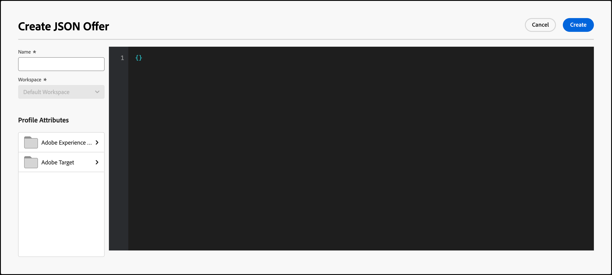

# Erstellen von JSON-Angeboten

Erstellen Sie JSON-Angebote im [!UICONTROL Offer Library] in [!DNL Adobe Target] zur Verwendung im [!UICONTROL Form-Based Experience Composer].

JSON-Angebote können in formularbasierten Aktivitäten verwendet werden, um Anwendungsfälle zu aktivieren, in denen eine [!DNL Target]-Entscheidung erforderlich ist, um ein Angebot im JSON-Format zur Verwendung in SPA Framework oder serverseitigen Integrationen zu senden.

## JSON-Überlegungen

Beachten Sie Folgendes, wenn Sie mit JSON-Angeboten arbeiten:

* JSON-Angebote sind derzeit nur für die Aktivitäten [!UICONTROL A/B Test], [!UICONTROL Automated Personalization] (AP) und [!UICONTROL Experience Targeting] (XT) verfügbar.
* JSON-Angebote können nur in [formularbasierten Aktivitäten](/help/main/c-experiences/form-experience-composer.md) verwendet werden.
* JSON-Angebote können direkt abgerufen werden, wenn Sie die [Server Side APIs und Mobile Node.js, Java, .NET und Python SDKs verwenden](https://experienceleague.adobe.com/docs/target-dev/developer/server-side/server-side-overview.html?lang=de){target=_blank}.
* Im Browser können JSON-Angebote nur über at.js 1.2.3 (oder höher) und mithilfe von [getOffer()](https://experienceleague.adobe.com/docs/target-dev/developer/client-side/at-js-implementation/functions-overview/adobe-target-getoffer.html){target=_blank} abgerufen werden, indem Aktionen mithilfe der Aktion `setJson` gefiltert werden.
* JSON-Angebote werden als native JSON-Objekte und nicht als Zeichenfolgen ausgeliefert. Nutzer dieser Objekte müssen diese also nicht mehr als Zeichenfolgen behandeln und in JSON-Objekte konvertieren.
* JSON-Angebote werden im Gegensatz zu anderen Angeboten (z. B. HTML-Angeboten) nicht automatisch eingesetzt, da es sich bei JSON-Angeboten um nicht visuelle Angebote handelt. Entwickler müssen Code schreiben, um das Angebot explizit mit [getOffer()](https://experienceleague.adobe.com/docs/target-dev/developer/client-side/at-js-implementation/functions-overview/adobe-target-getoffer.html){target=_blank} abzurufen.

## Erstellen eines JSON-Angebots {#section_BB9C72D59DEA4EFB97A906AE7569AD7A}

1. Klicken Sie auf **[!UICONTROL Offers]** > **[!UICONTROL Code Offers]**.

   

1. Klicken Sie auf **[!UICONTROL Create Offer]** > **[!UICONTROL JSON Offer]**.

   

1. Geben Sie einen Angebotsnamen ein.
1. (Bedingt) Wenn Sie über ein [[!DNL Target] Premium-Konto](/help/main/c-intro/intro.md#premium) verfügen, wählen Sie den gewünschten [Arbeitsbereich](/help/main/administrating-target/c-user-management/property-channel/property-channel.md#workspace) aus.
1. (Bedingt) Wählen Sie die gewünschten Profilattribute aus.
1. Geben Sie Ihren JSON-Code in das Feld **[!UICONTROL Code]** ein oder fügen Sie ihn ein.
1. Klicken Sie auf **[!UICONTROL Create]**.

## JSON-Beispiel {#section_A54F7BB2B55D4B7ABCD5002E0C72D8C9}

JSON-Angebote werden nur in Aktivitäten unterstützt, die mit dem [formularbasierten Experience Composer](/help/main/c-experiences/form-experience-composer.md) erstellt wurden. Die einzige Möglichkeit, JSON-Angebote zu nutzen, besteht derzeit in direkten API-/SDK-Aufrufen.

Siehe folgendes Beispiel:

```json
adobe.target.getOffer({ 
  mbox: "some-mbox", 
  success: function(actions) { 
    console.log('Success', actions); 
  }, 
  error: function(status, error) { 
    console.log('Error', status, error); 
  } 
});
```

Die Aktionen, die an den Erfolgs-Callback übergeben werden, sind eine Reihe von Objekten. Angenommen, Sie haben ein einzelnes JSON-Angebot, das diesen Inhalt enthält:

```json
{ 
  "demo": {"a": 1, "b": 2} 
}
```

Das Aktionsarray weist die folgende Struktur auf:

```json
[ 
 { 
   action: "setJson", 
   content: [{ 
     "demo": {"a": 1, "b": 2} 
   }] 
 }  
]
```

Um das JSON-Angebot zu extrahieren, durchlaufen Sie Aktionen, suchen die Aktion mit der Aktion `setJson` und navigieren dann durch das Inhalts-Array.

## Anwendungsfall {#section_85B07907B51A43239C8E3498EF58B1E5}

Angenommen, das folgende JSON-Angebot wird an Ihre Webseite geliefert:

```json
{ 
    "_id": "5a65d24d8fafc966921e9169", 
    "index": 0, 
    "guid": "7c006504-c6f7-468d-a46f-f72531ea454c", 
    "isActive": true, 
    "balance": "$2,075.06", 
    "picture": "https://placehold.it/32x32", 
    "tags": [ 
      "esse", 
      "commodo", 
      "excepteur"
    ], 
    "friends": [ 
      { 
        "id": 0, 
        "name": "Carla Lyons" 
      }, 
      { 
        "id": 1, 
        "name": "Ollie Mooney" 
      } 
    ], 
    "greeting": "Hello, Stephenson Fernandez! You have 4 unread messages.", 
    "favoriteFruit": "strawberry" 
} 
  
```

Der folgende Code zeigt Ihnen, wie Sie auf das Attribut „Begrüßung“ zugreifen können:

```json
adobe.target.getOffer({   
  "mbox": "name_of_mbox", 
  "params": {}, 
  "success": function(offer) {           
        console.log(offer[0].content[0].greeting); 
  },   
  "error": function(status, error) {           
      console.log('Error', status, error); 
  } 
});
```

## JSON-Angebotsbeispiel mit Echtzeit-Kundendatenplattform-Profilattributen

Echtzeit-Kundendatenplattform-Profilattribute können für [!DNL Target] freigegeben werden, um sie in HTML- und JSON-Angeboten zu verwenden.

Weitere Informationen finden Sie unter [Freigeben von Echtzeit-Kundendatenplattform-Profilattributen für  [!DNL Target]](/help/main/c-integrating-target-with-mac/integrating-with-rtcdp.md#rtcdp-profile-attributes).

## Filtern von Angeboten nach dem JSON-Angebotstyp {#section_52533555BCE6420C8A95EB4EB8907BDE}

Sie können die [!UICONTROL Offers] -Bibliothek nach dem JSON-Angebotstyp filtern, indem Sie auf das Symbol **[!UICONTROL Show filters]** klicken und dann das Kontrollkästchen **[!UICONTROL JSON]** aktivieren.


