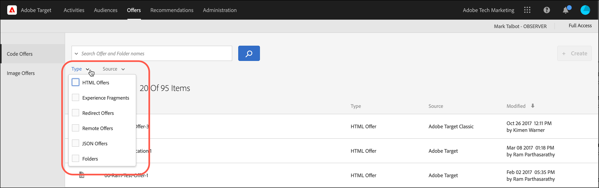

# Angebote

Verwenden Sie die [!UICONTROL Offers] Bibliothek in [!DNL Adobe Target] zur Verwaltung Ihres Code- und Bildangebots.

>[!NOTE]
>
>Dieser Artikel enthält Informationen zu Aktualisierungen des [!DNL Target] -Benutzeroberfläche, die derzeit Teil eines Beta-Programms ist. Die [!DNL Adobe Target] -Team ermöglicht oft neuen Funktionen für ausgewählte Kunden zu Test- und Feedback-Zwecken. Nach Abschluss des Testzeitraums werden diese Funktionen in Zukunft für alle Kunden aktiviert [!DNL Target Standard/Premium] veröffentlicht und in den Versionshinweisen angekündigt.

1. Klicks **[!UICONTROL Offers]** , um die Bibliothek zu öffnen.

   Die Bibliothek enthält die Angebote, die über [!DNL Target Standard/Premium], [!DNL Target Classic], [!DNL Adobe Experience Manager] (AEM), [!DNL Adobe Mobile Services] (AMS) und APIs erstellt wurden. In [!DNL Target Classic] oder anderen Lösungen erstellte Angebote lassen sich in [!DNL Target Standard/Premium] bearbeiten.

   Die [!UICONTROL Offers] Die Seite enthält zwei Registerkarten rechts: [!UICONTROL Code Offers] und [!UICONTROL Image Offers] die es Ihnen ermöglicht, Angebote nach Typ anzuzeigen.

   

1. (Optional) Klicken Sie auf die **[!UICONTROL Type]** Dropdown-Liste zum Filtern von Angeboten nach Typ (HTML-Angebot, [Experience Fragments](/help/main/c-experiences/c-manage-content/aem-experience-fragments.md), [Umleitungsangebot](/help/main/c-experiences/c-manage-content/offer-redirect.md), [Remote-Angebot](/help/main/c-experiences/c-manage-content/about-remote-offers.md), [JSON-Angebote](/help/main/c-experiences/c-manage-content/create-json-offer.md), und [Ordner](/help/main/c-experiences/c-manage-content/create-content-folder.md)).

   

1. (Optional) Klicken Sie auf die **[!UICONTROL Source]** Dropdownliste zum Filtern von Angeboten nach Quelle (Adobe Target, Adobe Target Classic und Adobe Experience Manager).

1. (Optional) Führen Sie zusätzliche Aufgaben durch, indem Sie den Mauszeiger über das gewünschte Angebot oder den Ordner auf der [!UICONTROL Code Offers] und klicken Sie dann auf das gewünschte Symbol.

   

   Zu den Optionen zählen:

   * Anzeigen (weitere Informationen finden Sie unter [Angebotsdefinitionen anzeigen](#section_6B059DD121434E6292CAB393507D010E) unten.)
   * Bearbeiten 
   * Kopieren 
   * Verschieben (um beispielsweise ein oder mehrere Elemente in einen Ordner zu verschieben, klicken Sie auf die **[!UICONTROL Move]** für das gewünschte Element klicken Sie auf den gewünschten Ordner und dann auf **[!UICONTROL Drop]**.
   * Löschen

   Je nach Ihren Berechtigungen werden möglicherweise keine Symbole für alle Optionen angezeigt. Beispiel: ein Benutzer mit [!UICONTROL Observer] -Berechtigungen verfügen nicht über die Rechte zur Verwendung der [!UICONTROL Copy] -Option.

   Detaillierte Informationen zu den Aufgaben, die Sie für Angebote und Ordner ausführen können, finden Sie unter [Arbeiten mit Inhalten in der Asset-Bibliothek](/help/main/c-experiences/c-manage-content/assets-working.md).

1. (Optional) Führen Sie zusätzliche Aufgaben durch, indem Sie den Mauszeiger über das gewünschte Bildangebot oder den Ordner auf der [!UICONTROL Image Offers] und klicken Sie dann auf das gewünschte Symbol.

   

   Zu den Optionen zählen:

   * Auswählen
   * Download 
   * Eigenschaften anzeigen
   * Bearbeiten 
   * Anmerkungen hinzufügen
   * Kopieren 

   Detaillierte Informationen zu den Aufgaben, die Sie für Angebote und Ordner ausführen können, finden Sie unter [Arbeiten mit Inhalten in der Asset-Bibliothek](/help/main/c-experiences/c-manage-content/assets-working.md).

   >[!NOTE]
   >
   >Bildangebote sind nicht Teil der [Berechtigungen für Unternehmensbenutzer](/help/main/administrating-target/c-user-management/property-channel/property-channel.md) -Modell.

## Angebotsdefinitionen anzeigen {#section_6B059DD121434E6292CAB393507D010E}

Sie können Details zur Angebotsdefinition auf einer Popup-Karte im [!UICONTROL Offers] -Bibliothek, ohne das Angebot zu öffnen.

Beispielsweise wird auf die folgende Angebotsdefinitionskarte für ein HTML-Angebot zugegriffen, indem Sie den Mauszeiger über ein Angebot auf der Seite [!UICONTROL Content] und klicken Sie dann auf das Informationssymbol:

Die folgenden Informationen sind verfügbar:

* Name
* Quelle
* Typ
* Angebots-ID
* Angebotspfad
* Zuletzt geändert

Klicken Sie auf [!UICONTROL Offer Usage] um die Aktivitäten anzuzeigen, die auf ein Codeangebot verweisen, und zwar in der Popup-Karte für die Angebotsdefinition. Diese Funktionalität gilt nicht für Bildangebote. Auf diese Weise können Sie bei der Bearbeitung von Angeboten Auswirkungen auf andere Aktivitäten vermeiden. Informationen enthalten [!UICONTROL Live Activities] und [!UICONTROL Inactive Activities].

Die folgende Angebotsdefinitionskarte für ein Umleitungsangebot:

Die folgenden Informationen sind verfügbar:

* Name
* Quelle
* Typ
* Angebots-ID
* Angebotspfad
* Zuletzt geändert
* Umleitungs-URL
* Alle URL-Parameter einschließen (Ein oder Aus)
* Übergeben der mbox-Sitzungs-ID (ein oder aus)

Die folgende Angebotsdefinitionskarte für ein Remoteangebot:

Die folgenden Informationen sind verfügbar:

* Name
* Quelle
* Typ
* Angebots-ID
* Angebotspfad
* Zuletzt geändert
* Umleitungs-URL-Typ
* Absolute oder relative URL

## Schulungsvideo: Das Content Repository 

In diesem Video wird beschrieben, wie Angebote verwaltet werden.

* Zusammenhang zwischen der [Experience Cloud-Asset-Bibliothek](https://experienceleague.adobe.com/docs/core-services/interface/assets/creative-cloud.html) und der Target-Inhaltsbibliothek
* Benutzerdefinierte HTML-Angebote
* Benutzerdefinierte HTML-Angebote im Visual Experience Composer

>[!VIDEO](https://video.tv.adobe.com/v/17387)
