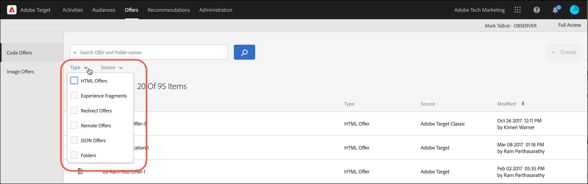
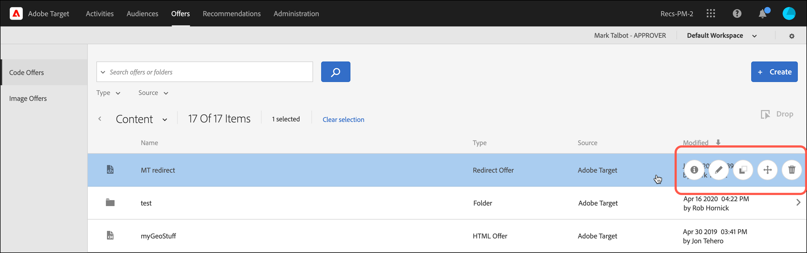
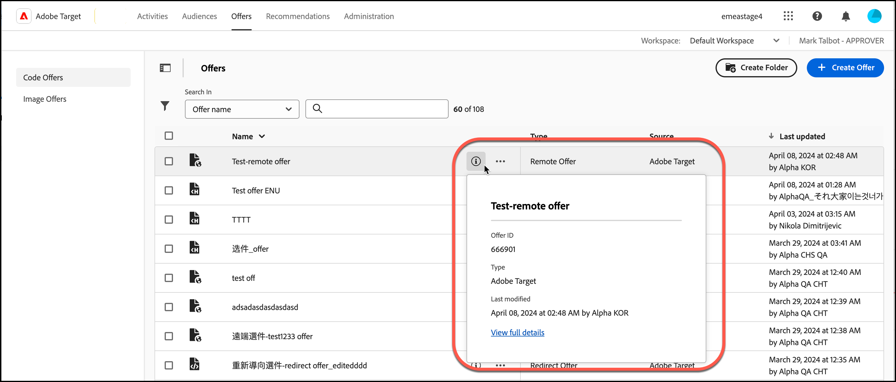

# Angebote

Verwenden Sie die [!UICONTROL Angebote]-Bibliothek in [!DNL Adobe Target], um den Inhalt Ihrer Code-Angebote und Bildangebote zu verwalten.

1. Klicken Sie auf **[!UICONTROL Angebote]**, um die Bibliothek zu öffnen.

   Die Bibliothek enthält die Angebote, die über [!DNL Target Standard/Premium], [!DNL Target Classic], [!DNL Adobe Experience Manager] (AEM), [!DNL Adobe Mobile Services] (AMS) und APIs erstellt wurden. In [!DNL Target Classic] oder anderen Lösungen erstellte Angebote lassen sich in [!DNL Target Standard/Premium] bearbeiten.

   Die Seite [!UICONTROL Angebote] verfügt auf der rechten Seite über zwei Registerkarten: [!UICONTROL Code-Angebote] und [!UICONTROL Bild-Angebote] mit denen Sie Angebote nach Typ anzeigen können.

   

1. (Optional) Klicken Sie auf die **[!UICONTROL Typ]** Dropdown-Liste, um Angebote nach Typ zu filtern (HTML-Angebot[Experience Fragments](/help/main/c-experiences/c-manage-content/aem-experience-fragments.md), [Umleitungsangebot](/help/main/c-experiences/c-manage-content/offer-redirect.md), [Remote-Angebot](/help/main/c-experiences/c-manage-content/about-remote-offers.md), [JSON-Angebote](/help/main/c-experiences/c-manage-content/create-json-offer.md) und [Ordner](/help/main/c-experiences/c-manage-content/create-content-folder.md)).

   

1. (Optional) Klicken Sie auf die Dropdown-Liste **[!UICONTROL Source]**, um Angebote nach Quelle (Adobe Target, Adobe Target Classic und Adobe Experience Manager) zu filtern.

1. (Optional) Führen Sie zusätzliche Aufgaben aus, indem Sie den Mauszeiger über das gewünschte Angebot oder den Ordner auf der Registerkarte [!UICONTROL Angebote &#x200B;]Code) bewegen und dann auf das gewünschte Symbol klicken.

   

   Zu den Optionen zählen:

   * Anzeigen (Weitere Informationen finden Sie [Anzeigen von Angebotsdefinitionen](#section_6B059DD121434E6292CAB393507D010E) unten.)
   * Bearbeiten
   * Kopieren
   * Verschieben (Um beispielsweise ein oder mehrere Elemente in einen Ordner zu verschieben, klicken Sie auf das **[!UICONTROL Verschieben]**-Symbol für das gewünschte Element, klicken Sie auf den gewünschten Ordner und dann auf **[!UICONTROL Ablegen]**.)
   * Löschen

   Je nach Ihren Berechtigungen werden möglicherweise nicht für alle Optionen Symbole angezeigt. Beispielsweise verfügt ein Benutzer mit [!UICONTROL Beobachter]-Berechtigungen nicht über die Rechte zur Verwendung der Option [!UICONTROL Kopieren].

   Ausführliche Informationen zu den Aufgaben, die Sie mit Angeboten und Ordnern ausführen können, finden Sie unter [Arbeiten mit Inhalten in der Asset-Bibliothek](/help/main/c-experiences/c-manage-content/assets-working.md).

1. (Optional) Führen Sie zusätzliche Aufgaben aus, indem Sie den Mauszeiger über das gewünschte Bildangebot oder den Ordner auf der Registerkarte [!UICONTROL Bildangebote] bewegen und dann auf das gewünschte Symbol klicken.

   

   Zu den Optionen zählen:

   * Auswählen
   * Download
   * Eigenschaften anzeigen
   * Bearbeiten
   * Anmerkungen hinzufügen
   * Kopieren

   Ausführliche Informationen zu den Aufgaben, die Sie mit Angeboten und Ordnern ausführen können, finden Sie unter [Arbeiten mit Inhalten in der Asset-Bibliothek](/help/main/c-experiences/c-manage-content/assets-working.md).

   >[!NOTE]
   >
   >Bildangebote sind nicht Teil des Modells [Enterprise-](/help/main/administrating-target/c-user-management/property-channel/property-channel.md)&quot;.

## Anzeigen der Angebotsdefinitionen {#section_6B059DD121434E6292CAB393507D010E}

Sie können Details zur Angebotsdefinition auf einer Popup-Karte in der Bibliothek [!UICONTROL Angebote] anzeigen, ohne das Angebot zu öffnen.

Beispielsweise kann die folgende Angebotsdefinitionskarte für ein HTML-Angebot durch Klicken auf das Informationssymbol aufgerufen werden:

Die folgenden Informationen sind verfügbar:

* Name
* Angebots-ID
* Typ
* Zuletzt geändert

Klicken Sie auf [!UICONTROL &#x200B; Link Vollständige Details anzeigen], um den Angebotsinhalt und die Aktivitäten anzuzeigen, die auf ein Code-Angebot verweisen. Auf diese Weise können Sie bei der Bearbeitung von Angeboten Auswirkungen auf andere Aktivitäten vermeiden. Die Informationen umfassen [!UICONTROL Live]Aktivitäten und [!UICONTROL Inaktive Aktivitäten].

Die verfügbaren Informationen auf den einzelnen Karten variieren je nach Angebotstyp: HTML-Angebot, [Experience Fragments](/help/main/c-experiences/c-manage-content/aem-experience-fragments.md), [Umleitungsangebot](/help/main/c-experiences/c-manage-content/offer-redirect.md), [Remote-Angebot](/help/main/c-experiences/c-manage-content/about-remote-offers.md) oder [JSON-Angebote](/help/main/c-experiences/c-manage-content/create-json-offer.md).

Die Funktion „offer-details“ gilt nicht für Bildangebote.

<!--

## Training video: The Content Repository 

This video includes information about managing offers.

* Connection between the [Experience Cloud Asset Library](https://experienceleague.adobe.com/docs/core-services/interface/assets/creative-cloud.html?lang=de) and the Target Content Library 
* Custom HTML Offers 
* Custom HTML Offer in the [!UICONTROL Visual Experience Composer]

>[!VIDEO](https://video.tv.adobe.com/v/17387)

-->
