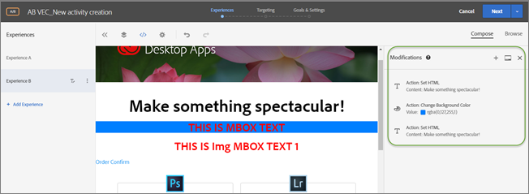

# Änderungen

Informationen zur [!UICONTROL Modifications] in [!DNL Adobe Target], mit denen Sie Änderungen an Ihrer Seite anzeigen und zusätzliche Änderungen hinzufügen können (CSS-Auswahl, Mbox und benutzerdefinierter Code).

Auf der Seite [!UICONTROL Modifications] werden alle Änderungen angezeigt, die an Ihrer Seite im Visual Experience Composer (VEC) vorgenommen wurden. Sie können zusätzliche Änderungen vornehmen, indem Sie auf die einzelnen Elemente der Seite klicken und [eine Aktion auswählen](/help/main/c-experiences/c-visual-experience-composer/viztarget-options.md#reference_3BD1BEEAFA584A749ED2D08F14732E81). Jede von Ihnen vorgenommene Änderung wird als separate Aktion oder Element in der [!UICONTROL Modifications] angezeigt. Sie können auch Änderungen hinzufügen, einschließlich folgender Änderungstypen: CSS-Selektor, Mbox und benutzerspezifischer Code.

## Änderungsübersicht {#section_EE27E7572AA74397BBDED563B2B3D509}

Auf der Seite [!UICONTROL Modifications] werden alle Änderungen angezeigt, die an Ihrer Seite in VEC vorgenommen wurden. Jede von Ihnen vorgenommene Änderung wird als separate Aktion oder Element in der [!UICONTROL Modifications] angezeigt.



Auf der Seite „Änderungen“ können Sie kleine Änderungen an dem Selektor vornehmen, den Target auswählt, wenn Sie über den VEC konfigurieren, wie Inhalte bereitgestellt werden. Sie können entweder den Inhalt oder ein HTML-Attribut ändern. Sie können auch den Code bearbeiten, um die Entsprechung zu einem HTML-Angebot in einer Mbox zu erstellen.

Auf der Seite „Änderungen“ können Sie folgende Aktionen durchführen:

* Anzeigen einer Aktion, die im Visual Composer durchgeführt wurde.

  

* Bearbeiten einer vorhandenen Aktion. Bewegen Sie den Mauszeiger über die gewünschte Änderung und klicken Sie dann auf das Symbol **[!UICONTROL Edit]** .

  

  Vornehmen der gewünschten Änderungen.

  

* Löschen einer vorhandenen Aktion. Bewegen Sie den Mauszeiger über die gewünschte Änderung und klicken Sie dann auf das Symbol **[!UICONTROL Delete]** .

  

* Hinzufügen einer neuen Änderung. Klicken Sie auf **[!UICONTROL Add Modification]** oder auf das Symbol + und geben Sie dann Ihre Änderungen wie unten beschrieben an.

  

  Beachten Sie, dass Target nach Erstellen einer Änderung anstelle der Schaltfläche „Änderung hinzufügen“ unten im Fenster ein Plus-Symbol (+) oben im Bereich „Änderungen“ anzeigt.

* Docken Sie das Bedienfeld „Änderungen“ vertikal an der Seite oder horizontal an der Unterseite der Target-Benutzeroberfläche an. Klicken Sie auf das Symbol [!UICONTROL Dock] , um zwischen den beiden Einstellungen umzuschalten.

  

  Die folgende Abbildung zeigt das Bedienfeld „Änderungen“, angedockt an der Unterseite des Bildschirms:

  

## Änderungen hinzufügen {#section_C7ABCD5731A048CB8F90EDC31A32EDF9}

1. Um die [!UICONTROL Modifications] Seite für ein ausgewähltes Erlebnis anzuzeigen, klicken Sie im VEC auf das Symbol **[!UICONTROL Modifications]** &lt;/>.

   

   >[!NOTE]
   >
   >Um den Bereich „Änderungen“ im formularbasierten Experience Composer zu öffnen, erstellen oder bearbeiten Sie ein HTML-Angebot. Weitere Informationen finden Sie unter [Form-Based Experience Composer](/help/main/c-experiences/form-experience-composer.md#task_FAC842A6535045B68B4C1AD3E657E56E).

   Die Seite [!UICONTROL Modifications] wird geöffnet, wobei der Bildschirm zwischen dem visuellen Modus auf der linken Seite und dem Bedienfeld Änderungen auf der rechten Seite aufgeteilt wird. Klicken Sie auf das Symbol [!UICONTROL Dock] , um das Bedienfeld Änderungen vertikal entlang der Seite der Target-Benutzeroberfläche oder horizontal unten anzudocken. Beachten Sie, dass Erlebnis A in der folgenden Abbildung keine vorangegangenen Änderungen aufweist.

   

   Erlebnis B zeigt die vorherigen Änderungen im [!UICONTROL Modifications] Bedienfeld auf der rechten Seite.

   

1. So fügen Sie eine Änderung hinzu:

   * Wenn keine vorherigen Änderungen am Erlebnis vorgenommen wurden, klicken Sie auf die Schaltfläche **[!UICONTROL Add Modification]** unten im Bedienfeld [!UICONTROL Modifications] auf der rechten Seite.
   * Wenn vorherige Änderungen am Erlebnis vorgenommen wurden, klicken Sie oben im [!UICONTROL Modifications] auf der rechten Seite auf das Plussymbol (+).

   Der Bereich „Änderungen“ zeigt Folgendes an:

   

1. Wählen Sie aus der Dropdown-Liste **[!UICONTROL Modifications Type]** den gewünschten Typ aus:

   | Änderungstyp | Details |
   |--- |--- |
   | CSS-Selektor | Geben Sie im Feld „CSS-Elementselektor“ das gewünschte CSS-Element an, das Sie ändern möchten, wählen Sie einen Aktionstyp aus (Inhalt festlegen oder Attribut festlegen) und geben Sie anschließend die gewünschten Informationen und den gewünschten Inhalt ein. |
   | mbox | Geben Sie den Mbox-Namen und den gewünschten Inhalt an.<p>**Hinweis**: Mboxes werden in Visual Experience Composer auf Seiten, die at.js 2 verwenden, nicht mehr unterstützt.*x*.<p>Als Problemumgehungen:<ul><li>Bei Verwendung von at.js 2.*x* fügen Sie eine CSS-Selektor-Änderung anstelle einer Mbox-Änderung hinzu und fügen Sie den Inhalt zu dem Selektor hinzu, den Ihre Mbox verwendet hat. </li><li>Verwenden von formularbasierten Aktivitäten (funktioniert mit Mboxes und at.js 1.*x* und in at.js 2.*x*).</li><li>Verwenden von at.js 1.*x* in VEC.</li></ul> |
   | Benutzerspezifischer Code | Geben Sie einen optionalen Namen ein, aktivieren oder deaktivieren Sie bei ] das Kontrollkästchen [!UICONTROL Add Code in the `<HEAD>` Abschnitt und fügen Sie dann Ihren benutzerdefinierten Code hinzu.<p>Wenn Sie [!UICONTROL Add Code in the `<HEAD>` Abschnitt] auswählen, wird benutzerdefinierter Code zum `<head>` Abschnitt hinzugefügt und seine Ausführung wartet nicht auf Text- oder Seitenladeereignisse. Fügen Sie ausschließlich Elemente der Typen `<script>` und `<style>` hinzu. Das Hinzufügen von `<div>`-Tags und anderen Elementen kann dazu führen, dass die verbleibenden `<head>`-Elemente in den Abschnitt `<body>` springen. Wenn Sie at.js verwenden, werden alle Angebote asynchron bereitgestellt.<p> Wenn Sie [!UICONTROL Add Code in the `<HEAD>` Abschnitt] deaktivieren, wird benutzerdefinierter Code unmittelbar nach dem `<body>`-Tag ausgeführt. Schließen Sie den gesamten Code in einen einzelnen `<div>`-Container ein, um die DOM-Struktur beizubehalten. Wenn Sie at.js verwenden, werden alle Angebote asynchron bereitgestellt.<p>Wenn HTML für `<BODY>` `<SCRIPT>` und `<DIV>` enthält, wird `<DIV>` an `<BODY>` angehängt und `<SCRIPT>` in `<HEAD>` ausgeführt. Außerdem wird `<SCRIPT>`, das eine externe Datei lädt, an `<HEAD>` angehängt.<p>**Hinweis**: Skripte werden asynchron ausgeführt. Das bedeutet, dass Sie beispielsweise nicht `document.write` oder ähnliche Skriptmethoden verwenden können.<p>Benutzerspezifischer Code bietet eine nicht visuelle Schnittstelle zum Anzeigen, Bearbeiten und Hinzufügen neuer Aktionen im VEC, im formularbasierten Experience Composer und im HTML-Angebotseditor. Der Bereich bietet eine Codeansicht für Erlebnisse, mit der Sie komplexere Erlebnisse erstellen, vorhandene Erlebnisse fein abstimmen und Probleme beheben können.<p>Benutzerspezifischer Code sollte nur von fortgeschrittenen Benutzern verwendet werden, die sich mit HTML, JavaScript und CSS auskennen. Die Codeansicht kann Ihnen dabei helfen, Änderungen zu optimieren oder fein abzustimmen oder Selektorprobleme zu beheben. Sie kann auch zum Hinzufügen von neuem benutzerdefiniertem Code und neuen Aktionen verwendet werden. Sie können mehr als einen benutzerspezifischen Code hinzufügen und optional jeden Code individuell benennen.<p>**Hinweis**: Benutzerdefinierter Code ist derzeit nur für A/B- und Experience Targeting(XT)-Aktivitäten verfügbar. Benutzerspezifischer Code ist für Overlays sowie bei Anwendung eines Umleitungsangebots deaktiviert.<p>Benutzerspezifischer Code unterstützt die folgenden Anwendungsfälle:<ul><li>Hinzufügen von benutzerdefiniertem JavaScript, HTML oder CSS zur Ausführung oben auf der Seite</li><li>Anzeigen oder Bearbeiten des Codes, der von VEC nach Änderungen generiert wurde</li><li>Festlegen von HTML-Inhalten für einen Selektor (nur CSS-Selektoren)</li><li>Festlegen eines Attributs zu einem HTML-Element</li><li>Hinzufügen von Angebotsinhalten, die in regionalen Mboxes übergeben werden sollen</li><li>Wechsel zu DOM-bereit anhand von jQuery</li><li>Wechsel zu DOM-bereit, ohne jQuery (Internet Explorer 8 wird nicht unterstützt)</li><li>Tausch mit DOM-Analyse über das Plug-in „elementOnLoad“</li><li>Benutzerdefinierte Umleitung</li></ul>Benutzerspezifischer Code bietet Folgendes:<ul><li>Zeilennummerierung für bessere Nutzbarkeit.</li><li>Syntaxhervorhebung zum Vermeiden einer falschen Syntax für HTML-Angebote.</li><li>Möglichkeit, mehrere benutzerspezifische Codes zu erstellen und sie optional individuell zu benennen. Erstellen mehrerer benutzerspezifischer Codes zur Vereinfachung des Debuggings. Statt nur einen benutzerspezifischen Code zu erstellen, um verschiedene Änderungen zu erreichen, können Sie beispielsweise einen separaten benutzerspezifischen Code für jede Änderung erstellen und die Codes eindeutig benennen. Mit separaten benutzerspezifischen Codes sind Ihre Änderungen modularer und leichter verwaltbar. Beachten Sie, dass die Ausführung mehrerer benutzerspezifischer Codes in einer Aktivität nicht zwingend in der Reihenfolge erfolgt, in der sie erstellt wurden.</li></ul>Der Bereich „Änderungen“ unterteilt den Bildschirm in den visuellen und den Codemodus. Beide Modi bleiben synchronisiert. Jede visuell vorgenommene Änderung hat eine entsprechende Zeile in der Codeansicht. Und jede Änderung am Code wird auch im visuellen Erlebnis angezeigt. Durch Klicken auf eine Zeile in der Codeansicht wird das entsprechende Element auf der visuellen Seite ausgewählt.<p>Benutzerspezifischer Code unterstützt HTML, Skripte und Styles. Jeder gültige HTML-Code und jedes gültige Skript kann hinzugefügt oder bearbeitet werden. |

1. Fügen Sie ggf. zusätzliche Änderungen hinzu.

## Anwendungsfälle für benutzerspezifischen Code  {#section_26CB3360097D400FB02E20AE5FDBA352}

Das **[!UICONTROL Custom Code]** enthält Code, der zu Beginn des Seitenladevorgangs ausgeführt wird.

Sie können den JavaScript-Code im Tag `<head>` ausführen. Es wird bei der Ausführung des Codes nicht abgewartet, bis das Tag `<body>` im DOM vorhanden ist.

Selektoren für nachfolgende visuelle Aktionen hängen von den HTML-Elementen ab, die auf dieser Registerkarte hinzugefügt wurden.

Der Bereich „Benutzerspezifischer Code“ wird normalerweise verwendet, um JavaScript oder CSS oben auf der Seite hinzuzufügen.


Verwenden Sie die Registerkarte **[!UICONTROL Custom Code]** für Folgendes:

* Verwenden von Inline-JavaScript oder Verlinken auf eine externe JavaScript-Datei

  So ändern Sie beispielsweise die Farbe eines Elements:

  ```javascript
  <script type="text/javascript"> 
  document.getElementById("element_id").style.color = "blue"; 
  </script> 
  ```

* Konfigurieren eines Inline-Styles oder Verlinken zu einem externen Stylesheet,

  beispielsweise zur Definition einer Klasse für ein Überlagerungselement:

  ```html
  <style> 
  .overlay 
  { position: absolute; top:0; left: 0; right: 0; bottom: 0; background: red; } 
  </style> 
  ```

* Hinzufügen von HTML-Snippets zur Definition von neuen Elementen

  Verwenden Sie beispielsweise das folgende HTML-Snippet, um eine Überlagerung `<div>` anhand der oben definierten CSS-Klasse zu erstellen:

  ```html
  <div class="overlay"></div>
  ```

* Wechsel zu DOM-bereit anhand von jQuery

  Beim folgenden Beispiel mit JQuery wird davon ausgegangen, dass auf der Website des Kunden jQuery auf der Seite verfügbar ist, wenn [!DNL Target] die Angebote ausführt.

  ```javascript
  <style>#default_content {visibility:hidden;}</style> 
  <script> 
  jQuery( document ).ready(function() { 
      jQuery("#default_content").html( "<span style='color:red'>Hello <strong>Again</strong></span>" ); 
      jQuery("#default_content").css("visibility","visible"); 
  }); 
  </script> 
  ```

* Wechsel zu DOM-bereit, ohne jQuery (Internet Explorer 8 wird nicht unterstützt)

  ```javascript
  <style>#default_content {visibility:hidden;}</style> 
  <script> 
  document.addEventListener("DOMContentLoaded", function(event) {  
      document.getElementById("default_content").innerHTML = "<span style='color:red'>Hello <strong>Again</strong></span>"; 
      document.getElementById("default_content").style.visibility="visible"; 
  }); 
  </script> 
  ```

* Benutzerdefinierte Umleitung zur Übergabe von vorhandenen Parametern, `s_tnt`-Parameter (für die Integration von Legacy in Analytics), Parametern für Referrer und Mbox-Sitzung

  ```javascript
  <style type="text/css">body{display:none!important;}</style> 
  <script type="text/javascript"> 
   var qs='';window.location.search?qs=window.location.search+'&':qs='?'; 
   window.location.replace('//www.mywebsite.com/'+qs+'s_tnt=${campaign.id}:${campaign.recipe.id}:${campaign.recipe.trafficType}&s_tntref='+encodeURIComponent(document.referrer)+'&mboxSession='+mboxFactoryDefault.getSessionId().getId()+''+window.location.hash+''); 
  </script> 
  ```

* Fügen Sie Adobe Target-Erlebnisvorlagen für die Verwendung in benutzerspezifischem Code hinzu. Target-Erlebnisvorlagen sind vorkonfigurierte Codebeispiele mit konfigurierbaren Eingaben, die für beliebte Marketing-Anwendungsfälle eingesetzt werden können. Diese Erlebnisvorlagen stehen Entwicklern und Marketing-Experten kostenlos zur Verfügung und bilden die Basis für beliebte Anwendungsfälle – entweder über den VEC oder den formularbasierten Experience Composer. Zu den Anwendungsfällen zählen Lightboxes, Karussells, Countdowns und mehr.

  Weitere Informationen finden Sie unter [Erlebnisvorlagen](/help/main/c-experiences/c-visual-experience-composer/c-vec-code-editor/experience-templates.md#concept_109BBD7EABC04DD39E6B7B1687786652).

## Best Practices für benutzerspezifischen Code {#section_10DFFD9FB92A43C1BB444A45E0272B28}

**Schließen Sie den benutzerspezifischen Code immer in ein Element ein.**

Beispiel:

```html
<div id="custom-code"> 
// My Code goes here 
</div>
```

Falls Änderungen erforderlich sind, nehmen Sie sie in diesem Container vor.

Wenn Sie den benutzerspezifischen Code nicht mehr benötigen, lassen Sie den Container einfach leer, doch entfernen Sie ihn nicht. Dadurch wird sichergestellt, dass andere Erlebnisänderungen nicht betroffen sind.

**Verwenden Sie nicht die Element-ID „CDQID“ für Änderungen an der Seite, die im Code-Editor vorgenommen wurden.**

Target wendet eine neue Element-ID mit dem Wert „CDQID“ auf alle Elemente der Seite an, die von Target geändert wird. Da diese ID von Target angewendet wird, sollte sie nicht für weitere Änderungen oder Anpassungen im Code-Editor verwendet werden.

**Führen Sie keine document.write-Aktionen in Skripts mit benutzerspezifischem Code durch.**

Skripts werden asynchron ausgeführt. Dies verursacht oft, dass `document.write`-Aktionen an der falschen Stelle einer Seite erscheinen. Die Verwendung von `document.write` in Skripten, die in benutzerspezifischem Code erstellt wurden, ist nicht zu empfehlen.

**Wenn Sie ein Element erstellen und es dann ändern, löschen Sie das ursprüngliche Element nicht.**

Jede Änderung erstellt ein neues Element im Bereich „Änderungen“. Da die zweite Aktion Element 1 bearbeitet, kann in dieser Aktion nichts mehr geändert werden, wenn Sie Element 1 löschen. Daher funktioniert die Änderung nicht mehr. Weitere Informationen finden Sie im folgenden Abschnitt zur Fehlerbehebung.

**Gehen Sie vorsichtig vor, wenn Sie die Funktion für benutzerspezifischen Code für zwei Aktivitäten verwenden, die dieselbe URL als Ziel auswählen.**

Wenn Sie die Funktion für benutzerspezifischen Code für zwei Aktivitäten verwenden, die dieselbe URL als Ziel auswählen, wird JavaScript von beiden Aktivitäten in die Seite eingefügt. Target legt automatisch die Reihenfolge der bereitgestellten Inhalte fest. Stellen Sie sicher, dass der Code nicht von der Platzierung abhängt. Sie sind selbst dafür verantwortlich, dass es keine Konflikte im Code gibt.

## Fehlerbehebung bei benutzerdefiniertem Code {#section_6C965CBC31C348D7AA5B57B63DAB9E7F}

**Benutzerdefinierter Code wird bei Verwendung von `triggerView` nicht ausgeführt.**

Angebote mit benutzerdefiniertem Code in VEC werden nicht erneut gerendert, wenn `triggerView()` mit `{page: false}` als Option aufgerufen wird.

**Ich habe eine Warnung mit dem Hinweis erhalten, dass eine Aktion aufgrund von strukturellen Änderungen auf einer Seite nicht ausgeführt werden kann. Was bedeutet das?**

Die Nachricht gibt an, dass sich die Struktur Ihrer Seite seit dem letzten Speichern der Aktivität geändert hat.

Die fehlenden Auswahlelemente können möglicherweise über den Durchsuchen-Modus erreicht werden. Es wird empfohlen, die einzelnen Erlebnisse zu löschen und anschließend neu zu erstellen, um zu gewährleisten, dass der Inhalt erwartungsgemäß dargestellt wird, wie in der Warnmeldung angegeben.


***Wenn ich ein Element lösche, wird mir eine Warnung angezeigt, die besagt: „Das Löschen dieser Aktion kann sich auf nachfolgende Aktionen auswirken.“ Was bedeutet das?***

Wenn Sie beispielsweise zwei Aktionen durchgeführt haben:

* Hinzufügen einer Klasse zu Element 1
* Bearbeiten des HTML für Element 1

Jede Änderung erstellt ein neues Element im Bereich „Änderungen“. Da die zweite Aktion Element 1 bearbeitet, kann in der zweiten Aktion nichts mehr geändert werden, wenn Sie Element 1 löschen. Daher funktioniert die Änderung nicht mehr.

Mit anderen Worten: Wenn Sie ein Element mit Text hinzufügen und dieses Element in einer anderen Aktion mit anderem Text bearbeiten, dann zeigt der Bereich „Änderungen“ beide Aktionen als separate Elemente an. Bei der Bearbeitung des Elements haben Sie ein neues Element erstellt, das das ursprünglich von Ihnen erstellte Element ändert und den bearbeiteten Text enthält. Wenn Sie dann das ursprüngliche Element löschen, kann der bearbeitete Text das Element nicht finden, das bearbeitet wurde, und wird folglich nicht angezeigt. Das zweite Element bleibt in der Liste der Elemente erhalten, doch es hat keine Auswirkung auf die Seite, weil das Element, das es ändert, nicht mehr vorhanden ist.

***Ein Element, das ich mit `document.write` in einem Skript erstellt habe, wird nicht dort angezeigt, wo ich es erwarte.***

Skripts werden asynchron ausgeführt. Dies verursacht oft, dass `document.write`-Aktionen an der falschen Stelle einer Seite erscheinen. Die Verwendung von `document.write` in Skripten, die in benutzerspezifischem Code erstellt wurden, wird von Adobe nicht empfohlen.

***Mein JavaScript zeigt Fehler im benutzerdefinierten Code an.***

Jedes Inline-JavaScript, das kein gültiges JavaScript ist, zeigt Fehler im benutzerspezifischen Code.

***Ich kann eine Änderung an meinem benutzerdefinierten Code nicht rückgängig machen.***

Derzeit wird das Rückgängigmachen für Bearbeitungs- und Löschaktionen im Bereich „Änderungen“ und in benutzerspezifischem Code nicht unterstützt. Wenn einer dieser Vorgänge rückgängig gemacht wird, stimmt das Erlebnis im VEC möglicherweise nicht mehr mit den im benutzerspezifischen Code sichtbaren tatsächlichen Aktionen überein. Die Aktionen im benutzerspezifischen Code sind jedoch korrekt und es gibt keine negativen Auswirkungen auf die Bereitstellung. Es handelt sich dabei um ein Problem der Benutzeroberfläche. Zur Aktualisierung des Erlebnisses müssen Sie das Erlebnis speichern und erneut öffnen oder zum nächsten Schritt gehen und zurückkehren. Diese Aktionen laden das Erlebnis neu; es erscheint daraufhin wie erwartet und ist mit den Aktionen im Bereich „Änderungen“ konsistent.

**Benutzerdefinierter Code generiert keine erwartungsgemäßen Ergebnisse in Internet Explorer 8.**

Target unterstützt IE 8 nicht mehr.
