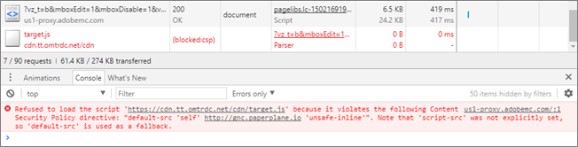

# Beheben von Problemen mit Visual Experience Composer und Enhanced Experience Composer

Anzeigeprobleme und andere Probleme treten manchmal in [!DNL Adobe Target] [!UICONTROL Visual Experience Composer] (VEC) und [!UICONTROL Enhanced Experience Composer] (EWG) unter bestimmten Voraussetzungen.

## Wie wirken sich die SameSite-Cookie-Richtlinien von Google Chrome auf VEC und EEC aus? {#samesite}

Beachten Sie die Änderungen, die sich auf VEC und EEC auswirken, wenn Sie die folgenden Chrome-Versionen verwenden:

>[!NOTE]
>
>Die folgende Änderung betrifft alle drei unten beschriebenen Aktualisierungen:
>
> * Will *not* Sie können VEC verwenden, ohne dass die VEC Helper-Erweiterung für kennwortgeschützte Seiten Ihrer Sites installiert und aktiviert ist. Ihre Site-Anmelde-Cookies werden als Drittanbieter-Cookies betrachtet und nicht mit Anmeldeanfragen im VEC-Editor im Modus Durchsuchen gesendet. Die einzige Ausnahme besteht darin, dass Ihre Site-Anmelde-Cookies bereits über die `SameSite=None` und `Secure` -Attribute festgelegt.


**Chrome 94 (21. September 2021)**: Da die bevorstehenden Änderungen für die Chrome-Version 94 (21. September 2021) geplant sind, wirkt sich die folgende Änderung auf alle Benutzer mit Chrome 94+-Browserversionen aus:

* Befehlszeilenkennzeichnung `--disable-features=SameSiteByDefaultCookies,CookiesWithoutSameSiteMustBeSecure` entfernt.

**Chrome 91 (25. Mai 2021)**: Nachdem die Änderungen für die Chrome-Version 91 (25. Mai 2021) implementiert wurden, wirkt sich die folgende Änderung auf alle Benutzer mit Chrome 91+-Browserversionen aus:

* Die Flags `#same-site-by-default-cookies` und `#cookies-without-same-site-must-be-secure` wurden aus `chrome://flags`. Dieses Verhalten ist jetzt standardmäßig aktiviert.

**Chrome 80 (August 2020)**: Nachdem die Änderungen im August 2020 implementiert wurden, sind alle Benutzer mit Chrome 80+-Browserversionen:

* Will *not* herunterladen können [!DNL Target] Bibliotheken beim Bearbeiten einer Aktivität (wenn diese noch nicht auf der Site vorhanden sind). Dies liegt daran, dass der Download-Aufruf von der Kundendomäne aus zu einem gesicherten [!DNL Adobe] Domäne und wird als nicht authentifiziert zurückgewiesen.
* Die EWG *not* -Funktion für alle Benutzer verwenden, da es nicht in der Lage ist, das SameSite-Attribut für Cookies in `adobemc.com domain`. Ohne dieses Attribut lehnt der Browser diese Cookies ab, wodurch der EEC fehlschlägt.

### Ermitteln, welche Cookies blockiert werden

Um festzustellen, welche Cookies aufgrund der SameSite-Cookie-Durchsetzungsrichtlinien blockiert werden, verwenden Sie die Entwicklertools in Chrome.

1. Um auf die Entwickler-Tools zuzugreifen, während Sie den VEC in Chrome anzeigen, klicken Sie auf die **[!UICONTROL Ellipse]** Symbol oben rechts in Chrome > **[!UICONTROL Weitere Tools]** > **[!UICONTROL Entwicklertools]**.
1. Klicken Sie auf **[!UICONTROL Netzwerk]** > dann nach blockierten Cookies suchen.

   >[!NOTE]
   >
   >Verwenden Sie die **[!UICONTROL Cookies blockiert]** aktivieren, um das Auffinden von blockierten Cookies zu vereinfachen.

   Die folgende Abbildung zeigt ein blockiertes Cookie:

   

### [!DNL Adobe Target] VEC Helper-Erweiterung

Ab Version 0.7.1 wird die [!DNL Adobe Target] Die VEC Helper-Browsererweiterung fügt die `SameSite=None` und `Secure` -Attribute zu allen Cookies auf Antworten, die von im VEC bearbeiteten Webseiten stammen, wenn der Umschalter &quot;Cookies&quot;in der Erweiterungs-Benutzeroberfläche aktiviert ist:


### Alternativen und Problemumgehungen

Verwenden Sie eine der folgenden Optionen, um sicherzustellen, dass VEC und EEC weiterhin erwartungsgemäß funktionieren:

* Herunterladen und Verwenden der aktualisierten [VEC Helper-Erweiterung](https://chrome.google.com/webstore/detail/adobe-target-vec-helper/ggjpideecfnbipkacplkhhaflkdjagak?hl=en).
* Verwenden Sie den Mozilla Firefox-Browser. Firefox erzwingt diese Richtlinie noch nicht.
* Verwenden Sie die folgenden Flags, um Google Chrome von der Befehlszeile bis zum 21. September 2021 auszuführen. Ab dem 21. September funktionieren Funktionen, für die Cookies erforderlich sind, im VEC nicht mehr, z. B. Anmelde- oder Cookie-Zustimmungs-Popup. Wenn Sie auf Chrome 94 aktualisieren, müssen Sie manuell Cookies mit `SameSite=none` und `Secure` auf Ihren Websites.

   ```
   --disable-features=SameSiteByDefaultCookies,CookiesWithoutSameSiteMustBeSecure
   ```

## Does [!DNL Target] iFrames mit mehreren Ebenen unterstützen?

[!DNL Target]Nein,  unterstützt keine iFrames mit mehreren Ebenen. Wenn Ihre Website einen iframe lädt, der über einen untergeordneten iframe verfügt, interagiert at.js nur mit dem übergeordneten iframe. [!DNL Target] -Bibliotheken interagieren nicht mit dem untergeordneten iframe.

Als Behelfslösung können Sie im Erlebnis eine Seite mit der URL des untergeordneten iFrame hinzufügen.

## Wenn ich versuche, eine Seite zu bearbeiten, sehe ich lediglich ein Netz anstelle meiner Seite. (VEC und EEC)   {#section_313001039F79446DB28C70D932AF5F58}

Dies kann vorkommen, wenn die URL ein #-Zeichen enthält. Um das Problem zu beheben, wechseln Sie im Visual Experience Composer in den Durchsuchen-Modus und anschließend wieder in den Erstellen-Modus. Das Netz sollte verschwinden und die Seite sollte angezeigt werden.

## Header der Content Security Policy (CSP) blockieren die [!DNL Target] Bibliotheken auf meiner Website. (VEC und EEC)   {#section_89A30C7A213D43BFA0822E66B482B803}

Wenn die CSP-Header Ihrer Website Target-Bibliotheken blockieren und die Website anschließend geladen wird, die Bearbeitung aber nicht möglich ist, stellen Sie sicher, dass die Target-Bibliotheken nicht blockiert werden.

>[!NOTE]
>
>Zusätzlich zu den folgenden Informationen können Sie auch die [Adobe Target VEC Helper-Browsererweiterung](/help/main/c-experiences/c-visual-experience-composer/r-troubleshoot-composer/vec-helper-browser-extension.md) für Google Chrome verwenden.



Als Problemumgehung können Sie eine Requestly-Regel zum Entfernen von CSP-Headern konfigurieren, wie unten dargestellt:


Sie können eine ähnliche Requestly-Regel für beliebige Header konfigurieren, durch die eine Ressource im VEC nicht geladen wird.

Gehen Sie bei Requestly wie folgt vor, wenn Sie Header entfernen müssen:

* Fügen Sie URL-Regeln für die URL hinzu, die Sie in VEC öffnen wollen, damit Header nur für diese URLs entfernt werden.
* Aktivieren Sie die Regel bei der Bearbeitung in VEC und deaktivieren Sie die Regel, wenn Sie VEC nicht verwenden.

## Der VEC oder EEC funktioniert scheinbar nicht oder wird beim erneuten Bearbeiten einer gespeicherten Aktivität nicht initialisiert. (VEC und EEC)   {#section_5AC3BA8F8FBB451EA814F298D0645E54}

Wenn die Website nach Definition des Erlebnisses außerhalb von Visual Experience Composer geändert wurde, sind die Selektoren, auf denen zuvor Aktionen durchgeführt wurden, nicht auffindbar und die Aktivität wird zur erneuten Bearbeitung geöffnet. Die Seite erscheint beschädigt und es werden keine Warnungen eingeblendet.

## Der VEC oder EEC zeigt meine sich drehenden Banner oder anderen Inhalt mit JavaScript nicht an. (VEC und EEC)   {#section_8B5BE6EB050B42D6A14A054724C41330}

Der Visual Experience Composer blockiert standardmäßig JavaScript-Elemente. Sie können mit diesen Elementen arbeiten, wenn Sie JavaScript in den Visual Experience Composer-Einstellungen deaktivieren. Je nach Einrichtung der Site werden einige Elemente möglicherweise weiterhin falsch angezeigt oder sind nicht verfügbar.

## Wenn ich ein Element auf der Seite ändere, ändern sich mehrere Elemente. (VEC und EEC)   {#section_309188ACF34942989BE473F63C5710AF}

Wenn für mehrere Elemente auf der Seite die gleiche DOM-Element-ID verwendet wird, werden beim Ändern eines dieser Elemente alle Elemente mit dieser ID geändert. Um dies zu verhindern, sollte eine ID nur einmal auf jeder Seite verwendet werden. Dies ist eine gängige Best Practice für HTML. Weitere Informationen finden Sie unter [Szenarien für die Seitenmodifizierung](/help/main/c-experiences/c-visual-experience-composer/r-troubleshoot-composer/vec-scenarios.md#concept_A458A95F65B4401588016683FB1694DB).

## Die Bearbeitung von Erlebnissen für eine Site, die iFrames zerstört, ist nicht möglich. (VEC und EEC)   {#section_9FE266B964314F2EB75604B4D7047200}

Dieses Problem kann durch die Aktivierung des Enhanced Experience Composer behoben werden. Klicken **[!UICONTROL Administration]** > **[!UICONTROL Visual Experience Composer]** und aktivieren Sie dann das Kontrollkästchen, das Enhanced Experience Composer aktiviert. Der Enhanced Experience Composer verwendet ein von Adobe verwaltetes Proxy, um Ihre Seite zur Bearbeitung zu laden. Dieser Proxy ermöglicht die Bearbeitung auf iFrame-Busting-Sites und die Bearbeitung auf Sites und Seiten, auf denen Sie noch keinen Adobe Target-Code hinzugefügt haben. Solange kein Code hinzugefügt wurde, liefern die Aktivitäten nicht an die Site. Einige Websites werden in Enhanced Experience Composer möglicherweise nicht geladen. In diesem Fall können Sie diese Option deaktivieren, um Visual Experience Composer in einem iFrame zu laden. 

>[!NOTE]
>
>Ihre lokal gehosteten Seiten oder Seiten, auf die außerhalb Ihres Netzwerks nicht zugegriffen werden kann, sind für den Adobe-Proxyserver nicht zugänglich und können im EEC nicht geöffnet werden. Diese Seiten können Staging-URLs, Akzeptanztest-URLs (UAT) oder lokal gehostete Seiten enthalten.

## Ich möchte Tests auf Seiten einrichten, für die bisher noch keine Mbox-/Target-Implementierung vorgenommen wurde. (VEC und EEC)   {#section_DE63BCCB5B124E10A71FA579B582A80A}

Siehe oben unter „Ich kann keine Erlebnisse für eine iFrame-zerstörende Website bearbeiten“.

## Auf meiner Seite wird bei „Text/HTML bearbeiten“ oder „Text/HTML ändern“ kein fett und kursiv gedruckter Text angezeigt. Manchmal verschwindet der Text nach der Anwendung dieser Stiländerungen. (VEC und EEC)   {#section_7A71D6DF41084C58B34C18701E8774E5}

Wenn Sie **[!UICONTROL Text/HTML bearbeiten]** im Visual Experience Composer für A/B- oder Erlebniszielaktivitäten oder **[!UICONTROL Text/HTML ändern]** für automatisierte Personalisierungs- oder Multivarianztest-Aktivitäten verwenden, um den Text fett oder kursiv zu formatieren, werden diese Stile möglicherweise nicht auf der Seite übernommen, oder der Text wird auf der Seite im Visual Experience Composer ausgeblendet. Dies geschieht aufgrund der Art und Weise, wie der Rich-Text-Editor diese Stile anwendet, möglicherweise mit dem Website-Markup in Konflikt gerät.

Wenn Sie dieses Problem angezeigt bekommen, tun Sie Folgendes:

1. Klicken Sie im Richt-Text-Editor auf die Schaltfläche **[!UICONTROL HTML]**, um in den Quellbearbeitungsmodus zu wechseln.
1. Suchen Sie die Stiltextelemente.

   * Für fett gedruckten Text ändern Sie `<strong>`-Elemente zu `<b>`.

   * Für kursiv gedruckten Text ändern Sie `<em>`-Elemente zu `<i>`.

## Bei Aktivitäten mit automatisierter Personalisierung scheint der Bildtausch im VEC oder EEC nicht zu funktionieren. (VEC und EEC)   {#section_88AABFDFE6A3420299B0D508B12A3994}

Das Hinzufügen eines Bildangebots zu einem Pfad erfordert die vollständige Dimension des ursprünglichen Bildplatzes im VEC oder EEC. Bei der Bereitstellung wird das Bild nicht erweitert, sondern wie vorhanden angezeigt, sodass die Bereitstellung nicht beeinträchtigt wird.
