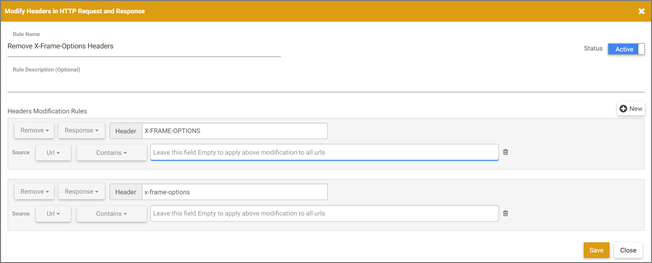

# Beheben von Problemen mit [!UICONTROL Visual Experience Composer]

In Visual Experience Composer (VEC[!DNL Adobe Target] treten unter bestimmten Bedingungen manchmal [!UICONTROL  auf] um Probleme anzuzeigen.

## Wenn ich meine Website im [!UICONTROL Visual Experience Composer] öffne, werden die [!DNL Target] Bibliotheken nicht geladen. (Nur VEC) {#section_8A7D3F4AD2CC4C3B823EE9432B97E06F}

+++Details
[!DNL Target] fügt zwei Parameter (`mboxEdit=1` und `mboxDisable=1`) hinzu, während die Website im [!UICONTROL Visual Experience Composer“ geöffnet ].

Wenn Ihre Website (insbesondere Einzelseiten-Apps) Parameter zuschneidet oder beim Navigieren von einer Seite zur anderen (ohne erneutes Laden der Seite) tatsächlich entfernt, funktioniert die [!DNL Target] nicht mehr und die [!DNL Target] Bibliotheken werden nicht geladen.

Stellen Sie zur Vermeidung dieses Problems sicher, dass Sie diese beiden Parameter nicht beschneiden oder entfernen.

+++

## Meine Seite wird im EEC nicht geöffnet oder nur langsam geladen. Aktivitäten oder Erlebnisse werden im VEC langsam geladen. (Nur VEC) {#section_71E7601BE9894E3DA3A7FBBB72B6B0C1}

+++Details
In Experience Composers (Target) [!UICONTROL  die Seitenleistung ] von mehreren Problemen betroffen sein. Im Folgenden finden Sie einige gängige Gründe:

* Es befindet sich keine Mbox auf der Seite.
* Ihre Website nutzt Proxy-Sperren, wodurch die Seite in keiner Version von Experience Composer geöffnet werden kann.
* Ihre Website verhindert, dass Sie in einem iFrame geöffnet wird.

Wenn im [!UICONTROL Enhanced Experience Composer] Probleme auftreten, versuchen Sie, den [!UICONTROL Enhanced Experience Composer] zu deaktivieren und [!UICONTROL Visual Experience Composer] zu verwenden.

Um den [!UICONTROL Enhanced Experience Composer] zu deaktivieren, gehen Sie zu **[!UICONTROL Administration]** > **[!UICONTROL Visual Experience Composer]** und deaktivieren Sie die Option **[!UICONTROL Enhanced Experience Composer aktivieren]**.

Bei einigen Benutzern wird in der Konsole die folgende Fehlermeldung angezeigt:

Wenn weder der [!UICONTROL Visual Experience Composer] noch der [!UICONTROL Enhanced Experience Composer] funktioniert, verwenden Sie eine Browser-Erweiterung wie [!DNL Requestly] ([!DNL Chrome] oder [!DNL Firefox]) oder Modify Response Headers (Firefox), die die X-Frames-Header-Optionen für Ihre Site überschreiben und deren Laden in iFrames zulassen kann, wodurch der VEC aktiviert wird. Wenn Sie keine Browser-Erweiterungen verwenden können, verwenden Sie den [formularbasierten Experience Composer](/help/main/c-experiences/form-experience-composer.md).

>[!NOTE]
>
>Zusätzlich zu den folgenden Informationen können Sie die Erweiterung [[!DNL Adobe Target] [!UICONTROL Visual Editing Helper] für ](/help/main/c-experiences/c-visual-experience-composer/r-troubleshoot-composer/visual-editing-helper-extension.md) verwenden[!DNL Google Chrome].

>[!NOTE]
>
>Diese Plug-ins sollten nur bei der VEC-Bearbeitung verwendet werden.
>
>Für die [!DNL Requestly]-Erweiterung sollten Sie, wenn Kopfzeilen entfernt werden müssen, einen der folgenden Schritte ausführen:
>
>* Fügen Sie URL-Regeln für die URL hinzu, die Sie in VEC öffnen wollen, damit Header nur für diese URLs entfernt werden.
>
>* Aktivieren Sie die Regel bei der Bearbeitung in VEC und deaktivieren Sie die Regel, wenn Sie VEC nicht verwenden.
>
>Für die [!UICONTROL Modify Response Header]-Erweiterung ([!DNL Firefox]) müssen Sie Folgendes tun, da Sie keine URL-Regel hinzufügen können:
>
>* Aktivieren Sie die Regel bei der Bearbeitung in VEC und deaktivieren Sie die Regel, wenn Sie VEC nicht verwenden.

**So verwenden Sie die [!DNL Requestly]-Erweiterung in [!DNL Chrome] oder [!DNL Firefox]:**

1. Deaktivieren Sie den [!UICONTROL Enhanced Experience Composer].
1. Installieren Sie die [!DNL Requestly] Browser-Erweiterung auf [!DNL Chrome] oder [!DNL Firefox].
1. Öffnen Sie die Erweiterung und konfigurieren Sie sie wie folgt:
1. Wählen Sie **[!UICONTROL Kopfzeilen ändern]** aus.
1. Geben Sie Folgendes ein:

   * Regelname
   * Änderungsregeln

      * Ändern Sie **[!UICONTROL Hinzufügen]** zu **[!UICONTROL Entfernen]**.
      * Ändern Sie **[!UICONTROL Anforderung]** zu **[!UICONTROL Antwort]**.
      * Geben Sie „X-Frame-Options“ als Kopfzeilenname ein.
      * Wiederholen Sie die vorherigen Schritte und geben Sie „x-frame-options“ als Header-Namen ein.

        >[!NOTE]
        >
        >Bei Kopfzeilen, die über [!DNL Requestly] bearbeitet werden, wird zwischen Groß- und Kleinschreibung unterschieden.

      * Ändern Sie **[!UICONTROL Entspricht]** zu **[!UICONTROL Enthält]** als Bedingung für die Quell-URL und geben Sie die URL der Aktivität ein, die Sie in VEC laden möchten.

     

1. Klicken Sie auf **[!UICONTROL Speichern]**.

   

   Sie sollten jetzt in der Lage sein, die Seite schnell mit dem [!UICONTROL Visual Experience Composer] zu laden.

**So verwenden Sie die [!DNL Modify Response Headers]-Erweiterung in [!UICONTROL Firefox]:**

1. Installieren Sie [!UICONTROL Antwort-Header ändern] auf [!DNL Firefox] und starten Sie den Browser neu.
1. Wählen Sie in Ihren [!DNL Firefox] Erweiterungen die Erweiterung Antwort-Header ändern aus.
1. Klicken Sie auf **[!UICONTROL Einstellungen]**.
1. Wählen **[!UICONTROL Filter]** aus der Dropdown[!UICONTROL Aktion] aus.
1. Geben Sie [!UICONTROL  Feld Kopfzeilenname] ein: **[!UICONTROL X-Frame-Options]**.
1. Wiederholen Sie die Schritte 4 und 5, um einen Filter mit **[!UICONTROL X-Frame-Optionen]** hinzuzufügen.
1. Klicken Sie auf **[!UICONTROL Hinzufügen]**.
1. Klicken Sie auf **[!UICONTROL Start]**.

Öffnen Sie nach dem Einrichten einer Erweiterung [!DNL Target]. Ihre Seiten sollten jetzt im [!UICONTROL Visual Experience Composer] geladen werden, auch wenn [!UICONTROL Enhanced Experience Composer] deaktiviert ist.

+++

## Meine Seite wird im VEC nicht angezeigt (nur VEC) {#does-not-load}

+++Details
* Die beste Kompatibilität mit VEC wird durch die neueste Version der Erweiterung gewährleistet: [[!DNL Adobe Experience Cloud] [!UICONTROL Visual Editing Helper-Erweiterung]](/help/main/c-experiences/c-visual-experience-composer/r-troubleshoot-composer/visual-editing-helper-extension.md).

  Um sicherzustellen, dass Sie die neueste Version verwenden, navigieren Sie zu [!UICONTROL Erweiterungen] > [!UICONTROL Erweiterungen verwalten] und klicken Sie dann auf [!UICONTROL Details].

* Der [!UICONTROL Visual Experience Composer] erfordert Authoring-Bibliotheken, um Änderungen auf der Web-Seite durchzuführen. Diese Bibliotheken sind in die at.js-Bibliothek eingebettet und werden bei jeder Verwendung von VEC von den [!DNL Adobe]-Servern heruntergeladen.

  Die Erweiterung lädt die at.js-Bibliothek herunter, unabhängig davon, ob at.js oder die [!DNL Adobe Experience Platform Web SDK] bereits auf der Seite enthalten sind.

  Stellen Sie sicher, dass keine ungültigen Änderungen zu den at.js-Headern hinzugefügt wurden, die im Abschnitt [!UICONTROL Administration] > [!UICONTROL Implementierung] konfiguriert sind.

* Stellen Sie sicher, dass die Web-Seite beim Einbetten in einen iFrame keine obligatorischen Ladeanfragen blockiert. Dazu gehört die Verwendung von Frame-Vorgänger-CSP-Anweisungen oder benutzerdefiniertem JS-Code, der in die Website des Kunden eingebettet ist, von Meta-HTML-Tags oder der Kopfzeile „x-frame-options“.

* Stellen Sie sicher, dass das JavaScript der Web-Seite die Authoring-Bibliotheken nicht beeinträchtigt. Verwenden oder schließen Sie keine Dateien mit den folgenden reservierten Namen ein:

   * `target-vec-helper.js`
   * `target-vec.js`
   * `target.js`
   * `admin.css`
   * `sizzle.js`
   * `mixContentCheck.html`

     Darüber hinaus kann das versehentliche Überschreiben von Variablen oder Ereignissen, die in diesen Dateien definiert sind, zu Problemen mit VEC führen.

* Der Browser blockiert eine nicht sichere Seite auf einer sicheren Site.

  Klicken Sie auf das Symbol links neben der URL in der Browser-Adressleiste und wählen Sie **[!UICONTROL Schutz auf dieser Seite deaktivieren]**.

* Sie haben eine ungültige URL eingegeben.
* Wenn Ihre Website nicht in VEC geladen werden kann oder sich unerwartet verhält, besteht die Möglichkeit, Cookies auf Ihrer Website im Browser zu akzeptieren, bevor Sie versuchen, die Website in [!DNL Target] zu laden.

+++

## Der VEC scheint fehlerhaft zu sein, wenn ich den Modus [!UICONTROL Durchsuchen] verwende. (Nur VEC) {#section_FA2A18E8FD6A4274B2E395DBAA2FB407}

+++Details
Wenn Sie im [!UICONTROL Durchsuchen]-Modus auf eine URL zugreifen, die nicht [!DNL Target] Bibliotheken implementiert hat ([at.js](https://experienceleague.adobe.com/docs/target-dev/developer/client-side/at-js-implementation/overview.html?lang=de){target=_blank} oder [Adobe Experience Platform Web SDK](https://experienceleague.adobe.com/docs/target-dev/developer/client-side/aep-web-sdk.html?lang=de){target=_blank}) oder eine Frame-Buster-Kopfzeile enthält, scheint der VEC fehlerhaft zu sein. Aufgrund von Sicherheitsbedenken des Browsers können [!DNL Target] nicht ordnungsgemäß auf die URL zugreifen, zu der Sie navigiert sind, oder die VEC-URL wird beim Laden der Seite nicht einheitlich aktualisiert.

Dieses Problem tritt auf, weil VEC die Webseite in einem `<iframe>` lädt. Die aktuellen Sicherheitsmechanismen von Browsern verhindern, dass die [!DNL Target]-Benutzeroberfläche aufgrund derselben Ursprungsrichtlinie auf die Elemente des angegebenen Frames zugreift. Browser blockieren Skripte, die versuchen, auf einen Frame mit einem anderen Ursprung zuzugreifen, wobei Informationen wie der `location.href` enthalten sind.

Sie müssen die neue Erweiterung [Visual Editing Helper](/help/main/c-experiences/c-visual-experience-composer/r-troubleshoot-composer/visual-editing-helper-extension.md) verwenden, um die [!DNL Target]-Bibliothek in die Seiten einzufügen, damit sie optimal durchsucht werden können.

+++

## Probleme, die durch CSS-Konflikte im [!UICONTROL Visual Experience Composer“ verursacht ]

+++Details
Überprüfen Sie, ob es CSS-Dateien gibt, die sich auf die Sichtbarkeit auswirken können, während Sie die Web-Seite im Editor laden. Die Verwendung der `overflow: hidden`-Eigenschaft im Seitentext könnte beispielsweise zu Scroll-Problemen oder Trigger-Klickereignissen führen, die das Menü für das Authoring beeinträchtigen könnten.

+++
