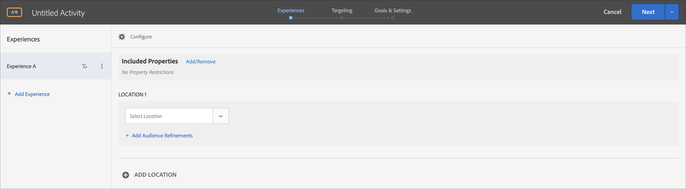
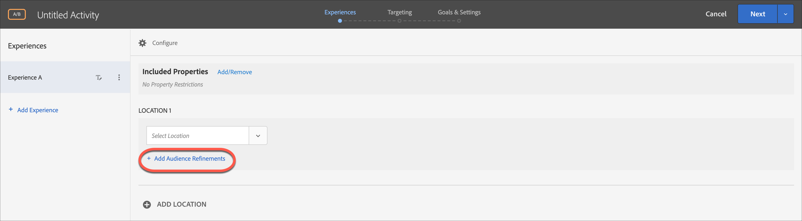

# Form-Based Experience Composer

Der [!DNL Adobe Target] [!UICONTROL Form-Based Experience Composer] ist eine nicht visuelle Benutzeroberfläche zur Erstellung von Erlebnissen und Angeboten, die beim Erstellen von Erlebnissen für die Verwendung in [!UICONTROL A/B Test]-, [!UICONTROL Experience Targeting]-, [!UICONTROL Automated Personalization]- und [!UICONTROL Recommendations]-Aktivitäten nützlich ist, wenn der [!UICONTROL Visual Experience Composer] (VEC) nicht verfügbar oder praktisch zur Verwendung ist. Sie können beispielsweise den formularbasierten Experience Composer verwenden, um Erlebnisse und Angebote für die Bereitstellung in E-Mails, Kiosks und Sprachassistenten zu erstellen.

Wenn Sie eine [!UICONTROL Recommendations] -Aktivität erstellen, gibt es keine Erlebnisse. Wählen Sie Ihre Kriterien und Ihren Entwurf aus. Wenn Sie mehrere Kriterien oder Entwürfe auswählen, generiert [!UICONTROL Target] automatisch die Erlebnisse.

1. Klicken Sie auf **[!UICONTROL Create Activity]** und wählen Sie dann den Aktivitätstyp aus, den Sie erstellen möchten.

   Die [!UICONTROL Form-Based Experience Composer] ist für die Aktivitäten [!UICONTROL A/B Test], [!UICONTROL Experience Targeting], [!UICONTROL Automated Personalization] und [!UICONTROL Recommendations] verfügbar.

1. Wählen Sie **[!UICONTROL Form]** aus dem Dialogfeld [!UICONTROL Create Activity] aus.

1. (Bedingt) Wählen Sie einen Arbeitsbereich und eine Eigenschaft aus.

1. Klicken Sie auf **[!UICONTROL Next]**.

   Der [!UICONTROL Form-Based Experience Composer] wird geöffnet.

   

   Dieser Bildschirm unterscheidet sich bei der Erstellung einer [!UICONTROL Recommendations] -Aktivität. [!UICONTROL Recommendations] -Aktivitäten enthalten keine Erlebnisse.

1. Benennen Sie die Aktivität durch Klicken auf &quot;[!UICONTROL Untitled Activity]&quot;.
1. Wählen Sie einen Standort aus.

   Wenn Sie auf das Feld [!UICONTROL Select Location] klicken, wird eine Liste der verfügbaren Orte angezeigt. Wählen Sie einen dieser Orte aus.

   Sie können auch einen Standort eingeben, der hier nicht aufgelistet ist. Dies kann sich als nützlich erweisen, wenn die Mbox noch nicht erstellt oder auf einer Seite angezeigt wurde. Geben Sie den Namen des Orts ein. Seien Sie vorsichtig, wenn Sie einen Standort eingeben, der noch nicht vorhanden ist. Wenn die Schreibweise oder Groß-/Kleinschreibung nicht mit der Schreibweise oder Groß-/Kleinschreibung bei Mbox-Aufruf übereinstimmt, dann wird die Aktivität nicht bereitgestellt. Manuell eingegebene Orte werden in der Liste der verfügbaren Orte gespeichert. Wenn Sie das nächste Mal versuchen, einen manuell eingegebenen Ort auszuwählen, ist dieser in der Dropdownliste [!UICONTROL Select Location] für diese Aktivität verfügbar.

   >[!NOTE]
   >
   >Wenn Sie während der Erstellung einer Aktivität einen manuell eingegebenen Ort erstellen, wird kein neuer Ort automatisch erstellt. Der Ortsname wird nur im Kontext der Aktivität gespeichert. Der Speicherort wird erstellt, wenn ein Inhaltsbereitstellungsaufruf erfolgt. Nach der Erstellung des Standorts ist er für die Verwendung in anderen Aktivitäten, die Erstellung von Zielgruppen usw. verfügbar. aus der Dropdown-Liste der verfügbaren Orte.

1. Klicken Sie auf **[!UICONTROL Add Audience Refinements]**, wählen Sie eine oder mehrere [Zielgruppen](/help/main/c-target/target.md#concept_A782F8481A5041EBA75103CB26376522) für diese Aktivität aus und klicken Sie dann auf **[!UICONTROL Done]**.

   

   In der [!UICONTROL Form-based Experience Composer] wurden Verfeinerungen durch die vollständige Zielgruppenfunktionalität ersetzt. Verfeinerungen für vorhandene Aktivitäten wurden in [Zielgruppen &quot;Nur Aktivität&quot;](/help/main/c-target/creating-activity-only-audience.md#concept_A6BADCF530ED4AE1852E677FEBE68483) migriert.

1. Wählen Sie den Inhaltstyp aus, der an diesem Standort angezeigt werden soll.

   

1. Geben Sie für den ausgewählten Content-Typ den Inhalt an.

   **HTML-Angebot ändern:** Wählen Sie ein HTML-Angebot.

   **Bildangebot ändern:** Wählen Sie ein in der Inhaltsbibliothek in Target gespeichertes Bild aus.

   Sie können außerdem einen Link zum Bild hinzufügen (Clickthrough, Ziel, Landing usw.)

   1. Klicken Sie auf [!UICONTROL Change Image Offer].
   1. Wählen Sie das gewünschte Bild aus und klicken Sie dann auf [!UICONTROL Edit Links].
   1. Geben Sie die gewünschte URL oder Seite auf Ihrer Site an und klicken Sie dann auf [!UICONTROL Update].

   **JSON-Angebot ändern:** Wählen Sie ein JSON-Angebot.

   **Erlebnisfragment ändern:** Wählen Sie ein Experience Fragment aus. Weitere Informationen finden Sie unter [Experience Fragment](/help/main/c-experiences/c-manage-content/aem-experience-fragments.md).

   **Umleitungsangebot ändern:** Wählen Sie ein Umleitungsangebot. Weitere Informationen finden Sie unter [Erstellen von Umleitungsangeboten](/help/main/c-experiences/c-manage-content/offer-redirect.md).

   **Remote-Angebot ändern:** Wählen Sie ein Remote-Angebot. Weitere Informationen finden Sie unter [Remote-Angebote erstellen](/help/main/c-experiences/c-manage-content/about-remote-offers.md).

   **HTML-Angebot erstellen:**

   1. Klicken Sie auf [!UICONTROL Offers] und wählen Sie dann die Registerkarte [!UICONTROL Code Offers] aus.
   1. Klicken Sie auf [!UICONTROL Create] > [!UICONTROL HTML Offer].
   1. Geben Sie einen Angebotsnamen ein.
   1. Geben Sie im Feld „Code“ den HTML-Code ein oder kopieren Sie ihn dorthin.
   1. Klicken Sie auf [!UICONTROL Save].

   **JSON-Angebot erstellen:**

   1. Klicken Sie auf [!UICONTROL Offers] und wählen Sie dann die Registerkarte [!UICONTROL Code Offers] aus.
   1. Klicken Sie auf [!UICONTROL Create] > [!UICONTROL JSON Offer].
   1. Geben Sie einen Angebotsnamen ein.
   1. Schreiben Sie Ihren JSON-Code in das Feld „Code“ oder kopieren Sie ihn dorthin.
   1. Klicken Sie auf [!UICONTROL Save].

   **Empfehlung hinzufügen:**

   Für eine Recommendations-Aktivität bietet die Dropdown-Liste Inhalt die Option [!UICONTROL Add Recommendation] . Klicken Sie auf **[!UICONTROL Add Recommendation]** und wählen Sie dann den Seitentyp aus. Folgen Sie den üblichen auf der Oberfläche angegebenen Schritten, um [eine Recommendations-Aktivität zu erstellen](/help/main/c-recommendations/t-create-recs-activity/create-recs-activity.md).

   Bei der Auswahl der Recommendations-Kriterien im formularbasierten Experience Composer gibt es jetzt einen direkten Link zur ausgewählten Kriterienkarte, damit Sie die Kriterien schnell und einfach bearbeiten können.

   

   Auf der Seite „Targeting“ des Drei-Schritte-Workflows zu Target:

   

   **Angebotsentscheidung hinzufügen:**

   Fügen Sie ein in [!DNL Adobe Journey Optimizer] (AJO) erstelltes Angebot zu einer [!DNL Adobe Target] -Aktivität hinzu, um Ihren Besuchern auf Ihrer Website oder auf Ihrer mobilen Site mithilfe von offer decisioning das beste dynamische Angebot und Erlebnis zu unterbreiten. Diese Option ist nur für manuelle [!UICONTROL A/B Test] - und [!UICONTROL Experience Targeting] -Aktivitäten (XT) verfügbar.

   Weitere Informationen finden Sie unter [Angebotsentscheidungen verwenden](/help/main/c-integrating-target-with-mac/ajo/offer-decision.md).

1. (Optional für die Aktivitäten [!UICONTROL A/B Test], [!UICONTROL Automated Personalization] und [!UICONTROL Experience Targeting]) Um diesen Vorgang für weitere Speicherorte zu wiederholen, klicken Sie auf **[!UICONTROL Add Location]** und konfigurieren Sie den Ort und den Inhalt.
1. Klicken Sie auf **[!UICONTROL Next]** und führen Sie dann die Schritte zur Erstellung der Aktivität wie gewohnt für Ihren Aktivitätstyp aus.

* [Erstellen eines A/B-Tests](/help/main/c-activities/t-test-ab/t-test-create-ab/test-create-ab.md)
* [Erstellen einer Erlebnis-Targeting-Aktivität](/help/main/c-activities/t-experience-target/t-xt-create/xt-create.md#task_D6B3429AC31549E1A70EDF04B3DDC765)
* [Recommendations-Aktivität erstellen](/help/main/c-recommendations/t-create-recs-activity/create-recs-activity.md#task_6874328773C64C44A73F0A130AD3F96F)

## Schulungsvideo: Form-Based Composer 

Im folgenden Video wird der Form-Based Experience Composer vorgeführt.

* Aktivität mithilfe von Form-Based Experience Composer erstellen
* Wann Form-Based Experience Composer und wann Visual Experience Composer verwendet werden sollte
* Verfeinerungen zur Ausrichtung auf einen Standort nutzen

>[!VIDEO](https://video.tv.adobe.com/v/17390)
