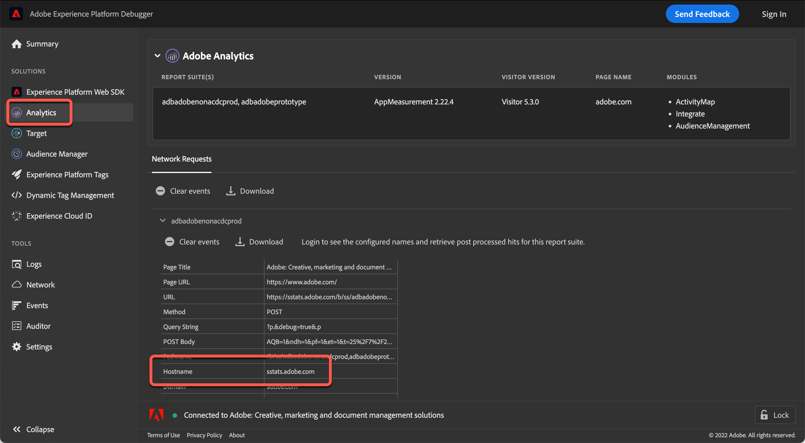

# Verwenden eines [!DNL Analytics] Trackingservers

Wenn Sie eine ältere Version von at.js verwenden, müssen Sie einen [!DNL Analytics]-Tracking-Server für Aktivitäten angeben, die [!DNL Adobe Analytics] für [!DNL Adobe Target] (A4T) verwenden.

>[!NOTE]
>
>Bei Verwendung von at.js Version 0.9.1 (oder höher) müssen Sie bei der Erstellung einer Aktivität keinen Tracking-Server angeben. Die at.js-Bibliothek sendet automatisch Tracking-Server-Werte an [!DNL Target]. Bei der Erstellung einer Aktivität können Sie das Feld [!UICONTROL Tracking Server] auf der Seite [!UICONTROL Goals & Settings] leer lassen.
>
>Das [!DNL Target]-Team unterstützt sowohl at.js 1.*x* und in at.js 2.*x*. Aktualisieren Sie auf die neueste Version einer der Hauptversionen von at.js, um sicherzustellen, dass Sie eine unterstützte Version ausführen. Weitere Informationen finden Sie unter [at.js-Versionsdetails](https://experienceleague.adobe.com/docs/target-dev/developer/client-side/at-js-implementation/target-atjs-versions.html?lang=de){target=_blank}.

Um sicherzustellen, dass Daten aus [!DNL Target] an den richtigen Speicherort in [!DNL Analytics] gelangen, muss bei allen Aufrufen von [!DNL Analytics] an Modstats ein [!DNL Target]-Trackingserver gesendet werden. Bei Implementierungen mit mehreren Tracking-Servern verwenden Sie die [!DNL Adobe Experience Platform Debugger] oder die Entwickler-Tools Ihres Browsers, um den richtigen Tracking-Server für Ihre Aktivität zu ermitteln.

## Abrufen des [!DNL Analytics] Tracking-Servers mithilfe der [!DNL Adobe Experience Platform Debugger]

Der Debugger sollte auf einer Seite angezeigt werden, auf der die Aktivität bereitgestellt wird, um sicherzustellen, dass Sie den richtigen Tracking-Server auswählen. Alternativ kann für jedes Konto ein Standard-Trackingserver angegeben werden. Wenden Sie sich an die Kundenunterstützung, wenn Sie die Standardeinstellung bearbeiten oder festlegen möchten.

1. Öffnen Sie auf der Seite, auf der Sie eine Aktivität erstellen, die [!DNL Adobe Experience Platform Debugger].

   Wenn Sie den Debugger nicht installiert haben, lesen Sie [Übersicht über Adobe Experience Platform Debugger](https://experienceleague.adobe.com/docs/platform-learn/data-collection/debugger/overview.html).

1. Klicken Sie im linken Navigationsmenü auf **[!UICONTROL Analytics]** .

   

   Der [!DNL Analytics]-Trackingserver befindet sich im [!UICONTROL Hostname] des Debuggers.

   * **Erstanbieter-Tracking-Server**: Wenn der Host-Name der Anfrage mit der Domain übereinstimmt, in der Sie sich befinden, handelt es sich um einen Erstanbieter-Tracking-Server. Wenn Sie sich beispielsweise in `adobe.com` befinden, ist `adobe.com` der Erstanbieter-Tracking-Server.
   * **Tracking-Server eines Drittanbieters**: Ein Tracking-Server eines Drittanbieters wird normalerweise `[company].sc.omtrdc.net`, wobei das Unternehmen der Name Ihres Unternehmens ist, aber immer in `sc.omtrdc.net` endet.
   * **CNAME-Implementierungen**: `sstats.adobe.com` ist ein Beispiel für einen CNAME-First-Party-Tracking-Server für eine (sichere) https-Anfrage. `stats.adobe.com` ist ein Beispiel für eine CNAME-First-Party-Anfrage für eine HTTP-Seite (nicht sicher).

1. Kopieren Sie den Inhalt des Felds vollständig.

1. Fügen Sie im Abschnitt **[!UICONTROL Reporting Settings]** des Bildschirms **[!UICONTROL Goal & Settings]** Ihrer Aktivität die Tracking-Server-Informationen in das Feld **[!UICONTROL Tracking Server]** ein.

   >[!NOTE]
   >
   >Wählen Sie [!UICONTROL Analytics as the Reporting Source] für Ihre Aktivität aus, damit das Feld [!UICONTROL Tracking Server] verfügbar ist.

## Abrufen des [!DNL Analytics] Tracking-Servers mit den Entwickler-Tools Ihres Browsers

Die Entwickler-Tools sollten auf einer Seite angezeigt werden, auf der die Aktivität bereitgestellt wird, um sicherzustellen, dass Sie den richtigen Tracking-Server auswählen. Alternativ kann für jedes Konto ein Standard-Trackingserver angegeben werden. Wenden Sie sich an die Kundenunterstützung, wenn Sie die Standardeinstellung bearbeiten oder festlegen möchten.

1. Öffnen Sie auf der Seite, auf der Sie eine Aktivität erstellen, die Entwickler-Tools des Browsers (klicken Sie in Google Chrome oben rechts auf die drei vertikalen Auslassungszeichen > Weitere Tools > Entwickler-Tools).

   

1. Klicken Sie auf die Registerkarte **[!UICONTROL Network]** .

1. Filtern Sie nach `/ss,`, um die [!DNL Analytics] anzuzeigen.

   

   Der Tracking-Server ist der Host-Name der Anfrage.

   * **Erstanbieter-Tracking-Server**: Wenn der Host-Name der Anfrage mit der Domain übereinstimmt, in der Sie sich befinden, handelt es sich um einen Erstanbieter-Tracking-Server. Wenn Sie sich beispielsweise in `adobe.com` befinden, ist `adobe.com` der Erstanbieter-Tracking-Server.
   * **Tracking-Server eines Drittanbieters**: Ein Tracking-Server eines Drittanbieters wird normalerweise `[company].sc.omtrdc.net`, wobei das Unternehmen der Name Ihres Unternehmens ist, aber immer in `sc.omtrdc.net` endet.
   * **CNAME-Implementierungen**: `sstats.adobe.com` ist ein Beispiel für einen CNAME-First-Party-Tracking-Server für eine (sichere) https-Anfrage. `stats.adobe.com` ist ein Beispiel für eine CNAME-First-Party-Anfrage für eine HTTP-Seite (nicht sicher).

1. Kopieren Sie den Inhalt des Felds vollständig.

1. Fügen Sie im Abschnitt **[!UICONTROL Reporting Settings]** des Bildschirms **[!UICONTROL Goal & Settings]** Ihrer Aktivität die Tracking-Server-Informationen in das Feld **[!UICONTROL Tracking Server]** ein.

   >[!NOTE]
   >
   >Wählen Sie [!UICONTROL Analytics as the Reporting Source] für Ihre Aktivität aus, damit das Feld [!UICONTROL Tracking Server] verfügbar ist.
