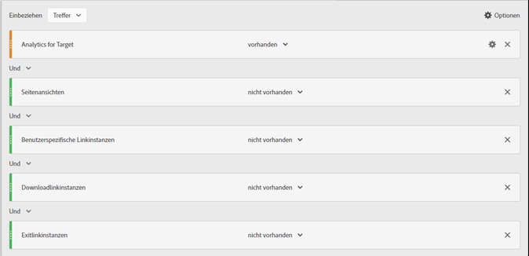

# Minimieren überhöhter Besuchs- und Besucherzahlen in A4T

Hilfreiche Informationen dazu, wie Sie bei der Verwendung von [!DNL Adobe Analytics] als Berichtsquelle für [!DNL Adobe Target] (A4T) die Auswirkungen überhöhter Besuchs- und Besucherzahlen minimieren können.

>[!IMPORTANT]
>Am 14. November 2016 hat sich in Adobe Analytics die Art und Weise geändert, in der manche Daten für Kunden per Analytics-Berichterstellung für Target (A4T) verarbeitet werden. Diese Änderungen bewirkten, dass Adobe Target-Daten besser auf das Datenmodell für Adobe Analytics ausgerichtet sind. Diese Änderungen wurden für alle Kunden eingeführt, die A4T verwenden. Diese Änderungen sollen insbesondere das Problem lösen, dass manche Kunden bei Ausführung von Target-Aktivitäten eine überhöhte Anzahl von Besuchern verzeichnet haben.
>
>Diese Änderung ist nicht rückwirkend. Wenn in Ihren historischen Berichten überhöhte Zählerwerte stehen, die Sie gerne von Ihren Berichten ausschließen möchten, können Sie dazu eine virtuelle Report Suite erstellen (wie weiter unten erklärt).
>
>Außerdem wurden verschiedene JavaScript-Bibliotheken aktualisiert, um überhöhten Zählerwerten vorzubeugen. Es wird empfohlen, dass Sie eine Aktualisierung auf die folgenden Bibliotheksversionen (oder höher) vornehmen:
>
>* Experience Cloud-Besucher-ID-Service: visitorAPI.js, Version 2.3.0 oder neuer.
>* Adobe Analytics: appMeasurement.js, Version 2.1.
>* Adobe Target: at.js-Version 0.9.6 oder höher (ausgenommen Version 1.1.0 bei der Verwendung von Umleitungsangeboten mit A4T).

## Was hat sich geändert? {#section_9CCF45F5D66D48EBA88F3A178B27D986}

Wenn [!DNL Adobe Analytics] zum Messen von [!DNL Target]-Aktivitäten verwendet wird (was als A4T bezeichnet wird), erfasst [!DNL Analytics] zusätzliche Daten, die nur dann verfügbar sind, wenn auf der Seite eine [!DNL Target]-Aktivität vorhanden ist. Die [!DNL Target]-Aktivität führt einen Aufruf zu Beginn der Seite aus, während [!DNL Analytics] ihre Datenerfassungsaufrufe für gewöhnlich am Ende der Seite durchführt. In der bisherigen Implementierung von A4T hat Adobe diese zusätzlichen Daten immer einbezogen, wenn eine [!DNL Target]-Aktivität aktiv war. Ab nun wird Adobe diese zusätzlichen Daten nur noch dann einbeziehen, wenn sowohl die [!DNL Target]- als auch die [!DNL Analytics]-Tags ausgelöst wurden.

## Warum hat Adobe diese Änderung vorgenommen? {#section_92380A4BD69E4B8886692DD27540C92A}

Adobe ist stolz auf die Genauigkeit und Qualität seiner bereitgestellten Daten. Wenn das [!DNL Target]-Tag ausgelöst wird, aber das [!DNL Analytics]-Tag nicht, zeichnet Analytics „Partial Data“ auf (manchmal auch als „Unstitched Hits“ bezeichnet). Diese nicht zugewiesenen Treffer (Unstitched Hits) werden nicht von [!DNL Analytics] erfasst, wenn keine [!DNL Target]-Aktivität vorhanden ist. Die Aufnahme solcher partiellen Daten in [!DNL Analytics]-Berichten bietet einen zusätzlichen Informationswert und gewährleistet darüber hinaus die Konsistenz mit historischen Daten aus früheren Zeiträumen, in denen Daten ohne laufende [!DNL Target]-Aktivitäten erfasst wurden. Diese Situation könnte für [!DNL Analytics]-Benutzer, die Trends über größere Zeiträume analysieren, problematisch sein. Adobe schließt zum Zweck der Datenkonsistenz in [!DNL Analytics] alle partiellen Daten aus.

## Welche Ursachen gibt es für partielle Daten? {#section_C9C906BEAA7D44DAB9D3C03932A2FEB8}

Bei manchen Kunden hat Adobe eine hohe Anzahl partieller Daten in [!DNL Analytics] festgestellt. Hohe Mengen partieller Daten können aus einer fehlerhaften Implementierung resultieren, aber es gibt auch legitime Ursachen.

Unter anderem können folgende Ursachen für partielle Daten verantwortlich sein:

* **Abweichende Report Suite-IDs (Implementierung):** Die während der Aktivitätseinrichtung festgelegte Report Suite stimmt nicht mit der Report Suite für die Seite überein, auf der der Test erfolgt. Die Daten können nicht in [!DNL Analytics]-Servern abgeglichen werden, sodass sie wie partielle Daten aussehen.
* **Langsame Seiten:** [!DNL Target]-Aufrufe finden am Seitenanfang und [!DNL Analytics]-Aufrufe normalerweise am Seitenende statt. Wenn die Seite langsam geladen wird, ist die Wahrscheinlichkeit höher, dass ein Besucher die Seite verlässt, nachdem der [!DNL Target]-Aufruf ausgelöst wird, jedoch bevor der [!DNL Analytics]-Aufruf erfolgt. Langsame Seiten können besonders bei mobilen Websites zu einem Problem werden, da dort die Verbindungsgeschwindigkeiten meist niedriger sind.
* **Seitenfehler:** Wenn JavaScript-Fehler auftreten oder andere Szenarien vorliegen, in denen die einzelnen Touchpoints nicht ausgelöst werden (Experience Cloud ID-Service, Target und Analytics), führt dies zu partiellen Daten.
* **Umleitungsangebot(e) in [!DNL Target]-Aktivitäten:** Für Umleitungsangebote in Aktivitäten unter Verwendung von A4T muss Ihre Implementierung bestimmten Mindestanforderungen entsprechen. Darüber hinaus gibt es dazu wichtige Hinweise, die zu beachten sind. Weitere Informationen finden Sie unter [Umleitungsangebote – A4T-FAQ](/help/main/c-integrating-target-with-mac/a4t/r-a4t-faq/a4t-faq-redirect-offers.md#section_FA9384C2AA9D41EDBCE263FFFD1D9B58).
* **Alte Versionen der Bibliotheken:** Im Verlauf des letzten Jahres hat Adobe verschiedene Verbesserungen in den JavaScript-Bibliotheken ([!DNL appMeasurement.js], `at.js` und `visitorAPI.js`) vorgenommen. Damit soll sichergestellt werden, dass Daten so effizient wie möglich gesendet werden. Weitere Informationen zu Implementierungsanforderungen finden Sie unter [Vor der Implementierung](/help/main/c-integrating-target-with-mac/a4t/before-implement.md#concept_046BC89C03044417A30B63CE34C22543).

## Was sind die Best Practices zum Reduzieren partieller Daten? {#section_065C38501527451C8058278054A1818D}

Wenn Sie das Entstehen partieller Daten reduzieren möchten, folgen Sie diesen Schritten:

| Schritt | Aufgabe |
| --- | --- |
|  | Stellen Sie sicher, dass die in [!DNL Target] ausgewählte Report Suite der Report Suite auf den Seiten entspricht, auf denen die Aktivität angezeigt wird. |
|  | Stellen Sie sicher, dass die Bibliotheken visitorAPI.js, appMeasurement.js und at.js in A4T-kompatiblen Versionen vorliegen. Weitere Informationen zu Implementierungsanforderungen finden Sie unter [Vor der Implementierung](/help/main/c-integrating-target-with-mac/a4t/before-implement.md). |
|  | Stellen Sie sicher, dass die SDID in sämtlichen [!DNL Target]- und [!DNL Analytics]-Aufrufen festgelegt ist, die die Seite verlassen. Und achten Sie auch darauf, dass die SDID-Angaben übereinstimmen. Verwenden Sie ein Netzwerkanalyse- oder Debugging-Werkzeug, um zu überprüfen, ob der `mboxMCSDID`-Parameter in den [!DNL Target]-Aufrufen mit dem SDID-Parameter im [!DNL Analytics]-Aufruf übereinstimmt. |
|  | Überzeugen Sie sich, dass die Bibliotheken für die Implementierung in der richtigen Reihenfolge in Ihren Websites geladen werden. Weitere Informationen finden Sie unter [Analytics for Target-Implementierung](/help/main/c-integrating-target-with-mac/a4t/a4timplementation.md). |

## Wie lässt sich feststellen, wie viele partielle Daten man hat? {#section_89B663E2824A4805AB934153508A0F4B}

Auch wenn dies nicht direkt in [!DNL Analytics] angegeben ist, können Sie sich an die Adobe Kundenunterstützung wenden, um einen Bericht zu partiellen Daten zu erhalten. Dieser Bericht soll beim Debugging helfen.

## Wie kann man Verlaufstrends ohne partielle Daten anzeigen? {#section_4C9DED560FAD4428B362DDA2064897C3}

Diese Veränderung in der Verarbeitung betrifft Daten erst nach dem Release-Datum (14. November 2016). Wenn Sie Ihre historischen Metriken anpassen möchten, empfiehlt Adobe, ein Segment zum Ausschließen partieller Daten zu erstellen.

Die nachfolgenden Informationen bezüglich dieser Änderung enthalten auch Anweisungen darüber, wie Sie das Segment definieren und es auf eine virtuelle Report Suite anwenden, sodass dieses Segment immer auf Ihre [!DNL Analytics]-Ansichten angewendet wird.

Meistens ist ein Treffer in [!DNL Target] auf jeder einzelnen Website mit einem Treffer in [!DNL Analytics] verknüpft. Diese Verknüpfung wird vorgenommen, wenn eine konsistente SDID sowohl im Aufruf von [!DNL Target] als auch von [!DNL Analytics] verwendet wird und eine [!DNL Experience Cloud ID] (MCID) im Aufruf [!DNL Analytics] auf der gleichen Seite enthalten ist. [!DNL Target] verfügt normalerweise ebenfalls über die MCID, wird [!DNL Target] jedoch vor Rückgabe der Besucher-ID aufgerufen, wird der Treffer aufgrund der SDID trotzdem zugewiesen. Außerdem muss der Besucher lange genug auf der Seite bleiben, um einen [!DNL Analytics]-Aufruf auslösen zu können, nachdem ein [!DNL Target]-Aufruf ausgelöst wurde. Dieses Szenario ist ideal.

**Treffer mit partiellen Daten:** Manchmal bleiben Besucher nicht lange genug auf einer Seite, um einen Aufruf von [!DNL Analytics] auszulösen, während in [!DNL Target] jedoch eine entsprechende MCID vorliegt. Dies führt zu Treffern, zu denen nur partielle Daten vorliegen (d. h. Treffer, zu denen es keine Seitenaufrufe in [!DNL Analytics] gibt). Kehren solche Besucher auf Ihre Website zurück und sehen sich eine Seite an, die [!DNL Analytics]-Code enthält, werden sie ordnungsgemäß als wiederkehrende Besucher erfasst. Hierbei handelt es sich um Treffer, die nicht aufgezeichnet worden wären, wenn sich auf der Seite nur [!DNL Analytics]-Code befände. Einige Kunden möchten für diese Treffer keine Daten aufzeichnen, da sie bestimmte Metriken (Besuche) sehr stark in die Höhe treiben, andere Metriken (Seitenansichten pro Besuch, Zeit pro Besuch und so weiter) jedoch stark reduzieren. Außerdem werden ihnen Besuche angezeigt, bei denen keine Seiten angesehen wurden. Es gibt jedoch einige gute Gründe, diese Daten trotzdem zu erfassen.

Um solche Treffer mit partiellen Daten zu minimieren, können Sie Ihre Seite so gestalten, dass sie schneller geladen wird, Bibliotheken auf die neueste Version aktualisieren oder eine [virtuelle Report Suite](https://experienceleague.adobe.com/docs/analytics/components/virtual-report-suites/vrs-workflow/vrs-create.html?lang=de) erstellen, in der solche Treffer ausgeschlossen sind. Eine schrittweise Anleitung hierzu finden Sie unter [Erstellen virtueller Report Suites](https://experienceleague.adobe.com/docs/analytics/components/virtual-report-suites/vrs-workflow/vrs-create.html?lang=de) im *Analytics-Komponentenhandbuch*.

Die folgende Abbildung zeigt die Segmentdefinition für die virtuelle Report Suite:

Beim Erstellen der virtuellen Report Suite müssen Sie für die Segmentdefinition die folgende Konfiguration festlegen (wie in der Abbildung oben gezeigt):

* **Treffer anzeigen:**
* Analytics for Target: Vorhanden
* Und
* Seitenansichten: Nicht vorhanden
* Und
* Benutzerspezifische Linkinstanzen: Nicht vorhanden
* Und
* Downloadlinkinstanzen: Nicht vorhanden
* Und
* Exitlinkinstanzen: Nicht vorhanden

**Verwaiste Treffer:** In einigen wenigen Fällen bleiben Besucher nicht lange genug auf einer Seite, um einen Aufruf von Analytics auszulösen, und Target konnte keine passende MCID erfassen. Diese Treffer werden von Adobe als „verwaiste“ Treffer bezeichnet. Diese Treffer stehen für Kunden, die nur selten zurückkehren, und treiben die Zählungen der Besuche und Besucher unverhältnismäßig stark in die Höhe.

Möchten Sie die Anzahl dieser „verwaisten“ Treffer minimieren, können Sie eine [virtuelle Report Suite](https://experienceleague.adobe.com/docs/analytics/components/virtual-report-suites/vrs-workflow/vrs-create.html?lang=de) erstellen, in der diese Treffer nicht erfasst werden.

## Was bedeutet dies für meine [!DNL Target]-Berichterstellung? {#section_AAD354C722BE46D4875507F0FCBA5E36}

Sobald diese Änderung vorgenommen wurde, verzeichnen Sie möglicherweise einen Rückgang an neuen Besuchern und Besuchen in Live-Tests, da [!DNL Adobe] eingehende partielle Daten nicht verarbeitet. Bei Konversionen und Treffern in anderen [!DNL Analytics]-Metriken ändert sich nichts.
