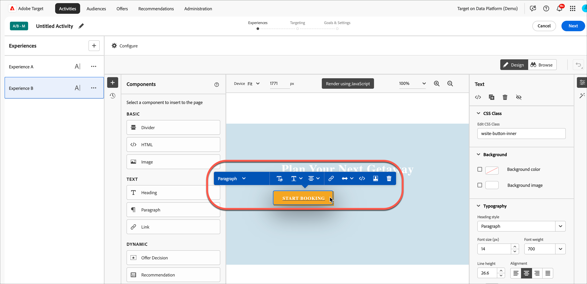

# Verwenden von Angebotsentscheidungen 

Verwendung [!DNL Adobe Target] mit [!DNL Adobe Journey Optimizer] Angebotsentscheidungen zur Bestimmung und Bereitstellung des nächsten besten Angebots für Ihre Besucher im Web und auf Mobilgeräten.

Hinzufügen von Angebotsentscheidungen, die in erstellt wurden [!DNL Adobe Journey Optimizer] nach [!DNL Target] Tätigkeiten (manuelle [!UICONTROL A/B-Test] oder [!UICONTROL Erlebnis-Targeting]) entweder mithilfe der [!UICONTROL Visual Experience Composer] (VEC) oder [!UICONTROL Form-Based Composer] Testen und Bereitstellen personalisierter Angebote für Ihre Besucher auf eingehenden Kanälen mithilfe von [!DNL Target].

Weitere Informationen finden Sie unter [!DNL Adobe Journey Optimizer] und Angebotsentscheidungen, siehe die folgenden Themen in der *[!DNL Journey Optimizer]* Dokumentation:

* [Erste Schritte mit Journey Optimizer](https://experienceleague.adobe.com/docs/journey-optimizer/using/get-started/get-started.html)

* [Über die Entscheidungsverwaltung](https://experienceleague.adobe.com/docs/journey-optimizer/using/offer-decisioniong/get-started/starting-offer-decisioning.html)

## Voraussetzungen 

So verwenden Sie Angebotsentscheidungen in [!DNL Target]benötigen Sie Folgendes:

* [!DNL Adobe Target Standard] oder [!DNL Adobe Target Premium] implementiert mithilfe der [Adobe Experience Platform Web SDK](https://experienceleague.corp.adobe.com/docs/target-dev/developer/client-side/aep-web-sdk.html){target=_blank}.

   Die Funktion ist bei der Implementierung nicht verfügbar [!DNL Target] mit at.js oder anderen [!DNL Target] SDKs.

* [!DNL Adobe Journey Optimizer Ultimate] (AJO + Offer decisioning) oder [!DNL Adobe Experience Platform] und [!UICONTROL offer decisioning] Anwendungsdienst-Add-On.

## Anwendungsbeispiele

Die folgenden Beispiele zeigen Anwendungsfälle für die Verwendung der [!DNL Target]/[!DNL Adobe Journey Optimizer] Integration zur Verwendung von Angebotsentscheidungen in [!DNL Target] Aktivitäten:

### Sportvermarktung

Als Marketer für eine Sportliga möchten Sie Inhalte auf Ihrer Homepage personalisieren (sowohl auf der Desktop- als auch auf der mobilen Website). Sie möchten Inhalte basierend auf mehreren Dimensionen personalisieren und ein Angebot für Franchise-Artikel zum Kauf unterbreiten. Sie interessieren sich für:

* Das Lieblingsteam des Besuchers
* Jüngste Athlet-/Player-Aktivität (z. B. Teambewegungen, Vertragsaktualisierungen oder Verletzungen)

Sie möchten beispielsweise für jede der folgenden Regionen ein personalisiertes Erlebnis bereitstellen: Dortmund, Frankfurt und Bochum sowie für Benutzer, die implizite und explizite Fans dieser Teams sind. Als Metriken möchten Sie sich Besuche und Klicks zur Merchandising-Site ansehen.

Sie möchten eine [!UICONTROL A/B-Test] Aktivität (Aufteilung 50/50) zwischen dem Standarderlebnis und dem personalisierten Erlebnis (einschließlich einer Angebotsentscheidung mit Angeboten für jede Region und jedes Team). Sie möchten diese Aktivität verwenden, um die Konversion und Steigerung für das personalisierte Erlebnis bzw. die Kontrolle zu ermitteln.

### Spiel-Streaming-Plattformen

Als Marketing-Experte für eine Gaming-Organisation möchten Sie ein personalisiertes Angebot für eine Spiel-Streaming-Plattform für Desktop- und Mobilbenutzer aus verschiedenen Ländern bereitstellen: Deutschland, Frankreich, Mexiko und Brasilien. Wenn ein Besucher von einer dieser Regionen aus auf die Desktop- oder mobile Website zugreift, möchten Sie ein Angebot für Spiel-Streaming in der Landessprache und mit einem entsprechenden Preis für die Landeswährung bereitstellen.

In [!DNL Adobe Journey Optimizer]können Sie für jede Zielregion ein personalisiertes Startseitenhero-Angebot sowie ein Fallback-Angebot mit einem standardmäßigen Startseiten-Hero erstellen. Anschließend können Sie eine Angebotsentscheidung erstellen, in der diese Angebote und ihre Eignungsregeln enthalten sind. Anschließend in [!DNL Target], können Sie eine [!DNL Experience Targeting] (XT) und fügen Sie diese Angebotsentscheidung in Ihre Desktop- oder mobile Website ein, um Besuchern das personalisierte Erlebnis zu bieten.

## Erstellen Sie ein Erlebnis, das eine Angebotsentscheidung verwendet:

1. Beim Bearbeiten oder Erstellen eines Handbuchs [!UICONTROL A/B-Test] oder [!UICONTROL Erlebnis-Targeting] (XT) -Aktivität im [!UICONTROL Visual Experience Composer] (VEC), klicken Sie auf ein Seitenelement, um die [Optionsmenü](/help/main/c-experiences/c-visual-experience-composer/viztarget-options.md).

   

   >[!NOTE]
   >
   >Sie können auch ein Erlebnis erstellen, das [!UICONTROL Angebotsentscheidungen] im [[!UICONTROL Form-Based Experience Composer]](/help/main/c-experiences/form-experience-composer.md).

1. Klicken **[!UICONTROL Einfügen vor]**, **[!UICONTROL Einfügen nach]** oder **[!UICONTROL Inhalt ersetzen]** Klicken Sie auf **[!UICONTROL Angebotsentscheidung]**.

   Die [!UICONTROL Angebotsentscheidung] ist beim Bearbeiten oder Erstellen verfügbar [Handbuch [!UICONTROL A/B-Test]](/help/main/c-activities/t-test-ab/test-ab.md#types) oder [[!UICONTROL Erlebnis-Targeting]](/help/main/c-activities/t-experience-target/experience-target.md) (XT) -Aktivitäten. Diese Option ist für andere Aktivitätstypen nicht verfügbar. Die verfügbaren Optionen im Menü variieren je nach ausgewähltem Element.

   

1. Im **[!UICONTROL Angebotsentscheidung hinzufügen]** wählen Sie die gewünschte Sandbox und Platzierung aus.

   A [Sandbox](https://experienceleague.adobe.com/docs/experience-platform/sandbox/ui/overview.html){target=_blank} in the [!DNL Adobe Experience Platform] lets you partition your instance into virtual environments. For example, you might have a production environment and a staging environment. A [placement](https://experienceleague.adobe.com/docs/journey-optimizer/using/offer-decisioniong/create-components/creating-placements.html){target=_blank} in [!DNL Adobe Journey Optimizer] hilft sicherzustellen, dass der richtige Angebotsinhalt an der richtigen Stelle angezeigt wird.

   

1. Wählen Sie die gewünschte Angebotsentscheidung aus und klicken Sie auf **[!UICONTROL Erstellen]**.

   

   Ihre Website wird im VEC angezeigt, wo Sie die neu erstellte Angebotsentscheidung im [!UICONTROL Änderungen] auf der rechten Seite. Sie können den Mauszeiger über die Änderung bewegen und auf die [!UICONTROL Vorschau] -Symbol, um die Angebotsentscheidung zu untersuchen.

   

   Sie können die verschiedenen Angebote des Angebots untersuchen, indem Sie auf das entsprechende Symbol am unteren Rand des [!UICONTROL Angebotsvorschau] , einschließlich des Fallback-Angebots. Ein Fallback-Angebot ist das Standardangebot, das angezeigt wird, wenn ein Besucher für keines der personalisierten Angebote in der Sammlung qualifiziert ist.

   

1. Schließen Sie die Erstellung der Aktivität ab, indem Sie die [!UICONTROL Targeting] und [!UICONTROL Ziele und Einstellungen] Schritte des dreiteiligen geführten Workflows.

   >[!IMPORTANT]
   >
   >Um sicherzustellen, dass [!DNL Target] die Aktivität personalisiert ist, stellen Sie sicher, dass das aktuelle Start-/Enddatum der Aktivität mit dem Start-/Enddatum der Angebotsentscheidung in [!DNL Adobe Journey Optimizer]. Wenn die Variable [!DNL Target] Start-/Enddatum außerhalb des Anfangs-/Enddatumsbereichs der Angebotsentscheidung liegen, der standardmäßige [!DNL Target] Inhalt wird Besuchern angezeigt.

   

## Hinweise und Einschränkungen

Beachten Sie bei der Arbeit mit Angebotsentscheidungen die folgenden Informationen:

* Die offer decisioning-Integration funktioniert für [!DNL Target] Implementierungen, die auf der [Adobe Experience Platform Web SDK](https://experienceleague.corp.adobe.com/docs/target-dev/developer/client-side/aep-web-sdk.html){target=_blank}. Diese Funktion ist bei der Implementierung von [!DNL Target] mit at.js oder anderen [!DNL Target] SDKs.

* Die Target-/Adobe Journey Optimizer-Integration unterstützt [Handbuch [!UICONTROL A/B-Test]](/help/main/c-activities/t-test-ab/test-ab.md#types) und [[!UICONTROL Erlebnis-Targeting]](/help/main/c-activities/t-experience-target/experience-target.md) (XT) -Aktivitäten. Diese Funktion ist nicht für andere Aktivitätstypen verfügbar.

* Angebote mit dem Inhaltstyp text/html unterstützen nicht die Bereitstellung von VersandURL-Inhalten. Die deliveryURL wird vom formularbasierten Experience Composer nur unterstützt, wenn der Client für das explizite Abrufen und Zusammenstellen des Inhalts verantwortlich ist.

* [!DNL Target] -Berichte bieten keine Berichte auf Ebene der Angebotsentscheidungen.

* Visualisierung [QA-Links](/help/main/c-activities/c-activity-qa/activity-qa.md) für [!DNL Target] Erlebnisse, die Angebotsentscheidungen enthalten, wirken sich auf die in [!DNL Adobe Journey Optimizer] für diese Angebotsentscheidungen.
