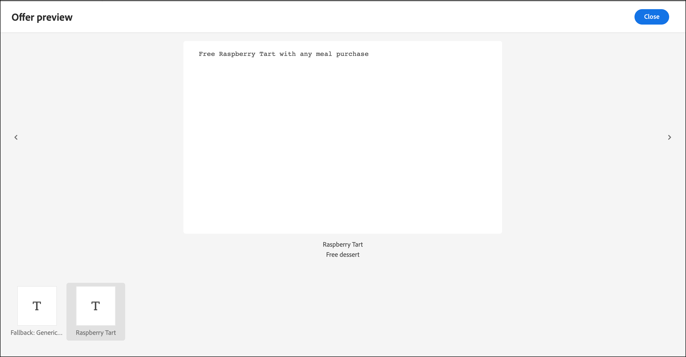

# Verwenden von Angebotsentscheidungen 

Verwenden Sie [!DNL Adobe Target] mit [!DNL Adobe Journey Optimizer] Angebotsentscheidungen, um das nächstbeste Angebot für Ihre Besucher im Web und auf Mobilgeräten zu ermitteln und bereitzustellen.

Fügen Sie Angebotsentscheidungen hinzu, die in [!DNL Adobe Journey Optimizer] erstellt wurden, um [!DNL Target] Aktivitäten (manuelle [!UICONTROL A/B Test] oder [!UICONTROL Experience Targeting]) mithilfe des [!UICONTROL Visual Experience Composer] (VEC) oder des [!UICONTROL Form-Based Composer] zu testen und Ihren Besuchern personalisierte Angebote über die von [!DNL Target] unterstützten eingehenden Kanäle bereitzustellen.

Weitere Informationen zu [!DNL Adobe Journey Optimizer] und Angebotsentscheidungen finden Sie in den folgenden Themen in der *[!DNL Journey Optimizer]*:

* [Erste Schritte mit Journey Optimizer](https://experienceleague.adobe.com/docs/journey-optimizer/using/get-started/get-started.html?lang=de)

* [Über das Entscheidungs-Management](https://experienceleague.adobe.com/docs/journey-optimizer/using/offer-decisioning/get-started-decision/starting-offer-decisioning.html?lang=de)

## Voraussetzungen 

Um Angebotsentscheidungen in [!DNL Target] zu verwenden, benötigen Sie Folgendes:

* [!DNL Adobe Target Standard] oder [!DNL Adobe Target Premium] mit der [Adobe Experience Platform Web SDK implementiert](https://experienceleague.adobe.com/docs/target-dev/developer/client-side/aep-web-sdk.html?lang=de){target=_blank}.

  Die Funktion ist nicht verfügbar, wenn [!DNL Target] mit at.js oder anderen [!DNL Target] SDKs implementiert wird.

* [!DNL Adobe Journey Optimizer Ultimate] (AJO + Offer decisioning) oder [!DNL Adobe Experience Platform] und das Add-on [!UICONTROL Offer Decisioning] Application Service .

## Beispiele für Anwendungsfälle

Im Folgenden finden Sie Beispiele für Anwendungsfälle, in denen Sie mithilfe der [!DNL Target]/[!DNL Adobe Journey Optimizer]-Integration Angebotsentscheidungen in [!DNL Target] Aktivitäten verwenden können:

### Sportartikelwerbung

Als Marketing-Experte für eine Sportliga möchten Sie Inhalte auf Ihrer Homepage (sowohl auf Desktop- als auch auf mobilen Websites) personalisieren. Sie möchten Inhalte basierend auf mehreren Dimensionen personalisieren und ein Angebot für Shop-bezogene Franchise-Waren unterbreiten. Sie interessieren sich für:

* Das Lieblingsteam des Besuchers
* Kürzliche Aktivitäten von Athleten/Spielern (z. B. Teambewegung, Vertragsaktualisierungen oder Verletzungen)

Sie möchten zum Beispiel ein personalisiertes Erlebnis für jede der folgenden Regionen bieten: Dortmund, Frankfurt und Bochum sowie für Benutzer, die implizite und explizite Fans dieser Teams sind. Als Metriken möchten Sie Besuche und Klicks auf die Merchandise-Site betrachten.

Sie möchten eine [!UICONTROL A/B Test] Aktivität (50/50-Aufteilung) zwischen dem Standarderlebnis und dem personalisierten Erlebnis entwerfen (das eine Angebotsentscheidung mit Angeboten für jede Region und jedes Team umfasst). Sie möchten mit dieser Aktivität die Konversion und die Steigerung für das personalisierte Erlebnis im Vergleich zur Kontrolle bestimmen.

### Spiel-Streaming-Plattformen

Als Marketing-Experte für eine Gaming-Organisation möchten Sie ein personalisiertes Angebot für eine Game-Streaming-Plattform für Desktop- und Mobile-Benutzer aus verschiedenen Regionen bereitstellen: Deutschland, Frankreich, Mexiko und Brasilien. Wenn ein Besucher von einem dieser Länder aus auf den Desktop oder die mobile Website zugreift, möchten Sie ein Angebot für Spiel-Streaming in der Landessprache und mit einem entsprechenden Preis für die Landeswährung bereitstellen.

In [!DNL Adobe Journey Optimizer] können Sie ein personalisiertes Homepage-Hero-Angebot für jede der Zielregionen sowie ein Fallback-Angebot mit einem standardmäßigen Homepage-Hero erstellen. Anschließend können Sie eine Angebotsentscheidung erstellen, die diese Angebote und ihre Eignungsregeln enthält. Anschließend können Sie [!DNL Target] eine [!DNL Experience Targeting] (XT)-Aktivität erstellen und diese Angebotsentscheidung in Ihren Desktop oder Ihre mobile Website einfügen, um Besuchern ein personalisiertes Erlebnis zu bieten.

## Erstellen Sie ein Erlebnis, das eine Angebotsentscheidung verwendet:

1. Klicken Sie beim Bearbeiten oder Erstellen einer manuellen [!UICONTROL A/B Test]- oder [!UICONTROL Experience Targeting] (XT)-Aktivität im [!UICONTROL Visual Experience Composer] (VEC) auf ein Seitenelement, um das [Menü „Optionen“ ](/help/main/c-experiences/c-visual-experience-composer/viztarget-options.md).

   

   >[!NOTE]
   >
   >Sie können auch ein Erlebnis erstellen, das [!UICONTROL Offer Decisions] in der [[!UICONTROL Form-Based Experience Composer]](/help/main/c-experiences/form-experience-composer.md) verwendet.

1. Klicken Sie auf **[!UICONTROL Insert Before]**, **[!UICONTROL Insert After]** oder **[!UICONTROL Replace Content]** und dann auf **[!UICONTROL Offer Decision]**.

   Die Option &quot;[!UICONTROL Offer Decision]&quot; ist nur beim Bearbeiten oder Erstellen [manuellen [!UICONTROL A/B Test]](/help/main/c-activities/t-test-ab/test-ab.md#types) oder [[!UICONTROL Experience Targeting]](/help/main/c-activities/t-experience-target/experience-target.md) (XT) -Aktivitäten verfügbar. Diese Option steht für andere Aktivitätstypen nicht zur Verfügung. Die verfügbaren Optionen im Menü variieren je nach ausgewähltem Element.

   

1. Wählen Sie im Dialogfeld **[!UICONTROL Add Offer Decision]** die gewünschte Sandbox und Platzierung aus.

   Mit einer [Sandbox](https://experienceleague.adobe.com/docs/experience-platform/sandbox/ui/overview.html?lang=de){target=_blank} im [!DNL Adobe Experience Platform] können Sie Ihre Instanz in virtuelle Umgebungen unterteilen. Sie könnten beispielsweise über eine Produktionsumgebung und eine Staging-Umgebung verfügen. Eine [Platzierung](https://experienceleague.adobe.com/docs/journey-optimizer/using/offer-decisioning/create-components/creating-placements.html?lang=de){target=_blank} in [!DNL Adobe Journey Optimizer] hilft sicherzustellen, dass der richtige Angebotsinhalt an der richtigen Stelle angezeigt wird.

   

1. Wählen Sie die gewünschte Angebotsentscheidung aus und klicken Sie dann auf **[!UICONTROL Create]**.

   

   Ihre Website wird in VEC angezeigt, wo Sie die neu erstellte Angebotsentscheidung im [!UICONTROL Modifications] Bereich auf der rechten Seite sehen können. Sie können den Mauszeiger über die Änderung bewegen und auf das Symbol [!UICONTROL Preview] klicken, um die Angebotsentscheidung zu untersuchen.

   

   Sie können die verschiedenen im Angebot enthaltenen Angebote überprüfen, indem Sie auf das entsprechende Symbol unten im Dialogfeld &quot;[!UICONTROL Offer Preview]&quot; klicken, einschließlich des Fallback-Angebots. Ein Fallback-Angebot ist das Standardangebot, das angezeigt wird, wenn ein Besucher für keines der personalisierten Angebote in der Sammlung geeignet ist.

   

1. Schließen Sie die Erstellung der Aktivität ab, indem Sie die [!UICONTROL Targeting] und [!UICONTROL Goals & Settings] Schritte des dreiteiligen geführten Workflows abschließen.

   >[!IMPORTANT]
   >
   >Um sicherzustellen, dass die [!DNL Target] personalisiert ist, stellen Sie sicher, dass das aktuelle Start-/Enddatum der Aktivität mit dem Start-/Enddatum der Angebotsentscheidung in [!DNL Adobe Journey Optimizer] übereinstimmt. Wenn die [!DNL Target] Start-/Enddaten außerhalb des Start-/Enddatumsbereichs der Angebotsentscheidung liegen, wird den Besuchern der [!DNL Target] Standardinhalt angezeigt.

   

## Hinweise und Einschränkungen

Beachten Sie bei der Arbeit mit Angebotsentscheidungen die folgenden Informationen:

* Die offer decisioning-Integration funktioniert für [!DNL Target]-Implementierungen, die auf der [Adobe Experience Platform Web SDK](https://experienceleague.adobe.com/docs/target-dev/developer/client-side/aep-web-sdk.html?lang=de){target=_blank} basieren. Diese Funktion ist nicht verfügbar, wenn [!DNL Target] mit at.js oder anderen [!DNL Target] SDKs implementiert wird.

* Die [!DNL Target]/[!DNL Adobe Journey Optimizer]-Integration unterstützt [nur manuelle [!UICONTROL A/B Test]](/help/main/c-activities/t-test-ab/test-ab.md#types) und [[!UICONTROL Experience Targeting]](/help/main/c-activities/t-experience-target/experience-target.md) (XT)-Aktivitäten. Diese Funktion ist für andere Aktivitätstypen nicht verfügbar.

* Sie können [[!UICONTROL Analytics as the reporting source]](/help/main/c-integrating-target-with-mac/a4t/a4t.md) (A4T) nicht verwenden, wenn Sie Angebotsentscheidungen in einer Aktivität verwenden. Wählen Sie [!DNL Target] als Berichtsquelle auf der Seite &quot;[!UICONTROL Goals and Settings]&quot; während der Aktivitätseinrichtung, wenn Sie Angebotsentscheidungen in der Aktivität verwenden.

* Angebote mit dem Inhaltstyp text/html unterstützen nicht die Bereitstellung von deliveryURL-Inhalten. Die deliveryURL wird vom [formularbasierten Experience Composer](/help/main/c-experiences/form-experience-composer.md) nur dann unterstützt, wenn der Client für das explizite Abrufen und Erstellen des Inhalts verantwortlich ist.

* [!DNL Target] Reporting bietet keine Berichte auf Angebotsentscheidungs-Ebene.

* Die Visualisierung [QA-](/help/main/c-activities/c-activity-qa/activity-qa.md)) für [!DNL Target] Erlebnisse, die Angebotsentscheidungen enthalten, wirkt sich auf die Frequenzlimitierung aus, die in [!DNL Adobe Journey Optimizer] für diese Angebotsentscheidungen festgelegt wird.
