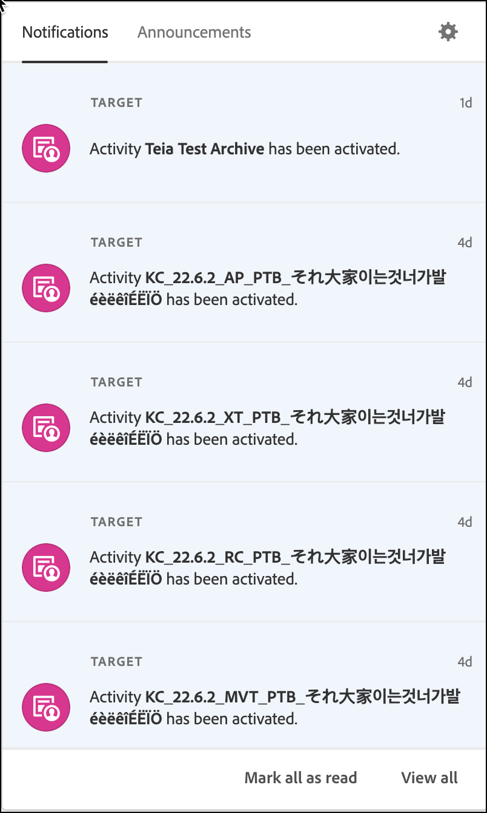

# Die Benutzeroberfläche von [!DNL Target]

Die Benutzeroberfläche ist logisch und übersichtlich angeordnet. Sie finden dort schnell, was Sie zur optimalen Nutzung von [!DNL Adobe Target] benötigen. Die folgende kurze Übersicht hilft Ihnen, sich mit [!DNL Target] vertraut zu machen. Über Links gelangen Sie zu detaillierteren Informationen und Schritt-für-Schritt-Anleitungen.

{{updated-ui}}

## [!DNL Target] UI-Kopfzeile

Die Kopfzeile am oberen Rand der [!DNL Target] Benutzeroberfläche enthält Registerkarten und Optionen, mit denen Sie durch die verschiedenen Funktionen der Lösung navigieren können. Sie können auch zwischen Organisationen wechseln und Lösungen [!DNL Adobe Experience Cloud], Feedback geben, wenn Sie Teil eines Beta-Programms sind, auf den KI-Assistenten zugreifen, Hilfe und Benachrichtigungen abrufen, Ihr [!DNL Adobe] verwalten und sich von [!DNL Target] abmelden.

Über die Registerkarten auf der linken Seite können Sie auf die verschiedenen Funktionen von [!DNL Target] zugreifen. Diese werden später erläutert. Beginnen wir mit der Erläuterung der Optionen auf der rechten Seite, bevor wir die Registerkarten besprechen.

### [!UICONTROL Organisation]

Eine *Organisation* ist die Entität, die es einem Administrator ermöglicht, Gruppen und Benutzer zu konfigurieren und Single Sign-on für die [!DNL Adobe Experience Cloud] zu steuern. Die Organisation agiert als zentrale Anmeldestelle, die sämtliche [!DNL Experience Cloud]-Produkte und -Lösungen umfasst. In den meisten Fällen entspricht die Organisation dem Namen Ihres Unternehmens. Ein Unternehmen kann aber auch aus mehreren Organisationen bestehen.

Wählen Sie die gewünschte Organisation aus der Dropdown[!UICONTROL Liste &#x200B;]Organisation“ aus, wenn Ihr Unternehmen aus mehreren Organisationen besteht:

### [!UICONTROL Beta-Feedback]

(Bedingt) Wenn Sie Teil eines offiziellen [!DNL Target] Beta-Programms sind, wird möglicherweise das Symbol [!UICONTROL Beta Feedback] angezeigt.

Geben Sie eine Beschreibung für Ihr Feedback ein, fügen Sie die entsprechenden Dateien oder Screenshots sowie ggf. weitere Details hinzu und klicken Sie dann auf **[!UICONTROL Senden]**.

### [!DNL AI Assistant]

(Bedingt) Wenn Ihnen von Ihrem Unternehmen die Rechte zur Verwendung von [!DNL AI Assistant] gewährt wurden, klicken Sie auf das Symbol [!DNL AI Assistant] .

Weitere Informationen finden Sie unter [Übersicht über den Adobe Experience Platform-KI-Assistenten](/help/main/c-intro/ai-assistant.md).

### Hilfe

Durch Klicken auf [!UICONTROL Hilfe]-Symbol (  ) können Sie auf Informationen, Videos, Blogs und mehr zugreifen, um [!DNL Target] effektiver zu verwenden. Sie können ein Support-Ticket erstellen, Fragen über Twitter stellen oder Ihr Feedback zu [!DNL Target] [!DNL Target] einreichen, um uns Ihre Kritik, Änderungswünsche oder auch Lob mitzuteilen. Auch die Telefonnummern der Kundenunterstützung finden Sie auf dieser Seite.

### Anfragen, Benachrichtigungen und Ankündigungen {#notifications-announcements}

Die Bedienfelder [!UICONTROL Anfragen], [!UICONTROL Benachrichtigungen] und [!UICONTROL Ankündigungen] helfen Ihnen, über alle [!DNL Adobe Target] auf dem Laufenden zu bleiben. Durch proaktive Benachrichtigungen sind Sie bereits frühzeitig über den Status [!DNL Adobe Experience Cloud] Lösungen und [!DNL Target] Ereignisse auf dem Laufenden. Proaktive Ankündigungen informieren Sie über geplante Ausfallzeiten (z. B. aufgrund von Systemwartungen).

Klicken Sie in [!UICONTROL &#x200B; Kopfzeile auf das Symbol &#x200B;]Benachrichtigungen“ (  ), um Benachrichtigungen anzuzeigen:

Das Bedienfeld enthält Registerkarten für [!UICONTROL Anfragen], [!UICONTROL Benachrichtigungen] und [!UICONTROL Ankündigungen].

In den folgenden Abschnitten finden Sie Informationen zu den einzelnen Registerkarten sowie zum Konfigurieren von Benachrichtigungen und Ankündigungen:

#### [!UICONTROL Anfragen]

Sie erhalten wichtige Informationen über [!DNL Adobe] Produkte und Lösungen, Ihre Zusammenarbeit mit anderen Benutzern und andere relevante Updates im Bedienfeld [!UICONTROL Anfragen].

Wenn Ihnen jemand eine Anfrage sendet, um ein Objekt zu genehmigen oder Zugriff auf ein Objekt zu gewähren, wird diese Anfrage im [!UICONTROL Anfragen] angezeigt.

#### Benachrichtigungen {#notifications}

[!DNL Target] Ereignisbenachrichtigungen umfassen Folgendes:

* **Aktivitäten**: Benachrichtigungen für alle Aktivitätstypen, wenn eine Aktivität genehmigt oder deaktiviert wird, entweder manuell oder beim Erreichen des Start- oder Enddatums. Die Benachrichtigung enthält den Namen der Aktivität mit einem Link zur Übersichtsseite der Aktivität.

  Benachrichtigungen sind konfigurierbar und werden standardmäßig von Produktadministratoren, Herausgebern und Genehmigern im Arbeitsbereich der Aktivität für [!DNL Target Premium] Konten empfangen. Bei [!DNL Target Standard]-Konten werden Benachrichtigungen von allen Herausgebern und genehmigenden Personen empfangen.

  Benachrichtigungen sind wie die folgenden Beispiele formatiert:

   * `Activity {target.activity.name} has been activated`

   * `Activity {target.activity.name} has been deactivated`

* **Profilskripte**: Benachrichtigungen, wenn ein Profilskript entweder manuell oder durch [!DNL Target] aktiviert oder deaktiviert wird.

  Benachrichtigungen sind konfigurierbar und werden standardmäßig von Produktadministratoren und Genehmigern für [!DNL Target Premium] und [!DNL Target Standard] Konten empfangen.

  Benachrichtigungen sind wie die folgenden Beispiele formatiert:

   * `Profile Script {target.profileScript.name} has been activated`
   * `Profile Script {target.profileScript.name} has been deactivated`

* **Recommendations-Feeds**: Benachrichtigungen, wenn ein [!DNL Recommendations]-Feed entweder manuell oder durch [!DNL Target] aktiviert oder deaktiviert wird. Benachrichtigungen werden auch gesendet, wenn ein [!DNL Recommendations]-Feed fehlschlägt.

  Benachrichtigungen sind konfigurierbar und werden standardmäßig von Produktadministratoren und Genehmigern für [!DNL Target Premium] Konten empfangen. [!DNL Recommendations] ist eine [!DNL Target Premium] Funktion und in [!DNL Target Standard] nicht verfügbar.

  Benachrichtigungen sind wie die folgenden Beispiele formatiert:

   * `Feed  {target.feed.name} has been activated`
   * `Feed {target.feed.name} has been deactivated`
   * `Feed {target.feed.name} has failed`
   * `Feed {target.feed.name} has failed to import from source`

Sie können einzelne Benachrichtigungen als gelesen markieren, indem Sie den Mauszeiger über die gewünschte Benachrichtigung bewegen und dann auf das Symbol [!UICONTROL Als gelesen markieren] klicken ( ). Sie können alle Benachrichtigungen als gelesen markieren oder alle Benachrichtigungen anzeigen, indem Sie [!UICONTROL Als gelesen markieren] oder [!UICONTROL Alle anzeigen] am unteren Rand des Bedienfelds klicken.

Sie können eine Erinnerung auch erneut benachrichtigen, indem Sie den Mauszeiger über eine Benachrichtigung bewegen und auf das Symbol [!UICONTROL Erneut &#x200B;]Erinnern) klicken. Sie können dann auswählen, wann Sie benachrichtigt werden möchten: 5 Minuten, 15 Minuten, eine Stunde oder morgen.

#### Mitteilungen

Proaktive Ankündigungen informieren Sie über geplante Ausfallzeiten (z. B. aufgrund von Systemwartungen).

Detailliertere Informationen finden Sie auf der Seite [Adobe Status](https://status.adobe.com/de).

### Konfigurieren von Benachrichtigungen und Ankündigungen

So bearbeiten Sie die Voreinstellungen für Benachrichtigungen:

1. Klicken Sie auf das [!UICONTROL Voreinstellungen bearbeiten] (  ) und klicken Sie dann auf **[!UICONTROL Benachrichtigungen]** in der linken Leiste.
1. Wählen **[!UICONTROL unter]** Target“ aus, wie Sie benachrichtigt werden möchten:

   * [!UICONTROL In-App]
   * [!UICONTROL E-Mail]
   * [!DNL Slack]

1. Wählen Sie die Kategorien aus, die als mit hoher Priorität eingestuft werden sollen.

   >[!NOTE]
   >
   >Für [!DNL Target] gelten nur [!UICONTROL neue Versionen] und &quot;[!UICONTROL Inhaltsaktualisierungen]. Die anderen Kategorien gelten für andere [!DNL Adobe].

1. Wählen Sie die Benachrichtigungen aus, für die Warnhinweise in Ihrem Browser angezeigt werden sollen.

   Diese Warnhinweise werden einige Sekunden lang in der oberen rechten Ecke Ihres Browsers angezeigt. Sie können festlegen, ob Kategorien mit hoher Priorität, alle Kategorien oder alle Benachrichtigungs-Popups angezeigt werden sollen. Sie können auch konfigurieren, ob die Benachrichtigungen sichtbar bleiben sollen, bis Sie sie schließen, oder die Dauer der Benachrichtigung konfigurieren.

1. Wählen Sie die Häufigkeit aus, mit der Sie Benachrichtigungs-E-Mails erhalten möchten:

   * [!UICONTROL Keine E-Mails senden]
   * [!UICONTROL Sofortige Benachrichtigungen]
   * [!UICONTROL Täglicher Auszug]
   * [!UICONTROL Wöchentliche Zusammenfassung]

1. Konfigurieren von Slack-Benachrichtigungen für einen Arbeitsbereich.

### Apps Switcher

Mit dem Apps Switcher können Sie schnell zwischen den [!DNL Adobe Experience Cloud]-Lösungen wechseln, auf die Sie Zugriff haben.

### Profil

Klicken Sie auf Ihren Profilavatar, um Ihre Voreinstellungen für [!DNL Adobe Experience Cloud] zu ändern oder sich von [!DNL Target] abzumelden. Sie können damit auch auf Ihr [!DNL Adobe]-Profil zugreifen und es bearbeiten.

Sehen wir uns nun aber die Registerkarten auf der linken Seite der [!DNL Target] an.

## Aktivitäten

Die **[!UICONTROL Aktivitäten]** ist die Standardansicht beim Öffnen von [!DNL Target]. Sie können Aktivitäten auf dieser Seite erstellen und vorhandene Aktivitäten verwalten.

Unter [Aktivitäten](/help/main/c-activities/activities.md) finden Sie detaillierte Informationen zu den in [!DNL Target] verfügbaren Aktivitätstypen sowie weitere Informationen zur Benutzeroberfläche der Liste [!UICONTROL Aktivität].

## Zielgruppen

Klicken Sie auf **[!UICONTROL Zielgruppen]**, um die Liste [!UICONTROL Zielgruppen] anzuzeigen, in der Sie Zielgruppen erstellen und vorhandene Zielgruppen verwalten können.

Eine Zielgruppe ist eine Gruppe ähnlicher Aktivitätsteilnehmer, denen eine zielgerichtete Aktivität angezeigt wird. Eine Zielgruppe ist eine Gruppe von Personen mit denselben Merkmalen, wie z. B. ein neuer Besucher, ein wiederkehrender Besucher oder wiederkehrende Besucher aus dem Mittleren Westen. Mit der Funktion [!UICONTROL Audience] können Sie Ihre Inhalte und Erlebnisse speziell an bestimmte Zielgruppen anpassen. Durch geeignete Botschaften zum richtigen Zeitpunkt für die richtigen Personen können Sie so Ihr digitales Marketing optimieren. Wird ein Besucher als Teil einer Zielgruppe identifiziert, bestimmt [!DNL Target] basierend auf den Kriterien, die bei der Erstellung der Aktivität festgelegt wurden, welches Erlebnis ihm angezeigt wird.

Unter [Erstellen von Zielgruppen](/help/main/c-target/c-audiences/create-audience.md) finden Sie detaillierte Informationen zu den Zielgruppentypen in [!DNL Target] und weitere Informationen zur Benutzeroberfläche der Liste [!UICONTROL Zielgruppe].

## Angebote

Klicken Sie auf die **[!UICONTROL Angebote]**, um die Liste [!UICONTROL Angebote] anzuzeigen, in der Sie Erlebnisse und Angebote erstellen und vorhandene Erlebnisse und Angebote verwalten können.

Ein Erlebnis kann ein Angebot, ein Bild, ein Text, eine Schaltfläche, ein Video, eine Kombination dieser Elemente auf einer Seite, eine gesamte Webseite oder mehrere Seiten sein, die möglicherweise einen Kauftrichter oder eine andere logische Seitenfolge bilden. Ein Erlebnis kann auch die Antwort eines Sprachassistenten, ein Skript für den Kundendienst oder sogar ein personalisierter Geschmack in einem Getränkeautomaten sein. Sie können Erlebnisse in [!DNL Target] Aktivitäten testen oder personalisieren.

Unter [Angebote](/help/main/c-experiences/c-manage-content/manage-content.md) finden Sie detaillierte Informationen zu den Angebotstypen in [!DNL Target] und weitere Informationen zur Benutzeroberfläche der Liste [!UICONTROL Angebot].

## Recommendations

Klicken Sie auf die **[!UICONTROL Recommendations]**, um auf [!DNL Target Recommendations] zuzugreifen.

>[!NOTE]
>
>[!UICONTROL Recommendations]-Aktivitäten sind als Teil der [!DNL Target Premium]-Lösung verfügbar. [!UICONTROL Recommendations] -Aktivitäten sind in [!DNL Target Standard] ohne [!DNL Target Premium]-Lizenz nicht verfügbar. Weitere Informationen finden Sie im Abschnitt *Einführung in Target* unter [Target Premium](/help/main/c-intro/intro.md#premium).

[!UICONTROL Recommendations]-Aktivitäten zeigen automatisch Produkte oder Inhalte an, die basierend auf früheren Benutzeraktivitäten oder anderen Algorithmen für Ihre Kunden interessant sein könnten. Recommendations tragen dazu bei, Kundinnen und Kunden zu relevanten Elementen zu lenken, von denen sie andernfalls möglicherweise nichts wüssten.

Unter [Recommendations](/help/main/c-recommendations/recommendations.md) finden Sie detaillierte Informationen zu [!UICONTROL Recommendations] in [!DNL Target] und weitere Informationen zur Benutzeroberfläche von [!UICONTROL Recommendations].

## Administration

Klicken Sie auf die **[!UICONTROL Administration]**, um auf die Seiten [!UICONTROL Administration] zuzugreifen.

Auf den [!UICONTROL Administration]-Seiten können Sie [!DNL Target] verwalten, einschließlich Konfigurationseinstellungen für [!UICONTROL Visual Experience Composer] (VEC), Berichterstellung, [!DNL Scene7], Implementierung, Hosts, Umgebungen, Antwort-Token, Benutzer und Empfehlungen.

Unter [Verwaltung von Target – Überblick](/help/main/administrating-target/administrating-target.md) finden Sie detaillierte Informationen zur Verwaltung von Target und weitere Informationen zur Benutzeroberfläche der Administrationsseiten.

## Visual Experience Composer (VEC)

Zusätzlich zur [!DNL Target]-Benutzeroberfläche sollten Sie sich auch mit der VEC-Benutzeroberfläche vertraut machen. Weitere Informationen finden Sie unter [[!DNL Visual Experience Composer] Optionen](/help/main/c-experiences/c-visual-experience-composer/viztarget-options.md).
