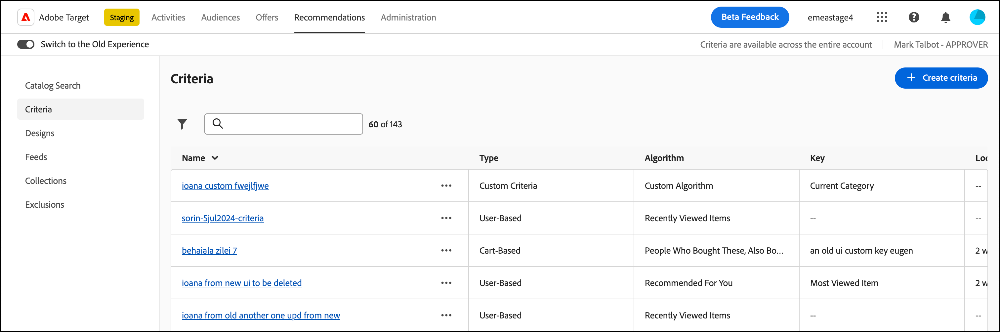

# [!UICONTROL Criteria]

[!UICONTROL Criteria] in [!DNL Adobe Target] [!DNL Recommendations] sind Regeln, die basierend auf einem vorab festgelegten Satz von Besucherverhalten bestimmen, welche Produkte oder Inhalte empfohlen werden sollen. Kriterien können auf beliebten Trends, dem aktuellen und vergangenen Verhalten eines Besuchers oder ähnlichen Produkten und Inhalten basieren. Sie können mehrere Empfehlungstypen untereinander testen, indem Sie mehrere Kriterien verwenden.

In den folgenden Abschnitten werden die Kriterienschlüssel und die Empfehlungslogik, die Sie für jeden Schlüssel verwenden können, ausführlicher erläutert. Klicken Sie auf die Links, um weitere Informationen zu erhalten.

## Vertikaler Markt {#section_936BCFCF234C49A2BEC1C38AAC2D71AF}

Beim Erstellen eines Kriteriums wählen Sie basierend auf den Zielen Ihrer Recommendations-Aktivität eine Branche aus.

| Vertikaler Markt | Ziel |
|--- |--- |
| [!UICONTROL Retail/Ecommerce] | Zum Kauf führende Konversion |
| [!UICONTROL Lead Generation/B2B/Financial Services] | Konversion ohne Kauf |
| [!UICONTROL Media/Publishing] | Interaktion |

Andere Kriterienoptionen ändern sich je nach ausgewählter Branchen-Vertikale. Sie können die standardmäßige vertikale Branche auf der Seite **[!UICONTROL Administration]>[!UICONTROL Recommendations]** festlegen oder die vertikale Branche für jedes Kriterium angeben.

## Algorithmentyp {#section_885B3BB1B43048A88A8926F6B76FC482}

Der ausgewählte Algorithmustyp bestimmt die verfügbaren Algorithmen.

In der folgenden Tabelle werden die verschiedenen Algorithmustypen und die zugehörigen Algorithmen erläutert.

| Algorithmustyp | Verwendungszeitpunkt | Verfügbare Algorithmen |
| --- | --- | --- |
| [!UICONTROL Cart-Based] | Empfehlungen auf der Grundlage des Warenkorbinhalts des Benutzers aussprechen. | <ul><li>[!UICONTROL People Who Viewed These, Also Viewed]</li><li>[!UICONTROL People Who Viewed These, Also Bought]</li><li>[!UICONTROL People Who Bought These, Also Bought]</li></ul>Weitere Informationen finden Sie unter [Warenkorbbasiert](/help/main/c-recommendations/c-algorithms/base-the-recommendation-on-a-recommendation-key.md#cart-based) in *Stützen der Empfehlung auf einen Empfehlungsschlüssel*. |
| [!UICONTROL Popularity-Based] | Empfehlungen auf der Grundlage der allgemeinen Popularität eines Elements auf Ihrer Website oder auf der Grundlage der Popularität von Elementen innerhalb der Lieblings- oder am häufigsten angezeigten Kategorie, Marke, Genre usw. | <ul><li>[!UICONTROL Most Viewed Across the Site]</li><li>[!UICONTROL Most Viewed by Category]</li><li>[!UICONTROL Most Viewed by Item Attribute]</li><li>[!UICONTROL Top Sellers Across the Site]</li><li>[!UICONTROL Top Sellers by Category]</li><li>[!UICONTROL Top Sellers by Item Attribute]</li><li>[!UICONTROL Top by Analytics Metric]</li></ul> |
| [!UICONTROL Item-Based] | Empfehlungen geben, basierend auf der Suche nach ähnlichen Elementen, die der Benutzer gerade anzeigt oder kürzlich angeschaut hat. | <ul><li>[!UICONTROL People Who Viewed This, Viewed That]</li><li>[!UICONTROL People Who Viewed This, Bought That]</li><li>[!UICONTROL People Who Bought This, Bought That]</li><li>[!UICONTROL Items with Similar Attributes]</li></ul> |
| [!UICONTROL User-Based] | Empfehlungen auf der Grundlage des Benutzerverhaltens aussprechen. | <ul><li>[!UICONTROL Recently Viewed Items]</li><li>[!UICONTROL Recommended for You]</li></ul> |
| [!UICONTROL Custom Criteria] | Empfehlungen basierend auf einer benutzerdefinierten Datei geben, die Sie hochladen. | <ul><li>Benutzerdefinierter Algorithmus</li></ul> |

Weitere Informationen zu den einzelnen Algorithmen finden Sie unter [Stützen der Recommendation auf einen Recommendation-Schlüssel](/help/main/c-recommendations/c-algorithms/base-the-recommendation-on-a-recommendation-key.md).

## Verwenden eines benutzerdefinierten Empfehlungsschlüssels {#custom-key}

Sie können Empfehlungen auch auf dem Wert eines benutzerdefinierten Profilattributs basieren.

>[!NOTE]
>
>Benutzerdefinierte Profilparameter können über JavaScript, API oder Integrationen an [!DNL Target] übergeben werden. Weitere Informationen zu benutzerdefinierten Profilattributen finden Sie unter [Besucherprofile](/help/main/c-target/c-visitor-profile/visitor-profile.md).

Angenommen, Sie möchten empfohlene Filme basierend auf dem Film anzeigen, den ein Benutzer der Warteschlange zuletzt hinzugefügt hat.

1. Klicken Sie auf **[!UICONTROL Recommendations]** > **[!UICONTROL Criteria]**.

1. Klicken Sie auf **[!UICONTROL Create Criteria]** > **[!UICONTROL Create Criteria]**.

1. Füllen Sie die Informationen im Abschnitt [Grundlegende Informationen](/help/main/c-recommendations/c-algorithms/create-new-algorithm.md#info) aus.

1. Wählen Sie im [Empfohlener ](/help/main/c-recommendations/c-algorithms/create-new-algorithm.md#rec-algo)&quot; **[!UICONTROL Item Based]** aus der **[!UICONTROL Algorithm Type]** aus.

1. Wählen Sie **[!UICONTROL People Who Viewed This, Viewed That]** aus der Liste **[!UICONTROL Algorithm]** aus.

1. Wählen Sie Ihr benutzerdefiniertes Profilattribut aus der **[!UICONTROL Recommendation Key]** Liste aus (z. B. [!UICONTROL Last Show Added to Watchlist]).

## Anzeigen von Kriterieninformationen {#section_7162DE58E4594FD688A4D7FDB829FD8B}

Sie können Details zu den Kriterien anzeigen, indem Sie auf die gewünschten Kriterien in der Spalte [!UICONTROL Name] klicken.

Auf der Registerkarte **[!UICONTROL Algorithm Info]** können Sie allgemeine Informationen zu den ausgewählten Kriterien anzeigen, einschließlich [!UICONTROL Name], [!UICONTROL Description], [!UICONTROL Industry Vertical], [!UICONTROL Page Types], [!UICONTROL Recommendation Key], [!UICONTROL Recommendation Logic], [!UICONTROL Algorithm ID] und zuletzt geänderter Informationen (Datum und wer hat den Algorithmus geändert).

Im Abschnitt **[!UICONTROL Algorithm Usage]** können Sie eine Liste der Aktivitäten anzeigen, die auf die ausgewählten Kriterien verweisen.

>[!NOTE]
>
>Die [!UICONTROL Algorithm Usage] Funktion wird derzeit nur für [!DNL Recommendations] Aktivitäten unterstützt. Diese Funktion wird derzeit nicht für [!UICONTROL A/B Test]-, [!UICONTROL Auto-Allocate]-, [!UICONTROL Auto-Target]- und [!UICONTROL Experience Targeting] (XT)-Aktivitäten unterstützt, die [Recommendations als Angebot](/help/main/c-recommendations/recommendations-as-an-offer.md) enthalten.
