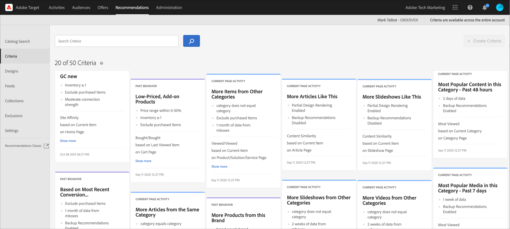
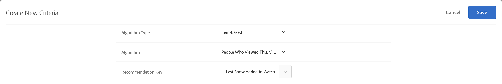

# Kriterien

Kriterien in [!DNL Adobe Target] [!DNL Recommendations] sind Regeln, die basierend auf einem vorab festgelegten Satz von Besucherverhalten bestimmen, welche Produkte oder Inhalte empfohlen werden sollen. Die Kriterien können auf angesagten Trends, dem aktuellen und früheren Verhalten eines Besuchers oder auf ähnlichen Produkten und Inhalten basieren. Sie können mehrere Empfehlungstypen untereinander testen, indem Sie mehrere Kriterien verwenden.

In den folgenden Abschnitten werden die Kriterien und die Empfehlungslogik erläutert, die Sie für jeden Schlüssel verwenden können. Klicken Sie auf die Links, um weitere Informationen zu erhalten.

## Vertikaler Markt {#section_936BCFCF234C49A2BEC1C38AAC2D71AF}

Beim Erstellen eines Kriteriums wählen Sie basierend auf den Zielen Ihrer Recommendations-Aktivität eine Branche aus.

| Vertikaler Markt | Ziel |
|--- |--- |
| Einzelhandel/E-Commerce | Zum Kauf führende Konversion |
| Lead-Generierung/B2B/Finanzdienstleistungen | Konversion ohne Kauf |
| Medien/Verlagswesen | Interaktion |

Andere Kriterienoptionen ändern sich je nach ausgewählter Branchen-Vertikale. Sie können die Standardbranchenhöhe auf der Seite **[!UICONTROL Recommendations > Einstellungen]** festlegen oder für jedes Kriterium die Branchenhöhe angeben.

## Algorithmentyp {#section_885B3BB1B43048A88A8926F6B76FC482}

Der ausgewählte Algorithmustyp bestimmt die verfügbaren Algorithmen. Es gibt mehrere Algorithmustypen, die beim Einrichten einer [!DNL Recommendations] als Kriterienkarten dargestellt werden.

In der folgenden Tabelle werden die verschiedenen Algorithmustypen und die zugehörigen Algorithmen erläutert.

| Algorithmustyp | Verwendungszeitpunkt | Verfügbare Algorithmen |
| --- | --- | --- |
| [!UICONTROL Warenkorbbasiert] | Empfehlungen auf der Grundlage des Warenkorbinhalts des Benutzers aussprechen. | <ul><li>Menschen, die sich diese ansahen, sahen sich diese an</li><li>Leute, die sich diese ansahen, kauften sie</li><li>Leute, die das kauften, kauften das</li></ul>Weitere Informationen finden Sie unter [Warenkorbbasiert](/help/main/c-recommendations/c-algorithms/base-the-recommendation-on-a-recommendation-key.md#cart-based) in *Stützen der Empfehlung auf einen Empfehlungsschlüssel*. |
| [!UICONTROL Beliebtheitsbasiert] | Empfehlungen auf der Grundlage der allgemeinen Popularität eines Elements auf Ihrer Website oder auf der Grundlage der Popularität von Elementen innerhalb der Lieblings- oder am häufigsten angezeigten Kategorie, Marke, Genre usw. | <ul><li>Am häufigsten auf der Website angezeigt</li><li>Am häufigsten angezeigt nach Kategorie</li><li>Am häufigsten angezeigt nach Elementattribut</li><li>Top-Verkäufer auf der Website</li><li>Topverkäufe nach Kategorie</li><li>Topverkäufe nach Artikelattribut</li><li>Am besten nach Analytics-Metrik</li></ul> |
| [!UICONTROL Elementbasiert] | Empfehlungen geben, basierend auf der Suche nach ähnlichen Elementen, die der Benutzer gerade anzeigt oder kürzlich angeschaut hat. | <ul><li>Personen, die das ansahen, sahen auch dies an</li><li>Personen, die das ansahen, kauften dies</li><li>Personen, die das kauften, kauften dies</li><li>Elemente mit ähnlichen Attributen</li></ul> |
| [!UICONTROL Benutzerbasiert] | Empfehlungen auf der Grundlage des Benutzerverhaltens aussprechen. | <ul><li>Vor Kurzem aufgerufene Artikel</li><li>Empfohlen für</li></ul> |
| [!UICONTROL Benutzerdefinierte Kriterien] | Empfehlungen basierend auf einer benutzerdefinierten Datei, die Sie hochladen. | <ul><li>Benutzerdefinierter Algorithmus</li></ul> |

Weitere Informationen zu den einzelnen Algorithmen finden Sie unter [Stützen der Recommendation auf einen Recommendation-Schlüssel](/help/main/c-recommendations/c-algorithms/base-the-recommendation-on-a-recommendation-key.md).

## Verwenden eines benutzerdefinierten Empfehlungsschlüssels {#custom-key}

Sie können Empfehlungen auch auf dem Wert eines benutzerdefinierten Profilattributs basieren.

>[!NOTE]
>
>Benutzerdefinierte Profilparameter können über JavaScript, API oder Integrationen an [!DNL Target] übergeben werden. Weitere Informationen zu benutzerdefinierten Profilattributen finden Sie unter [Besucherprofile](/help/main/c-target/c-visitor-profile/visitor-profile.md).

Angenommen, Sie möchten empfohlene Filme basierend auf dem Film anzeigen, den ein Benutzer der Warteschlange zuletzt hinzugefügt hat.

1. Klicken Sie **[!UICONTROL Recommendations]** > **[!UICONTROL Kriterien]**.

1. Klicken Sie **[!UICONTROL Kriterien erstellen]** > **[!UICONTROL Kriterien erstellen]**.

1. Füllen Sie die Informationen im Abschnitt [Grundlegende Informationen](/help/main/c-recommendations/c-algorithms/create-new-algorithm.md#info) aus.

1. Wählen Sie im Abschnitt [Empfohlener ](/help/main/c-recommendations/c-algorithms/create-new-algorithm.md#rec-algo)&quot; **[!UICONTROL Elementbasiert]** aus der Liste **[!UICONTROL Algorithmustyp]** aus.

1. Wählen Sie **[!UICONTROL Personen, die dies angesehen haben, das angezeigt haben]** aus der Liste **[!UICONTROL Algorithmus]** aus.

1. Wählen Sie Ihr benutzerdefiniertes Profilattribut aus der Liste **[!UICONTROL Empfehlungsschlüssel]** aus (z. B. [!UICONTROL Zuletzt angezeigt zur Watchlist hinzugefügt]).

   

## Anzeigen von Kriterieninformationen {#section_7162DE58E4594FD688A4D7FDB829FD8B}

Sie können Kriteriendetails auf einer Popupkarte anzeigen, indem Sie mit dem Mauszeiger über eine Karte fahren und auf das Informationssymbol einer Kriterienkarte klicken, ohne das Kriterium zu öffnen.

Klicken Sie auf die Registerkarte **[!UICONTROL Algorithmusinformationen]**, um allgemeine Informationen zu den ausgewählten Kriterien anzuzeigen, einschließlich Name, Beschreibungen, vertikalen Markt, Seitentyp(en), Empfehlungsschlüssel, Empfehlungslogik und Algorithmus-ID.

Klicken Sie auf die Registerkarte **[!UICONTROL Algorithmusnutzung]**, um eine Liste der Aktivitäten anzuzeigen, die das ausgewählte Kriterium verwenden. Die Karte listet aktive, inaktive und Entwurfsaktivitäten auf. Klicken Sie auf die Dropdown-Listen Live-Aktivitäten/Inaktive Aktivitäten/Entwurfsaktivitäten , um die gesamte Liste der Aktivitäten anzuzeigen, die auf dieses Kriterium verweisen. Sie können auf einen Aktivitätslink klicken, um die Aktivität zur Bearbeitung zu öffnen.

>[!NOTE]
>
>Die Funktion [!UICONTROL Nutzung des ]) wird derzeit nur für Recommendations -Aktivitäten unterstützt. Diese Funktion wird derzeit nicht für Aktivitäten des Typs A/B-Test, Automatische Zuordnung, Automatisches Targeting und Erlebnis-Targeting (XT) unterstützt, die [Recommendations als Angebot“ ](/help/main/c-recommendations/recommendations-as-an-offer.md).
