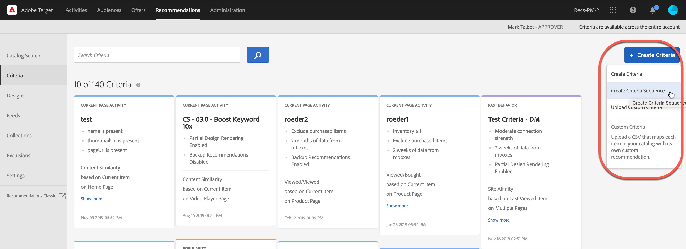

# Erstellen von Kriteriensequenzen

Verwenden Sie Sequenzen von bis zu fünf Kriterien, um mehr Kontrolle über die Elemente zu erhalten, die in Ihren [!UICONTROL Recommendations]-Aktivitäten angezeigt werden. Sie können auch die Anzahl der zurückgegebenen Elemente begrenzen (manchmal auch als „Steuerung auf Steckplatzebene“ bezeichnet).

>[!NOTE]
>
>Kriteriensequenzen können nicht mit Aktivitäten [!UICONTROL Recommendations) verwendet werden, &#x200B;] vor der [!DNL Target Premium] vom Oktober 2016 erstellt wurden.

Bevor Sie eine Kriteriensequenz erstellen können, müssen Sie zuerst die Kriterien erstellen, die in der Sequenz stehen sollen. Weitere Informationen [&#x200B; Sie unter &#x200B;](/help/main/c-recommendations/c-algorithms/create-new-algorithm.md) erstellen .

Mithilfe einer Kriteriensequenz können Sie zusätzliche gezielte Empfehlungen bereitstellen, anstatt allgemeinere Reserveempfehlungen zu verwenden, wenn ein Kriterium nicht genügend Ergebnisse zurückgibt, um Ihr Design zu füllen. In der Regel geht eine Kriteriensequenz von einer spezifischeren Zielgruppenbestimmung, die möglicherweise weniger Ergebnisse zurückgibt, zu einer allgemeineren Zielgruppenbestimmung über, die in der Regel mehr Ergebnisse zurückgibt.

Ihre Kriteriensequenzen können je nach Seitentyp variieren, wie in den folgenden Beispielen gezeigt:

| Seitentyp | Mögliche Reihenfolge |
| --- | --- |
| Produktseite | <ol><li>Basierend auf dem aktuellen Artikel, von der gleichen Marke</li><li>Basierend auf dem aktuellen Artikel, von allen Marken</li><li>Basierend auf Inhaltsähnlichkeit</li><li>Basierend auf Topverkäufen</li><li>Basierend auf Artikeln, die auf der gesamten Website am häufigsten angezeigt wurden</li></ol> |
| Startseite | <ol><li>Basierend auf dem letzten Einkauf des Besuchers </li><li>Basierend auf dem Lieblingsartikel des Besuchers</li><li>Basierend auf der Lieblingskategorie des Besuchers</li><li>Basierend auf Topverkäufen</li><li>Basierend auf den Elementen, die auf der gesamten Website am häufigsten angezeigt wurden</li></ol> |

## Erstellen einer Kriteriensequenz

Kriteriensequenzen werden auf dem Bildschirm [!UICONTROL Kriteriensequenz erstellen] erstellt.

Es gibt mehrere Möglichkeiten, um auf den Bildschirm [!UICONTROL Kriteriensequenz erstellen] zu gelangen. Einige Bildschirmoptionen variieren je nachdem, wie Sie auf den Bildschirm gelangen.

* Klicken Sie im Bildschirm der Bibliothek **[!UICONTROL Empfehlungen]** > **[!UICONTROL Kriterien]** auf **[!UICONTROL Kriterien erstellen]** > **[!UICONTROL Kriteriensequenz erstellen]**. Kriterien, die Sie hier erstellen, stehen automatisch für alle [!UICONTROL Recommendations]-Aktivitäten zur Verfügung.
* Wenn Sie eine Aktivität vom Typ [!UICONTROL Recommendations] erstellen, klicken Sie auf dem Bildschirm Kriterien auswählen auf **[!UICONTROL Neu erstellen]** > **[!UICONTROL Kriteriensequenz erstellen]**. Sie haben die Möglichkeit, Ihre neue Kriteriensequenz zu speichern, um sie mit anderen [!UICONTROL Recommendations]-Aktivitäten zu verwenden.
* Wenn Sie eine Aktivität vom Typ [!UICONTROL Recommendations] bearbeiten, klicken Sie auf  Seite in ein Feld Recommendations-Speicherort und wählen Sie dann **[!UICONTROL Kriterien ändern]** aus. Klicken Sie im Bildschirm [!UICONTROL Kriterien auswählen] auf **[!UICONTROL Neu erstellen]** > **[!UICONTROL Kriteriensequenz erstellen]**. Sie können Ihre neuen Kriterien speichern, um Sie mit anderen [!UICONTROL Recommendations]-Aktivitäten zu verwenden.

Bei den folgenden Schritten wird davon ausgegangen, dass Sie mithilfe der ersten Methode auf [!UICONTROL &#x200B; Bildschirm &#x200B;]Kriteriensequenz erstellen **[!UICONTROL zugreifen: dem Bildschirm Recommendations]** > **[!UICONTROL Kriterien]** Bibliothek .

1. Klicken Sie **[!UICONTROL Recommendations]** > **[!UICONTROL Kriterien]**.

1. Klicken Sie **[!UICONTROL Kriterien erstellen]** > **[!UICONTROL Kriteriensequenz erstellen]**.

   

1. Füllen Sie die Informationen im Abschnitt [Basisinformationen](/help/main/c-recommendations/c-algorithms/create-new-algorithm.md#info) aus.

1. Klicken Sie **[!UICONTROL Abschnitt]** Kriteriensequenz“ auf **[!UICONTROL Kriterien hinzufügen]**.

   Die Sequenzreihenfolge definiert die Reihenfolge, in der ein Design ausgefüllt wird. Wenn Kriterium 1 nicht genügend Empfehlungen zum Ausfüllen Ihres Designs enthält, werden die verbleibenden Slots mit Kriterium 2 usw. gefüllt.

   

1. Wählen Sie [!UICONTROL &#x200B; Bildschirm &quot;] auswählen“ ein Kriterium aus und klicken Sie dann auf **[!UICONTROL Hinzufügen]**.

   Sie können das Suchfeld und die Filter-Dropdown-Listen verwenden, um die gewünschten Kriterien zu finden.

   

1. (Optional) Schieben Sie den Umschalter **[!UICONTROL Begrenzung der Anzahl der zurückgegebenen Elemente]** auf die „Ein“-Position und geben Sie dann die Anzahl der Elemente (zwischen 1 und 50) an.

   

   Beachten Sie die folgenden Anwendungsfälle, um den Wert der Option [!UICONTROL Begrenzung der Anzahl der zurückgegebenen Elemente] (manchmal auch als „Steuerung auf Steckplatzebene“ bezeichnet) zu verstehen:

   * **Anwendungsfall 1**: Sie möchten eine Mischung aus verschiedenen Arten von Elementen in einer einzigen Recommendations-Taskleiste haben. Beispiel: Sie möchten eine Mischung aus Oberbekleidung (Jacken) und Oberteilen (Hemden, T-Shirts) anzeigen. Verwenden Sie dazu eine Sammlung für die Aktivität , die alle potenziellen Produkttypen in allen Slots in Ihrem Design enthält. Richten Sie dann Ihre ersten Kriterien mit einem statischen Filter ein, der die Kriterien auf Oberbekleidung einschränkt, und richten Sie Ihre zweiten Kriterien mit einem statischen Filter ein, der die Kriterien auf Oberbekleidung einschränkt. Fügen Sie schließlich beide Kriterien zu einer Kriteriensequenz hinzu und beschränken Sie die ersten Kriterien auf zwei Slots.

     Die Recommendations -Taskleiste könnte auf Ihrer Site wie folgt aussehen:

     

   * **Anwendungsfall 2**: Sie möchten eine Mischung aus alternativen und komplementären Elementen. Richten Sie ein Kriterium ein, um einen angezeigten/angezeigten Algorithmus zu verwenden, und verwenden Sie einen dynamischen Filter, der die empfohlenen Elemente auf die Kategorie des aktuellen Elements beschränkt. Richten Sie das zweite Kriterium ein, um einen angezeigten/gekauften Algorithmus zu verwenden, und verwenden Sie einen dynamischen Filter, der nur empfohlene Artikel enthält, die nicht mit der Kategorie des aktuellen Artikels übereinstimmen. Fügen Sie schließlich beide Kriterien zu einer Sequenz hinzu und beschränken Sie das erste Kriterium auf zwei Slots.

1. Fügen Sie Ihrer Sequenz weitere Kriterien hinzu. Sie können einer Sequenz bis zu fünf Kriterien hinzufügen.

1. Aktivieren Sie [Optionen für Sicherungsinhalte](/help/main/c-recommendations/c-algorithms/create-new-algorithm.md#content).

1. Klicken Sie auf **[!UICONTROL Speichern]**.

   Die Kriteriensequenz wird in der Kriterienliste angezeigt.

   Weitere Informationen zu den Empfehlungslogikoptionen finden Sie unter [Kriterien](/help/main/c-recommendations/c-algorithms/algorithms.md).

## Schulungsvideo: Erstellen von Kriterien in Recommendations (12:33) 

Dieses Video enthält die folgenden Informationen:

* Erstellen von Kriterien
* Erstellen von Kriteriensequenzen
* Hochladen benutzerdefinierter Kriterien

>[!VIDEO](https://video.tv.adobe.com/v/27694?quality=12)
