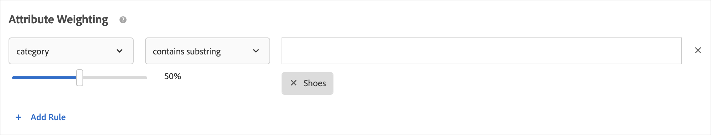

# Erstellen von Kriterien

Kriterien in [!UICONTROL Adobe Target] [!UICONTROL Recommendations] steuern den Inhalt Ihrer [!UICONTROL Recommendations]. Erstellen Sie Kriterien, um die Empfehlungen anzuzeigen, die für Ihre Aktivität am besten geeignet sind. Diese Kriterien verwenden die Aktionen des Besuchers, um zu bestimmen, welche Inhalte oder Produkte angezeigt werden sollen.

In den folgenden Abschnitten wird erläutert, wie Sie neue Kriterien erstellen.

## Aufrufen des Bildschirms Neue Kriterien erstellen

Es gibt mehrere Möglichkeiten, den [!UICONTROL Create New Criteria] zu erreichen. Einige Bildschirmoptionen variieren je nachdem, wie Sie auf den Bildschirm gelangen.

* Klicken Sie im Bildschirm **[!UICONTROL Recommendations]** > **[!UICONTROL Criteria]** Bibliothek auf **[!UICONTROL Create Criteria]** > **[!UICONTROL Create Criteria]**. Kriterien, die Sie hier erstellen, stehen automatisch für alle [!DNL Recommendations]-Aktivitäten zur Verfügung.
* Wenn Sie eine [!DNL Recommendations] mit dem [!UICONTROL Visual Experience Composer] (VEC) erstellen, gelangen Sie sofort zum [!UICONTROL Select Criteria], nachdem Sie ein Element auf Ihrer Seite ausgewählt und auf [!UICONTROL Replace w/ Recommendations], [!UICONTROL Insert Recommendations Before] oder [!UICONTROL Insert Recommendations After] geklickt haben. Anschließend können Sie ein verfügbares Kriterium auswählen oder auf **[!UICONTROL Create Criteria]** klicken. Wenn Sie neue Kriterien erstellen, haben Sie die Möglichkeit, Ihre Kriterien zur Verwendung mit anderen [!DNL Recommendations] Aktivitäten zu speichern. Weitere Informationen finden Sie unter [Erstellen einer Recommendations-Aktivität](/help/main/c-recommendations/t-create-recs-activity/create-recs-activity.md).
* Wenn Sie eine [!DNL Recommendations] bearbeiten, klicken Sie in ein [!UICONTROL Recommendations Location] auf Ihrer Seite und wählen Sie **[!UICONTROL Change Criteria]** aus. Klicken Sie auf dem Bildschirm [!UICONTROL Select Criteria] auf **[!UICONTROL Create Criteria]**. Sie können Ihre neuen Kriterien speichern, um Sie mit anderen [!DNL Recommendations]-Aktivitäten zu verwenden.

Bei den folgenden Schritten wird davon ausgegangen, dass Sie auf den [!UICONTROL Create New Criteria] über die erste Methode zugreifen: den Bildschirm **[!UICONTROL Recommendations]** > **[!UICONTROL Criteria]** Bibliothek .

1. Klicken Sie auf **[!UICONTROL Recommendations]** > **[!UICONTROL Criteria]**.

1. Klicken Sie auf **[!UICONTROL Create Criteria]** > **[!UICONTROL Create Criteria]**.

   

1. Konfigurieren Sie die Informationen in den folgenden Abschnitten.

## [!UICONTROL Basic Information] {#info}

1. Geben Sie eine **[!UICONTROL Criteria Name]** ein.

   Dies ist der „interne“ Name, der für die Beschreibung der Kriterien verwendet wird. Sie möchten zum Beispiel Ihre Kriterien „Produkte mit der höchsten Marge“ nennen, Sie möchten jedoch nicht, dass dieser Titel öffentlich angezeigt wird. Sehen Sie sich den nächsten Schritt an, um den öffentlichen Titel festzulegen.

   

1. Geben Sie eine öffentlich zugängliche **[!UICONTROL Display Title]** ein, die auf der Seite für alle Empfehlungen angezeigt werden soll, die diese Kriterien verwenden.

   So wäre es möglicherweise sinnvoll, „Personen, die das ansahen, sahen auch dies an“ oder „Ähnliche Produkte“ einzublenden, wenn Sie diese Kriterien zum Einblenden von Empfehlungen verwenden.

1. Geben Sie eine kurze **[!UICONTROL Description]** der Kriterien ein.

   Die Beschreibung sollte Ihnen dabei helfen, die Kriterien zu identifizieren, und kann Informationen über den Zweck der Kriterien enthalten.

1. Wählen Sie basierend auf den Zielen Ihrer Recommendations-Aktivität eine Branche aus.

   | Vertikaler Markt | Ziel |
   |--- |--- |
   | Einzelhandel/E-Commerce | Zum Kauf führende Konversion |
   | Lead-Generierung/B2B/Finanzdienstleistungen | Konversion ohne Kauf |
   | Medien/Verlagswesen | Interaktion |

   Andere Optionen für Kriterien ändern sich auf Grundlage des vertikalen Markts, den Sie auswählen.

1. **[!UICONTROL Page Type]** auswählen.

   Verschiedene Seitentypen stehen zur Verfügung.

   Vertikaler Markt und Seitentyp werden zusammen genutzt, um Ihre gespeicherten Kriterien zu kategorisieren, wodurch die Wiederverwendung der Kriterien für andere [!DNL Recommendations]-Aktivitäten erleichtert wird.

## [!UICONTROL Recommendations Algorithm] {#rec-algo}

1. **[!UICONTROL Algorithm Type]** und **[!UICONTROL Algorithm]** auswählen:

   

   | Algorithmustyp | Verwendungszeitpunkt | Verfügbare Algorithmen |
   | --- | --- | --- |
   | [!UICONTROL Cart-Based] | Empfehlungen auf der Grundlage des Warenkorbinhalts des Benutzers aussprechen. | <ul><li>Menschen, die sich diese ansahen, sahen sich diese an</li><li>Leute, die sich diese ansahen, kauften sie</li><li>Leute, die das kauften, kauften das</li></ul> |
   | [!UICONTROL Popularity-Based] | Empfehlungen auf der Grundlage der allgemeinen Popularität eines Elements auf Ihrer Website oder auf der Grundlage der Popularität von Elementen innerhalb der Lieblings- oder am häufigsten angezeigten Kategorie, Marke, Genre usw. | <ul><li>Am häufigsten auf der Website angezeigt</li><li>Am häufigsten angezeigt nach Kategorie</li><li>Am häufigsten angezeigt nach Elementattribut</li><li>Top-Verkäufer auf der Website</li><li>Topverkäufe nach Kategorie</li><li>Topverkäufe nach Artikelattribut</li><li>Am besten nach Analytics-Metrik</li></ul> |
   | [!UICONTROL Item-Based] | Empfehlungen geben, basierend auf der Suche nach ähnlichen Elementen, die der Benutzer gerade anzeigt oder kürzlich angeschaut hat. | <ul><li>Personen, die das ansahen, sahen auch dies an</li><li>Personen, die das ansahen, kauften dies</li><li>Personen, die das kauften, kauften dies</li><li>Elemente mit ähnlichen Attributen</li></ul> |
   | [!UICONTROL User-Based] | Empfehlungen auf der Grundlage des Benutzerverhaltens aussprechen. | <ul><li>Vor Kurzem aufgerufene Artikel </li><li>Empfohlen für</li></ul> |
   | [!UICONTROL Custom Criteria] | Empfehlungen basierend auf einer benutzerdefinierten Datei, die Sie hochladen. | <ul><li>Benutzerdefinierter Algorithmus</li></ul> |

   >[!NOTE]
   >
   >Wenn Sie **[!UICONTROL Items]**/**[!UICONTROL Media with Similar Attributes]** auswählen, haben Sie die Möglichkeit, [Inhaltsähnlichkeitsregeln](#similarity) festzulegen.

1. Wählen Sie je nach Bedarf ein **Elementattribut** und **Profilattribut,** einen **Empfehlungsschlüssel**, **Filterschlüssel** und/oder **Analytics-Metrik**, um den Algorithmus zu konfigurieren.

Die restlichen Konfigurationsoptionen für den Algorithmus variieren je nach ausgewähltem Algorithmus. Um die Konfiguration des Algorithmus abzuschließen, wählen Sie ein [!UICONTROL Recommendation Key], ein [!UICONTROL Filtering Key], ein [!UICONTROL Co-Occurrence Basis], ein [!UICONTROL Analytics Metric] und/oder ein [!UICONTROL Item Attribute] und eine [!UICONTROL Profile Attribute to Match] aus.

Weitere Informationen zur Auswahl eines [!UICONTROL Recommendation Key] finden Sie unter [Stützen der Empfehlung auf einen Empfehlungsschlüssel](/help/main/c-recommendations/c-algorithms/base-the-recommendation-on-a-recommendation-key.md).

## [!UICONTROL Data Source] {#data-source}

1. Wählen Sie die gewünschte **[!UICONTROL Behavioral Data Source]** aus: [!UICONTROL Adobe Target] oder [!UICONTROL Analytics].

   >[!NOTE]
   >
   >Der Abschnitt [!UICONTROL Behavioral Data Source] wird nur angezeigt, wenn Ihre Implementierung [Analytics for Target](/help/main/c-integrating-target-with-mac/a4t/a4t.md) (A4T) verwendet.

   

   Wählen Sie [!UICONTROL Analytics] die gewünschte Report Suite aus.

   Wenn die Kriterien [!DNL Adobe Analytics] als Verhaltensdatenquelle verwenden, hängt der Zeitpunkt für die Verfügbarkeit der Kriterien davon ab, ob die ausgewählte Report Suite und das Lookback-Fenster für andere Kriterien verwendet wurde, wie unten erläutert:

   * **Einmalige Einrichtung der Report Suite**: Wenn eine Report Suite zum ersten Mal mit einem Datumsbereich-Lookback-Fenster verwendet wird, kann es zwei bis sieben Tage dauern, bis [!DNL Target Recommendations] die Verhaltensdaten für die ausgewählte Report Suite von [!DNL Analytics] vollständig heruntergeladen hat. Dieser Zeitrahmen hängt von der [!DNL Analytics] Systemlast ab.
   * **Neue oder bearbeitete Kriterien mit einer bereits verfügbaren Report Suite**: Wenn Sie ein neues Kriterium erstellen oder ein vorhandenes Kriterium bearbeiten und die ausgewählte Report Suite bereits mit [!DNL Target Recommendations] verwendet wurde und der Datumsbereich gleich oder kleiner als der ausgewählte Datumsbereich ist, sind die Daten unmittelbar verfügbar und es ist keine einmalige Einrichtung erforderlich. In diesem Fall oder wenn die Einstellungen eines Algorithmus bearbeitet werden, ohne dass die ausgewählte Report Suite oder der ausgewählte Datumsbereich geändert wird, wird der Algorithmus innerhalb von 12 Stunden ausgeführt bzw. erneut ausgeführt.
   * **Laufende Ausführung von Algorithmen**: Daten werden täglich von [!DNL Analytics] zu [!DNL Target Recommendations] übertragen. Wenn ein Benutzer beispielsweise für die [!UICONTROL Viewed Affinity] Empfehlung ein Produkt anzeigt, wird ein Tracking-Aufruf für die Produktansicht nahezu in Echtzeit an [!DNL Analytics] übergeben. Die [!DNL Analytics]-Daten werden am Morgen des nächsten Tages an [!DNL Target] gesendet und [!DNL Target] führt den Algorithmus in weniger als 12 Stunden aus.

   Weitere Informationen finden Sie unter [Verwenden von Adobe Analytics mit Target Recommendations](/help/main/c-recommendations/c-algorithms/use-adobe-analytics-with-recommendations.md).

1. Legen Sie die **[!UICONTROL Lookback Window]** fest, um den Zeitbereich der verfügbaren historischen Benutzerverhaltensdaten zu bestimmen, die bei der Bestimmung der anzuzeigenden Empfehlungen verwendet werden sollen. Diese Option steht für alle Algorithmen mit Ausnahme von Elementen mit ähnlichen Attributen und benutzerdefinierten Algorithmen zur Verfügung.

   

   Wählen Sie ein kürzeres Datenfenster, wenn Ihre Site durch hohes Traffic-Aufkommen und häufig wechselndes Verhalten gekennzeichnet ist. Ein kürzeres Fenster ermöglicht es [!DNL Recommendations], besser auf Änderungen am Markt und in Ihrem Unternehmen zu reagieren. Ein kürzeres Fenster bedeutet zum Beispiel, dass [!DNL Recommendations] Änderungen im Besucherverhalten erkennt, wenn Ihre Besucher Saisoneinkäufe absolvieren - wie etwa zum Schulanfang oder zu Weihnachten –, und Artikel empfiehlt, die zur jeweiligen Einkaufssaison passen.

   Wenn Sie nur über wenige Daten verfügen oder das Besucherverhalten sich nur selten ändert, können Sie ein längeres Fenster auswählen. Für viele Sites führt ein kürzeres Fenster jedoch zu qualitativ hochwertigeren Empfehlungen.

   Die verfügbaren Datenbereiche sind:

   | Option „Lookback-Fenster“ | Aktualisierte Häufigkeit (wird beim Bewegen des Mauszeigers angezeigt) | Unterstützte Algorithmen |
   | --- | --- | --- |
   | Sechs Stunden | Algorithmus wird alle 3-6 Stunden ausgeführt | Algorithmen [!UICONTROL Popularity-Based], wenn die ausgewählte [!UICONTROL Behavioral Data Source] [!DNL Adobe Target] wird |
   | Ein Tag | Algorithmus wird alle 12-24 Stunden ausgeführt | [!UICONTROL Popularity-Based] Algorithmen |
   | Zwei Tage | Algorithmus wird alle 12-24 Stunden ausgeführt | <ul><li>[!UICONTROL Popularity-Based] Algorithmen</li><li>[!UICONTROL Item-Based] Algorithmen</li><li>[!UICONTROL User-Based] Algorithmen</li><li>[!UICONTROL Cart-Based] Algorithmen</li></ul> |
   | Eine Woche | Algorithmus wird alle 24-48 Stunden ausgeführt | <ul><li>[!UICONTROL Popularity-Based] Algorithmen</li><li>[!UICONTROL Item-Based] Algorithmen</li><li>[!UICONTROL User-Based] Algorithmen</li><li>[!UICONTROL Cart-Based] Algorithmen</li></ul> |
   | Zwei Woche | Algorithmus wird alle 24-48 Stunden ausgeführt | <ul><li>[!UICONTROL Popularity-Based] Algorithmen</li><li>[!UICONTROL Item-Based] Algorithmen</li><li>Alle [!UICONTROL User-Based]</li><li>[!UICONTROL Cart-Based] Algorithmen</li></ul> |
   | Ein Monat (30 Tage) | Algorithmus wird alle 24-48 Stunden ausgeführt | <ul><li>[!UICONTROL Popularity-Based] Algorithmen</li><li>[!UICONTROL Item-Based] Algorithmen</li><li>[!UICONTROL User-Based] Algorithmen</li><li>[!UICONTROL Cart-Based] Algorithmen</li></ul> |
   | Zwei Monate (61 Tage) | Algorithmus wird alle 24-48 Stunden ausgeführt | <ul><li>[!UICONTROL Popularity-Based] Algorithmen</li><li>[!UICONTROL Item-Based] Algorithmen</li><li>[!UICONTROL User-Based] Algorithmen</li><li>[!UICONTROL Cart-Based] Algorithmen</li></ul> |

## [!UICONTROL Backup Content] {#content}

[!UICONTROL Backup Content] Regeln bestimmen, was passiert, wenn die Anzahl der empfohlenen Elemente Ihrem [-Design nicht ](/help/main/c-recommendations/c-design-overview/design-overview.md). Es ist möglich, dass [!DNL Recommendations] Kriterien weniger Empfehlungen zurückgeben als von Ihrem Design gefordert. Wenn Ihr Design beispielsweise Steckplätze für vier Elemente hat, Ihre Kriterien jedoch nur zwei Elemente verursachen, können Sie die verbleibenden Steckplätze leer lassen, Sie können Sicherungsempfehlungen verwenden, um die zusätzlichen Steckplätze zu füllen, oder Sie können festlegen, dass keine Empfehlungen angezeigt werden.

1. (Optional) Schieben Sie den Umschalter **[!UICONTROL Partial Design Rendering]** in die Position „Ein“.

   Es werden so viele Steckplätze wie möglich belegt, aber die Design-Vorlage enthält möglicherweise Leerzeichen für die verbleibenden Steckplätze. Wenn diese Option deaktiviert ist und nicht genügend Inhalt vorhanden ist, um alle verfügbaren Slots zu füllen, werden keine Empfehlungen bereitgestellt und stattdessen Standardinhalte angezeigt.

   Aktivieren Sie diese Option, wenn Empfehlungen mit leeren Slots bereitgestellt werden sollen. Verwenden Sie Sicherungsempfehlungen, wenn Sie möchten, dass Empfehlungs-Slots basierend auf Ihren Kriterien mit Inhalten gefüllt werden, wobei leere Slots mit ähnlichen oder beliebten Inhalten von Ihrer Site gefüllt werden, wie im nächsten Schritt erläutert.

1. (Optional) Schieben Sie den Umschalter **[!UICONTROL Show Backup Content]** in die Position „Ein“.

   Füllen Sie alle verbleibenden leeren Slots im Design mit einer zufälligen Auswahl der am häufigsten angezeigten Produkte aus Ihrer gesamten Site.

   Durch die Verwendung von Sicherungsempfehlungen wird sichergestellt, dass Ihr Empfehlungsentwurf alle verfügbaren Steckplätze ausfüllt. Angenommen, Sie haben ein 4 x 1-Design, wie unten dargestellt:

   

   Angenommen, Ihre Kriterien führen dazu, dass nur zwei Elemente empfohlen werden. Wenn Sie die Option [!UICONTROL Partial Design Rendering] aktivieren, werden die ersten beiden Steckplätze belegt, aber die beiden verbleibenden Steckplätze bleiben leer. Wenn Sie jedoch die Option [!UICONTROL Show Backup Recommendations] aktivieren, werden die ersten beiden Slots auf der Grundlage Ihrer angegebenen Kriterien und die verbleibenden zwei Slots auf der Grundlage Ihrer Backup-Empfehlungen gefüllt.

   Die folgende Matrix zeigt das Ergebnis, das Sie bei Verwendung der Optionen [!UICONTROL Partial Design Rendering] und [!UICONTROL Backup Content] sehen werden:

   | Teilweises Entwurfs-Rendering | Backup-Inhalt | Ergebnis |
   |--- |--- |--- |
   | Deaktiviert | Deaktiviert | Wenn weniger Empfehlungen zurückgegeben werden als im Entwurf vorgesehen, wird der Empfehlungsentwurf durch Standardinhalte ersetzt und es erscheinen keine Empfehlungen. |
   | Aktiviert | Deaktiviert | Der Entwurf wird gerendert, kann jedoch leere Positionen enthalten, falls weniger Empfehlungen zurückgegeben werden, als im Entwurf vorgesehen. |
   | Aktiviert | Aktiviert | Ersatzempfehlungen erscheinen an solchen leeren Positionen und vervollständigen den Entwurf. Sollte die Anwendung von Einschlussregeln auf die Ersatzempfehlungen die Anzahl an geeigneten Ersatzempfehlungen so stark einschränken, dass der Entwurf nicht vervollständigt werden kann, wird der Entwurf nur teilweise gerendert. In dem Fall, dass die Kriterien keine Empfehlungen zurückgeben und die Einschlussregeln die Ersatzempfehlungen auf null reduzieren, wird der Entwurf durch Standardinhalte ersetzt. |
   | Deaktiviert | Aktiviert | Ersatzempfehlungen erscheinen an solchen leeren Positionen und vervollständigen den Entwurf. Sollte die Anwendung von Einschlussregeln auf die Ersatzempfehlungen die Anzahl an geeigneten Ersatzempfehlungen so stark einschränken, dass der Entwurf nicht vervollständigt werden kann, wird der Entwurf durch Standardinhalte ersetzt und es werden keine Empfehlungen angezeigt. |

   Weitere Informationen finden Sie unter [Verwenden einer Sicherungsempfehlung](/help/main/c-recommendations/c-algorithms/backup-recs.md).

1. (Bedingt) Wenn Sie im vorherigen Schritt **[!UICONTROL Show Backup Content]** ausgewählt haben, können Sie **[!UICONTROL Apply inclusion rules to backup recommendations]** aktivieren.

   Einschlussregeln bestimmen, welche Elemente in Ihren Empfehlungen enthalten sind. Die verfügbaren Optionen hängen von Ihrem vertikalen Markt ab.

   Weitere Informationen finden Sie [ „Einschlussregeln angeben](#inclusion) unten.

## Ähnlichkeit von Inhalten {#similarity}

Verwenden Sie [!UICONTROL Content Similarity] Regeln, um Empfehlungen auf der Grundlage von Element- oder Medienattributen zu geben.

>[!NOTE]
>
>Wenn Sie **[!UICONTROL Item-Based]**/**[!UICONTROL Media with Similar Attributes]** als Algorithmustyp und -algorithmus ausgewählt haben, können Sie Inhaltsähnlichkeitsregeln festlegen.

Mithilfe der Funktion für Ähnlichkeit von Inhalten werden Artikelattribut-Schlüsselwörter verglichen und Empfehlungen basierend darauf erstellt, wie viele Schlüsselwörter die verschiedenen Artikel gemeinsam haben. Empfehlungen, die auf der Ähnlichkeit von Inhalten basieren, benötigen für herausragende Ergebnisse keine historischen Daten.

Eine Erstellung von Empfehlungen anhand der Ähnlichkeit von Inhalten ist besonders bei neuen Artikeln effektiv, die bei Empfehlungen mit der Funktion *Personen, die das ansahen, sahen auch dies an* und anderen, auf historischem Verhalten von Benutzern basierenden Optionen nicht angezeigt werden. Anhand der Ähnlichkeit von Inhalten können sinnvolle Empfehlungen für neue Benutzer erstellt werden, für die noch keine historischen Daten oder Einkäufe verzeichnet wurden.

Bei Auswahl von **[!UICONTROL Item-Based]**/**[!UICONTROL Media with Similar Attributes]** haben Sie die Möglichkeit, Regeln zu erstellen, um die Bedeutung bestimmter Elementattribute für die Bestimmung von Empfehlungen zu erhöhen oder zu verringern. Bei Artikeln wie beispielsweise Büchern möchten Sie möglicherweise die Bedeutung von Attributen wie *Genre*, *Autor*, *Serie* und so weiter hervorheben, um ähnliche Bücher zu empfehlen.

Da beim Vergleich der Ähnlichkeit von Inhalten Stichwörter verwendet werden, führen einige Attribute wie *Botschaft* oder *Beschreibung* zu einer Verwässerung der Vergleiche. Sie können daher Regeln erstellen, mit denen solche Attribute ignoriert werden.

Standardmäßig sind alle Attribute auf den Wert *Grundlinie* eingestellt. Sie müssen keine Regeln erstellen, wenn Sie diese Einstellung nicht ändern möchten.

>[!NOTE]
>
>Der Inhaltsähnlichkeits-Algorithmus kann beim Berechnen der Ähnlichkeit zwischen Elementen ein Zufallsstichprobe verwenden. Infolgedessen können die Ähnlichkeitsbewertungen zwischen Elementen zwischen den Algorithmusausführungen variieren.

## Einschlussregeln {#inclusion}

Mehrere Optionen ermöglichen es Ihnen, die in Ihren Empfehlungen angezeigten Elemente einzuschränken. Sie können Einschlussregeln beim Erstellen von Kriterien oder Promotions verwenden.

Einschlussregeln sind optional. Das Festlegen dieser Regeln jedoch ermöglicht Ihnen die bessere Steuerung der Artikel, die in Ihren Empfehlungen erscheinen. Jedes konfigurierte Detail schränkt die Anzeigekriterien weiter ein.

Beispiel: Sie können nur Damenschuhe anzeigen, deren Bestand über 50 und deren Preis zwischen 25 und 45 Euro liegt. Sie können auch jedes Attribut gewichten, sodass die für Ihr Unternehmen wichtigeren Artikel am ehesten angezeigt werden.

Weiteres Beispiel: Sie können Stellenangebote ausschließlich für Besucher Ihrer Website anzeigen, die aus bestimmten Orten stammen und über die erforderlichen Abschlüsse verfügen.

Die Optionen für die Einschlussregeln variieren je nach vertikalem Markt. Einschlussregeln werden standardmäßig auf Ersatzempfehlungen angewendet.

>[!IMPORTANT]
>
>Sie sollten mit Einschlussregeln vorsichtig umgehen. Sie sind nützlich, wenn Ihr Unternehmen beispielsweise mit Regeln arbeitet, die erfordern, dass eine Marke nicht empfohlen wird, während eine andere Marke gezeigt wird. Bei dieser Funktion kommt es jedoch zu Opportunitätskosten. Ein gewisser Lift-Prozentsatz geht möglicherweise verloren, wenn Artikel nicht angezeigt werden, die normalerweise durch die Aktivitätskriterien angezeigt werden würden.

Die Einschlussregeln werden mit „AND“ verbunden. Alle Regeln müssen erfüllt sein, damit ein Artikel in den Empfehlungen berücksichtigt wird.

Führen Sie zum Erstellen einer einfachen Einschlussregel die folgenden Schritte aus, um - wie im oben stehenden Beispiel - nur Damenschuhe mit einem Bestand von mehr als 50 und einem Preis von zwischen 25 und 45 € anzuzeigen.

1. (Bedingt) Schieben Sie den Umschalter **[!UICONTROL Allow recently purchased items to be recommended?]** in die Position „ein“.

   Diese Einstellung basiert auf `productPurchasedId`. Das Standardverhalten ist es, zuvor gekaufte Artikel nicht zu empfehlen. In den meisten Fällen ist es nicht sinnvoll, Artikel zu bewerben, die Kunden kürzlich gekauft haben. Es ist nützlich, wenn Sie Artikel verkaufen, die Kunden in der Regel nur einmal kaufen, zum Beispiel Kayaks. Wenn Sie Artikel verkaufen, die die Leute wiederholt zum Kauf zurückkommen, wie Shampoo oder andere persönliche Artikel, sollten Sie diese Option aktivieren.

1. Legen Sie einen Preisbereich für die Produkte fest, die Sie empfehlen möchten.
1. Legen Sie den Mindestbestand für die Produkte fest, die Sie empfehlen möchten.
1. Konfigurieren Sie die Empfehlung, um nur Artikel anzuzeigen, wenn sie bestimmte Kriterien erfüllen.

   

   Sie können angeben, dass Artikel nur berücksichtigt werden, wenn eines der Attribute in der Liste eine oder mehrere angegebene Bedingungen erfüllt oder nicht erfüllt.

   Die verfügbaren Auswerter sind von dem Wert abhängig, den Sie in der ersten Dropdownliste auswählen. Sie können mehrere Elemente auflisten. Diese Artikel werden durch ODER ausgewertet.

   Mehrere Regeln werden mit „AND“ kombiniert.

   >[!NOTE]
   >
   >Diese Option beschränkt die in der Empfehlung angezeigten Elemente. Sie hat keine Auswirkungen darauf, auf welchen Seiten die Empfehlung angezeigt wird. Um eine Einschränkung bezüglich der Anzeige der Empfehlung vorzunehmen, wählen Sie die Seiten im Experience Composer aus.

Weitere Informationen finden Sie unter [Verwenden dynamischer und statischer Einschlussregeln](/help/main/c-recommendations/c-algorithms/use-dynamic-and-static-inclusion-rules.md).

## Attributgewichtung {#weighting}

Sie können mehrere Regeln hinzufügen, um den Algorithmus basierend auf wichtigen Informationen oder Metadaten zum Inhaltskatalog „anzustoßen“, sodass bestimmte Elemente mit höherer Wahrscheinlichkeit angezeigt werden.

Sie können beispielsweise Artikel im Angebot höher gewichten, sodass sie häufiger in der Empfehlung angezeigt werden. Artikel, die nicht Teil des Sonderangebots sind, werden nicht vollständig ausgeschlossen, jedoch weniger häufig angezeigt. Auf denselben Algorithmus können mehrere gewichtete Attribute angewendet werden und die gewichteten Attribute können mit dem in der Empfehlung aufgeteilten Traffic getestet werden.

1. Wählen Sie einen Wert aus.

   Der Wert bestimmt den Typ des Elements, das mit größerer Wahrscheinlichkeit und auf der Basis mehrerer verfügbarer Kriterien angezeigt wird.

1. Wählen Sie einen Auswerter.

1. Geben Sie das Keyword ein, um die Regelattribute abzuschließen.

   Die vollständige Regel könnte beispielsweise lauten: „Kategorie enthält Teilzeichenfolgen-Schuhe.“

   

1. Wählen Sie die Wertigkeit aus, die der Regel zugeordnet werden soll.

   Die Gewichtung kann von 0 bis 100 in 25er-Schritten eingestellt werden.

1. Fügen Sie nach Bedarf weitere Regeln hinzu.

Klicken Sie abschließend auf **[!UICONTROL Save]**.

Wenn Sie eine neue [!UICONTROL Recommendations]-Aktivität erstellen oder eine vorhandene bearbeiten, ist das Kontrollkästchen **[!UICONTROL Save criteria for later]** standardmäßig aktiviert. Sollten Sie die Kriterien nicht in anderen Aktivitäten verwenden wollen, deaktivieren Sie das Kontrollkästchen, bevor Sie speichern.

## Schulungsvideo: Erstellen von Kriterien in Recommendations (12:33) 

Dieses Video enthält die folgenden Informationen:

* Erstellen von Kriterien
* Erstellen von Kriteriensequenzen
* Hochladen benutzerdefinierter Kriterien

>[!VIDEO](https://video.tv.adobe.com/v/35312?quality=12&captions=ger)
