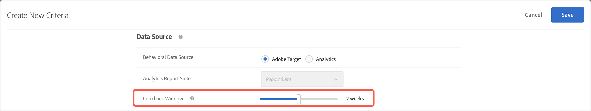

# Erstellen von Kriterien

Kriterien in [!UICONTROL Adobe Target] [!UICONTROL Recommendations] steuern den Inhalt Ihrer [!UICONTROL Recommendations]-Aktivitäten. Erstellen Sie Kriterien zur Anzeige der Empfehlungen, die am besten zu Ihrer Aktivität passen. Diese Kriterien verwenden die Aktionen des Besuchers, um zu bestimmen, welche Inhalte oder Produkte angezeigt werden sollen.

In den folgenden Abschnitten wird erläutert, wie Sie neue Kriterien erstellen.

## Aufrufen des Bildschirms Neue Kriterien erstellen

Sie haben viele Möglichkeiten, um auf den Bildschirm [!UICONTROL Neue Kriterien erstellen] zu gelangen. Einige Bildschirmoptionen variieren je nachdem, wie Sie auf den Bildschirm gelangen.

* Klicken Sie im Bildschirm **&#x200B;**&#x200B;> **[!UICONTROL Kriterien]** Bibliothek auf **[!UICONTROL Kriterien erstellen]** > **[!UICONTROL Kriterien erstellen]**. Kriterien, die Sie hier erstellen, stehen automatisch für alle [!DNL Recommendations]-Aktivitäten zur Verfügung.
* Wenn Sie eine [!DNL Recommendations] mit dem [!UICONTROL Visual Experience Composer] (VEC) erstellen, gelangen Sie sofort zum Bildschirm [!UICONTROL Kriterien auswählen], nachdem Sie ein Element auf Ihrer Seite ausgewählt haben und auf [!UICONTROL Mit Empfehlungen ersetzen], [!UICONTROL Empfehlungen einfügen vor] oder [!UICONTROL Empfehlungen einfügen nach] klicken. Sie können dann ein verfügbares Kriterium auswählen oder auf **[!UICONTROL Kriterien erstellen]** klicken. Wenn Sie neue Kriterien erstellen, haben Sie die Möglichkeit, Ihre Kriterien zur Verwendung mit anderen [!DNL Recommendations] Aktivitäten zu speichern. Weitere Informationen finden Sie unter [Erstellen einer Recommendations-Aktivität](/help/main/c-recommendations/t-create-recs-activity/create-recs-activity.md).
* Wenn Sie eine [!DNL Recommendations] bearbeiten, klicken Sie in ein Feld [!UICONTROL Recommendations-Speicherort] auf Ihrer Seite und wählen Sie **[!UICONTROL Kriterien ändern]** aus. Klicken Sie im [!UICONTROL Kriterien auswählen] auf **[!UICONTROL Kriterien erstellen]**. Sie können Ihre neuen Kriterien speichern, um Sie mit anderen [!DNL Recommendations]-Aktivitäten zu verwenden.

Bei den folgenden Schritten wird davon ausgegangen, dass Sie mit der ersten Methode auf [!UICONTROL &#x200B; Bildschirm „Neue Kriterien &#x200B;]&quot; zugreifen: der Bildschirm **[!UICONTROL Recommendations]** > **[!UICONTROL Kriterien]** Bibliothek .

1. Klicken Sie **[!UICONTROL Recommendations]** > **[!UICONTROL Kriterien]**.

1. Klicken Sie **[!UICONTROL Kriterien erstellen]** > **[!UICONTROL Kriterien erstellen]**.

1. Konfigurieren Sie die Informationen in den folgenden Abschnitten.

## [!UICONTROL Basisinformationen] {#info}

1. Geben Sie einen **[!UICONTROL Kriteriennamen]** ein.

   Dies ist der „interne“ Name, der für die Beschreibung der Kriterien verwendet wird. Sie möchten zum Beispiel Ihre Kriterien „Produkte mit der höchsten Marge“ nennen, Sie möchten jedoch nicht, dass dieser Titel öffentlich angezeigt wird. Sehen Sie sich den nächsten Schritt an, um den öffentlichen Titel festzulegen.

1. Geben Sie einen öffentlichen Titel **[!UICONTROL Titel anzeigen]** ein, der auf der Seite für alle Empfehlungen angezeigt werden soll, die diese Kriterien verwenden.

   So wäre es möglicherweise sinnvoll, „Personen, die das ansahen, sahen auch dies an“ oder „Ähnliche Produkte“ einzublenden, wenn Sie diese Kriterien zum Einblenden von Empfehlungen verwenden.

1. Geben Sie eine kurze **[!UICONTROL Beschreibung]** der Kriterien ein.

   Die Beschreibung sollte Ihnen dabei helfen, die Kriterien zu identifizieren, und kann Informationen über den Zweck der Kriterien enthalten.

1. Wählen Sie basierend auf den Zielen Ihrer Recommendations-Aktivität eine Branche aus.

   | Vertikaler Markt | Ziel |
   |--- |--- |
   | [!UICONTROL Retail/eCommerce] | Zum Kauf führende Konversion |
   | [!UICONTROL Lead-Generierung/B2B/Finanzdienstleistungen] | Konversion ohne Kauf |
   | [!UICONTROL Medien/Veröffentlichen] | Interaktion |

   Andere Kriterienoptionen ändern sich je nach ausgewählter Branchen-Vertikale.

1. Wählen Sie einen **[!UICONTROL Seitentyp]** aus.

   Verschiedene Seitentypen stehen zur Verfügung.

   Gemeinsam helfen Ihnen die Branchen- und Seitentypen dabei, Ihre gespeicherten Kriterien zu kategorisieren, wodurch die Wiederverwendung von Kriterien für andere [!DNL Recommendations]-Aktivitäten erleichtert wird.

## [!UICONTROL Empfehlungs-Algorithmus] {#rec-algo}

>[!CONTEXTUALHELP]
>id="target_recommendations_profile_attribute"
>title="Profilattribut"
>abstract="Sie können ein Profilattribut mithilfe von Profilskripts erstellen."

1. Wählen Sie einen **[!UICONTROL Algorithmustyp]** und **[!UICONTROL Algorithmus]**:

   

   | Algorithmustyp | Verwendung der verfügbaren Algorithmen / |
   | --- | --- |
   | [!UICONTROL Warenkorbbasiert] | Empfehlungen auf der Grundlage des Warenkorbinhalts des Benutzers aussprechen. <ul><li>[!UICONTROL Personen, die diese angesehen haben, haben auch Folgendes angesehen] </li><li>[!UICONTROL Personen, die diese angesehen haben, kauften auch]</li><li>[!UICONTROL Personen, die diese gekauft haben, kauften auch]</li></ul> |
   | [!UICONTROL Beliebtheitsbasiert] | Empfehlungen auf der Grundlage der allgemeinen Popularität eines Elements auf Ihrer Website oder auf der Grundlage der Popularität von Elementen innerhalb der Lieblings- oder am häufigsten angezeigten Kategorie, Marke, Genre usw. <ul><li>[!UICONTROL Am häufigsten auf der Website angezeigt]</li><li>[!UICONTROL Am häufigsten angezeigt nach Kategorie]</li><li>[!UICONTROL Am häufigsten angezeigt nach Elementattribut]</li><li>[!UICONTROL Topverkäufe auf der Website]</li><li>[!UICONTROL Topverkäufe nach Kategorie]</li><li>[!UICONTROL Topverkäufe nach Artikelattribut]</li><li>[!UICONTROL Am besten nach Analytics-Metrik]</li></ul> |
   | [!UICONTROL Elementbasiert] | Empfehlungen geben, basierend auf der Suche nach ähnlichen Elementen, die der Benutzer gerade anzeigt oder kürzlich angeschaut hat. <ul><li>[!UICONTROL Personen, die dies angesehen haben, haben dies angesehen]</li><li>[!UICONTROL Leute, die das angesehen haben, kauften das]</li><li>[!UICONTROL Personen, die das gekauft haben, kauften das]</li><li>[!UICONTROL Elemente mit ähnlichen Attributen]</li></ul> |
   | [!UICONTROL Benutzerbasiert] | Empfehlungen auf der Grundlage des Benutzerverhaltens aussprechen.<ul><li>[!UICONTROL Vor Kurzem aufgerufene Artikel]</li><li>[!UICONTROL Empfohlen für Sie]</li></ul> |
   | [!UICONTROL Benutzerdefinierte Kriterien] | Empfehlungen basierend auf einer benutzerdefinierten Datei, die Sie hochladen.<ul><li>Benutzerdefinierter Algorithmus</li></ul> |

   >[!NOTE]
   >
   >Bei Auswahl von **[!UICONTROL Elemente]**/ **[!UICONTROL Medien mit ähnlichen Attributen]** haben Sie die Möglichkeit, [Inhaltsähnlichkeitsregeln“ &#x200B;](#similarity).

1. Wählen Sie je nach Bedarf ein **Elementattribut** und **Profilattribut,** einen **Empfehlungsschlüssel**, **Filterschlüssel** und/oder **Analytics-Metrik**, um den Algorithmus zu konfigurieren.

Die restlichen Konfigurationsoptionen für den Algorithmus variieren je nach ausgewähltem Algorithmus. Um die Konfiguration des Algorithmus abzuschließen, wählen Sie einen [!UICONTROL Empfehlungsschlüssel], [!UICONTROL Filterschlüssel], [!UICONTROL Basis für gleichzeitiges Auftreten], [!UICONTROL Analytics-Metrik] und/oder [!UICONTROL Elementattribut] und [!UICONTROL Profilattribut, das abgeglichen werden soll].

Weitere Informationen zur Auswahl eines [!UICONTROL Empfehlungsschlüssels] finden Sie unter [Stützen der Empfehlung auf einen Empfehlungsschlüssel](/help/main/c-recommendations/c-algorithms/base-the-recommendation-on-a-recommendation-key.md).

## [!UICONTROL Inhalt sichern] {#content}

[!UICONTROL Inhalt sichern] Regeln bestimmen, was passiert, wenn die Anzahl der empfohlenen Elemente nicht Ihrem [Recommendations-Design](/help/main/c-recommendations/c-design-overview/design-overview.md) entspricht. Es ist möglich, dass [!DNL Recommendations] Kriterien weniger Empfehlungen zurückgeben als von Ihrem Design gefordert. Wenn Ihr Design beispielsweise Steckplätze für vier Elemente hat, Ihre Kriterien jedoch nur zwei Elemente verursachen, können Sie die verbleibenden Steckplätze leer lassen, Sie können Sicherungsempfehlungen verwenden, um die zusätzlichen Steckplätze zu füllen, oder Sie können festlegen, dass keine Empfehlungen angezeigt werden.

1. (Optional) Schieben Sie den Umschalter **[!UICONTROL Teilweises Design-Rendering]** auf die Position „Ein“.

   Es werden so viele Steckplätze wie möglich belegt, aber die Design-Vorlage enthält möglicherweise Leerzeichen für die verbleibenden Steckplätze. Wenn diese Option deaktiviert ist und nicht genügend Inhalt vorhanden ist, um alle verfügbaren Slots zu füllen, werden keine Empfehlungen bereitgestellt und stattdessen Standardinhalte angezeigt.

   Aktivieren Sie diese Option, wenn Empfehlungen mit leeren Slots bereitgestellt werden sollen. Verwenden Sie Sicherungsempfehlungen, wenn Sie möchten, dass Empfehlungs-Slots basierend auf Ihren Kriterien mit Inhalten gefüllt werden, wobei leere Slots mit ähnlichen oder beliebten Inhalten von Ihrer Site gefüllt werden, wie im nächsten Schritt erläutert.

1. (Optional) Schieben Sie den Umschalter **[!UICONTROL Sicherungsinhalt anzeigen]** auf die Position „ein“.

   Füllen Sie alle verbleibenden leeren Slots im Design mit einer zufälligen Auswahl der am häufigsten angezeigten Produkte aus Ihrer gesamten Site.

   Durch die Verwendung von Sicherungsempfehlungen wird sichergestellt, dass Ihr Empfehlungsentwurf alle verfügbaren Steckplätze ausfüllt. Angenommen, Sie haben ein 4 x 1-Design, wie unten dargestellt:

   

   Angenommen, Ihre Kriterien führen dazu, dass nur zwei Elemente empfohlen werden. Wenn Sie die Option [!UICONTROL Teilweises Design-Rendering] aktivieren, werden die ersten beiden Steckplätze belegt, aber die verbleibenden beiden Steckplätze bleiben leer. Wenn Sie jedoch die Option [!UICONTROL Sicherungsempfehlungen anzeigen] aktivieren, werden die ersten beiden Slots auf der Grundlage Ihrer angegebenen Kriterien und die verbleibenden zwei Slots auf der Grundlage Ihrer Sicherungsempfehlungen gefüllt.

   Die folgende Matrix zeigt das Ergebnis, das Sie bei Verwendung der Optionen [!UICONTROL Teilweises Design-Rendering] und [!UICONTROL Backup-Inhalt] sehen werden:

   | Teilweises Entwurfs-Rendering | Backup-Inhalt | Ergebnis |
   |--- |--- |--- |
   | Deaktiviert | Deaktiviert | Wenn weniger Empfehlungen zurückgegeben werden als im Entwurf vorgesehen, wird der Empfehlungsentwurf durch Standardinhalte ersetzt und es erscheinen keine Empfehlungen. |
   | Aktiviert | Deaktiviert | Der Entwurf wird gerendert, kann jedoch leere Positionen enthalten, falls weniger Empfehlungen zurückgegeben werden, als im Entwurf vorgesehen. |
   | Aktiviert | Aktiviert | Ersatzempfehlungen erscheinen an solchen leeren Positionen und vervollständigen den Entwurf. Sollte die Anwendung von Einschlussregeln auf die Ersatzempfehlungen die Anzahl an geeigneten Ersatzempfehlungen so stark einschränken, dass der Entwurf nicht vervollständigt werden kann, wird der Entwurf nur teilweise gerendert. In dem Fall, dass die Kriterien keine Empfehlungen zurückgeben und die Einschlussregeln die Ersatzempfehlungen auf null reduzieren, wird der Entwurf durch Standardinhalte ersetzt. |
   | Deaktiviert | Aktiviert | Ersatzempfehlungen erscheinen an solchen leeren Positionen und vervollständigen den Entwurf. Sollte die Anwendung von Einschlussregeln auf die Ersatzempfehlungen die Anzahl an geeigneten Ersatzempfehlungen so stark einschränken, dass der Entwurf nicht vervollständigt werden kann, wird der Entwurf durch Standardinhalte ersetzt und es werden keine Empfehlungen angezeigt. |

   Weitere Informationen finden Sie unter [Verwenden einer Sicherungsempfehlung](/help/main/c-recommendations/c-algorithms/backup-recs.md).

1. (Bedingt) Wenn Sie im vorherigen Schritt **[!UICONTROL Sicherungsinhalt anzeigen]** ausgewählt haben, können Sie **[!UICONTROL Einschlussregeln auf Sicherungsempfehlungen anwenden]** aktivieren.

   Einschlussregeln bestimmen, welche Elemente in Ihren Empfehlungen enthalten sind. Die verfügbaren Optionen hängen von Ihrem vertikalen Markt ab.

   Weitere Informationen finden Sie [&#x200B; „Einschlussregeln angeben](#inclusion) unten.

## [!UICONTROL Daten-Source] {#data-source}

1. Wählen Sie die gewünschte **[!UICONTROL Verhaltensdaten-Source]** aus: [!UICONTROL Adobe Target] oder [!UICONTROL Analytics].

   >[!NOTE]
   >
   >Der Abschnitt [!UICONTROL Verhaltensdaten-Source] wird nur angezeigt, wenn Ihre Implementierung [Analytics for Target](/help/main/c-integrating-target-with-mac/a4t/a4t.md) (A4T) verwendet.

   

   Wenn Sie sich für [!UICONTROL Analytics] entschieden haben, wählen Sie die gewünschte Report Suite.

   Wenn die Kriterien [!DNL Adobe Analytics] als Verhaltensdatenquelle verwenden, hängt der Zeitpunkt für die Verfügbarkeit der Kriterien davon ab, ob die ausgewählte Report Suite und das Lookback-Fenster für andere Kriterien verwendet wurde, wie unten erläutert:

   * **Einmalige Einrichtung der Report Suite**: Wenn eine Report Suite zum ersten Mal mit einem Datumsbereich-Lookback-Fenster verwendet wird, kann es zwei bis sieben Tage dauern, bis [!DNL Target Recommendations] die Verhaltensdaten für die ausgewählte Report Suite von [!DNL Analytics] vollständig heruntergeladen hat. Dieser Zeitrahmen hängt von der [!DNL Analytics] Systemlast ab.
   * **Neue oder bearbeitete Kriterien mit einer bereits verfügbaren Report Suite**: Wenn Sie ein neues Kriterium erstellen oder ein vorhandenes Kriterium bearbeiten und die ausgewählte Report Suite bereits mit [!DNL Target Recommendations] verwendet wurde und der Datumsbereich gleich oder kleiner als der ausgewählte Datumsbereich ist, sind die Daten unmittelbar verfügbar und es ist keine einmalige Einrichtung erforderlich. In diesem Fall oder wenn die Einstellungen eines Algorithmus bearbeitet werden, ohne dass die ausgewählte Report Suite oder der ausgewählte Datumsbereich geändert wird, wird der Algorithmus innerhalb von 12 Stunden ausgeführt bzw. erneut ausgeführt.
   * **Laufende Ausführung von Algorithmen**: Daten werden täglich von [!DNL Analytics] zu [!DNL Target Recommendations] übertragen. Bei der Empfehlung [!UICONTROL Angezeigte Affinität] wird beispielsweise beim Anzeigen eines Produkts durch einen Benutzer ein Tracking-Aufruf für die Produktansicht nahezu in Echtzeit an [!DNL Analytics] übergeben. Die [!DNL Analytics]-Daten werden am Morgen des nächsten Tages an [!DNL Target] gesendet und [!DNL Target] führt den Algorithmus in weniger als 12 Stunden aus.

   Weitere Informationen finden Sie unter [Verwenden von Adobe Analytics mit Target Recommendations](/help/main/c-recommendations/c-algorithms/use-adobe-analytics-with-recommendations.md).

1. Legen Sie das **[!UICONTROL Lookback-Fenster]** fest, um den Zeitbereich der verfügbaren historischen Benutzerverhaltensdaten zu bestimmen, die bei der Bestimmung der anzuzeigenden Empfehlungen verwendet werden sollen. Diese Option steht für alle Algorithmen mit Ausnahme von [!UICONTROL Elementen mit ähnlichen Attributen] und [!UICONTROL benutzerdefinierten Algorithmen] zur Verfügung.

   

   Wählen Sie ein kürzeres Datenfenster, wenn Ihre Site durch hohes Traffic-Aufkommen und häufig wechselndes Verhalten gekennzeichnet ist. Ein kürzeres Fenster ermöglicht es [!DNL Recommendations], besser auf Änderungen am Markt und in Ihrem Unternehmen zu reagieren. Ein kürzeres Fenster bedeutet zum Beispiel, dass [!DNL Recommendations] Änderungen im Besucherverhalten erkennt, wenn Ihre Besucher Saisoneinkäufe absolvieren - wie etwa zum Schulanfang oder zu Weihnachten –, und Artikel empfiehlt, die zur jeweiligen Einkaufssaison passen.

   Wenn Sie nur über wenige Daten verfügen oder das Besucherverhalten sich nur selten ändert, können Sie ein längeres Fenster auswählen. Für viele Sites führt ein kürzeres Fenster jedoch zu qualitativ hochwertigeren Empfehlungen.

   Die verfügbaren Datenbereiche sind:

   | Option „Lookback-Fenster“ | Aktualisierte Häufigkeit (wird beim Bewegen des Mauszeigers angezeigt) | Unterstützte Algorithmen |
   | --- | --- | --- |
   | Sechs Stunden | Algorithmus wird alle 3-6 Stunden ausgeführt | [!UICONTROL Beliebtheitsalgorithmen] wenn die ausgewählte [!UICONTROL Verhaltensdaten-Source] [!DNL Adobe Target] wird |
   | Ein Tag | Algorithmus wird alle 12-24 Stunden ausgeführt | [!UICONTROL Beliebtheitsbasierte] Algorithmen |
   | Zwei Tage | Algorithmus wird alle 12-24 Stunden ausgeführt | <ul><li>[!UICONTROL Beliebtheitsbasierte] Algorithmen</li><li>[!UICONTROL Elementbasierte] Algorithmen</li><li>[!UICONTROL Benutzerbasierte] Algorithmen</li><li>[!UICONTROL Warenkorb-basierte] Algorithmen</li></ul> |
   | Eine Woche | Algorithmus wird alle 24-48 Stunden ausgeführt | <ul><li>[!UICONTROL Beliebtheitsbasierte] Algorithmen</li><li>[!UICONTROL Elementbasierte] Algorithmen</li><li>[!UICONTROL Benutzerbasierte] Algorithmen</li><li>[!UICONTROL Warenkorb-basierte] Algorithmen</li></ul> |
   | Zwei Woche | Algorithmus wird alle 24-48 Stunden ausgeführt | <ul><li>[!UICONTROL Beliebtheitsbasierte] Algorithmen</li><li>[!UICONTROL Elementbasierte] Algorithmen</li><li>Alle [!UICONTROL benutzerbasierten] Algorithmen</li><li>[!UICONTROL Warenkorb-basierte] Algorithmen</li></ul> |
   | Ein Monat (30 Tage) | Algorithmus wird alle 24-48 Stunden ausgeführt | <ul><li>[!UICONTROL Beliebtheitsbasierte] Algorithmen</li><li>[!UICONTROL Elementbasierte] Algorithmen</li><li>[!UICONTROL Benutzerbasierte] Algorithmen</li><li>[!UICONTROL Warenkorb-basierte] Algorithmen</li></ul> |
   | Zwei Monate (61 Tage) | Algorithmus wird alle 24-48 Stunden ausgeführt | <ul><li>[!UICONTROL Beliebtheitsbasierte] Algorithmen</li><li>[!UICONTROL Elementbasierte] Algorithmen</li><li>[!UICONTROL Benutzerbasierte] Algorithmen</li><li>[!UICONTROL Warenkorb-basierte] Algorithmen</li></ul> |

## Ähnlichkeit von Inhalten {#similarity}

Verwenden Sie Regeln zur [!UICONTROL Ähnlichkeit von Inhalten] für die Bereitstellung von Empfehlungen basierend auf Artikeln oder Medienattributen.

>[!NOTE]
>
>Wenn Sie **[!UICONTROL Elementbasiert]**/**[!UICONTROL Medien mit ähnlichen Attributen]** wie [!UICONTROL Algorithmustyp] und [!UICONTROL Algorithmus] ausgewählt haben, können Sie Inhaltsähnlichkeitsregeln festlegen.

Mithilfe der Funktion für Ähnlichkeit von Inhalten werden Artikelattribut-Schlüsselwörter verglichen und Empfehlungen basierend darauf erstellt, wie viele Schlüsselwörter die verschiedenen Artikel gemeinsam haben. Empfehlungen, die auf der Ähnlichkeit von Inhalten basieren, benötigen für herausragende Ergebnisse keine historischen Daten.

Die Verwendung der Inhaltsähnlichkeit zum Generieren von Empfehlungen ist besonders effektiv für neue Elemente, die wahrscheinlich nicht in Empfehlungen angezeigt werden, wenn *Personen, die dies angesehen haben, auch angezeigt*, und andere Logiken basierend auf vergangenem Verhalten verwendet werden. Anhand der Ähnlichkeit von Inhalten können sinnvolle Empfehlungen für neue Benutzer erstellt werden, für die noch keine historischen Daten oder Einkäufe verzeichnet wurden.

Bei Auswahl von **[!UICONTROL Elementbasiert]**/ **[!UICONTROL Medien mit ähnlichen Attributen]** haben Sie die Möglichkeit, Regeln zu erstellen, um die Bedeutung bestimmter Elementattribute für die Bestimmung von Empfehlungen zu erhöhen oder zu verringern. Bei Artikeln wie beispielsweise Büchern möchten Sie möglicherweise die Bedeutung von Attributen wie *Genre*, *Autor*, *Serie* und so weiter hervorheben, um ähnliche Bücher zu empfehlen.

Da beim Vergleich der Ähnlichkeit von Inhalten Stichwörter verwendet werden, führen einige Attribute wie *Botschaft* oder *Beschreibung* zu einer Verwässerung der Vergleiche. Sie können daher Regeln erstellen, mit denen solche Attribute ignoriert werden.

Standardmäßig sind alle Attribute auf den Wert *Grundlinie* eingestellt. Sie müssen keine Regeln erstellen, wenn Sie diese Einstellung nicht ändern möchten.

>[!NOTE]
>
>Der Inhaltsähnlichkeits-Algorithmus kann beim Berechnen der Ähnlichkeit zwischen Elementen ein Zufallsstichprobe verwenden. Infolgedessen können die Ähnlichkeitsbewertungen zwischen Elementen zwischen den Algorithmusausführungen variieren.

## Einschlussregeln {#inclusion}

Mehrere Optionen ermöglichen es Ihnen, die in Ihren Empfehlungen angezeigten Elemente einzuschränken. Sie können Einschlussregeln beim Erstellen von Kriterien oder Promotions verwenden.

Einschlussregeln sind optional. Das Festlegen dieser Regeln jedoch ermöglicht Ihnen die bessere Steuerung der Artikel, die in Ihren Empfehlungen erscheinen. Jedes konfigurierte Detail schränkt die Anzeigekriterien weiter ein.

Beispiel: Sie können nur Damenschuhe anzeigen, deren Bestand über 50 und deren Preis zwischen 25 und 45 Euro liegt. Sie können auch jedes Attribut gewichten, sodass die für Ihr Unternehmen wichtigeren Artikel am ehesten angezeigt werden.

Weiteres Beispiel: Sie können Stellenangebote ausschließlich für Besucher Ihrer Website anzeigen, die aus bestimmten Orten stammen und über die erforderlichen Abschlüsse verfügen.

Die Optionen für die Einschlussregeln variieren je nach vertikalem Markt. Einschlussregeln werden standardmäßig auf Ersatzempfehlungen angewendet.

>[!IMPORTANT]
>
>Sie sollten mit Einschlussregeln vorsichtig umgehen. Sie sind nützlich, wenn Ihr Unternehmen beispielsweise mit Regeln arbeitet, die erfordern, dass eine Marke nicht empfohlen wird, während eine andere Marke gezeigt wird. Bei dieser Funktion kommt es jedoch zu Opportunitätskosten. Ein gewisser Lift-Prozentsatz geht möglicherweise verloren, wenn Artikel nicht angezeigt werden, die normalerweise durch die Aktivitätskriterien angezeigt werden würden.

Die Einschlussregeln werden mit „AND“ verbunden. Alle Regeln müssen erfüllt sein, damit ein Artikel in den Empfehlungen berücksichtigt wird.

Führen Sie zum Erstellen einer einfachen Einschlussregel die folgenden Schritte aus, um - wie im oben stehenden Beispiel - nur Damenschuhe mit einem Bestand von mehr als 50 und einem Preis von zwischen 25 und 45 € anzuzeigen.

1. (Bedingt) Schieben Sie die Folie **[!UICONTROL Zulassen, dass kürzlich gekaufte Artikel empfohlen werden?]** Schalten Sie in die „Ein“-Position.

   Diese Einstellung basiert auf `productPurchasedId`. Das Standardverhalten ist es, zuvor gekaufte Artikel nicht zu empfehlen. In den meisten Fällen ist es nicht sinnvoll, Artikel zu bewerben, die Kunden kürzlich gekauft haben. Es ist nützlich, wenn Sie Artikel verkaufen, die Kunden in der Regel nur einmal kaufen, zum Beispiel Kayaks. Wenn Sie Artikel verkaufen, die die Leute wiederholt zum Kauf zurückkommen, wie Shampoo oder andere persönliche Artikel, sollten Sie diese Option aktivieren.

1. Legen Sie einen Preisbereich für die Produkte fest, die Sie empfehlen möchten.
1. Legen Sie den Mindestbestand für die Produkte fest, die Sie empfehlen möchten.
1. Konfigurieren Sie die Empfehlung, um nur Artikel anzuzeigen, wenn sie bestimmte Kriterien erfüllen.

   Sie können angeben, dass Artikel nur berücksichtigt werden, wenn eines der Attribute in der Liste eine oder mehrere angegebene Bedingungen erfüllt oder nicht erfüllt.

   Die verfügbaren Auswerter sind von dem Wert abhängig, den Sie in der ersten Dropdownliste auswählen. Sie können mehrere Elemente auflisten. Diese Artikel werden durch ODER ausgewertet.

   Mehrere Regeln werden mit „AND“ kombiniert.

   >[!NOTE]
   >
   >Diese Option beschränkt die in der Empfehlung angezeigten Elemente. Sie hat keine Auswirkungen darauf, auf welchen Seiten die Empfehlung angezeigt wird. Um eine Einschränkung bezüglich der Anzeige der Empfehlung vorzunehmen, wählen Sie die Seiten im Experience Composer aus.

Weitere Informationen finden Sie unter [Verwenden dynamischer und statischer Einschlussregeln](/help/main/c-recommendations/c-algorithms/use-dynamic-and-static-inclusion-rules.md).

## Attributgewichtung {#weighting}

Sie können mehrere Regeln hinzufügen, um den Algorithmus basierend auf wichtigen Informationen oder Metadaten zum Inhaltskatalog „anzustoßen“, sodass bestimmte Elemente mit höherer Wahrscheinlichkeit angezeigt werden.

So haben Sie zum Beispiel die Möglichkeit, rabattierten Artikeln eine höherer Gewichtung zu verleihen, damit sie öfter in den Empfehlungen erscheinen. Artikel, die nicht Teil des Sonderangebots sind, werden nicht vollständig ausgeschlossen, jedoch weniger häufig angezeigt. Auf denselben Algorithmus können mehrere gewichtete Attribute angewendet werden und die gewichteten Attribute können mit dem in der Empfehlung aufgeteilten Traffic getestet werden.

1. Wählen Sie einen Wert aus.

   Der Wert bestimmt den Typ des Elements, das mit größerer Wahrscheinlichkeit und auf der Basis mehrerer verfügbarer Kriterien angezeigt wird.

1. Wählen Sie einen Auswerter.

1. Geben Sie das Keyword ein, um die Regelattribute abzuschließen.

   Die vollständige Regel könnte beispielsweise lauten: „Kategorie enthält Teilzeichenfolgen-Schuhe.“

1. Wählen Sie die Wertigkeit aus, die der Regel zugeordnet werden soll.

   Die Gewichtung kann von 0 bis 100 in 25er-Schritten eingestellt werden.

1. Fügen Sie nach Bedarf weitere Regeln hinzu.

Klicken Sie abschließend auf **[!UICONTROL Erstellen]**.

Wenn Sie eine neue [!UICONTROL Recommendations]-Aktivität erstellen oder eine bestehende bearbeiten, wird das Kontrollkästchen **[!UICONTROL Kriterien für später speichern]** automatisch aktiviert. Sollten Sie die Kriterien nicht in anderen Aktivitäten verwenden wollen, deaktivieren Sie das Kontrollkästchen, bevor Sie speichern.
