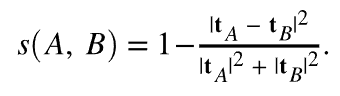

# Die Wissenschaft hinter den Empfehlungsalgorithmen von Target

Eine ausführliche Beschreibung der in [!DNL Adobe Target Recommendations] verwendeten Algorithmen, einschließlich der logischen und mathematischen Details des Modelltrainings und des Prozesses der Modellbereitstellung.

Modelltraining ist der Prozess, wie Empfehlungen von den [!DNL Adobe Target] Lernalgorithmen erzeugt werden. Mit der Modellbereitstellung werden [!DNL Target] Ihren Site-Besuchern Empfehlungen bereitstellen (auch als Inhaltsbereitstellung bezeichnet).

[!DNL Target] umfasst die folgenden Algorithmustypen in [!DNL Recommendations]:

* **Elementbasierte Algorithmen**: beinhalten Algorithmen, die der Logik folgen: „Personen, die diesen Artikel angesehen/gekauft haben, haben auch diese Artikel angesehen/gekauft.“ Diese Algorithmen sind unter dem Oberbegriff Item-Item-Collaborative-Filterung gruppiert, sowie [!UICONTROL Items with Similar Attributes].

* **Benutzerbasierte Algorithmen**: Schließen Sie die [!UICONTROL Recently Viewed] und [!UICONTROL Recommended for You] Algorithmen ein.

* **Beliebtheitsalgorithmen** Schließen Sie Algorithmen ein, die die am häufigsten angezeigten oder am häufigsten gekauften Artikel auf der Website oder die am häufigsten angezeigten oder am häufigsten gekauften Artikel nach Kategorie oder Artikelattribut zurückgeben.

* **Warenkorb-Algorithmen**: Schließen Sie auf mehreren Artikeln basierende Empfehlungen mit der Logik „Personen, die diese Artikel angesehen/gekauft haben, haben diese Artikel auch angesehen/gekauft“ ein.

* **Benutzerdefinierte Kriterien**: Schließen Sie Empfehlungen ein, die auf benutzerdefinierten Dateien basieren, die in [!DNL Target] hochgeladen wurden.

>[!NOTE]
>
>Weitere allgemeine Informationen zu den einzelnen Algorithmustypen und den einzelnen Algorithmen finden Sie unter [Stützen der Empfehlung auf einen Empfehlungsschlüssel](/help/main/c-recommendations/c-algorithms/base-the-recommendation-on-a-recommendation-key.md).

Viele der oben aufgeführten Algorithmen basieren auf dem Vorhandensein eines oder mehrerer Schlüssel. Diese Schlüssel werden verwendet, um ähnliche Elemente zum Zeitpunkt der Inhaltsbereitstellung abzurufen (wenn Empfehlungen gegeben werden). Kundenspezifische Schlüssel können den aktuellen Artikel, den eine Person anzeigt, den zuletzt angezeigten oder gekauften Artikel, den am häufigsten angezeigten Artikel, die aktuelle Kategorie oder die Favoritenkategorie für diesen Besucher enthalten. Andere Algorithmen, wie z. B. Warenkorb- oder benutzerbasierte Empfehlungen, verwenden implizite Schlüssel (die vom Kunden nicht konfiguriert werden können). Weitere Informationen finden Sie unter *Empfehlungsschlüssel* in &quot;[ der Empfehlung auf einen Empfehlungsschlüssel](/help/main/c-recommendations/c-algorithms/base-the-recommendation-on-a-recommendation-key.md#keys). Beachten Sie jedoch, dass diese Schlüssel nur zur Modellbereitstellungszeit relevant sind (Inhaltsbereitstellung). Diese Schlüssel wirken sich nicht auf die Logik der „Offline“- oder Modell-Trainingszeit aus.

In den folgenden Abschnitten werden Algorithmen etwas anders gruppiert als die oben beschriebenen Algorithmustypen. Die folgende Gruppierung basiert auf der Ähnlichkeit der Modell-Trainings-Logik.

## Partizipatives Filtern nach Elementen

Zu den Algorithmen gehören:

* [!UICONTROL People Who Viewed This, Viewed That]
* [!UICONTROL People Who Viewed This, Bought That]
* [!UICONTROL People Who Bought This, Bought That]

Algorithmen für kollaborative Filterempfehlungen für Elemente basieren auf der Idee, dass Sie die Verhaltensmuster vieler Benutzer verwenden sollten (daher „kollaborativ„), um nützliche Empfehlungen für ein bestimmtes Element bereitzustellen (z. B. Filtern des Katalogs möglicher zu empfehlender Elemente). Obwohl es viele verschiedene Algorithmen gibt, die unter den allgemeinen Dach der [kollaborativen Filterung](https://en.wikipedia.org/wiki/Collaborative_filtering) fallen, verwenden diese Algorithmen universell verhaltensbezogene Datenquellen als Eingaben. [!DNL Target Recommendations] sind diese Eingaben die individuellen Ansichten und Käufe von Artikeln durch Benutzende.

Für den Algorithmus „Personen, die diesen Artikel angesehen/gekauft haben, haben auch diese Artikel angesehen/gekauft“ besteht das Ziel darin, eine Ähnlichkeit (A,B) zwischen allen Artikelpaaren zu berechnen. Für ein bestimmtes Element A werden die wichtigsten Empfehlungen dann nach ihrer Ähnlichkeit (A, B) sortiert.

Ein Beispiel für eine solche Ähnlichkeit ist das gleichzeitige Auftreten von Artikeln: eine einfache Zählung der Anzahl der Benutzer, die beide Artikel gekauft haben. Obwohl intuitiv, ist eine solche Metrik insofern naiv, als sie darauf ausgerichtet ist, beliebte Elemente zu empfehlen. Wenn zum Beispiel in einem Lebensmittelgeschäft in retailer die meisten Leute Brot kaufen, gibt es Brot in hohem Maße gleichzeitig mit allen Artikeln, aber es ist nicht unbedingt eine gute Empfehlung. [!DNL Target] verwendet stattdessen eine komplexere Ähnlichkeitsmetrik namens Log Likelihood Ratio (LLR). Diese Größe ist groß, wenn die Wahrscheinlichkeit des gleichzeitigen Auftretens von zwei Elementen, A und B, sehr unterschiedlich zu der Wahrscheinlichkeit ist, dass sie nicht gleichzeitig auftreten. Zur Konkretisierung sollten Sie einen Fall des [!UICONTROL People Who Viewed This, Bought That] Algorithmus betrachten. Die LLR-Ähnlichkeit ist groß, wenn die Wahrscheinlichkeit, dass B gekauft wurde, *nicht* unabhängig davon ist, ob jemand A betrachtet hat.

Wenn z. B.

dann sollte Element B nicht mit Element A empfohlen werden. Die vollständigen Details dieser Ähnlichkeitsberechnung des Log-Wahrscheinlichkeitsverhältnisses sind [dieser PDF) ](/help/main/c-recommendations/c-algorithms/assets/log-likelihood-ratios-recommendation-algorithms.pdf).

Der logische Ablauf der tatsächlichen Algorithmimplementierung wird im folgenden Diagramm dargestellt:

Die Einzelheiten dieser Schritte lauten wie folgt:

* **Eingabedaten**: Verhaltensdaten in Form von Ansichten und Käufen von Besucherinnen und Besuchern, die beim [Implementieren von Target](https://experienceleague.adobe.com/docs/target-dev/developer/recommendations.html?lang=de){target=_blank} oder von [Adobe Analytics erfasst ](/help/main/c-recommendations/c-algorithms/use-adobe-analytics-with-recommendations.md){target=_blank}.

* **Modell-**:

   * **Datenbereinigung und -**: Bei Algorithmen mit einem N-tägigen Lookback werden die Verhaltensdaten zunächst so gefiltert, dass nur die N Tage der Daten einbezogen werden. Sammlungsregeln und globale Ausschlüsse werden dann angewendet, um alle Elemente zu entfernen, die nicht empfohlen werden sollten. Schließlich werden bei allen Besuchern, die mit mehr als 1.000 Elementen interagiert haben, die Nutzungsdaten nur auf 1.000 Elemente gesampelt.
   * **Berechnung der Elementähnlichkeit**: Dies ist der wichtigste Berechnungsschritt: Berechnung der Ähnlichkeit des Log-Wahrscheinlichkeitsverhältnisses zwischen allen möglichen Elementpaaren und Rangfolge der Elementpaare nach diesem Ähnlichkeitswert.
   * **Offline-**: Schließlich werden alle weiteren anwendbaren dynamischen Filter angewendet (z. B. dynamische Kategorieausschlüsse). Nach diesem Schritt werden vorberechnete Empfehlungen global zwischengespeichert, um für die Bereitstellung verfügbar zu sein.

* **Modellbereitstellung**: Recommendations-Inhalte werden vom globalen &quot;Edge[!DNL Target]Netzwerk“ von [ bereitgestellt](/help/main/c-intro/how-target-works.md#concept_0AE2ED8E9DE64288A8B30FCBF1040934). Wenn Mbox-Anfragen an [!DNL Target] gesendet werden und festgelegt wird, dass Recommendations-Inhalte an die Seite gesendet werden sollen, wird die Anfrage für den entsprechenden [Elementschlüssel](/help/main/c-recommendations/c-algorithms/base-the-recommendation-on-a-recommendation-key.md#keys) für den Recommendations-Algorithmus entweder aus der Anfrage analysiert oder aus dem Benutzerprofil nachgeschlagen und dann zum Abrufen der in den vorherigen Schritten berechneten Recommendations verwendet. Zu diesem Zeitpunkt werden weitere dynamische Filter angewendet, bevor das entsprechende [Design](/help/main/c-recommendations/c-design-overview/create-design.md) gerendert wird.

## Ähnlichkeit des Inhalts

Enthaltener Algorithmus:

* [!UICONTROL Items with Similar Attributes]

Bei diesem Algorithmustyp werden zwei Elemente als miteinander verbunden betrachtet, wenn ihre Namen und Textbeschreibungen semantisch ähnlich sind. Im Gegensatz zu den meisten Recommendations-Algorithmen, in denen Verhaltensdatenquellen verwendet werden müssen, verwenden Inhaltsähnlichkeits-Algorithmen Metadaten aus Produktkatalogen, um die Ähnlichkeit zwischen Elementen abzuleiten. [!DNL Target] ist daher in der Lage, Empfehlungen in so genannten „Kaltstart“-Szenarien voranzutreiben, in denen keine Verhaltensdaten erfasst wurden (z. B. zu Beginn einer [!DNL Target]).

Obwohl die Aspekte der Modellbereitstellung und Inhaltsbereitstellung der Inhaltsähnlichkeitsalgorithmen von [!DNL Target] mit anderen artikelbasierten Algorithmen identisch sind, sind die Modellschulungsschritte völlig unterschiedlich und umfassen eine Reihe von Vorverarbeitungs- und Verarbeitungsschritten für natürliche Sprache, wie im folgenden Diagramm dargestellt. Der Kern der Ähnlichkeitsberechnung ist die Verwendung der Kosinusähnlichkeit von modifizierten tf-idf-Vektoren, die jedes Element im Katalog darstellen.

Die Einzelheiten dieser Schritte lauten wie folgt:

* **Eingabedaten**: Dieser Algorithmus basiert, wie zuvor beschrieben, ausschließlich auf Katalogdaten (die über einen -Katalog[!DNL Target]Feed, die Entitäten-API oder aus Aktualisierungen auf der Seite in [ aufgenommen ](https://experienceleague.adobe.com/docs/target-dev/developer/recommendations.html?lang=de){target=_blank}.

* **Modell-**:

   * **Attributextraktion**: Nach der Anwendung regulärer statischer Filter, Katalogregeln und globaler Ausschlüsse extrahiert dieser Algorithmus relevante Textfelder aus dem Entitätsschema. [!DNL Target] verwendet automatisch die Felder Name, Nachricht und Kategorie aus den Entitätsattributen und versucht, Zeichenfolgenfelder aus benutzerdefinierten (Entitätsattributen[ zu ](/help/main/c-recommendations/c-products/entity-attributes.md). Dieser Prozess erfolgt, indem sichergestellt wird, dass die meisten Werte für dieses Feld nicht als Zahl, Datum oder Boolesch parabel werden können.
   * **Stemmen und Entfernen von Stoppwörtern**: Für eine genauere Textähnlichkeitsübereinstimmung ist es ratsam, sehr gängige „Stopp“-Wörter zu entfernen, die die Bedeutung eines Elements nicht wesentlich ändern (z. B. „was“, „ist“, „and“ usw.). In ähnlicher Weise bezieht sich das Wortstammen auf den Prozess, Wörter mit unterschiedlichen Suffixen auf ihr Stammwort zu reduzieren, das eine identische Bedeutung hat (z. B. haben „connect“, „connector“ und „connection“ alle dasselbe Stammwort: „connect„). [!DNL Target] verwendet den Schneeballstamm. [!DNL Target] führt zuerst die automatische Spracherkennung durch und kann die Wortentfernung für bis zu 50 Sprachen und das Stemmen für 18 Sprachen stoppen.
   * **N-Gramm-Erstellung**: Nach den vorherigen Schritten wird jedes Wort als Token behandelt. Der Prozess des Kombinierens zusammenhängender Sequenzen von Token zu einem einzigen Token wird als n-Gram-Erstellung bezeichnet. Die Algorithmen von [!DNL Target] berücksichtigen bis zu 2 Gramm.
   * **tf-idf computation**: Der nächste Schritt umfasst die Erstellung von tf-idf-Vektoren, um die relative Bedeutung von Token in der Artikelbeschreibung widerzuspiegeln. Für jedes Token/jeden Begriff in einem Element i in einem Katalog D mit |D| Als Erstes wird die Termfrequenz TF(t, i) berechnet (die Anzahl, wie oft der Term in der Item i) erscheint, sowie die Dokumentenfrequenz DF(t, D). Im Wesentlichen die Anzahl der Elemente, in denen das Token vorhanden ist. Die tf-idf-Kennzahl wird dann

     

     [!DNL Target] verwendet die Implementierung der Funktionen von *tf-idf* von Apache Spark, bei der jedes Token im Hintergrund auf ein Leerzeichen von 218 Token hasht. In diesem Schritt wird auch eine kundenspezifische Attributverstärkung und -vergrabung angewendet, indem die Begriffsfrequenzen in jedem Vektor auf der Grundlage der in den [ angegebenen Einstellungen angepasst ](/help/main/c-recommendations/c-algorithms/create-new-algorithm.md#similarity).

   * **Berechnung der Artikelähnlichkeit**: Die letzte Berechnung der Artikelähnlichkeit erfolgt mit einer ungefähren Kosinusähnlichkeit. Für die beiden Positionen *A* und *B* mit den Vektoren tA und tB wird die Kosinusähnlichkeit wie folgt definiert:

     

     Um eine erhebliche Komplexität bei der Berechnung der Ähnlichkeiten zwischen allen N x N Elementen zu vermeiden, wird der *tf-idf*-Vektor abgeschnitten, sodass er nur die größten 500 Einträge enthält, und dann werden Kosinusähnlichkeiten zwischen Elementen mithilfe dieser abgeschnittenen Vektordarstellung berechnet. Dieser Ansatz erweist sich bei dünnen Vektorähnlichkeitsberechnungen als robuster im Vergleich zu anderen Ann-Techniken (Approximate Nearest Neighbor), wie z. B. lokalitätsempfindliches Hashing.

   * **Modellbereitstellung**: Dieser Prozess ist identisch mit den im vorherigen Abschnitt beschriebenen kollaborativen Filtertechniken für Elemente.

## Empfehlungen mit mehreren Schlüsseln

Zu den Algorithmen gehören:

* Warenkorb-basierte Empfehlungen
* [!UICONTROL Recommended For You]

Die neuesten Ergänzungen der [!DNL Target] Suite von Recommendations-Algorithmen sind [!UICONTROL Recommended For You] und eine Reihe von Warenkorb-basierten Recommendations-Algorithmen. Beide Algorithmustypen verwenden kollaborative Filtertechniken, um individuelle, auf Elementen basierende Empfehlungen zu erstellen. Zur Laufzeit werden dann mehrere Elemente im Browser-Verlauf (z. B. [!UICONTROL Recommended For You]) des Benutzers oder der aktuelle Warenkorb des Benutzers (für Warenkorb-basierte Recommendations) verwendet, um diese auf Elementen basierenden Recommendations abzurufen, die dann zur endgültigen Liste der Recommendations zusammengeführt werden. Beachten Sie, dass es viele Varianten personalisierter Empfehlungsalgorithmen gibt. Die Wahl eines Algorithmus mit mehreren Schlüsseln bedeutet, dass Empfehlungen sofort verfügbar sind, nachdem ein Besucher einen Navigationsverlauf hat, und dass Empfehlungen aktualisiert werden können, um auf das neueste Besucherverhalten zu reagieren.

Diese Algorithmen bauen auf den grundlegenden kollaborativen Filtertechniken auf, die im Abschnitt Elementbasierte Empfehlungen beschrieben werden, enthalten jedoch auch eine Hyperparameteroptimierung, um die optimale Ähnlichkeitsmetrik zwischen Elementen zu ermitteln. Der Algorithmus führt eine chronologische Aufteilung der Verhaltensdaten für jede Benutzerin und jeden Benutzer durch und trainiert Empfehlungsmodelle für die früheren Daten, während versucht wird, die Elemente vorherzusagen, die eine Benutzerin oder ein Benutzer später ansieht oder kauft. Anschließend wird die Ähnlichkeitsmetrik ausgewählt, die die optimale [mittlere durchschnittliche Genauigkeit]&#x200B;(https://en.wikipedia.org/wiki/Evaluation_measures_(information_retrieval)) ergibt.

Die Logik der Schritte zum Trainieren und Bewerten von Modellen wird im folgenden Diagramm dargestellt:

Die Einzelheiten dieser Schritte lauten wie folgt:

* **Eingabedaten**: Dies ist identisch mit den Methoden für das kollaborative Filtern (CF) nach Elementen. [!UICONTROL Both Recommended For You]- und Warenkorbalgorithmen verwenden Verhaltensdaten in Form von Ansichten und Käufen von Benutzenden, die beim Implementieren von [Target](https://experienceleague.adobe.com/docs/target-dev/developer/recommendations.html?lang=de){target=_blank} oder von [Adobe Analytics erfasst ](/help/main/c-recommendations/c-algorithms/use-adobe-analytics-with-recommendations.md){target=_blank}.

* **Modell-**:

   * **Datenbereinigung und -**: Dies ist wieder dasselbe wie bei kollaborativen Filtermethoden, bei denen das Lookback-Fenster angewendet wird, um Verhaltensdaten nach einem geeigneten Datumsbereich zu filtern, gefolgt von der Anwendung von Katalogregeln und globalen Ausschlüssen. Bei Besucherinnen und Besuchern, die mit mehr als 1.000 Elementen interagiert haben, werden nur die letzten 1.000 Anwendungen berücksichtigt.
   * **Testaufspaltung trainieren**: Führen Sie eine chronologische Aufspaltung der Nutzung für jeden Benutzer durch und weisen Sie die ersten 80 % seiner Nutzung Schulungsdaten zu, während die restlichen 20 % den Testdaten zugewiesen werden.
   * **Modell-Training für die Artikelähnlichkeit**: Die Berechnung der Artikelähnlichkeit im Kern unterscheidet sich bei [!UICONTROL Recommended For You] und Warenkorb-basierten Algorithmen in der Art und Weise, wie Vektoren für mögliche Artikel konstruiert werden. [!UICONTROL Recommended For You] haben die Artikelvektoren die Dimension NUsers, wobei jeder Eintrag die Summe der impliziten Bewertungen für diesen Benutzer des Artikels darstellt - Käufe eines Artikels erhalten eine Gewichtung von 2x der der Ansichten des Artikels. Bei Empfehlungen auf Warenkorbbasis verfügen die Elementvektoren über binäre Einträge. Wenn nur das Verhalten innerhalb einer Sitzung berücksichtigt werden soll, gibt es für jede Sitzung einen neuen Eintrag. Andernfalls gibt es für jeden Besucher einen Eintrag in diesem Elementvektor.

  Im Trainingsschritt werden mehrere Typen von Vektorähnlichkeiten berechnet: LLR-Ähnlichkeit ([ hier erörtert](/help/main/c-recommendations/c-algorithms/assets/log-likelihood-ratios-recommendation-algorithms.pdf)), Kosinusähnlichkeit (zuvor definiert) und eine normalisierte L2-Ähnlichkeit, definiert als:

  

   * **Bewertung des Elementähnlichkeitsmodells**: Die Modellevaluierung erfolgt anhand der im vorherigen Schritt generierten Empfehlungen und anhand von Prognosen zum Testdatensatz. Die Online-Bewertungsphase wird nachgeahmt, indem die Elementnutzung jedes Benutzers im Testdatensatz chronologisch sortiert und dann 100 Empfehlungen für sortierte Untergruppen von Elementen gegeben werden, um spätere Ansichten und Käufe vorherzusagen. Eine Metrik zum Abrufen von Informationen, [Mean Average Precision]&#x200B;(https://en.wikipedia.org/wiki/Evaluation_measures_(information_retrieval)), wird verwendet, um die Qualität dieser Empfehlungen zu bewerten. Diese Metrik berücksichtigt die Reihenfolge der Empfehlungen und bevorzugt relevante Elemente weiter oben in der Liste der Empfehlungen, die eine wichtige Eigenschaft für Rangfolgesysteme ist.
   * **Modellauswahl**: Nach der Offline-Auswertung wird das Modell mit der höchsten mittleren Genauigkeit ausgewählt und alle individuellen Element-Element-Empfehlungen werden dafür berechnet.
   * **Offline-**: Die letzte Phase des Modelltrainings ist die Anwendung aller anwendbaren dynamischen Filter. Nach diesem Schritt werden vorberechnete Empfehlungen global zwischengespeichert, um für die Bereitstellung verfügbar zu sein.

* **Modellbereitstellung**: Im Gegensatz zu vorherigen Algorithmen, bei denen Bereitstellungsempfehlungen das Angeben eines einzelnen Schlüssels zum Abrufen und die nachfolgende Anwendung von Geschäftsregeln beinhalten, verwenden die [!UICONTROL Recommended for You]- und Warenkorb-basierten Algorithmen einen komplexeren Laufzeitprozess.

   * **Abrufen und Zusammenführen mehrerer Schlüssel**: Bei auf dem Warenkorb basierenden Empfehlungen werden bis zu zehn Artikel, die im Warenkorb übergeben werden, als Schlüssel für den Abruf betrachtet, und die Empfehlungen von jedem werden gleich gewichtet. [!UICONTROL Recommended for You] werden bis zu den letzten fünf Einzelposten betrachtet, die angezeigt werden, und die letzten fünf Einzelposten werden als Schlüssel zum Abruf betrachtet, wobei Empfehlungen, die aus gekauften Artikeln entstehen, doppelt so gewichtet werden wie Empfehlungen, die aus angezeigten Artikeln entstehen. Wenn beim Zusammenführen von Recommendations ein Element in mehreren individuellen Listen von Recommendations angezeigt wird, werden seine gewichteten Ähnlichkeitsbewertungen hinzugefügt. Die endgültige Liste der Empfehlungen aus dieser Phase ist dann die zusammengeführte Liste der neu gewichteten Empfehlungen, sortiert in absteigender Reihenfolge.
   * **Filtern** Als Nächstes werden Filterregeln wie das Entfernen zuvor angezeigter und/oder gekaufter Artikel sowie andere dynamische Geschäftsregeln angewendet.

Diese Prozesse werden in der folgenden Abbildung veranschaulicht, in der ein Besucher Artikel A und Artikel B angesehen hat. Einzelne Empfehlungen werden mit den Offline-Ähnlichkeitsbewertungen abgerufen, die unter den einzelnen Artikelbeschriftungen angezeigt werden. Nach dem Abrufen werden die Empfehlungen mit den summierten gewichteten Ähnlichkeitsbewertungen zusammengeführt. In einem Szenario, in dem der Kunde angegeben hat, dass zuvor angezeigte und gekaufte Artikel herausgefiltert werden müssen, entfernt der Filterschritt schließlich die Artikel A und B aus der Liste der Empfehlungen.

## Beliebtheitsbasiert

Zu den Algorithmen gehören:

* [!UICONTROL Most Viewed Across the Site]
* [!UICONTROL Most Viewed by Category]
* [!UICONTROL Most Viewed by Item Attribute]
* [!UICONTROL Top Sellers Across the Site]
* [!UICONTROL Top Sellers by Category]
* [!UICONTROL Top Sellers by Item Attribute]

[!DNL Target] bietet Beliebtheitsalgorithmen für die am häufigsten angezeigten Elemente sowie für die meistverkauften Elemente, entweder auf einer Website oder aufgeschlüsselt nach Artikelattribut oder Kategorie. Popularitätsbasierte Algorithmen ordnen Elemente basierend auf der Anzahl der Sitzungen, in denen dieses Element in einem bestimmten Zeitrahmen angezeigt oder gekauft wurde.

Alle diese Algorithmen kombinieren aggregierte Verhaltensdaten, bei denen die Gesamtzahl der Sitzungen, in denen Artikel angezeigt und gekauft wurden, sowohl in stündlichen als auch in täglichen Auflösungen aufgezeichnet wird. Einzelne Algorithmen finden dann die am häufigsten angezeigten oder gekauften Artikel für das vom Kunden konfigurierte Lookback-Fenster.

Die einzelnen Algorithmusnuancen lauten wie folgt:

* [!UICONTROL Most Viewed Across the Site] und [!UICONTROL Top Sellers Across the Site] ordnen Artikel nach der Gesamtzahl der Sitzungen, in denen diese Artikel angezeigt bzw. gekauft wurden. Die Ausgabe ist eine einzelne (schlüssellose) Liste empfohlener Elemente.
* Die am häufigsten angezeigten/Topverkäufe nach Kategorie-/Artikelattribut sind Empfehlungen, bei denen Artikel nach der aggregierten Anzahl der Sitzungen sortiert werden, in denen diese Artikel angezeigt oder gekauft wurden, jedoch nach Artikelkategorie oder spezifischem Artikelattribut gruppiert sind. Die Ergebnisse sind Listen empfohlener Elemente, die durch Werte von Kategorien oder Werte von Elementattributen verschlüsselt sind.

## Kürzlich angesehen

Der Algorithmus für „kürzlich angezeigte“ Empfehlungen ermöglicht die Personalisierung von Empfehlungen während der Sitzung. Dieser Algorithmus erfordert kein Offline-„Modell-Training“. Stattdessen verwendet [!DNL Target] das eindeutige [Besucherprofil](/help/main/c-target/c-visitor-profile/visitor-profile.md), um eine laufende Liste der Elemente zu verwalten, die in einer bestimmten Sitzung angezeigt wurden, und kann diese Elemente in Recommendations-Aktivitäten einblenden. Dies ermöglicht Echtzeit-Aktualisierungen an Recommendations und die Personalisierung der nächsten Seite.

## Benutzerdefinierte Kriterien

Benutzerdefinierte Kriterien ermöglichen es Kunden, [ihre eigenen Empfehlungen in hochzuladen [!DNL Target]](/help/main/c-recommendations/c-algorithms/recommendations-csv.md) was wichtige Flexibilität bietet und Funktionen für „Ihr eigenes Modell mitbringen“ ermöglicht. Benutzerdefinierte Kriterien ersetzen den Teil „Offline-Schulung“ [!UICONTROL Item-Based] Empfehlungen, verhalten sich jedoch ähnlich wie Elementbasierte Empfehlungsalgorithmen während der Phase der Bereitstellung von Online-Inhalten, da ein einzelner Schlüssel zum Abrufen von Empfehlungen verwendet wird und dann Geschäftsregeln/Filter angewendet werden.
