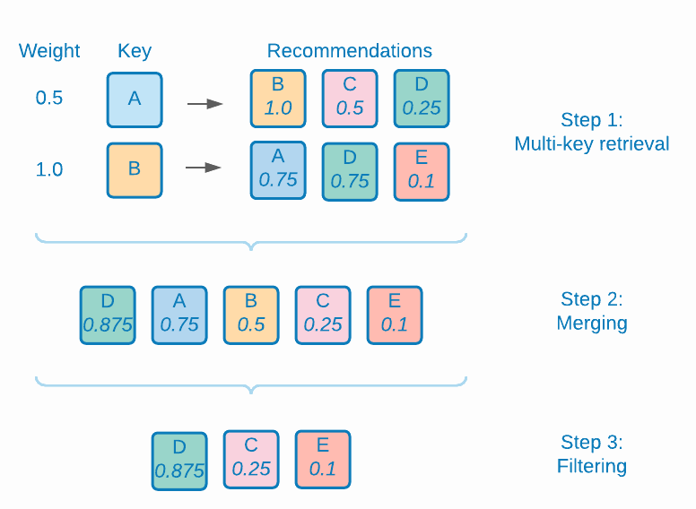

#  Die Wissenschaft hinter den Empfehlungsalgorithmen von Target

Eine ausführliche Beschreibung der in [!DNL Adobe Target Recommendations], einschließlich der Logik und mathematischen Details der Modellschulung und des Prozesses der Modellbereitstellung.

Modellschulung ist der Prozess, wie Empfehlungen von der [!DNL Adobe Target] Lernalgorithmen. So wird eine Modellbereitstellung bereitgestellt [!DNL Target] stellt Empfehlungen für Ihre Site-Besucher bereit (auch als Inhaltsbereitstellung bezeichnet).

[!DNL Target] umfasst die folgenden allgemeinen Typen von Algorithmen in [!DNL Recommendations]:

* **Elementbasierte Algorithmen**: Fügen Sie Algorithmen hinzu, die der Logik folgen: &quot;Personen, die diesen Artikel angesehen/gekauft haben, haben auch diese Artikel angesehen/gekauft.&quot; Diese Algorithmen werden unter dem Dachbegriff kollaboratives Filtern von Element zu Element gruppiert sowie [!UICONTROL Elemente mit ähnlichen Attributen] Algorithmen.

* **Benutzerbasierte Algorithmen**: Fügen Sie die [!UICONTROL Kürzlich angezeigt] und [!UICONTROL Empfohlen für Sie] Algorithmen.

* **Popularitätsbasierte Algorithmen**: Binden Sie Algorithmen ein, die die am häufigsten angezeigten oder die am häufigsten gekauften Artikel auf der gesamten Website zurückgeben, oder am häufigsten angezeigt oder am häufigsten gekauft nach Kategorie oder Artikelattribut.

* **Warenkorbbasierte Algorithmen**: Schließen Sie auf mehreren Artikeln basierende Empfehlungen mit der Logik ein: &quot;Personen, die diese Artikel angesehen/gekauft, auch diese Artikel angesehen/gekauft haben.&quot;

* **Benutzerdefinierte Kriterien**: Einschließen von Empfehlungen basierend auf benutzerdefinierten Dateien, die in hochgeladen wurden [!DNL Target].

>[!NOTE]
>
>Allgemeine Informationen zu den einzelnen Algorithmustypen und den einzelnen Algorithmen finden Sie unter [Stützen der Empfehlung auf einen Empfehlungsschlüssel](/help/main/c-recommendations/c-algorithms/base-the-recommendation-on-a-recommendation-key.md).

Viele der oben aufgeführten Algorithmen basieren auf einem oder mehreren Schlüsseln. Mit diesen Schlüsseln werden ähnliche Elemente zum Zeitpunkt der Inhaltsbereitstellung (wenn Empfehlungen abgegeben werden) abgerufen. Kundenspezifische Schlüssel können das aktuelle Element, das von einem Besucher angezeigt wird, das zuletzt angezeigte oder gekaufte Element, das am häufigsten angezeigte Element, die aktuelle Kategorie oder die bevorzugte Kategorie für diesen Besucher enthalten. Andere Algorithmen, wie z. B. auf dem Warenkorb basierende oder benutzerbasierte Empfehlungen, verwenden implizite Schlüssel (die vom Kunden nicht konfiguriert werden können). Weitere Informationen finden Sie unter *Empfehlungsschlüssel* in [Stützen der Empfehlung auf einen Empfehlungsschlüssel](/help/main/c-recommendations/c-algorithms/base-the-recommendation-on-a-recommendation-key.md#keys). Beachten Sie jedoch, dass diese Schlüssel nur zur Modellbereitstellungszeit (Inhaltsbereitstellung) relevant sind. Diese Schlüssel wirken sich nicht auf die &quot;Offline&quot;- oder Modell-Trainings-Zeitlogik aus.

In den folgenden Abschnitten werden Algorithmen etwas anders gruppiert als die oben beschriebenen Algorithmustypen. Die folgende Gruppierung basiert auf der Ähnlichkeit der Trainings-Logik des Modells.

## Partizipative Filterung nach Elementen

Zu den Algorithmen gehören:

* [!UICONTROL Personen, die das ansahen, sahen auch dies an]
* [!UICONTROL Personen, die das ansahen, kauften dies]
* [!UICONTROL Personen, die das kauften, kauften dies]

Empfehlungsalgorithmen für das partizipative Filtern von Elementen basieren auf der Idee, dass Sie die Verhaltensmuster vieler Benutzer (daher kollaborativ) verwenden sollten, um nützliche Empfehlungen für ein bestimmtes Element bereitzustellen (z. B. Filtern des Katalogs möglicher Artikel, die empfohlen werden sollen). Obwohl es viele verschiedene Algorithmen gibt, die unter den allgemeinen Rahmen von [kollaboratives Filtern](https://en.wikipedia.org/wiki/Collaborative_filtering)verwenden diese Algorithmen allgemein Verhaltensdatenquellen als Eingaben. In [!DNL Target Recommendations], sind diese Eingaben die individuellen Ansichten und Käufe von Artikeln durch Benutzer.

Für den Algorithmus &quot;Personen, die diesen Artikel angesehen/gekauft haben, haben auch diese Artikel angesehen/gekauft&quot;besteht das Ziel darin, eine Ähnlichkeit (A,B) zwischen allen Artikelpaaren zu berechnen. Für einen bestimmten Artikel A werden die wichtigsten Empfehlungen dann nach ihrer Ähnlichkeit s (A, B) geordnet.

Ein Beispiel für eine solche Ähnlichkeit ist das gemeinsame Auftreten zwischen Elementen: eine einfache Zählung der Anzahl der Benutzer, die beide Artikel gekauft haben. Obwohl intuitiv, ist eine solche Metrik naiv, da sie dazu neigt, beliebte Artikel zu empfehlen. Wenn beispielsweise in einem Lebensmittelhändler die meisten Menschen Brot kaufen, wird Brot mit allen Artikeln häufig vorkommen, aber es ist nicht unbedingt eine gute Empfehlung. [!DNL Target] verwendet stattdessen eine ausgefeiltere Ähnlichkeitsmetrik, die als Protokoll-Wahrscheinlichkeitsverhältnis (LLR) bezeichnet wird. Diese Menge ist groß, wenn die Wahrscheinlichkeit, dass zwei Elemente, A und B, gleichzeitig auftreten, sich von der Wahrscheinlichkeit unterscheidet, dass sie nicht gleichzeitig auftreten. Im Interesse der Konkretheit sollten Sie einen Fall der [!UICONTROL Personen, die das ansahen, kauften dies] -Algorithmus. Die Ähnlichkeit des LLR ist groß, wenn die Wahrscheinlichkeit, dass B gekauft wurde, groß ist *not* unabhängig davon, ob jemand A angesehen hat.

Wenn z. B.

dann sollte Element B nicht zusammen mit Element A empfohlen werden. Vollständige Details dieser Berechnung der Ähnlichkeitsrate der Protokollwahrscheinlichkeit werden bereitgestellt. [in dieser PDF](/help/main/c-recommendations/c-algorithms/assets/log-likelihood-ratios-recommendation-algorithms.pdf).

Der logische Ablauf der eigentlichen Algorithmusimplementierung wird im folgenden Schemadiagramm dargestellt:

Diese Schritte werden im Einzelnen wie folgt beschrieben:

* **Eingabedaten**: Verhaltensdaten in Form von Ansichten und Käufen von Besuchern, die bei der Erfassung erfasst werden [Target implementieren](https://developer.adobe.com/target/implement/recommendations/){target=_blank} oder von [Adobe Analytics](/help/main/c-recommendations/c-algorithms/use-adobe-analytics-with-recommendations.md){target=_blank}.

* **Modellschulung**:

   * **Datenbereinigung und -bearbeitung**: Bei Algorithmen mit einem N-Tage-Lookback werden die Verhaltensdaten zunächst so gefiltert, dass nur die n Tage an Daten einbezogen werden. Sammlungsregeln und globale Ausschlüsse werden dann angewendet, um alle Elemente zu entfernen, die nicht empfohlen werden sollten. Schließlich lassen sich bei Besuchern, die mit mehr als 1.000 Artikeln interagiert haben, nur Nutzungsdaten von 1.000 Artikeln abrufen.
   * **Berechnung der Elementähnlichkeit**: Dies ist der wichtigste Rechenschritt: Berechnung der Ähnlichkeit des Log-Wahrscheinlichkeitsverhältnisses zwischen allen Kandidaten-Element-Paaren und Rangpaaren von Elementen anhand dieses Ähnlichkeitswerts.
   * **Offline-Filter**: Schließlich werden alle weiteren anwendbaren dynamischen Filter angewendet (z. B. dynamische Kategorieausschlüsse). Nach diesem Schritt werden vorberechnete Empfehlungen global zwischengespeichert und stehen somit zur Verfügung.

* **Modellbereitstellung**: Recommendations-Inhalte werden aus bereitgestellt [!DNL Target]s [globales &quot;Edge&quot;-Netzwerk](/help/main/c-intro/how-target-works.md#concept_0AE2ED8E9DE64288A8B30FCBF1040934). Wenn Mbox-Anfragen an [!DNL Target] und es wird bestimmt, dass Empfehlungsinhalte an die Seite gesendet werden, die Anforderung für die [item key](/help/main/c-recommendations/c-algorithms/base-the-recommendation-on-a-recommendation-key.md#keys) für den Empfehlungsalgorithmus wird entweder aus der Anforderung analysiert oder aus dem Benutzerprofil nachgeschlagen und dann zum Abrufen der Empfehlungen verwendet, die in den vorherigen Schritten berechnet wurden. Zu diesem Zeitpunkt werden weitere dynamische Filter angewendet, bevor die entsprechenden [Design](/help/main/c-recommendations/c-design-overview/create-design.md) wird gerendert.

## Ähnlichkeit von Inhalten

Algorithmus enthalten:

* [!UICONTROL Elemente mit ähnlichen Attributen]

Bei diesem Algorithmustyp werden zwei Elemente als verwandt betrachtet, wenn ihre Namen und textlichen Beschreibungen semantisch ähnlich sind. Im Gegensatz zu den meisten Empfehlungsalgorithmen, in denen Verhaltensdatenquellen verwendet werden müssen, verwenden Algorithmen zur Ähnlichkeit von Inhalten Metadaten aus Produktkatalogen, um die Ähnlichkeit zwischen Artikeln abzuleiten. [!DNL Target] ist daher in der Lage, Empfehlungen in so genannten &quot;Kaltstart&quot;-Szenarien zu fördern, in denen keine Verhaltensdaten erfasst wurden (z. B. zu Beginn einer [!DNL Target] Aktivität).

Auch wenn die Bereitstellung von Modellen und die Bereitstellung von Inhalten Aspekte von [!DNL Target]Die Algorithmen der Ähnlichkeit von Inhalten sind mit anderen elementbasierten Algorithmen identisch. Die Trainings-Schritte für Modelle unterscheiden sich drastisch und umfassen eine Reihe von Schritten zur Verarbeitung natürlicher Sprachen und zur Vorverarbeitung, wie im folgenden Diagramm dargestellt. Kernstück der Ähnlichkeitsberechnung ist die Verwendung der Kosinähnlichkeit modifizierter tf-idf-Vektoren, die jedes Element im Katalog darstellen.

Diese Schritte werden im Einzelnen wie folgt beschrieben:

* **Eingabedaten**: Wie zuvor beschrieben, basiert dieser Algorithmus ausschließlich auf Katalogdaten (erfasst auf [!DNL Target] über eine [Katalog-Feed, die Entitäten-API oder von On-Page-Aktualisierungen](https://developer.adobe.com/target/implement/recommendations/){target=_blank}.

* **Modellschulung**:

   * **Attributextraktion**: Nach der Anwendung regulärer statischer Filter, Katalogregeln und globaler Ausnahmen extrahiert dieser Algorithmus relevante Textfelder aus dem Entitätsschema. [!DNL Target] verwendet automatisch die Felder Name, Nachricht und Kategorie aus den Entitätsattributen und versucht, alle Zeichenfolgenfelder aus benutzerdefinierten [Entitätsattribute](/help/main/c-recommendations/c-products/entity-attributes.md). Dies geschieht, indem sichergestellt wird, dass die meisten Werte für dieses Feld nicht als Zahl, Datum oder boolesch analysiert werden können.
   * **Entfernen von Wortstämmen und Stoppwörtern**: Für eine präzisere Textähnlichkeit ist es ratsam, sehr häufig vorkommende &quot;Stopp&quot;-Wörter zu entfernen, die die Bedeutung eines Elements nicht wesentlich ändern (z. B. &quot;war&quot;, &quot;ist&quot;, &quot;und&quot;usw.). Auf ähnliche Weise bezieht sich Wortstamm auf den Prozess der Reduzierung von Wörtern mit verschiedenen Suffixen auf ihr Stammwort, das eine identische Bedeutung hat (z. B. &quot;Verbinden&quot;, &quot;Verbinden&quot;und &quot;Verbindung&quot;haben alle dasselbe Stammwort: &quot;connect&quot;). [!DNL Target] verwendet den Snowball-Stiler. [!DNL Target] führt zuerst eine automatische Spracherkennung durch und kann das Entfernen von Wörtern für bis zu 50 Sprachen und das Stemmen für 18 Sprachen stoppen.
   * **n-Gramm-Erstellung**: Nach den vorherigen Schritten wird jedes Wort als Token behandelt. Der Prozess, zusammenhängende Sequenzen von Token zu einem einzigen Token zu kombinieren, wird als n-Gramm-Erstellung bezeichnet. [!DNL Target]Die Algorithmen von berücksichtigen bis zu 2 Gramm.
   * **tf-idf-Berechnung**: Der nächste Schritt umfasst die Erstellung von tf-idf-Vektoren, die die relative Bedeutung von Token in der Elementbeschreibung widerspiegeln. Für jeden Token/Begriff t in einem Element i in einem Katalog D mit |D| Elemente, der Begriff Häufigkeit TF(t, i) wird zuerst berechnet (die Häufigkeit, mit der der Begriff im Element i erscheint), sowie die Dokumentfrequenz DF(t, D). Im Wesentlichen die Anzahl der Elemente, in denen das Token vorhanden ist. Die tf-idf-Maßnahme ist dann

      

      [!DNL Target] verwendet das *tf-idf* Implementierung der -Funktion, die jedes Token unter der Haube auf einen Bereich von 218 Token hasst. In diesem Schritt wird das kundenspezifische Attribut Boosting und Burying auch angewendet, indem die Begriffsfrequenzen in jedem Vektor basierend auf den Einstellungen im [Kriterien](/help/main/c-recommendations/c-algorithms/create-new-algorithm.md#similarity).

   * **Berechnung der Elementähnlichkeit**: Die Berechnung der endgültigen Elementähnlichkeit erfolgt mithilfe einer Näherungskosinähnlichkeit. Für zwei Elemente: *A* und *B* Bei den Vektoren tA und tB wird die Kosinähnlichkeit wie folgt definiert:

      

      Um eine erhebliche Komplexität bei der Berechnung der Ähnlichkeiten zwischen allen N x N-Elementen zu vermeiden, muss die *tf-idf* Der Vektor ist so abgeschnitten, dass er nur die größten 500 Einträge enthält, und berechnet dann die Kosinähnlichkeiten zwischen Elementen mithilfe dieser abgeschnittenen Vektordarstellung. Dieser Ansatz erweist sich als robuster für die Berechnung der geringen Vektorähnlichkeit im Vergleich zu anderen nahe gelegenen Angrenzenmethoden (ANN), z. B. beim Hashing durch lokale Gegebenheiten.

   * **Modellbereitstellung**: Dieser Prozess ist mit den kollaborativen Filtertechniken für Elemente identisch, die im vorherigen Abschnitt beschrieben wurden.

## Empfehlungen mit mehreren Schlüsseln

Zu den Algorithmen gehören:

* Warenkorbbasierte Empfehlungen
* [!UICONTROL Empfohlen für Sie]

Die neuesten Ergänzungen zum [!DNL Target] Suite von Empfehlungsalgorithmen: [!UICONTROL Empfohlen für Sie] und eine Reihe von auf dem Warenkorb basierenden Empfehlungsalgorithmen. Beide Algorithmustypen verwenden kollaborative Filtermethoden, um einzelne elementbasierte Empfehlungen zu bilden. Anschließend werden zur Bereitstellungszeit mehrere Elemente im Browser-Verlauf des Benutzers (für [!UICONTROL Empfohlen für Sie]) oder der aktuelle Warenkorb des Benutzers (für kartbasierte Empfehlungen) zum Abrufen dieser artikelbasierten Empfehlungen verwendet werden, die dann zusammengeführt werden, um die endgültige Liste der Empfehlungen zu bilden. Beachten Sie, dass es viele Varianten personalisierter Empfehlungsalgorithmen gibt. Die Auswahl eines Algorithmus mit mehreren Schlüsseln bedeutet, dass Empfehlungen sofort verfügbar sind, nachdem ein Besucher über einen Browserverlauf verfügt, und dass Empfehlungen aktualisiert werden können, um auf das neueste Besucherverhalten zu reagieren.

Diese Algorithmen basieren auf den im Abschnitt elementbasierte Empfehlungen beschriebenen kollaborativen Filtermethoden, enthalten aber auch eine Hyperparameter-Optimierung, um die optimale Ähnlichkeitsmetrik zwischen Artikeln zu ermitteln. Der Algorithmus führt eine chronologische Aufspaltung der Verhaltensdaten für jeden Benutzer durch und trainiert Empfehlungsmodelle für frühere Daten, während versucht wird, die Artikel vorherzusagen, die ein Benutzer später ansieht oder kauft. Die Ähnlichkeitsmetrik, die die optimale [Mittlere durchschnittliche Genauigkeit](https://en.wikipedia.org/wiki/Evaluation_measures_(information_retrieval)#Mean_average_precision) ausgewählt wird.

Die Logik der Trainings- und Scoring-Schritte für Modelle wird im folgenden Diagramm dargestellt:

Diese Schritte werden im Einzelnen wie folgt beschrieben:

* **Eingabedaten**: Dies entspricht den Methoden des partizipativen Filterns (CF) von Elementen. [!UICONTROL Beide werden für Sie empfohlen] und auf den Warenkorb basierende Algorithmen verwenden Verhaltensdaten in Form von Ansichten und Käufen von Benutzern, die bei der Erfassung erfasst werden [Target implementieren](https://developer.adobe.com/target/implement/recommendations/){target=_blank} oder von [Adobe Analytics](/help/main/c-recommendations/c-algorithms/use-adobe-analytics-with-recommendations.md){target=_blank}.

* **Modellschulung**:

   * **Datenbereinigung und -bearbeitung**: Dies entspricht auch bei kollaborativen Filtermethoden, bei denen das Lookback-Fenster angewendet wird, um Verhaltensdaten nach einem geeigneten Datumsbereich zu filtern, gefolgt von Katalogregeln und globalen Ausschlüssen. Bei Besuchern, die mit mehr als 1.000 Artikeln interagiert haben, werden nur die letzten 1.000 Verwendungen berücksichtigt.
   * **Zugtestaufteilung**: Führen Sie für jeden Benutzer eine chronologische Aufschlüsselung der Verwendung durch, wobei die ersten 80 % seiner Nutzung Trainings-Daten zugeordnet werden, wobei die verbleibenden 20 % den Testdaten zugeordnet werden.
   * **Trainieren des Elementähnlungsmodells**: Die Berechnung der Ähnlichkeit des Kernelements unterscheidet sich für [!UICONTROL Empfohlen für Sie] und auf dem Warenkorb basierende Algorithmen in der Art und Weise, wie Kandidaten-Element-Vektoren erstellt werden. Für [!UICONTROL Empfohlen für Sie], verfügen die Element-Vektoren über die Dimension &quot;Benutzer&quot;, wobei jeder Eintrag die Summe der impliziten Bewertungen für diesen Benutzer des Elements darstellt - Käufe eines Artikels erhalten eine Gewichtung von 2x so viel wie Ansichten des Artikels. Für kartbasierte Empfehlungen verfügen die Element-Vektoren über binäre Einträge. Wenn nur das Verhalten innerhalb einer Sitzung berücksichtigt werden soll, gibt es einen neuen Eintrag für jede Sitzung. Andernfalls gibt es einen Eintrag in diesem Element-Vektor für jeden Besucher.

   Der Schulungsschritt berechnet verschiedene Arten von Vektorähnlichkeiten: LLR-Ähnlichkeit ([hier diskutiert](/help/main/c-recommendations/c-algorithms/assets/log-likelihood-ratios-recommendation-algorithms.pdf)), Kosinähnlichkeit (zuvor definiert) und eine normalisierte L2-Ähnlichkeit, definiert als:

   

   * **Bewertung des Elementähnlungsmodells**: Die Modellbewertung erfolgt anhand der im vorherigen Schritt generierten Empfehlungen und Prognosen zum Testdatensatz. Die Online-Scoring-Phase wird nachgeahmt, indem die Elementverwendungen der einzelnen Benutzer im Testdatensatz chronologisch geordnet werden und dann 100 Empfehlungen für geordnete Untergruppen von Artikeln abgegeben werden, um zu versuchen, nachfolgende Ansichten und Käufe vorherzusagen. Eine Informationsabruffetrik, die [Mittlere durchschnittliche Genauigkeit](https://en.wikipedia.org/wiki/Evaluation_measures_(information_retrieval)#Mean_average_precision)verwendet wird, um die Qualität dieser Empfehlungen zu bewerten. Diese Metrik berücksichtigt die Reihenfolge der Empfehlungen und bevorzugt relevante Artikel, die höher oben in der Empfehlungsliste stehen. Dies ist eine wichtige Eigenschaft für Ranking-Systeme.
   * **Modellauswahl**: Nach der Offline-Auswertung wird das Modell mit der höchsten durchschnittlichen Genauigkeit ausgewählt und alle einzelnen Element-Element-Empfehlungen dafür berechnet.
   * **Offline-Filter**: Die letzte Stufe der Modellschulung ist die Anwendung aller anwendbaren dynamischen Filter. Nach diesem Schritt werden vorberechnete Empfehlungen global zwischengespeichert und stehen somit zur Verfügung.

* **Modellbereitstellung**: Im Gegensatz zu früheren Algorithmen, bei denen Empfehlungen bereitgestellt werden, indem ein einzelner Schlüssel für den Abruf spezifiziert wird, gefolgt von der Anwendung von Geschäftsregeln, muss die [!UICONTROL Empfohlen für Sie] und Warenkorbbasierte Algorithmen verwenden einen komplexeren Laufzeitprozess.

   * **Abrufen und Zusammenführen von mehreren Schlüsseln**: Bei kartbasierten Empfehlungen werden bis zu zehn Artikel, die im Warenkorb übergeben werden, als Schlüssel für den Abruf betrachtet und Empfehlungen aus jedem davon werden gleichmäßig gewichtet. Für [!UICONTROL Empfohlen für Sie], werden bis zu den letzten fünf individuellen angezeigten Artikeln und den letzten fünf individuellen gekauften Artikeln als Schlüssel für den Abruf betrachtet, wobei Empfehlungen aus gekauften Artikeln doppelt so stark gewichtet werden wie Empfehlungen aus aufgerufenen Artikeln. Wenn beim Zusammenführen von Empfehlungen ein Element in mehreren individuellen Empfehlungslisten angezeigt wird, werden seine gewichteten Ähnlichkeitswerte hinzugefügt. Die endgültige Liste der Empfehlungen aus dieser Phase ist dann die zusammengeführte Liste neu gewichteter Empfehlungen, die in absteigender Reihenfolge aufgeführt werden.
   * **Filter**: Anschließend werden Filterregeln wie das Entfernen zuvor angezeigter und/oder gekaufter Artikel sowie andere dynamische Geschäftsregeln angewendet.

Diese Prozesse werden in der folgenden Abbildung veranschaulicht, in der ein Besucher Artikel A und Artikel B gekauft hat. Einzelne Empfehlungen werden mit den unter jeder Artikelbezeichnung angezeigten Offline-Ähnlichkeitswerten abgerufen. Nach dem Abrufen werden die Empfehlungen mit den bewerteten Ähnlichkeitswerten zusammengeführt. Schließlich werden in einem Szenario, in dem der Kunde angegeben hat, dass zuvor angezeigte und gekaufte Artikel herausgefiltert werden müssen, im Filterschritt die Elemente A und B aus der Liste der Empfehlungen entfernt.

## Popularitätsbasiert

Zu den Algorithmen gehören:

* [!UICONTROL Am häufigsten angezeigt auf der gesamten Site]
* [!UICONTROL Am häufigsten angezeigt nach Kategorie]
* [!UICONTROL Am häufigsten nach Elementattribut angezeigt]
* [!UICONTROL Topverkäufe auf der gesamten Site]
* [!UICONTROL Topverkäufe nach Kategorie]
* [!UICONTROL Topverkäufe nach Elementattribut]

[!DNL Target] bietet auf Popularität basierende Algorithmen für die am häufigsten angezeigten Elemente sowie die am häufigsten verkauften Artikel auf einer Website oder aufgeschlüsselt nach einem Artikelattribut oder einer Kategorie. Beliebtheitsbasierte Algorithmen ordnen Elemente basierend auf der Anzahl der Sitzungen, in denen der Artikel in einem bestimmten Zeitraum angezeigt oder gekauft wurde.

Alle diese Algorithmen kombinieren aggregierte Verhaltensdaten, bei denen die Gesamtzahl der Sitzungen, in denen Artikel angezeigt und gekauft wurden, sowohl bei stündlichen als auch bei täglichen Auflösungen aufgezeichnet wird. Einzelne Algorithmen finden dann die am häufigsten angezeigten oder am häufigsten gekauften Artikel für das kundenkonfigurierte Lookback-Fenster.

Die einzelnen Algorithmusnuancen lauten wie folgt:

* [!UICONTROL Am häufigsten angezeigt auf der gesamten Site] und [!UICONTROL Topverkäufe auf der gesamten Site] Rangeinträge nach der aggregierten Anzahl der Sitzungen, in denen diese Artikel angezeigt bzw. gekauft wurden. Die Ausgabe ist eine einzelne (schlüssellose) Liste empfohlener Elemente.
* Die meisten angezeigten/Topverkäufe nach Kategorie-/Artikelattribut sind Empfehlungen, bei denen Artikel nach der aggregierten Anzahl der Sitzungen sortiert werden, in denen diese Artikel angezeigt oder gekauft wurden, jedoch nach Artikelkategorie oder spezifischem Artikelattribut gruppiert wurden. Die Ausgaben sind Listen mit empfohlenen Artikeln, die nach Werten von Kategorien oder Werten von Elementattributen eingegeben werden.

## Kürzlich angezeigt

Der Empfehlungsalgorithmus &quot;Kürzlich angezeigt&quot;ermöglicht die Personalisierung von Empfehlungen in einer Sitzung. Dieser Algorithmus erfordert keine Offline-Modellschulung. Stattdessen [!DNL Target] verwendet die eindeutige [Besucherprofil](/help/main/c-target/c-visitor-profile/visitor-profile.md) , um eine laufende Liste von Artikeln zu verwalten, die in einer bestimmten Sitzung angezeigt wurden und diese Elemente in Recommendations-Aktivitäten aufdecken können. Dies ermöglicht Echtzeitaktualisierungen von Empfehlungen und die Personalisierung der nächsten Seite.

## Benutzerdefinierte Kriterien

Benutzerdefinierte Kriterien ermöglichen es Kunden, [ihre eigenen Empfehlungen hochladen [!DNL Target]](/help/main/c-recommendations/c-algorithms/recommendations-csv.md), die wichtige Flexibilität bieten und &quot;eigene Modelle mitbringen&quot;ermöglichen. Benutzerdefinierte Kriterien ersetzen den Teil &quot;Offline-Schulung&quot;von [!UICONTROL Artikelbasiert] Empfehlungen, verhalten sich jedoch während der Bereitstellungsphase von Online-Inhalten ähnlich wie artikelbasierte Empfehlungsalgorithmen, da dann ein einzelner Schlüssel zum Abrufen von Empfehlungen verwendet und Geschäftsregeln/Filter angewendet werden.
