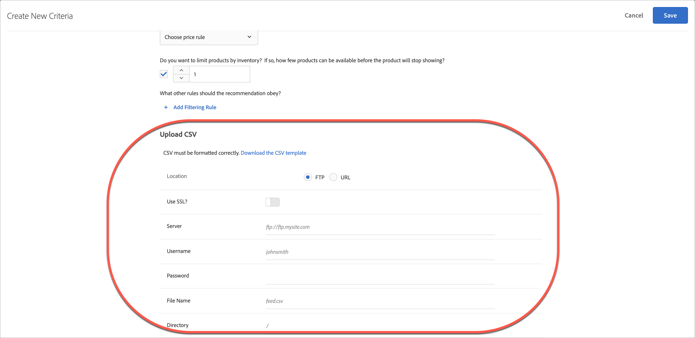

# Hochladen benutzerdefinierter Kriterien

Laden Sie eine CSV-Datei hoch, um Ihre Empfehlungen anzupassen in [!DNL Adobe Target].

Sie haben viele Möglichkeiten, um auf den Bildschirm [!UICONTROL Neue Kriterien erstellen] zu gelangen. Einige Bildschirmoptionen variieren je nachdem, wie Sie auf den Bildschirm gelangen.

* Im **[!UICONTROL Recommendations]** > **[!UICONTROL Kriterien]** Bibliotheksbildschirm, klicken Sie auf **[!UICONTROL Erstellen von Kriterien]** > **[!UICONTROL Erstellen von Kriterien]**. Kriterien, die Sie hier erstellen, stehen automatisch für alle [!DNL Recommendations]-Aktivitäten zur Verfügung.
* Wenn Sie eine [!DNL Recommendations] -Aktivität, die [!UICONTROL Visual Experience Composer] (VEC), werden Sie sofort zur [!UICONTROL Kriterien auswählen] angezeigt, nachdem Sie ein Element auf Ihrer Seite ausgewählt haben, und klicken Sie auf [!UICONTROL Ersetzen durch Recommendations], [!UICONTROL Recommendations vor einfügen]oder [!UICONTROL Recommendations einfügen nach]. Sie können dann ein verfügbares Kriterium auswählen oder auf **[!UICONTROL Erstellen von Kriterien]**. Wenn Sie ein neues Kriterium erstellen, können Sie Ihre Kriterien speichern, um sie mit anderen zu verwenden [!DNL Recommendations] Aktivitäten. Weitere Informationen finden Sie unter [Erstellen einer Recommendations-Aktivität](/help/main/c-recommendations/t-create-recs-activity/create-recs-activity.md).
* Klicken Sie beim Bearbeiten einer [!DNL Recommendations]Aktivität in ein Feld für die [!UICONTROL Empfehlungsposition] auf Ihrer Seite und wählen Sie **[!UICONTROL Kriterien ändern]**. Im [!UICONTROL Kriterien auswählen] Bildschirm, klicken Sie auf **[!UICONTROL Erstellen von Kriterien]**. Sie können Ihre neuen Kriterien zur Verwendung mit anderen speichern [!DNL Recommendations] Aktivitäten.

Die folgenden Schritte setzen voraus, dass Sie auf die [!UICONTROL Neue Kriterien erstellen] mit der ersten Methode: die **[!UICONTROL Recommendations]** > **[!UICONTROL Kriterien]** Bibliotheksbildschirm.

1. Klicken **[!UICONTROL Recommendations]** > **[!UICONTROL Kriterien]**.

1. Klicken Sie auf **[!UICONTROL Kriterien erstellen]**.

1. Füllen Sie die Informationen im [Basisinformationen](/help/main/c-recommendations/c-algorithms/create-new-algorithm.md#info) Abschnitt.

   1. Aus dem **[!UICONTROL Algorithmus auswählen]** Typ-Dropdown-Liste, wählen Sie **[!UICONTROL Benutzerdefinierte Kriterien]**.

   1. Aus dem **[!UICONTROL Algorithmus]** Dropdown-Liste auswählen **[!UICONTROL Benutzerspezifischer Algorithmus]**.

      >[!NOTE]
      >
      >Die vorherigen Schritte führen dazu, dass die [!UICONTROL CSV hochladen] -Abschnitt, der unten im [!UICONTROL Neue Kriterien erstellen] Dialogfeld.

1. (Bedingt) Füllen Sie die Informationen im [Backup Content](/help/main/c-recommendations/c-algorithms/create-new-algorithm.md#content) Abschnitt.

1. (Bedingt) Füllen Sie die Informationen im [Einschlussregeln](/help/main/c-recommendations/c-algorithms/create-new-algorithm.md#inclusion) Abschnitt.

1. Im **[!UICONTROL CSV hochladen]** auswählen, wählen Sie die **[!UICONTROL Standort]** Ihrer CSV-Datei.

   

   Die CSV-Datei muss korrekt formatiert sein, um erfolgreich hochgeladen werden zu können. Klicken Sie auf **[!UICONTROL CSV-Vorlage herunterladen]**, um eine Vorlage mit richtiger Formatierung zu erhalten.

   Es gibt für Orte zwei Optionen:

   * **FTP:** Um Ihre CSV-Datei von einem FTP-Server hochzuladen, wählen Sie **[!UICONTROL FTP]** aus und geben Sie die erforderlichen Informationen ein. Sie können SSL verwenden, das das FTPS-Protokoll verwendet, um Ihre CSV-Datei sicher zu übertragen.
   * **URL:** Um Ihre CSV-Datei von einer URL hochzuladen, wählen Sie **[!UICONTROL URL]** und geben Sie eine Feed-URL ein.

1. Klicken Sie auf **[!UICONTROL Speichern]**.

## Zu beachten

* Benutzerdefinierte Kriterienentitäten (Zeilen) können bis zu 1.000 empfohlene Elemente (Spalten) enthalten.

* Benutzerspezifische Kriterienupdates sind standardmäßig kumulativ. Neue Schlüssel-Wert-Paare, die in der CSV-Uploaddatei angegeben werden, überschreiben bestehende Schlüssel-Wert-Paare. Vorhandene Schlüssel-Wert-Paare, für die keine Schlüssel im CSV-Upload angegeben sind, können weiterhin bereitgestellt werden und laufen 31 Tage nach dem letzten Hochladen als Teil der CSV-Datei ab.

   Wenden Sie sich an Adobe Client Care, um die Einstellung zum Verwerfen bestehender Ergebnisse, die nicht im nächsten CSV-Upload enthalten sind, zu aktivieren. Wenn diese Einstellung aktiviert ist, können nur die Schlüssel in der benutzerdefinierten CSV-Feed-Datei bereitgestellt werden. Diese Einstellung gilt für alle benutzerspezifischen Kriterien.

* Benutzerspezifische Kriterien-Feeds werden alle 24 Stunden aktualisiert.

   Sie können den Upload- und Synchronisierungsstatus Ihrer benutzerdefinierten Kriterien am unteren Rand jeder Kriterienkarte auf der [!UICONTROL Recommendations] > [!UICONTROL Kriterien] Seite. Sie können den Status auch im [!UICONTROL Bearbeiten] beim Bearbeiten benutzerdefinierter Kriterien.

* Der Ablauf für einen fehlerfreien Upload sollte [!UICONTROL Geplant] > [!UICONTROL Herunterladen der Feed-Datei] > [!UICONTROL Import] > [!UICONTROL Erfolgreich].

* Die folgenden Fehlermeldungen sind möglich, wenn [!DNL Target] stößt auf ein Problem mit dem Upload:

   | Fehlermeldung | Details |
   |--- |--- |
   | Unbekannter Fehler | Zeigt einen internen technischen Fehler an. |
   | Parsing-Fehler | Es gibt wahrscheinlich ein Problem mit dem Feed-Dateiformat. Korrigieren Sie das Dateiformat und speichern Sie den Algorithmus erneut, der den Dateidownload-Prozess neu startet. |
   | Server nicht gefunden | Geben Sie einen IP- oder Hostnamen an, der im Internet sichtbar ist. |
   | Zugangsdatenfehler | Geben Sie einen gültigen Benutzernamen und ein gültiges Passwort für ein aktives Konto auf dem Server an. |
   | Verzeichnis nicht gefunden | Geben Sie ein Verzeichnis an, das auf dem Server existiert. |
   | Datei nicht gefunden | Geben Sie den Namen einer Datei an, die auf dem Server im angegebenen Verzeichnis existiert. |

## Schulungsvideo: Kriterien in Recommendations erstellen (12:33) 

Dieses Video enthält die folgenden Informationen (Details zum Hochladen benutzerdefinierter Kriterien beginnen um 11:43 Uhr):

* Erstellen von Kriterien
* Erstellen von Kriteriensequenzen
* Hochladen benutzerdefinierter Kriterien

>[!VIDEO](https://video.tv.adobe.com/v/27694?quality=12)
