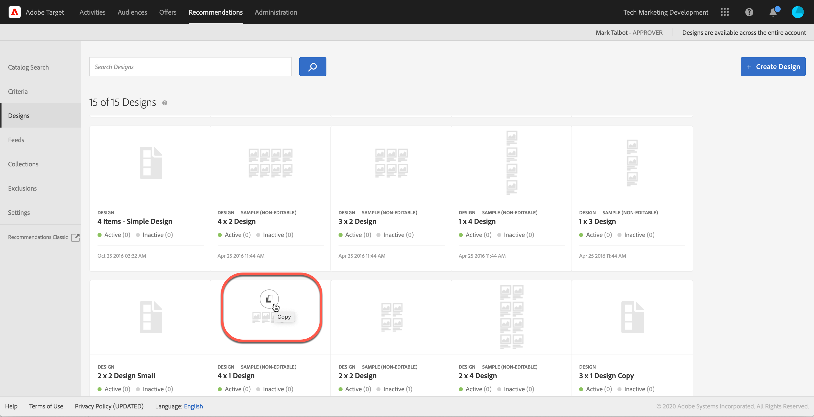
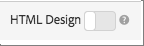

#  Erstellen eines Designs

Mit einem Entwurf wird festgelegt, wie Empfehlungen auf einer Seite dargestellt werden.

Sie können einen [!UICONTROL Recommendations]-Entwurf erstellen, indem ein Standardentwurf oder ein benutzerdefinierter Entwurf verwendet wird. Die **[!UICONTROL Recommendations > Designs]** -Bildschirm zeigt sowohl Standard-Design-Karten als auch alle Designs an, die in Ihrem Konto erstellt wurden.

Beachten Sie beim Arbeiten mit Designs die folgenden Informationen:

* Sie können einen Empfehlungsentwurf mit einem Standardentwurf erstellen oder einen benutzerdefinierten Entwurf erstellen.
* Ein Standardentwurf kann nicht bearbeitet oder gelöscht werden.
* Sie können einen benutzerdefinierten Entwurf bearbeiten, kopieren oder löschen.
* Um einen auf einem Standardentwurf basierenden Entwurf zu erstellen, müssen Sie zunächst den Entwurf kopieren und dann die Kopie bearbeiten.

Diese Abbildung zeigt das standardmäßige 1 x 4-Design:


Diese Abbildung zeigt ein benutzerdefiniertes Design:


Sie können ein Design während des Aktivitätserstellungsprozesses aus dem Visual Experience Composer (VEC) oder aus der Design-Bibliothek außerhalb der Aktivitätserstellung erstellen. In den folgenden Abschnitten wird davon ausgegangen, dass Sie Designs aus der Bibliothek erstellen, die Schritte sind jedoch ähnlich.

## Erstellen von Entwürfen

Sie können einen Entwurf basierend auf einem Standardentwurf erstellen oder einen benutzerdefinierten Entwurf erstellen.

### Erstellen eines Designs basierend auf einem Standardentwurf

1. Klicken **[!UICONTROL Recommendations]** > **[!UICONTROL Designs]** , um [!UICONTROL Designs] -Bibliothek.

   

1. Bewegen Sie den Mauszeiger über die Karte für das Design, das Sie erstellen möchten, und klicken Sie dann auf **[!UICONTROL Kopieren]** Symbol.

   

   Die [!UICONTROL Design erstellen] angezeigt.

   

1. Im **[!UICONTROL Informationen]** Bedienfeld hinzufügen, **[!UICONTROL Inhaltsname]** und optionales Vorschaubild, das auf der Designkarte angezeigt werden soll.

   Wenn Sie einen Standardentwurf verwenden, werden der Designname und &quot;Kopieren&quot;im **[!UICONTROL Inhaltsname]** -Feld. Sie können den Namen bearbeiten. Sie können auch ein Bild auswählen, das auf der Entwurfskarte angezeigt werden soll.

1. (Bedingt) Bearbeiten Sie den Entwurf. **[!UICONTROL Code]**, wie gewünscht.

   Empfehlungsentwürfe verwenden die Open Source-Entwurfssprache Velocity. Informationen über Velocity finden Sie unter [https://velocity.apache.org](https://velocity.apache.org) und [Anpassen eines Designs mithilfe von Velocity](/help/main/c-recommendations/c-design-overview/customizing-a-template.md).

   Der Entwurf kann ein HTML- oder ein Nicht-HTML-Entwurf sein. Standardmäßig werden HTML-Entwürfe mit einem `<div>` Tag umschlossen, um Clicktracking in einer Webumgebung zuzulassen. Nicht-HTML-Entwürfe eignen sich für Nicht-Webumgebungen, in denen ein Klick-Tracking nicht möglich ist. Schieben Sie die [!UICONTROL HTML Design] schalten Sie auf die &quot;Aus&quot;-Position um, um Nicht-HTML-Code zu verwenden.

   >[!NOTE]
   >
   >Die maximale Anzahl von Entitäten, die in einem Entwurf referenziert werden können, egal ob hartcodiert oder in Schleife, beträgt 99.

1. Klicken Sie auf **[!UICONTROL Speichern]**.

### Erstellen eines benutzerdefinierten Entwurfs

1. Klicken **[!UICONTROL Recommendations]** > **[!UICONTROL Designs]** , um [!UICONTROL Designs] -Bibliothek.

1. Klicken **[!UICONTROL Design erstellen]**.

   Wenn Sie Ihr neues benutzerdefiniertes Design auf einem vorhandenen Entwurf basieren möchten, halten Sie den Mauszeiger über das gewünschte Design und klicken Sie auf die Schaltfläche [!UICONTROL Kopieren] Symbol. Anschließend können Sie die Kopie bearbeiten, um ein neues benutzerdefiniertes Design zu erstellen.

1. Hinzufügen einer **[!UICONTROL Inhaltsname]** und optionales Vorschaubild.

1. (Bedingt) Bearbeiten Sie den Entwurf. **[!UICONTROL Code]**, wie gewünscht.

   Weitere Informationen finden Sie in den Informationen in Schritt 4.

1. Klicken Sie auf **[!UICONTROL Speichern]**.

## Bearbeiten, Kopieren oder Löschen eines Entwurfs

Beachten Sie, dass Sie einen Standardentwurf nicht bearbeiten oder kopieren können. Sie können nur Standardentwürfe kopieren.

Bewegen Sie den Mauszeiger über das gewünschte Design im [!UICONTROL Design] -Bibliothek und klicken Sie dann auf das entsprechende Symbol: Bearbeiten, Kopieren oder Löschen.


Sie können einen vorhandenen Entwurf kopieren, um ein doppeltes Design zu erstellen, das Sie dann ändern können. Auf diese Weise können Sie ein ähnliches Design mit geringerem Aufwand erstellen.

Beachten Sie, dass Designs für das gesamte Konto verfügbar sind. Beachten Sie dies vor dem Löschen eines Designs. Gelöschte Designs können nicht wiederhergestellt werden.

## JSON-Beispiel {#section_75BFB2537CFF4FBD9B560F59EB32C8DD}

Das folgende Beispiel zeigt, wie JSON-Antworten zurückgegeben werden können, wenn eine Aktivität über den formularbasierten Editor konfiguriert wird.

1. Erstellen Sie einen Entwurf in der Design-Bibliothek oder im formularbasierten Workflow. Wenn Sie dies innerhalb des Visual Experience Composer (VEC)-Arbeitsablaufs versuchen, können Sie nichts anderes als ein HTML-Design erstellen, das umschlossen ist von einem  `<div>` für das Klick-Tracking.

1. Achten Sie darauf, dass die Option „HTML-Design“ ausgeschaltet ist:

   

1. Der folgende Code ist ein Beispiel dafür, was Sie in Ihren Entwurf einfügen können:

   ```javascript
       #* 
       * "Return a simple list of recommended entity ids"   
       *#
   
       {   
         "notes":{   
         "purpose": "Return a simple list of recommended entity ids",   
         "use-case": "Use this approach if you prefer to do a real-time lookup of entity attribute details (such as inventory, price, rating) from another system (such as a CMS, PIM or ecommerce platform)",   
         "version": "01"   
         },   
         "recommendedItems": {   
           "key": "$key.id",   
           "slot-01": "$entity1.id",   
           "slot-02": "$entity2.id",   
           "slot-03": "$entity3.id",   
           "slot-04": "$entity4.id",   
           "slot-05": "$entity5.id",   
           "slot-06": "$entity6.id",   
           "slot-07": "$entity7.id",   
           "slot-08": "$entity8.id",   
           "slot-09": "$entity9.id",   
           "slot-10": "$entity10.id"   
         }   
       }  
   ```

1. Einrichten eines formularbasierten [!DNL Recommendations] -Aktivität, die diesen Entwurf verwendet.

   1. Navigieren Sie zum **[!UICONTROL Tätigkeiten]** Seite.
   1. Klicken Sie auf **[!UICONTROL Aktivität erstellen]** > **[!UICONTROL Empfehlungen]**.
   1. under **[!UICONTROL Experience Composer auswählen]** auswählen **[!UICONTROL Formular]** Klicken Sie auf **[!UICONTROL Nächste]**.
   1. Geben Sie unter Speicherort den Text „Sample_Recs_Response“ ein.
   1. Klicken Sie unter **[!UICONTROL Standard-Content]** auf den Pfeil nach unten und dann auf **[!UICONTROL Empfehlung hinzufügen]**.
   1. Wählen Sie einen Seitentyp aus. Das legt fest, welches Bild Sie als nächstes sehen.
   1. Wählen Sie eine Kriterienkarte aus und klicken Sie dann auf **[!UICONTROL Nächste]**.
   1. Wählen Sie das Design aus, das Sie im vorherigen Schritt erstellt haben, und klicken Sie dann auf **[!UICONTROL Nächste]**.
   1. Schließen Sie den Setup-Vorgang ab.
   1. Klicken Sie auf den Pfeil neben **[!UICONTROL Inaktiv]** und wählen Sie dann **[!UICONTROL Aktivieren]**.

1. Nachdem Ihre Aktivität eingerichtet und aktiviert wurde, können Sie eine Musteranforderung einrichten, um die korrekte JSON-Antwort zurückzubekommen.

   Ab dem Zeitpunkt der Speicherung der Aktivität [!DNL Target] muss ein Modell erstellen, das die ausgewählte Kriterienkonfiguration unterstützt. Abhängig von einer Reihe von Faktoren kann dies einige Zeit in Anspruch nehmen. Die Ergebnisse werden angezeigt, sobald das Modell aufgebaut wurde.

   Beispiel:

   ```
   https://[YOUR_CLIENT_CODE].tt.omtrdc.net/m2/YOUR_CLIENT_CODE/ubox/raw?mbox=[YOUR_MBOX_NAME]&mboxContentType=text/html&mboxXDomain=disabled&entity.id=[ENTITY_ID]&mboxHost=rawbox_sample&at_property=[AT_PROPERTY_TOKEN]&mboxNoRedirect=true&mboxPC=1234-4321&mboxSession=9876-7000
   ```

   wo

   | Parameter | Wert |
   |--- |--- |
   | `[YOUR_CLIENT_CODE]` | Target-Client-Code (verfügbar unter /help/target/products.html#recsSettings > Recommendations API Token > Client Code. |
   | `[YOUR_MBOX_NAME]` | Der Name, den Sie im Abschnitt &quot;Speicherorte&quot;des formularbasierten Recommendations ausgewählt haben, in diesem Fall Sample_Recs_Response. |
   | `[ENTITY_ID` | Die `entity.id` eines Artikels in Ihrem Katalog |
   | `[AT_PROPERTY_TOKEN]` | (Optional) Fügen Sie dies hinzu, wenn Sie bei der Einrichtung Ihrer Aktivität eine Eigenschaft (Teil der Unternehmensberechtigungen) ausgewählt haben. |

Nachdem Ihr Algorithmus ausgeführt wurde und Sie Ergebnisse erhalten haben, sollte Ihre Antwort ungefähr so aussehen:

{width=&quot;575px&quot;}

## Zusätzliche Tipps und Tricks für JSON-Objekte {#section_C305673C68944749969DB239E3221DC2}

Sie können auch einfach eine durch Kommas getrennte Liste von Elementen zurücksenden, indem Sie ein Design mit folgender Syntax erstellen:

```
entity1.id, $entity2.id, $entity3.id, $entity4.id, $entity5.id, 
```

Außerdem können Sie mit der Antwort zusätzliche Informationen senden. Die folgende Codedatei ist ein komplexeres Beispiel, das viel mehr zurücksendet als die Entity-IDs mit den zugehörigen Slots (Bestellung). Dieses Designbeispiel gibt auch Aktivitätsdetails, Target-Profildetails (falls zutreffend) und andere zurück. `entity.attributes` mit den zurückgegebenen Elementen verknüpft.

```javascript
    {   
     "adobeRecommendations": {   
      "notes": {   
       "purpose": "Return a list of entity ids with their associated entity.attributes",   
       "use-case": "Use this approach to avoid looking up attribute details after receiving a response from Target",   
       "version": "01"   
      },   
      "recommendedItems": {   
       "slot-01": "$entity1.id",   
       "slot-02": "$entity2.id",   
       "slot-03": "$entity3.id",   
       "slot-04": "$entity4.id",   
       "slot-05": "$entity5.id",   
       "slot-06": "$entity6.id",   
       "slot-07": "$entity7.id",   
       "slot-08": "$entity8.id",   
       "slot-09": "$entity9.id",   
       "slot-10": "$entity10.id"   
      },   
      "activityDetails": {   
       "mbox.name": "email-mbox",   
       "campaign.name": "\${campaign.name}",   
       "campaign.id": "\${campaign.id}",   
       "campaign.recipe.name": "\${campaign.recipe.name}",   
       "campaign.recipe.id": "\${campaign.recipe.id}",   
       "offer.name": "\${offer.name}",   
       "offer.id": "\${offer.id}",   
       "criteria.title": "$criteria.title",   
       "algorithm.name": "$algorithm.name",   
       "algorithm.dayCount": "$algorithm.dayCount"   
      },   
      "visitorProfile": {   
       "profile.favorite-category": "\${profile.favorite-category}",   
       "profile.test": "\${profile.test}",   
       "user.endpoint.lastPurchasedEntity": "\${user.endpoint.lastPurchasedEntity}",   
       "user.endpoint.lastViewedEntity": "\${user.endpoint.lastViewedEntity}",   
       "user.endpoint.mostViewedEntity": "\${user.endpoint.mostViewedEntity}",   
       "user.endpoint.categoryAffinity": "\${user.endpoint.categoryAffinity}",   
       "profile.geolocation.city": "\${profile.geolocation.city}",   
       "profile.geolocation.dma": "\${profile.geolocation.dma}",   
       "profile.geolocation.state": "\${profile.geolocation.state}",   
       "profile.geolocation.country": "\${profile.geolocation.country}",   
       "profile.sessionCount": "\${profile.sessionCount}",   
       "profile.averageDaysBetweenVisits": "\${profile.averageDaysBetweenVisits}",   
       "profile.browserTime": "\${profile.browserTime}",   
       "user.activeActivities": "\${user.activeActivities}",   
       "user.pcId": "\${user.pcId}",   
       "user.isFirstSession": "\${user.isFirstSession}",   
       "user.isNewSession": "\${user.isNewSession}",   
       "user.header": "\${user.header}",   
       "user.parameter": "\${user.parameter}"   
      },   
      "recKey": {   
       "recKeyDetails": {   
        "id": "$key.id",   
        "name": "$key.name",   
        "category": "$key.category",   
        "pageUrl": "$key.pageUrl",   
        "thumbnailUrl": "$key.thumbnailUrl"   
       }   
      },   
      "recDetailedResults": {   
       "recEntity1Details": {   
        "id": "$entity1.id",   
        "name": "$entity1.name",   
        "category": "$entity1.category",   
        "pageUrl": "$entity1.pageUrl",   
        "thumbnailUrl": "$entity1.thumbnailUrl"   
       },   
       "recEntity2Details": {   
        "id": "$entity2.id",   
        "name": "$entity2.name",   
        "category": "$entity2.category",   
        "pageUrl": "$entity2.pageUrl",   
        "thumbnailUrl": "$entity2.thumbnailUrl"   
       },   
       "recEntity3Details": {   
        "id": "$entity3.id",   
        "name": "$entity3.name",   
        "category": "$entity3.category",   
        "pageUrl": "$entity3.pageUrl",   
        "thumbnailUrl": "$entity3.thumbnailUrl"   
       },   
       "recEntity4Details": {   
        "id": "$entity4.id",   
        "name": "$entity4.name",   
        "category": "$entity4.category",   
        "pageUrl": "$entity4.pageUrl",   
        "thumbnailUrl": "$entity4.thumbnailUrl"   
       },   
       "recEntity5Details": {   
        "id": "$entity5.id",   
        "name": "$entity5.name",   
        "category": "$entity5.category",   
        "pageUrl": "$entity5.pageUrl",   
        "thumbnailUrl": "$entity5.thumbnailUrl"   
       },   
       "recEntity6Details": {   
        "id": "$entity6.id",   
        "name": "$entity6.name",   
        "category": "$entity6.category",   
        "pageUrl": "$entity6.pageUrl",   
        "thumbnailUrl": "$entity6.thumbnailUrl"   
       },   
       "recEntity7Details": {   
        "id": "$entity7.id",   
        "name": "$entity7.name",   
        "category": "$entity7.category",   
        "pageUrl": "$entity7.pageUrl",   
        "thumbnailUrl": "$entity7.thumbnailUrl"   
       },   
       "recEntity8Details": {   
        "id": "$entity8.id",   
        "name": "$entity8.name",   
        "category": "$entity8.category",   
        "pageUrl": "$entity8.pageUrl",   
        "thumbnailUrl": "$entity8.thumbnailUrl"   
       },   
       "recEntity9Details": {   
        "id": "$entity9.id",   
        "name": "$entity9.name",   
        "category": "$entity9.category",   
        "pageUrl": "$entity9.pageUrl",   
        "thumbnailUrl": "$entity9.thumbnailUrl"   
       },   
       "recEntity10Details": {   
        "id": "$entity10.id",   
        "name": "$entity10.name",   
        "category": "$entity10.category",   
        "pageUrl": "$entity10.pageUrl",   
        "thumbnailUrl": "$entity10.thumbnailUrl"   
       }   
      }   
     }   
    }  
```

## Schulungsvideo: Erstellen benutzerdefinierter Designs in Recommendations (3:20) 

Dieses Video enthält die folgenden Informationen:

* Erstellen eines benutzerdefinierten Entwurfs
* Informationen zur Referenzierung von Anzeigevariablen in Entwürfen

>[!VIDEO](https://video.tv.adobe.com/v/27687)
