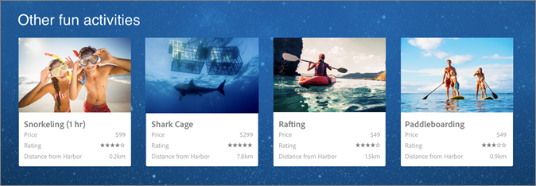

# Designübersicht

Designs in [!DNL Adobe Target Recommendations] definieren, wie Empfehlungen auf einer Seite angezeigt werden. Designs definieren das Layout und Format Ihrer Empfehlungen, um die Besucherinteraktion, Konversion und den Umsatz zu verbessern.

[!DNL Recommendations] verfügt über mehrere standardmäßige (Pre-Build-)Designs oder Sie können eigene erstellen.

[!DNL Target] können das vollständige Erscheinungsbild Ihrer Empfehlungen liefern, wie in der folgenden Abbildung dargestellt. Das Design kann HTML, JavaScript und CSS enthalten. Dieses Design wird als 4 x 1-Design bezeichnet: vier Räume in einer Reihe.

Target kann Ihre Recommendations auch als JSON-Objekte versenden, die in E-Mail-Nachrichten, IoT-Geräten, Konsolen oder bei Sprachanwendungen (Amazon Alexa oder Google Home) verwendet werden können.

Designs helfen Ihnen bei der Bestimmung:

* Wie viele Elemente Sie in einer Empfehlung anzeigen möchten
* Angabe, wie Ihre Elemente angezeigt werden sollen (in einer Zeile, Spalte, einem Raster oder einer Tabelle)
* Gibt an, ob Sie möchten, dass Besuchende nur die angegebene Anzahl von Elementen sehen, oder ob Sie möchten, dass Besucher durch mehrere Elemente scrollen können?
