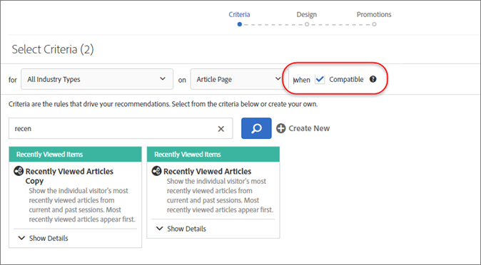

# Recommendations-FAQs

Liste der häufig gestellten Fragen (FAQs) zu [!DNL Adobe Target] [!DNL Recommendations]-Aktivitäten.

## Warum zeigt [!UICONTROL Catalog Search] nicht die richtigen Ergebnisse an, wenn ich nach einem benutzerdefinierten Attribut mit einem numerischen Wert suche?

Wenn Sie einen Katalog nach einem benutzerdefinierten Attribut mit einem numerischen Wert durchsuchen, wird das benutzerdefinierte Attribut als String-Typ (Zeichenfolge) und nicht als numerischer Wert betrachtet.

Derzeit gibt es keine Funktion, mit der Kunden den Attributtyp ändern können. Wenn Sie eine Änderung vornehmen müssen, eröffnen Sie ein [Supportticket](/help/main/cmp-resources-and-contact-information.md#reference_ACA3391A00EF467B87930A450050077C). Geben Sie darin die Attribute an, deren Typ von „String“ in „numerisch“ geändert werden muss.

## Wie lange dauert es, bis Aktualisierungen an Elementen in meinem Katalog auf meiner Site erscheinen?

Der Zeitrahmen und die Ergebnisse hängen davon ab, wie die Elemente aktualisiert werden.

| Quelle | Details |
| --- | --- |
| Elementattribute über Mbox oder API aktualisiert | <ul><li>Empfehlungen werden innerhalb von 15 Minuten aktualisiert.</li><li>Vorhandene Empfehlungen und Elementattribute werden angezeigt, bis Aktualisierungen verfügbar sind.</li><li>Die Katalogsuche wird nach dem Katalogindex aktualisiert (3–8 Stunden).</li></ul> |
| Elementattribute über Feed aktualisiert | <ul><li>Empfehlungen werden nach der Feed-Aufnahme aktualisiert (2–8 Stunden).</li><li>Vorhandene Empfehlungen und Elementattribute werden angezeigt, bis Aktualisierungen verfügbar sind.</li><li>Die Katalogsuche wird nach der Feed-Aufnahme (2–8 Stunden) und nach dem anschließenden Katalogindex (3–8 Stunden) aktualisiert. Die Katalogsuche wird innerhalb von 5–16 Stunden aktualisiert.</li></ul> |
| Element aus dem Katalog über die [!DNL Target]-Benutzeroberfläche oder -API gelöscht | <ul><li>Empfehlungen werden innerhalb von 15 Minuten aktualisiert.</li><li>Vorhandene Empfehlungen und Elementattribute werden angezeigt, bis Aktualisierungen verfügbar sind.</li><li>Die Katalogsuche wird nach dem Katalogindex aktualisiert (3–8 Stunden).</li></ul> |
| Element zum Katalog über die Mbox oder API hinzugefügt | <ul><li>Empfehlungen werden nach der Ausführung des Algorithmus aktualisiert. Algorithmusausführungen finden für 1- bis 2-tägige Algorithmen alle 12 Stunden und für 7-tägige oder längere Algorithmen alle 24 Stunden statt.</li><li>Wenn das hinzugefügte Element kein angeforderter Schlüssel ist, werden bestehende Empfehlungen angezeigt, bis Aktualisierungen verfügbar sind.</li><li>Wenn das hinzugefügte Element ein angeforderter Schlüssel ist, werden Backup-Empfehlungen angezeigt, bis Aktualisierungen verfügbar sind.</li><li>Die Katalogsuche wird nach dem Katalogindex aktualisiert (3–8 Stunden).</li></ul> |
| Element, das zum Katalog über einen Feed hinzugefügt wird | <ul><li>Empfehlungen werden nach der Aufnahme des Feeds aktualisiert (2–8 Stunden). Nachfolgende Algorithmusausführungen sind für 1- bis 2-tägige Algorithmen alle 12 Stunden und für 7-tägige Algorithmen alle 24 Stunden geplant. Empfehlungen werden innerhalb von 2 bis 32 Stunden aktualisiert.</li><li>Wenn das hinzugefügte Element kein angeforderter Schlüssel ist, werden bestehende Empfehlungen angezeigt, bis Aktualisierungen verfügbar sind.</li><li>Wenn das hinzugefügte Element ein angeforderter Schlüssel ist, werden Backup-Empfehlungen angezeigt, bis Aktualisierungen verfügbar sind.</li><li>Die Katalogsuche wird nach der Feed-Aufnahme (2–8 Stunden) und nach dem Katalogindex (3–8 Stunden) aktualisiert. Die Katalogsuche wird innerhalb von 5–16 Stunden aktualisiert.</li></ul> |

Nachdem Sie eine Feed-Datei importiert oder Entitätsaktualisierungen per API oder Mbox erhalten haben, werden die folgenden Änderungen in maximal 60 Minuten angezeigt:

* Wenn ein Element zuvor ausgeschlossen wurde, jetzt aber eingeschlossen werden sollte, wird das Element bei der nächsten Algorithmusausführung (12–24 Stunden) einbezogen.

  Dies geschieht, weil [!DNL Target] Ausschlüsse sowohl online als auch offline anwendet. Wenn ein Element neu ausgeschlossen wird, wird der Online-Ausschluss schnell angewendet. Wenn ein Element neu eingeschlossen wird, wird der Online-Ausschluss schnell beendet, aber der Offline-Ausschluss wird erst beendet, wenn der nächste Algorithmus ausgeführt wird.

* Wenn ein Element zuvor eingeschlossen war, aber jetzt ausgeschlossen werden soll, wird das Element gemäß dem Zeitrahmen „Elementattribute aktualisiert...“ ausgeschlossen. Der oben genannte Zeitrahmen hängt von der Feed-Quelle ab (15 Minuten über Mbox/API oder 12–24 Stunden über Feed).

Die folgenden Änderungen werden erst wirksam, wenn der nächste Algorithmus ausgeführt wird (innerhalb von 12 bis 24 Stunden):

* Elementattribute, die in den für die Aktivität verwendeten Sammlungsregeln verwendet werden.
* Elementattribute, die in einer Promotion basierend auf einem Attribut oder einer Sammlung verwendet werden, die mit der Aktivität verknüpft ist.
* Elementkategorie, in der das Element für eine „aktuelle Kategorie“ oder „Favoritenkategorie“ im Algorithmus „Topverkäufe“ oder „Am äftesten angesehen“ angezeigt wird.
* Rangordnung empfohlener Artikel, wenn das sich geänderte Attribut ein benutzerdefiniertes Attribut ist, das als benutzerdefinierter Schlüssel für einen Algorithmus verwendet wird.
* Rangordnung empfohlener Artikel basierend auf einem oder mehreren geänderten Attributen, wenn die Empfehlungslogik „Artikel mit ähnlichen Attributen“ lautet oder wenn die Gewichtungsfaktoren „Ähnlicher Inhalt“ oder die Faktoren „Attributgewichtung“ verwendet werden.

>[!NOTE]
>
>Eine Feed-Datei wird als importiert erachtet, wenn sich ihr Status von „Elemente werden importiert“ in „Aktualisierungen des Suchindex werden vorbereitet“ ändert. Es kann mehr als 60 Minuten dauern, bis Aktualisierungen in der Benutzeroberfläche der Katalogsuche angezeigt werden. Die Katalogsuche ist aktuell, wenn sich der Feedstatus in „Aktualisierungen abgeschlossen“ ändert. Selbst wenn die Katalogsuche noch nicht aktuell ist, zeigt Ihre Site Aktualisierungen innerhalb der oben aufgeführten Zeitrahmen an. Auf der Seite „Katalogsuche“ wird die aktuelle Indexaktualisierungszeit der Katalogsuche angezeigt.

## Wie lange dauert es, bis die Konfiguration meiner [!UICONTROL Recommendations] -Aktivität, meines Angebots, meiner Promotions oder der Kriterieneinstellungen auf meiner Site geändert wird?

* Eine Änderung der Promotion-Einstellungen kann bis zu fünf Stunden dauern, bis sie auf der Website angezeigt wird.
* Eine Änderung anderer Kriterieneinstellungen wird möglicherweise erst angezeigt, wenn der nächste Algorithmus ausgeführt wird:

   * Einige Kriterieneinstellungen (z. B. &quot;Hinzufügen einer dynamischen Einschlussregel&quot;) werden sofort angezeigt.
   * Andere Kriterieneinstellungen (z. B. &quot;Entfernen einer dynamischen Einschlussregel&quot;, Änderung des Lookback-Fensters usw.) können erst eingefügt werden, wenn der nächste Algorithmus ausgeführt wird.
   * Algorithmusausführungen werden durch diese Änderungen ausgelöst, es kann jedoch bis zu 24 Stunden dauern, bis sie abgeschlossen sind. Algorithmen können auch planmäßig alle 12–24 Stunden ausgeführt werden.

## Wie lange dauert es, bis das Verhalten eines Benutzers (z. B. beim Klicken auf Produkt A und beim Kauf von Produkt B) in den Empfehlungen für *angezeigt wird, die der Benutzer* erhält?

* Aktuell angezeigte/gekaufte Produkte/Inhalte beeinflussen die Empfehlungen, die der Benutzer in derselben Seitenansicht/[!DNL Target]-Inhaltsanfrage erhält.
* Historisches Benutzerverhalten, wie &quot;zuletzt angezeigtes Produkt&quot;, &quot;am häufigsten angezeigtes Produkt&quot;und der gesamte Anzeige-/Kaufverlauf werden mit dieser Anforderung aktualisiert und beeinflussen die Empfehlungen, die der Benutzer in der nächsten Seitenansicht/[!DNL Target] -Inhaltsanforderung erhält. Beispielsweise werden die Algorithmen &quot;Kürzlich angezeigte Elemente&quot;und &quot;Für Sie empfohlen&quot;mit jeder Produktansicht/jedem Kauf aktualisiert und in der nachfolgenden Inhaltsanforderung angezeigt.

## Wie lange dauert es, bis das Verhalten eines Benutzers (z. B. beim Klicken auf Produkt A und beim Kauf von Produkt B) in den Empfehlungen für *andere* -Benutzer angezeigt wird?

Das gesamte Benutzerverhalten wird in die Offline-Algorithmusverarbeitung einbezogen, wobei jeder Algorithmus alle 12–24 Stunden ausgeführt wird.

## Was sollte ich tun, wenn mein Array durch Sonderzeichen umbrochen wird? {#section_D27214116EE443638A60887C7D1C534E}

Verwenden Sie Escape-Werte in JavaScript. Das Array kann durch Anführungszeichen (&quot;) umbrochen werden. Der folgende Codeausschnitt ist ein Beispiel für Escape-Werte:

```
#set($String='') 
#set($escaper=$String.class.forName('org.apache.commons.lang.StringEscapeUtils')) 
<script type="text/javascript"> 
console.log("$escaper.escapeJavaScript($entity1.name)") 
console.log("$escaper.escapeJavaScript($entity2.name)") 
console.log('$escaper.escapeJavaScript($entity3.name)') 
names.push("$escaper.escapeJavaScript($entity4.name)") 
</script>
```

## Warum stehen beim Erstellen einer Recommendations-Aktivität nicht alle Kriterien, einschließlich benutzerdefinierter Kriterien, zur Verfügung? {#section_B2265AC8B8A94E0298D495A05C5D817F}

Die verfügbaren Kriterien basieren auf der aktuellen Kategorie. Beim Erstellen von Recommendations-Angeboten zeigt die Algorithmusauswahl Kriterien auf Grundlage der Kategorie-ID an.

Wenn der Speicherort, auf den Sie diese Kriterien anwenden, die Kategorie-ID nicht enthält, sind im Algorithmus-Wähler bestimmte Kriterien nicht verfügbar.

Bei der Verwendung eines Speicherorts, unter dem die Kategorie-ID in der Mbox vorhanden ist, enthält die Kriterienauswahl alle anwendbaren Kriterien.

[!DNL Target] verfügt über die Einstellung [Inkompatible Kriterien filtern](https://experienceleague.adobe.com/docs/target-dev/developer/recommendations.html){target=_blank} , um die intelligente Filterung der Algorithmusauswahl zu steuern.

>[!NOTE]
>
>Diese Einstellung gilt nur für Aktivitäten, die im VEC (0) erstellt wurden. [!UICONTROL Visual Experience Composer] Sie gilt nicht für Aktivitäten, die im Formular-basierten Experience Composer erstellt wurden ([!DNL Target] verfügt über keinen Speicherortkontext).

Um auf die Einstellung [!UICONTROL Filter Incompatible Criteria] zuzugreifen, klicken Sie auf [!UICONTROL Recommendations] > [!UICONTROL Settings]:


Wenn die Einstellung [!UICONTROL Filter Incompatible Criteria] NICHT aktiviert ist, filtert [!DNL Target] die Algorithmen im Algorithmuswähler nicht und alle Algorithmen werden angezeigt.

Wenn die Einstellung [!UICONTROL Filter Incompatible Criteria] aktiviert ist, liest [!DNL Target] in VEC-Aktivitäten die entityId- und Kategorie-ID-Einträge aus dem ausgewählten Speicherort und zeigt dann Algorithmen basierend auf `currentItem|currentCategory` an (sofern entsprechende Werte an diesem Ort vorhanden sind). Daraufhin werden im Algorithmus-Wähler standardmäßig nur kompatible Algorithmen für den gewählten Speicherort angezeigt.

Wenn die Einstellung [!UICONTROL Filter Incompatible Criteria] aktiviert ist, können Sie nicht kompatible Algorithmen weiterhin anzeigen, indem Sie das Kontrollkästchen [!UICONTROL Compatible] bei der Auswahl der Kriterien deaktivieren.



Die folgende Liste enthält Sonderfälle, in denen [!DNL Target] das Kontrollkästchen [!UICONTROL Compatible] nicht anzeigt:

* Der Speicherort enthält sowohl entityId- als auch Kategorie-ID-Einträge. In diesem Fall erfolgt keine Filterung.
* Sie verwenden [!DNL mbox.js] der Version 55 oder früher.
* Auf der Seite werden keine Mbox-Aufrufe ausgelöst (!config.isAutoCreateGlobalMbox &amp;&amp; !config.isRegionalMbox)
* Es sind keine [!DNL Target]-Parameter definiert.

## Was sollte ich tun, wenn eine Sammlung in Recommendations den Wert null (0) annimmt? {#section_E2DB2FE67CF24EEC81412BFF3FA6385D}

Beachten Sie die folgenden Informationen, wenn eine Sammlung, die zuvor nicht null war, den Wert null annimmt:

* Sie können die Sammlung erneut speichern und prüfen, ob der Wert aktualisiert wird. Durch das erneute Speichern führt die Sammlung alle Algorithmen, die diese Sammlung verwenden, erneut aus.
* Befinden Sie sich in der richtigen Umgebung? Zu [!DNL /target/products.html#recsSettings] gehen, um gegenzuprüfen (wie unten dargestellt).

  

* Ist Ihr Index aktuell? Wechseln Sie zu [!DNL /target/products.html#productSearch] und überprüfen Sie, wie viele Stunden der Index alt ist (z. B. &quot;Vor 3 Stunden indiziert&quot;). Sie können den Index bei Bedarf aktualisieren.
* Haben Sie Änderungen am Feed oder an der Datenebene vorgenommen, die dazu geführt haben, dass Ihre Entitäten nicht mehr mit den Sammlungsregeln übereinstimmen? Stellen Sie sicher, dass die Groß-/Kleinschreibung übereinstimmt (Beachtung der Groß-/Kleinschreibung).
* Wurde der Feed erfolgreich ausgeführt? Wurden das FTP-Verzeichnis, das Kennwort usw. geändert?
* [!DNL Target] versucht nach Kräften, den Versand (auf der Seite/App des Kunden) so schnell wie möglich zu aktualisieren. Dennoch muss [!DNL Target] auf seiner Benutzeroberfläche einige Darstellungen für den Marketer bereitstellen. [!DNL Target] wartet mit Bereitstellungsaktualisierungen nicht auf die Synchronisierung der Benutzeroberflächenaktualisierungen. Mithilfe von [mboxTrace](/help/main/c-activities/c-troubleshooting-activities/content-trouble.md) können Sie die Inhalte des Systems zu dem Zeitpunkt anzeigen, zu dem eine Anforderung eingeht.

## Worin besteht der Unterschied zwischen der allgemeinen und der Inhaltsähnlichkeits-spezifischen Attributgewichtung? {#section_FCD96598CBB44B16A4C6C084649928FF}

Die Attributgewichtung liegt in zwei Formen vor: „Standardattributgewichtung“ und „Inhaltsähnlichkeits-Attributgewichtung“.

Die „Standardattributgewichtung“ gilt für die meisten, wenn nicht gar für alle Kriterientypen (nicht nur „Inhaltsähnlichkeit“). Dieser Gewichtungstyp gewichtet bestimmte Attributwerte stärker. Im folgenden Beispiel werden Nike-Produkte in den Ausgabeempfehlungen angestoßen.


Die &quot;Attributgewichtung für Ähnlichkeit von Inhalten&quot;gilt nur für Kriterien für Ähnlichkeit von Inhalten.

Diese Art der Gewichtung ist dynamischer und basiert auf dem aktuellen &quot;Empfehlungsschlüssel&quot;(dem aktuell angezeigten Artikel). Im folgenden Beispiel (Marke x 16) wird dieser Besucher, wenn er Nike-Turnschuhe anschaut, mit höherer Wahrscheinlichkeit andere Nike-Produkte (nicht notwendigerweise nur Turnschuhe) anstelle der Turnschuhe von Konkurrenten empfohlen. Wenn ein Besucher Sneaker der Marke Adidas anzeigen würde, würden ihm wahrscheinlich Adidas-Produkte empfohlen.


## Warum ist [!DNL Target] manchmal nicht in der Lage, Empfehlungen anzuzeigen? {#section_DB3F40673AED42228E407C05437D99E9}

[!DNL Target] kann manchmal keine Empfehlungen anzeigen, wenn zu wenige Empfehlungen verfügbar sind.

Die Anzahl der pro Kriterium generierten Werte ist die dreifache Anzahl der im Design angegebenen Entitäten. Die Laufzeitfilterung (beispielsweise Inventar, Mbox-Attributabgleich) wird angewendet, nachdem die 3x-Werte generiert wurden. Daher ist es möglich, dass zur Bereitstellungszeit weniger als 3x-Werte vorhanden sind. Erhöhen Sie zum Mindern dieser Situation die Anzahl der Entitäten im Design, indem Sie andere Entitäten ausblenden.

Das folgende JavaScript kann zu Beginn des Designs verwendet werden, um die Anzahl der angeforderten Entitäten zu erhöhen. In diesem Beispiel würde die angeforderte Anzahl von Entitäten 30 (3 x 10) betragen.

```
#foreach($entity in $entities) 
 #if( $foreach.count > 10 ) 
  #break 
 #end 
 #set ($foo = $entity.id) 
#end 
```

## Welche Größenbeschränkung besteht für einen API-Aufruf beim Einfügen/Aktualisieren von Produkten? Kann ich 50.000 Produkte mit einem Aufruf aktualisieren, indem ich die API statt eines Feeds verwende? {#section_434FE1F187B7436AA39B7C14C7895168}

[!DNL Target] begrenzt Posts auf Programmebene auf 50 MB – allerdings nur, wenn der Content-Typ-Header `application/x-www-form-urlencoded` übergeben wird.

Sie können sicherlich versuchen, 50.000 Produkte in einem einzigen Aufruf zu senden. Wenn das nicht funktioniert, empfiehlt sich eventuell eine Aufteilung der Produkte in Batches. Adobe empfiehlt Kunden die Aufteilung ihrer Aufrufe in Batches von jeweils 5.000 oder 10.000 Produkten. Dadurch lassen sich Zeitüberschreitungen aufgrund einer zu hohen Systemauslastung umgehen.

## Muss ich den Mbox-Namen angeben, wenn ich Testregeln für Recommendations-Kriterien, -Promotions oder -Vorlagen erstelle? {#section_FFA42ABCC5954B48A46526E32A3A88A2}

Beim Erstellen von Recommendations-Kriterien, -Promotions oder Vorlagentestregeln, die auf einem basieren, erhalten Sie von `mboxParameter`mboxParameter keine Aufforderung mehr, `mboxName` einzugeben. Der Mbox-Name ist nun optional. Mit dieser Änderung können Sie Parameter aus mehreren Mboxes verwenden oder auf einen Parameter verweisen, der noch nicht am Rand aufgezeichnet wurde.

So wählen Sie den gewünschten Parameter aus:

* Wählen Sie beim Erstellen einer Testregel für Kriterien, Promotions oder Vorlagen einen Parameternamen aus der Liste aus. Geben Sie die ersten Zeichen oder auch den vollständigen Namen des gewünschten Parameters ein.
* Wenn Sie den Mbox-, aber nicht den Parameternamen kennen, filtern Sie mithilfe des Kontrollkästchens nach der bekannten Mbox, die den gewünschten Parameter übergibt.

Bei keiner der Methoden gibt es eine Verbindung zwischen Mbox und Parameter. Eine Testregel für Kriterien, Promotions oder Vorlagen verarbeitet die Parameter aller Mboxes, die diesen Parameter übergeben.

Wenn Sie bestehende Kriterien, Promotions oder Vorlagentestregeln bearbeiten, werden die Filterkriterien mit dem Mbox-Namen angezeigt, der bei der Erstellung angegeben wurde.

## Warum kann ich meine alte Recommendations-Aktivität nicht speichern, nachdem ich eine neue Zielgruppe definiert habe? {#section_1E47C40B1FE7479BAC3EE0F50CE7C2C4}

Stellen Sie sicher, dass die Zielgruppe einen eindeutigen Namen aufweist. Wenn Sie der Zielgruppe den Namen einer bereits vorhandenen Zielgruppe zugewiesen haben, können Sie die alte Recommendations-Aktivität, also Recommendations-Aktivitäten, die vor Oktober 2016 erstellt wurden, nicht speichern.

## Wie groß dürfen CSV-Dateien für den Feedupload maximal sein? {#section_20F1AF4839A447B9889B246D6E873538}

Es gibt keine feste Grenze hinsichtlich der Zeilen oder Dateigröße für den Feedupload von CSV-Dateien. Als Best Practice empfiehlt Adobe jedoch, die CSV-Datei auf 1 GB zu beschränken, um Fehler während des Uploadprozesses zu vermeiden. Wenn die Größe der Datei 1 GB übersteigt, teilen Sie sie am besten in mehrere Feeddateien auf. Die maximale Anzahl benutzerdefinierter Attributspalten ist 100 und benutzerdefinierte Attribute sind auf 4.096 Zeichen beschränkt. Weitere Längenbeschränkungen für erforderliche Spalten finden Sie auf der Seite [[!DNL Target] Beschränkungen](/help/main/r-troubleshooting-target/target-limits.md#reference_BEFE60C3AAA442FF94D4EBFB9D3CC9B1).

## Kann ich eine Entität dynamisch ausschließen? {#exclude}

In der Abfragezeichenfolge können Sie Entität-IDs für Entitäten übermitteln, die Sie von Ihren Recommendations ausschließen möchten. Beispielsweise können Sie Artikel ausschließen, die sich bereits im Warenkorb befinden.

Verwenden Sie den Mbox-Parameter `excludedIds`, um die Ausschlussfunktion zu aktivieren. Dieser Parameter verweist auf eine Liste kommagetrennter Entitäts-IDs. Zum Beispiel `mboxCreate(..., "excludedIds=1,2,3,4,5")`. Der Wert wird übermittelt, wenn Empfehlungen angefordert werden.

Der Ausschluss gilt nur für den aktuellen [!DNL Target]-Aufruf. In nachfolgenden [!DNL Target]-Aufrufen werden Elemente nur ausgeschlossen, wenn der Wert `excludedIds` erneut übergeben wird. Wenn Sie die Artikel im Warenkorb auf jeder Seite aus Ihren Empfehlungen ausschließen möchten, müssen Sie den `excludedIds`-Wert auf jeder Seite übergeben.

>[!NOTE]
>
>Wenn zu viele Entitäten ausgeschlossen werden, verhalten sich die Recommendations so, als wären nicht ausreichend Entitäten zum Ausfüllen der Recommendations-Vorlage vorhanden.

Hängen Sie zum Ausschluss von `entityIds` das Token `&excludes=${mbox.excludedIds}` an die Inhalts-URL des Angebots an. Wenn die Inhalts-URL extrahiert wird, werden die erforderlichen Parameter mit aktuellen Mbox-Anforderungsparametern ersetzt.

Diese Funktion ist für neu erstellte Empfehlungen standardmäßig aktiviert. Bestehende Empfehlungen müssen gespeichert werden, um eine Unterstützung für dynamisch ausgeschlossene Entitäten zu gewährleisten.

## Was bedeutet die Antwort NO_CONTENT, die gelegentlich im Recommendations-Inhalts-Trace zurückgegeben wird?

NO_CONTENT wird zurückgegeben, wenn für die angeforderte Algorithmus- und Schlüsselkombination keine Recommendations verfügbar sind. Im Allgemeinen tritt diese Situation auf, wenn Backups für den Algorithmus deaktiviert sind und zudem mindestens eine der folgenden Bedingungen zutrifft:

* Die Ergebnisse sind noch nicht bereit.

  Diese Situation tritt normalerweise ein, wenn eine neu erstellte Aktivität zum ersten Mal gespeichert wird oder nachdem die Konfiguration der Sammlung, der Kriterien oder der in der Aktivität verwendeten Promotions geändert wurde.

* Die Ergebnisse sind für die angeforderte Algorithmus-/Schlüsselkombination bereit, jedoch noch nicht auf dem nächstgelegenen Edge-Server zwischengespeichert.

  Die Anforderung löst einen Caching-Vorgang aus. Dieses Problem sollte sich daher nach einigen Seitenneuladungen und/oder nach einigen Minuten von alleine lösen.

* Die Ergebnisse sind bereit, aber für den bereitgestellten Schlüsselwert nicht verfügbar.

  Diese Situation tritt in der Regel auf, wenn Empfehlungen für ein Element angefordert werden, das erst nach der Ausführung des letzten Algorithmus zum Katalog hinzugefügt wurde. Das Problem sollte sich nach der nächsten Ausführung des Algorithmus von alleine lösen.

* Das teilweise Vorlagen-Rendering ist deaktiviert, weswegen nicht genügend Ergebnisse zum Ausfüllen der Vorlage verfügbar sind.

  Diese Situation tritt in der Regel auf, wenn eine dynamische Einschlussregel eingerichtet ist, die aggressiv viele Elemente aus den möglichen Ergebnissen herausfiltert. Zur Vermeidung dieser Situation aktivieren Sie Backups, wenden die Einschlussregel aber nicht auf die Backups an. Oder Sie verwenden das Kriterium in Verbindung mit einem weniger aggressiv gefilterten Kriterium.

## Werden Empfehlungen, die auf kürzlich betrachteten Artikeln basieren, für einen einzelnen Besucher auf mehreren Geräten angezeigt? {#persist-across-devices}

Wenn ein Besucher eine Sitzung beginnt, wird die Sitzungs-ID mit einem einzigen Edge-Computer verknüpft und ein temporärer Profil-Cache wird auf diesem Edge-Computer gespeichert. Nachfolgende Anfragen aus derselben Sitzung lesen diesen Profil-Cache, einschließlich der zuletzt angezeigten Elemente.

Wenn die Sitzung beendet wird (im Allgemeinen, wenn sie nach 30 Minuten ohne Aktivität abläuft), wird der Sitzungsstatus einschließlich der zuletzt angezeigten Elemente in eine beständigere Profil-Datenspeicherung am selben geografischen Edge-Computer umgewandelt.

Nachfolgende Sitzungen auf verschiedenen Geräten können dann auf diese zuletzt angezeigten Elemente zugreifen, solange die neue Sitzung mit dem Profil des Kunden über die gleiche Marketing Cloud ID (MCID), Experience Cloud ID (ECID) oder CustomerID/mbox3rdPartyId verknüpft ist.

Wenn ein Besucher gleichzeitig zwei aktive Sitzungen hat, werden die zuletzt angezeigten Elemente auf einem Gerät nicht auf dem anderen Gerät aktualisiert, es sei denn, die Geräte werden gezwungen, die Sitzungs-ID freizugeben. Es gibt eine mögliche Problemumgehung, aber [!DNL Target] unterstützt nicht direkt die Freigabe einer Sitzungs-ID auf mehreren Geräten. Der Kunde muss diese ID-Freigabe selbst verwalten.

Dieses Verhalten tritt ebenfalls auf, wenn ein Besucher auf einem Gerät aktiv ist und dann einige Minuten später auf einem anderen Gerät aktiv wird. Die Sitzung des ersten Geräts wird 30 Minuten lang nicht beendet. Es kann bis zu fünf Minuten dauern, bevor der Profilstatus in den permanenten Status geschrieben und verarbeitet wird. Warten Sie beim Testen dieses Verhaltens 35 Minuten, bis die Sitzung beendet ist und das Profil gespeichert wurde.

Wenn der Besucher nicht gleichzeitig zwei aktive Sitzungen hat, werden die zuletzt auf einem Gerät angezeigten Elemente auf dem anderen Gerät aktualisiert, solange die Sitzung beendet ist. Warten Sie beim Testen dieses Verhaltens 35 Minuten, bis die Sitzung beendet ist.

## Kann ich einen Algorithmus verwenden, der in [!DNL Adobe Recommendations Classic] in [!DNL Recommendations Premium] erstellt wurde?

Ein in [!DNL Recommendations Classic] erstellter Algorithmus wird in [!DNL Recommendations Premium] nicht unterstützt. Möglicherweise können Sie den alten Algorithmus in [!DNL Target Premium] verwenden. Der Algorithmus kann jedoch zu Synchronisationsproblemen führen, wenn die Aktivität in der [!DNL Target Premium]-Benutzeroberfläche deaktiviert oder gelöscht wird. Weitere Informationen zu den Unterschieden zwischen den beiden Lösungen finden Sie unter [[!DNL Recommendations Classic] gegenüber [!DNL Recommendations] Aktivitäten in [!DNL Target Premium]](/help/main/c-recommendations/c-recommendations-faq/recommendations-classic-versus-recommendations-activities-target-premium.md).

## Wie kann ich nur neue Artikel oder Videos empfehlen? {#recommend-new-articles}

Einige Kunden möchten sicherstellen, dass in Medien und Veröffentlichungen empfohlene Artikel nur die neuesten Artikel bzw. Videos enthalten. Ein [!DNL Target]-Kunde hat beispielsweise den folgenden Ansatz verwendet, um Artikel zu empfehlen, die weniger als 60 Tage alt sind:

1. Übergeben Sie das Veröffentlichungsdatum des Artikels im JJJJMMTT-Format als benutzerdefiniertes Entitätsattribut.
1. Erstellen Sie ein Profilskript, das dem aktuellen Datum abzüglich 60 Tage entspricht, auch im Format JJJMMTT .
1. Verwenden Sie einen dynamischen Einschlussfilter in den Kriterien, sodass `publish date > today's date minus 60 days` angezeigt wird.

### Übergeben Sie das Veröffentlichungsdatum als benutzerdefiniertes Entitätsattribut:

| Entitätsattribut | Beispiel |
| --- | --- |
| issueDate | 2021218 |
| lastViewDate | 2021701 |
| parentCategory | commentary |
| publishDate | 20210113 |
| publishDateDisplay | 13. Januar 2021 |

### Konfigurieren Sie das Profilskript:


### Konfigurieren Sie die Einschlussregel:


>[!NOTE]
>
>Dieses Beispiel kann auch mit der Parameterübereinstimmung und der Übergabe des `priorDate60`-Werts als Mbox-Parameter durchgeführt werden.

### Welche bekannten Probleme gibt es bei der Verwendung von [!DNL Recommendations] -Aktivitäten?

Die folgenden bekannten Probleme bei [!UICONTROL Recommendations] -Aktivitäten sind bekannt:

* Wenn [!DNL Target] ein JSON-Angebot mit getOffer() zurückgibt, wird der JSON-Typ zurückgegeben. Ein JSON Recommendations-Design hingegen wird mit einem HTML-Typ zurückgegeben.
* Abgelaufene Entitäten verlieren ordnungsgemäß die Gültigkeit, wenn innerhalb von 60 Tagen keine Updates per Feed oder API empfangen werden. Die abgelaufenen Entitäten werden jedoch nach ihrem Ablauf nicht aus dem Katalogsuchindex entfernt. Entitäten, die über Feed oder API gelöscht wurden, werden derzeit auch nicht aus dem Katalogsuchindex entfernt. (IRI-857)
* Für Recommendations-Angebote in A/B- und Erlebnis-Targeting-Aktivitäten wird keine Vorschau der Recommendations-Taskleiste angezeigt. (TGT-33426)
* Sammlungen, Ausschlüsse, Kriterien und Designs, die über die API erstellt wurden, sind in der Benutzeroberfläche von Target nicht sichtbar und können nur über die API bearbeitet werden. Erstellen Sie umgekehrt eines dieser Elemente in der Benutzeroberfläche von Target und bearbeiten Sie diese später über die API, werden die Änderungen nicht in der Benutzeroberfläche von Target angezeigt. Über die API bearbeitete Elemente sollten weiterhin über die API bearbeitet werden, um sicherzustellen, dass keine Änderungen verloren gehen. (TGT-35777)
* Recommendations-Aktivitäten, die über die API erstellt wurden, können zwar in der Benutzeroberfläche angezeigt, aber nur über die API bearbeitet werden.
* Der Feed-Status „Benutzerspezifische Kriterien“ in der Kriterien-Listenansicht (Karte) wird alle zehn Minuten aktualisiert und kann in seltenen Fällen mehr als zehn Minuten veraltet sein. Der in der Bearbeitungsansicht für benutzerdefinierte Kriterien angezeigte Status wird in Echtzeit abgerufen und ist stets auf dem neuesten Stand. (TGT-35896, TGT-36173)
