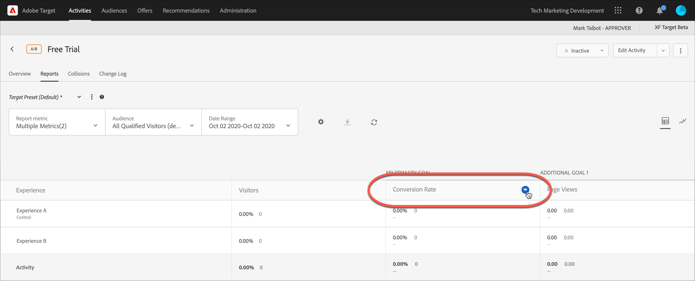

# Anzeigen mehrerer Metriken in einem Bericht

Sie können mehrere Metriken auswählen, die in einer [!DNL Adobe Target] Bericht.

Beachten Sie beim Arbeiten mit mehreren Metriken in Berichten die folgenden Informationen:

* Die Möglichkeit, mehrere Metriken anzuzeigen, ist verfügbar für [A/B-Test](/help/main/c-activities/t-test-ab/test-ab.md), [Automatische Zuordnung](/help/main/c-activities/automated-traffic-allocation/automated-traffic-allocation.md), [Automatisches Targeting](/help/main/c-activities/auto-target/auto-target-to-optimize.md)und [Erlebnis-Targeting](/help/main/c-activities/t-experience-target/experience-target.md) (XT) -Aktivitäten.
* Sie können einem Bericht nicht mehr als 20 Metriken für eine Aktivität hinzufügen, die [Analytics for Target](/help/main/c-integrating-target-with-mac/a4t/a4t.md) (A4T). Sie können beliebig viele Metriken zu Berichten für Aktivitäten hinzufügen, die *not* Verwenden Sie A4T.
* Wenn Sie mehrere Metriken ausgewählt haben, können Sie die Option Download nicht zum Herunterladen von Berichten in CSV verwenden. Zum Aktivieren der Option [!UICONTROL Download] dürfen Sie nur eine einzelne Metrik auswählen.
* Sie können nicht mehrere Metriken für Aktivitäten anzeigen, die vor Juli 2015 erstellt wurden [!DNL Target] -Version (30. Juli 2015).

**So wählen Sie mehrere Metriken für die Anzeige im Bericht aus:**

1. Möchten Sie einen Bericht anzeigen, klicken Sie auf **[!UICONTROL Aktivitäten]**, wählen Sie die gewünschte Aktivität aus der Liste aus und klicken Sie auf die Registerkarte **[!UICONTROL Berichte.]**
1. Klicken Sie auf die Dropdownliste **[!UICONTROL Berichtsmetrik]**, um die Listen [!UICONTROL Angezeigte Metriken] und [!UICONTROL Ausgeblendete Metriken] anzuzeigen.

   

   Mithilfe des Feldes [!UICONTROL Suche] können Sie schnell verfügbare Metriken finden, die der Liste [!UICONTROL Angezeigte Metriken] hinzugefügt werden sollen.

   Beachten Sie, dass Sie in den beiden Modi [!UICONTROL Tabellenansicht] und [!UICONTROL Diagrammansicht] des Berichts mehrere Metriken auswählen können.

1. Bewegen Sie den Mauszeiger über die gewünschten Metriken in der Liste [!UICONTROL Ausgeblendete Metriken] und klicken Sie dann auf **[!UICONTROL Auswählen]**, um sie in die Liste [!UICONTROL Angezeigte Metriken] zu verschieben.

   Oder

   Verschieben Sie die gewünschten Metriken per Drag-and-drop von der Liste [!UICONTROL Ausgeblendete Metriken] in die Liste [!UICONTROL Angezeigte Metriken].

   Die Liste [!UICONTROL Angezeigte Metriken] muss mindestens eine Metrik enthalten.

   Sie können die Metriken neu anordnen, indem Sie sie per Drag-and-drop in der Liste [!UICONTROL Angezeigte Metriken] in die gewünschte Reihenfolge bringen. Die ausgewählte Bestellung wird im [!UICONTROL Tabellenansicht] und [!UICONTROL Diagrammansicht]. Wenn Sie eine Metrik aus der Liste [!UICONTROL Angezeigte Metriken] entfernen möchten, bewegen Sie Ihren Mauszeiger über die Metrik und klicken Sie dann auf das **X**-Symbol.

1. Klicken Sie auf **[!UICONTROL Speichern]**, wenn Sie fertig sind.
1. (Bedingt) Beim Anzeigen des Berichts im [!UICONTROL Tabellenansicht]zeigen Sie mit dem Mauszeiger auf die Spaltenüberschrift einer Metrik, um einen blauen Pfeil anzuzeigen. Klicken Sie auf den Pfeil, um die Tabelle zu erweitern und [!UICONTROL Lift] und [!UICONTROL Vertrauen] für die jeweilige Metrik anzuzeigen.

   

   Sie können nur jeweils eine Metrik/Spalte erweitern. Klicken Sie erneut auf den Pfeil, um die Spalten zu reduzieren.

1. (Bedingt) Beim Anzeigen des Berichts in der Diagrammansicht können Sie einzelne Metriken auswählen, die in der Dropdownliste angezeigt werden sollen:

   
