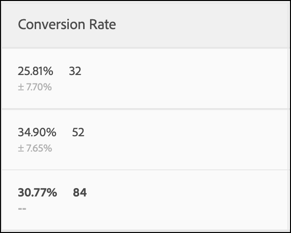
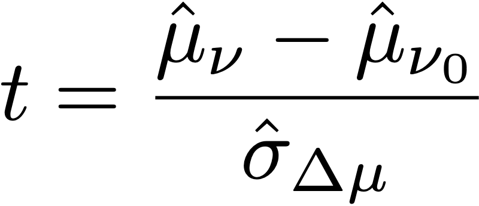
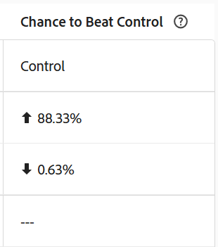

# Statistische Berechnungen in A/Bn-Tests

In diesem Artikel werden die detaillierten statistischen Berechnungen dokumentiert, die bei manuellen A/Bn-Tests in [!DNL Adobe Target] verwendet werden. Definitionen werden für die Entscheidungsmetriken **[!UICONTROL Konversionsrate]**, **[!UICONTROL Konfidenzintervall der Konversionsrate]**, **[!UICONTROL Anstieg]**, **[!UICONTROL Konfidenzintervall für Steigerung]**, **[!UICONTROL Konfidenz]** und **[!UICONTROL Bayes]** bereitgestellt.

Eine **[!UICONTROL A/B-Test]**-Aktivität (manuell) unterstützt zwei statistische Methoden, die pro Aktivität in „Ziele [ Einstellungen“ ](/help/main/c-activities/t-test-ab/t-test-create-ab/ab-goals-and-settings.md#section_13119392051044FBA6387D9B3B1C43CF) werden:

* [Welchs t-Test](#welchs-t-test): eine frequentistische Methodik, die einen **[!UICONTROL Konfidenz]** Prozentsatz und ein Konfidenzintervall meldet, basierend auf einem Hypothesentest mit festem Stichprobenumfang. Wird für Aktivitäten mit einem primären Ziel **[!UICONTROL Umsatz]** oder **[!UICONTROL Interaktion]** verwendet.

* [Bayes](#bayesian-statistics): Berichte zu Ergebnissen als Wahrscheinlichkeiten, wie **[!UICONTROL Chance zur Schlägerkontrolle]** und glaubwürdige Intervalle, berechnet aus der vollständigen A-posteriori-Verteilung der Zielmetriken jedes Erlebnisses. Diese Einstellung ist nur für Aktivitäten verfügbar, deren primäre Zielmetrik &quot;**[!UICONTROL &quot;]**.

## Welch-T-Test

### Durchschnittliche Leistung

Im folgenden Abschnitt werden die in der folgenden Abbildung verwendeten Berechnungen erläutert.

![Target-Bericht, der die [!UICONTROL Konversionsrate], [!UICONTROL Durchschnittlicher Anstieg und ]Konfidenzintervall) und [!UICONTROL Konfidenz] einer A/B-Testaktivität ausgibt.](/help/main/c-reports/statistical-methodology/img/target_report.png)

#### Konversionsrate und Umsatz pro Besucher (RPV)-Kampagnen

Die folgende Abbildung zeigt **[!UICONTROL Konversionsrate]**, **[!UICONTROL Konfidenzintervall der Konversionsrate]** und die Anzahl **[!UICONTROL Konversionen]** in einem [!DNL Target]. Die erste Zeile zeigt beispielsweise, dass für Erlebnis A: die **[!UICONTROL Konversionsrate]** 25,81 % beträgt, wobei **[!UICONTROL Konfidenzintervall]** von ±7,7 % beträgt und 32 Konversionen aufgezeichnet wurden. Da 124 Besucher das Erlebnis gesehen haben, entspricht dies 32/124 = 25,81 %.

<p style="text-align:center;"></p>

Die Konversionsrate oder **Mittelwert**, *µ<sub></sub>* für jedes Erlebnis ** in einem Experiment wird als Verhältnis der Summe der Metrik zur Anzahl der Einheiten definiert, die dieser Metrik zugewiesen sind, *N<sub></sub>*:

<p style="text-align:center;"></p>

Hier,

* *Y<sub>I</sub>* ist der Wert der Metrik für jede Einheit *i*, die einem bestimmten Erlebnis zugewiesen wurde **.

* Die Summe über den Einheiten *i* hängt von der gewählten Zählmethodik ab.

  * Wenn **[!UICONTROL Besucher]** als Zählmethodik verwendet wird, ist jede Einheit ein Unique Visitor , der als eindeutiger Teilnehmer an der Aktivität über die gesamte Lebensdauer der Aktivität definiert ist.
  * Wenn **[!UICONTROL Besuche]** als Zählmethodik verwendet wird, ist jede Einheit ein eindeutiger Besuch, der als eindeutiger Teilnehmer eines Erlebnisses während einer [!DNL Target] Sitzung (mit eindeutiger `sessionId`) definiert ist. Wenn sich die `sessionId` ändert oder der Besucher den Konversionsschritt erreicht, wird ein neuer Besuch gezählt.
  * Wenn **[!UICONTROL Aktivitätsimpressionen]** als Zählmethodik verwendet wird, ist jede Einheit eine eindeutige Impression, die jedes Mal definiert wird, wenn ein Besucher eine Seite der Aktivität lädt.

### [!UICONTROL Konfidenzintervall des Mittelwerts]/[!UICONTROL Konversionsrate]

Das Konfidenzintervall der Konversionsrate wird intuitiv definiert als Bereich möglicher Konversionsraten, der mit den zugrunde liegenden Daten konsistent ist.

Bei der Durchführung von Experimenten ist die Konversionsrate für ein bestimmtes Erlebnis eine *Schätzung* der „echten“ Konversionsrate. Um die Unsicherheit in dieser Schätzung zu quantifizieren, verwendet [!DNL Target] ein Konfidenzintervall. [!DNL Target] meldet immer ein Konfidenzintervall von 95 %, was bedeutet, dass am Ende 95 % der berechneten Konfidenzintervalle die tatsächliche Konversionsrate des Erlebnisses enthalten.

Neben dem derzeit führenden oder erfolgreichsten Erlebnis wird auch eine Zahl für „Konfidenz“ angezeigt. Diese Zahl wird nur gemeldet, bis die „Konfidenz **[!UICONTROL des führenden Erlebnisses]** mindestens 60 % erreicht. Wenn zwei Erlebnisse in der Aktivität vorhanden sind, stellt diese Zahl das Konfidenzniveau dar, bei dem das Erlebnis eine bessere Leistung zeigt als das andere Erlebnis. Wenn mehr als zwei Erlebnisse in der Aktivität vorhanden sind, stellt diese Zahl das Konfidenzniveau dar, bei dem die Leistung des Erlebnisses besser ist als bei dem definierten Kontrollerlebnis. Wenn das Kontrollerlebnis gewinnt, wird keine „Konfidenzzahl“ gemeldet.

Ein 95 %-Konfidenzintervall der Konversionsrate *µ<sub></sub>* ist definiert als der Wertebereich:

<p style="text-align:center;"></p>

wobei der Standardfehler für den Mittelwert wie folgt definiert ist

<p style="text-align:center;"></p>

Wird eine unvoreingenommene Schätzung der Stichprobenstandardabweichung verwendet:

<p style="text-align:center;"></p>

Handelt es sich bei der Kampagne um eine Kampagne mit Konversionsrate (d. h. die Konversionsmetrik ist binär), wird der Standardfehler wie folgt reduziert:

<p style="text-align:center;"></p>

### Steigerung

Die folgende Abbildung zeigt **[!UICONTROL Steigerung]** und **[!UICONTROL Konfidenzintervall der Steigerung]** in einem [!DNL Target]. Die Zahl stellt den Durchschnitt des Bereichs der Steigerungsgrenzen dar, und der Pfeil gibt an, ob die Steigerung positiv oder negativ ist. Der Pfeil wird grau angezeigt, bis die Konfidenz um 95 % überschritten ist. Nachdem die Konfidenz den Schwellenwert überschritten hat, wird der Pfeil basierend auf einer positiven oder negativen Steigerung grün oder rot angezeigt.

<p style="text-align:center;"></p>

Die Steigerung zwischen einem Erlebnis *<sub>* und dem Kontrollerlebnis *0</sub>* ist das relative „Delta“ der Konversionsraten, definiert als

<p style="text-align:center;"></p>

wobei die einzelnen Umrechnungskurse wie oben definiert sind. Einfacher ausgedrückt:

```
Lift(Experience N) = (Performance_Experience_N - Performance_Control)/ Performance_Control
```

Wenn die Konversionsrate des Kontrollerlebnisses *<sub>0</sub>* 0 beträgt, gibt es keine Steigerung.

### [!DNL Confidence Interval of Lift]

Das Boxplot-Diagramm in der Spalte **[!UICONTROL Durchschnittlicher Anstieg und Konfidenzintervall]** stellt den Durchschnittswert und 95 % **[!UICONTROL Konfidenzintervall des Anstiegs]** dar. Das Boxplot-Diagramm ist grau, wenn es eine Überschneidung des Konfidenzintervalls eines bestimmten Nicht-Kontrollerlebnisses mit dem Konfidenzintervall des Kontrollerlebnisses gibt. Das Boxplot-Diagramm ist grün oder rot, wenn der Bereich des Konfidenzintervalls eines bestimmten Erlebnisses über oder unter dem Konfidenzintervall des Kontrollerlebnisses liegt.

Der Standardfehler des Anstiegs zwischen einem Erlebnis ** und dem Kontrollerlebnis *<sub>0</sub>* wird wie folgt definiert:

<p style="text-align:center;"></p>

Dann beträgt das 95-%-Konfidenzintervall der Steigerung:

<p style="text-align:center;"></p>

Diese Berechnung verwendet die „Delta“-Methode und wird [in diesem Dokument ausführlicher beschrieben](/help/main/assets/confidence_interval_lift.pdf)

### [!UICONTROL Konfidenz]

Die letzte Spalte zeigt die Konfidenz in einem [!DNL Target]. Die Konfidenz eines Erlebnisses ist eine Wahrscheinlichkeit (als Prozentsatz bezeichnet), ein Ergebnis zu erhalten, das so extrem ist wie das beobachtete, wenn die Nullhypothese wahr ist. Im Hinblick auf p-Werte ist die angezeigte Konfidenz *1 - p-Wert*. Eine höhere Konfidenz bedeutet intuitiv, dass die Wahrscheinlichkeit, dass das Kontrollerlebnis und das Nicht-Kontrollerlebnis gleiche Konversionsraten haben, geringer ist.

[!DNL Target] wird zwischen dem Prüferlebnis und dem Kontrollerlebnis ein zweiseitiger **Welch&#39;s t-Test** durchgeführt, um zu testen, ob die Mittel der Prüf- und Kontrollerlebnisse identisch sind. Da wir vor der Durchführung des Experiments normalerweise nicht wissen, ob die Stichprobengrößen und Varianzen zweier Gruppen identisch sind, und [!DNL Target] auch die Übertragung ungleicher Prozentsätze des Traffics an jedes Erlebnis ermöglicht, gehen wir nicht davon aus, dass die Varianz für jedes Erlebnis gleich ist. So wird Welchs t-Test anstelle des Student-t-Tests gewählt.

Um Welchs t-Test durchzuführen, beginnen wir zunächst mit der Berechnung der t-Statistik und der Freiheitsgrade, dann führen wir einen zweiseitigen t-Test durch, um den p-Wert zu erzeugen. Schließlich berechnen wir die Konfidenz auf der Basis des p-Werts.

Die *t*-Statistik ist definiert als die Differenz der Mittelwerte zweier unabhängiger Zufallsvariablen, ** und *<sub>0</sub>*, geteilt durch den Standardfehler der Differenz:

<p style="text-align:center;"></p>

Dabei sind *µ<sub>v</sub>* und *µ<sub>v0</sub>* die Mittel für ** bzw. *<sub>0</sub>*, und der Standardfehler der Differenz zwischen *µ<sub>v</sub>* und *<sub>v0</sub>* ergibt sich aus:

<p style="text-align:center;"></p>

Dabei sind *<sub><sup>2</sup><sub>v</sub>* und *</sub></sub>*<sup>2</sup><sub>v<sub>0 </sub></sub>*die Varianzen zweier Erlebnisse**bzw.*<sub>0 </sub>*und* NN *v</sub>* und *Nn<sub>v<sub>0sind Stichproben fürgrößen für**bzw.<sub></sub>* 000.

Für Welchs t-Test wird der Freiheitsgrad wie folgt berechnet:

<p style="text-align:center;"></p>

Und der Freiheitsgrad für ** und *<sub>0</sub>* wird definiert als:

<p style="text-align:center;"></p>

<p style="text-align:center;"></p>

Dann kann der p-Wert aus der Fläche in den Schwänzen der *t*-Verteilung berechnet werden:

<p style="text-align:center;"></p>

Schließlich wird die in [!DNL Target] gemeldete Konfidenz wie folgt definiert:

<p style="text-align:center;"></p>

## Bayes&#39;sche Statistik

Anstatt einen p-Wert aus einer annähernden Verteilung zu berechnen, drückt der Bericht einer **[!UICONTROL Bayes&#39;schen]** Aktivität die Ergebnisse als Wahrscheinlichkeiten aus, die aus der vollständigen A-posteriori-Verteilung der Zielmetriken jedes Erlebnisses berechnet werden. Dies macht es sicher, einen **[!UICONTROL Bayes&#39;schen]** Bericht kontinuierlich zu überwachen, da es keine statistische Strafe für die Überprüfung der Ergebnisse gibt, bevor eine feste Stichprobengröße erreicht wird, und es kann bei kleineren Stichproben schneller konvergieren als **[!UICONTROL Welchs t-Test]**.

Mit der **[!UICONTROL Bayes&#39;schen]** Methode können Marketing-Experten auch eine Hypothese einspeisen, die auf ihren früheren Experimenten und Ergebnissen für die Kontrollvariante basiert.

Die **[!UICONTROL Bayes&#39;sche]** Methode ist nur für Aktivitäten verfügbar, deren primäre Zielmetrik **[!UICONTROL Konversion]** ist, Aktivitäten mit einem **[!UICONTROL Umsatz]** oder **[!UICONTROL Interaktion]** primäres Ziel verwenden immer **[!UICONTROL Welchs t-Test]**. Weitere Informationen zur Auswahl einer Methode finden Sie unter [Ziele und Einstellungen](/help/main/c-activities/t-test-ab/t-test-create-ab/ab-goals-and-settings.md#section_13119392051044FBA6387D9B3B1C43CF).

### Durchschnittliche Steigerung und glaubwürdiges Intervall

<p style="text-align:center;"></p>

Die durchschnittliche Steigerung und das glaubwürdige Intervall messen zusammen die Leistungsverbesserung und ihre Unsicherheit in einer **[!UICONTROL Bayes]**-Aktivität. Die durchschnittliche Steigerung ist die mittlere prozentuale Änderung zwischen einer Behandlung und der Kontrolle, während das glaubwürdige Intervall den Bereich definiert, in den die tatsächliche Steigerung mit einer bestimmten Wahrscheinlichkeit fällt.

### [!UICONTROL Chance, die Kontrolle zu schlagen]

<p style="text-align:center;"></p>

**[!UICONTROL Chance zur Beat-Kontrolle]** ist die Wahrscheinlichkeit, dass die Zielmetrik eines Erlebnisses das **[!UICONTROL Kontrolle]**-Erlebnis übertrifft, z. B. „Chance B von 92 % übertrifft A“. Dies ist die primäre Entscheidungsmetrik für eine **[!UICONTROL Bayes&#39;sche]** Aktivität: Ein Challenger-Erlebnis ist ein Kandidat, um **[!UICONTROL Kontrolle]** zu ersetzen, wenn dessen **[!UICONTROL Chance, die Kontrolle zu]**, den Entscheidungsschwellenwert der Aktivität erreicht.

<!--
### [!UICONTROL Probability to be Best]

[!UICONTROL Probability to be Best] is the probability that an experience is the single best of all experiences in the activity. Use this decision metric to pick which winner to ship in a test with more than one challenger experience.
-->

## Durchführen von Berechnungen offline

Der [heruntergeladene CSV-Bericht](/help/main/c-reports/c-report-settings/downloading-data-in-csv-file.md) enthält nur Rohdaten und keine berechneten Metriken wie Umsatz pro Besucher, Steigerung oder Konfidenz, die für A/B-Tests verwendet werden.

Um diese statistischen Größen zu berechnen, laden Sie die Excel[!DNL Target]Datei [Konfidenzrechner abschließen](/help/main/assets/complete_confidence_calculator.xlsx) herunter, um den Wert der Aktivität einzugeben.
