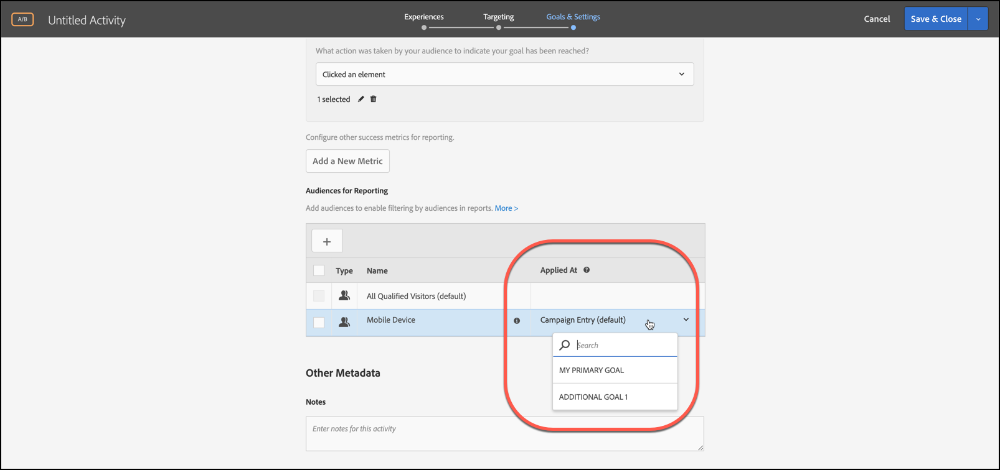
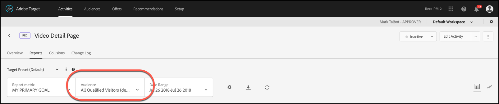

# Anwenden einer Reporting-Zielgruppe auf eine Erfolgsmetrik

Wählen Sie eine Erfolgsmetrik , die den Benutzer für die Reporting-Zielgruppe in [!DNL Adobe Target] qualifiziert.

Mit der Dropdownliste [!UICONTROL Angewendet am] können Sie Zielgruppen bei allen Aktivitäten Erfolgsmetriken zuordnen. Somit können Sie die Berichtszahlen anzeigen, nachdem die Metrik erreicht wurde. Dasselbe gilt auch für nachfolgende Aktionen.

Ein Beispiel: Angenommen, Sie haben eine Aktivität für alle Besucher erstellt, die über Ihre Homepage die Konversionsseite erreichen, aber Sie möchten sich auch stärker auf Besucher konzentrieren, die im Vorfeld ihrer Konversion einen Wert von mehr als 50 $ zum Warenkorb hinzugefügt haben.

Die [!UICONTROL Angewandter Tag] Dropdown-Liste bietet möglicherweise drei Kategorien:

* Alle Besucher der Aktivität
* Nur Besucher, die einen bestimmten Schritt in der Aktivität erreichen
* Nur Besucher, die eine Konversion erreichen

Oder, anders gesagt, Sie können festlegen, dass ein Besucher eine Mbox auf der Entrypage der Aktivität, eine mbox, die einen bestimmten Punkt in der Mitte der Aktivität definiert, oder die Konversions-Mbox am Ende der Aktivität erreichen muss.

>[!NOTE]
>
>[Erfolgsmetriken](/help/main/c-activities/r-success-metrics/success-metrics.md#reference_D011575C85DA48E989A244593D9B9924) sind nur verfügbar, wenn Sie sie für Ihre Aktivität konfiguriert haben. Wenn Sie keine Erfolgsmetriken definiert haben, sehen Sie in der Dropdown-Liste nur zwei Optionen: [!UICONTROL Kampagneneintritt] und [!UICONTROL Konversion].

## Zu beachten

Bedenken Sie folgende Informationen, wenn Sie einer Erfolgsmetrik eine Berichterstellungszielgruppe zuweisen:

* Nur Erfolgsmetriken, die mit der Metrik beginnen, auf die die Zielgruppe angewendet wird, zeigen Berichtsdaten an, die nach Zielgruppe segmentiert sind
* Erfolgsmetriken, die denjenigen vorausgehen, auf die die Zielgruppe angewendet wird, werden nicht nach Zielgruppe segmentiert und zeigen alle Besucherdaten an
* Die Metriken werden anhand ihrer Reihenfolge in der Aktivitätsdefinition betrachtet, wobei das Primäre Ziel  das letzte ist.

## Anzeigen der Segmentierung in Berichten

Um die Segmentierung im Reporting anzuzeigen, wählen Sie die gewünschte Zielgruppe aus der [!UICONTROL Zielgruppe] Dropdown-Liste im Bericht der Aktivität aus.

## Beispiel

Stellen Sie sich eine Aktivität vor, die über Erfolgsmetriken1, Erfolgsmetriken2, Erfolgsmetriken3 und das Primäre Ziel verfügt.

Angenommen, für Audience1 ist die Berichterstellung „Einstieg“ festgelegt und für Audience2 die Berichterstellung „Erfolgsmetrik2“. Die Zielgruppen filtern die Berichtsdaten wie folgt:

|  | Besuchern | Erfolgsmetrik1 | Erfolgsmetrik2 | Erfolgsmetrik3 | Primäres Ziel |
| --- | --- | --- | --- | --- | --- |
| Audience1 | Angewendet | Angewendet | Angewendet | Angewendet | Angewendet |
| Audience2 | Nicht angewendet | Nicht angewendet | Angewendet | Angewendet | Angewendet |
