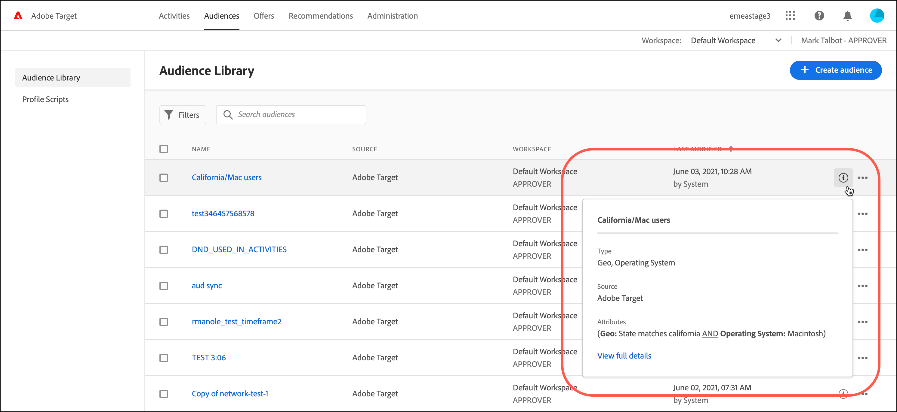

# Erstellen von Zielgruppen

Zielgruppen in [!DNL Adobe Target] bestimmen, wer Inhalte und Erlebnisse in einer zielgerichteten Aktivität sieht.

Zielgruppen werden überall dort eingesetzt, wo Targeting zur Verfügung steht. Für die Zielgruppenbestimmung einer Aktivität stehen folgende Optionen zur Verfügung:

* Wählen Sie eine wiederverwendbare Zielgruppe aus der Liste [!UICONTROL Audiences] aus.
* [Erstellen einer aktivitätsspezifischen Audience](/help/main/c-target/creating-activity-only-audience.md) und deren Targeting
* [Kombinieren mehrerer Zielgruppen](/help/main/c-target/combining-multiple-audiences.md#concept_A7386F1EA4394BD2AB72399C225981E5) zum Erstellen einer Ad-hoc-Zielgruppe

Sie können auch von [!DNL Adobe Analytics] erfasste Zielgruppendaten für Echtzeit-Targeting und Personalisierung in [!DNL Target] und anderen [!DNL Adobe Experience Cloud] Anwendungen verwenden. Siehe [Experience Cloud Audiences](https://experienceleague.adobe.com/docs/core-services/interface/audiences/audience-library.html?lang=de) im Handbuch *Experience Cloud Central Interface Components* .

Es gibt zwei Arten von Zielgruppen in [!DNL Target]:

* **Targeting-Zielgruppen:** Wird verwendet, um unterschiedlichen Besuchertypen unterschiedliche Inhalte bereitzustellen.
* **Berichterstellungszielgruppen:** Wird verwendet, um zu bestimmen, wie verschiedene Besuchertypen auf denselben Inhalt reagieren, damit Sie Ihre Testergebnisse analysieren können.

  In [!DNL Target] können Sie Berichtszielgruppen nur dann konfigurieren, wenn Sie [!DNL Target] als Berichtsquelle verwenden. Wenn Sie [Adobe Analytics als Berichtsquelle verwenden](/help/main/c-integrating-target-with-mac/a4t/a4t.md) (A4T), müssen Sie Ihre Berichterstellungszielgruppen in [!DNL Analytics] konfigurieren.

## Verwenden der Liste &quot;[!UICONTROL Audiences]&quot; {#use-list}

Um auf die Liste [!UICONTROL Audiences] zuzugreifen, klicken Sie in der oberen Menüleiste auf **[!UICONTROL Audiences]** :

![[!UICONTROL Audiences] list](assets/audiences_list.png)

Die Liste [!UICONTROL Audiences] enthält die Zielgruppen, die Sie in Ihren Aktivitäten verwenden können. Verwenden Sie die Liste &quot;[!UICONTROL Audiences]&quot;, um Zielgruppen zu erstellen, zu bearbeiten, zu duplizieren, zu kopieren oder zu kombinieren. Die Liste zeigt auch die Quelle an, an der die Audience erstellt wurde:

* [!DNL Adobe Target]
* [!DNL Adobe Target Classic]
* [!DNL Experience Cloud]
* [!DNL Adobe Experience Platform]

  >[!NOTE]
  >
  >Die Quelle &quot;[!DNL Adobe Experience Platform]&quot; steht allen [!DNL Target] -Kunden zur Verfügung, die das [Adobe Experience Platform Web SDK](https://experienceleague.adobe.com/docs/target-dev/developer/client-side/aep-web-sdk.html?lang=de){target=_blank} verwenden. Die über [!DNL Adobe Experience Platform] verfügbaren Zielgruppen können unverändert oder [mit vorhandenen Zielgruppen kombiniert werden](/help/main/c-target/combining-multiple-audiences.md).
  >
  >Benutzer müssen den Status [!UICONTROL Approver] oder höher in [!DNL Target] haben, um [!DNL Target] [!UICONTROL Destinations] Karten in AEP/RTCDP ([!DNL Real-time Customer Data Platform]) zu konfigurieren.
  >
  >Weitere Informationen finden Sie unter [Verwenden von Zielgruppen aus Adobe Experience Platform](#aep).

Vordefinierte Zielgruppen wie &quot;[!UICONTROL New Visitors]&quot; und &quot;[!UICONTROL Returning Visitors]&quot; können nicht umbenannt werden.

Beim Arbeiten mit Zielgruppen, die ursprünglich in [!DNL Experience Cloud] oder [!DNL Adobe Experience Platform] erstellt wurden, werden Sie von [!DNL Target] darauf hingewiesen, dass Sie eine Zielgruppe in [!DNL Target] Aktivitäten referenzieren, die später in [!DNL Experience Cloud] oder [!DNL Adobe Experience Platform] gelöscht wurden.

* Wenn eine Zielgruppe in [!DNL Experience Cloud] oder [!DNL Adobe Experience Platform] gelöscht wurde, wird sowohl in der Liste [!UICONTROL Audience] als auch in der Zielgruppenauswahl ein Warnsymbol angezeigt. Eine QuickInfo in der Benutzeroberfläche [!DNL Target] gibt auch an, dass die Zielgruppe in [!DNL Experience Cloud] oder [!DNL Adobe Experience Platform] gelöscht wurde.
* Wenn Sie versuchen, mehrere Zielgruppen mit einer gelöschten Zielgruppe zu kombinieren oder eine Aktivität zu speichern, die auf eine gelöschte Zielgruppe verweist, wird eine Warnmeldung angezeigt.

Sie können auch benutzerdefinierte Profilparameter und `user.`-Parameter als Ziel auswählen. Ziehen Sie beim Erstellen einer Zielgruppe die Attribute, die Sie für das Targeting Ihrer Aktivität verwenden möchten, in das Audience Builder-Fenster. Wenn das gewünschte Attribut nicht angezeigt wird, wurde das Attribut nicht von einer Mbox ausgelöst. Andere benutzerdefinierte Mbox-Parameter sind in der Dropdownliste [!UICONTROL Custom Parameters] verfügbar.

Verwenden Sie die Schaltfläche [!UICONTROL Filters] , um die Liste [!UICONTROL Audiences] nach Quelle zu filtern: [!DNL Adobe Target], [!DNL Adobe Target Classic], [!DNL Experience Cloud] und [!DNL Adobe Experience Platform].

![Filteroption in der [!UICONTROL Audiences] Liste](assets/filters.png)

Benutzen Sie das Feld [!UICONTROL Search audiences] , um Ihre Liste [!UICONTROL Audiences] zu durchsuchen. Sie können nach einem beliebigen Teil des Zielgruppennamens suchen oder eine bestimmte Zeichenfolge in Anführungszeichen setzen.

Sie können die Liste [!UICONTROL Audiences] nach Zielgruppennamen oder dem Datum der letzten Änderung sortieren. Wenn Sie eine Sortierung nach Name oder Datum vornehmen möchten, klicken Sie auf die Spaltenüberschrift und wählen Sie dann die Anzeige der Zielgruppen in aufsteigender oder absteigender Reihenfolge aus.

## Anzeigen von Zielgruppendefinitionen {#section_11B9C4A777E14D36BA1E925021945780}

Sie können Details zur Zielgruppendefinition auf einer Pop-up-Karte an verschiedenen Stellen in der Benutzeroberfläche von [!DNL Target] anzeigen, ohne die Zielgruppe zu öffnen. Diese Funktion gilt für Zielgruppen, die in [!DNL Target Standard/Premium] erstellt wurden, sowie für Zielgruppen, die aus [!DNL Target Classic] importiert oder über die API erstellt wurden.

Beispielsweise wird auf die folgende Zielgruppendefinitionskarte zugegriffen, indem Sie für die gewünschte Zielgruppe auf das Symbol [!UICONTROL View Details] klicken:

Auf die folgende Zielgruppendefinitionskarte kann durch Klicken auf das Symbol [!UICONTROL View Details] auf der Seite [!UICONTROL Overview] einer Aktivität zugegriffen werden:

Auf der Karte zur Zielgruppendefinition werden Typ, Quelle und Attribute der Zielgruppe angezeigt. Klicken Sie auf **[!UICONTROL View full details]** , um weitere Aktivitäten anzuzeigen, die auf diese Zielgruppe verweisen (falls zutreffend). Wenn Sie eine Zielgruppendefinitionskarte von der Seite [!UICONTROL Overview] einer Aktivität aus anzeigen, klicken Sie auf **[!UICONTROL Audience Usage]**.

Mithilfe der Informationen zur Zielgruppennutzung können Sie beim Bearbeiten von Zielgruppen unbeabsichtigte Auswirkungen auf andere Aktivitäten vermeiden. Zu den Informationen gehören [!UICONTROL Live Activities], [!UICONTROL Inactive Activities], [!UICONTROL Archived Activities] und [!UICONTROL Syncing Activities]. Diese Funktion ist für alle Zielgruppen verfügbar (Bibliothekszielgruppen und [Zielgruppen &quot;Nur Aktivität&quot;](/help/main/c-target/creating-activity-only-audience.md#concept_A6BADCF530ED4AE1852E677FEBE68483)).

Wenn eine Zielgruppe [mit einer anderen Zielgruppe kombiniert wird](/help/main/c-target/combining-multiple-audiences.md) und die kombinierte Zielgruppe zum Erstellen einer Aktivität verwendet wird, werden in den Nutzungsinformationen für beide Zielgruppen die neu erstellte Aktivität aufgelistet.

<!--The following audience definition card is for an audience imported from the Adobe Experience Cloud. In this instance, the audience was imported from Adobe Audience Manager (AAM).

The following details are available for these imported audience types:

| Audience Type | Details |
|--- |--- |
|Mobile audience|Marketing Name, Vendor, and Model. The `matches | does not match` operator displays instead of `equals | does not equal` .|
|Visitor-behavior audience|**user.categoryAffinity:** `categoryAffinity` with `FAVORITE` parameter.  **Monitoring:** Monitoring service equals true. **No Monitoring Service:** Monitoring service equals false. |
|Audiences using the NOT operator|**Single Rule:** Target displays the audience in the format `[All Visitor AND [NOT [rule]`. Single NOT rule displays with AND with `AllVisitor` audience. |

Keep the following points in mind as you work with imported audiences:

* Expression target audiences are no longer supported in Target Standard/Premium. 
* Target Standard/Premium does not support some deprecated audiences or has improved operators for ease of use. Because of this, the definition of an imported audience, although working as per definition, does not mean that same is now available for creation in the Standard/Premium interface. For example, Social Audiences are visible with their rules but Target Standard/Premium does not allow social audiences to be created.-->

## Verwenden von Audiences aus [!DNL Adobe Experience Platform] {#aep}

Die Verwendung von in [!DNL Adobe Experience Platform] erstellten Zielgruppen bietet umfassendere Kundendaten, die zu einer wirkungsvolleren Personalisierung führen.

Weitere Informationen finden Sie unter [Verwenden von Zielgruppen aus  [!DNL Adobe Experience Platform]](/help/main/c-integrating-target-with-mac/integrating-with-rtcdp.md#aep).

## Schulungsvideo: Verwenden von Zielgruppen 

Dieses Video enthält Informationen zur Verwendung von Zielgruppen.

* Erläuterung des Begriffs „Zielgruppe“
* Erläuterung der beiden Arten, auf die Zielgruppen zur Optimierung eingesetzt werden
* Auffinden von Zielgruppen in der Zielgruppenliste
* Zuordnung einer Aktivität zu einer Zielgruppe
* Verwenden von Zielgruppen für die passive Berichterstattung zu einer Aktivität

>[!VIDEO](https://video.tv.adobe.com/v/17398)
