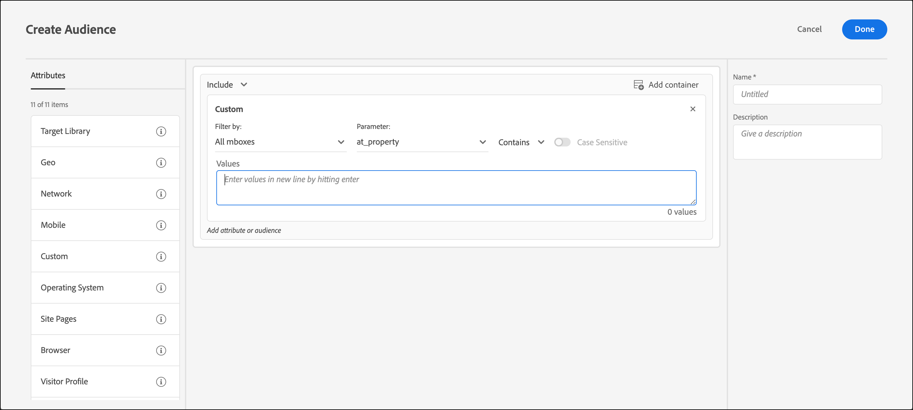

# Benutzerdefinierte Parameter

Benutzerdefinierte Parameter sind mBox-Parameter in [!DNL Adobe Target]. Wenn Sie Mbox-Parameter an Mboxes übergeben oder die `targetPageParams`-Funktion verwenden, werden diese Parameter hier zur Verwendung in Zielgruppen angezeigt.

Weitere Informationen finden Sie unter [Parameter an eine globale Mbox übergeben](https://experienceleague.adobe.com/docs/target-dev/developer/client-side/global-mbox/pass-parameters-to-global-mbox.html?lang=de){target=_blank}.

Wenn Sie eine benutzerdefinierte Zielgruppe basierend auf einem erstellen, erhalten Sie von `mboxParameter`mboxParameter keine Aufforderung mehr, `mboxName` einzugeben. Der Mbox-Name ist jetzt optional. Mit dieser Änderung können Sie Parameter aus mehreren Mboxes verwenden oder auf einen Parameter verweisen, der noch nicht am Rand aufgezeichnet wurde.

1. Klicken Sie in der [!DNL Target] auf **[!UICONTROL Audiences]** > **[!UICONTROL Create Audience]**.
1. Benennen Sie die Zielgruppe und fügen Sie eine optionale Beschreibung hinzu.
1. Ziehen Sie **[!UICONTROL Custom]** per Drag-and-Drop in Audience Builder.

   So wählen Sie den gewünschten Parameter aus:

   * Wählen Sie beim Erstellen einer Zielgruppe einen Parameternamen aus der Liste aus, geben Sie die ersten Zeichen des gewünschten Parameternamen ein oder geben Sie den vollständigen Namen des gewünschten Parameters ein.
   * Wenn Sie sich an den Mbox-Namen, aber nicht an den Parameternamen erinnern, verwenden Sie die Dropdown-Liste [!UICONTROL Filter by] , um nach einer bekannten Mbox zu filtern und den gewünschten Parameter zu übergeben.

   Bei keiner der Methoden gibt es eine Verbindung zwischen Mbox und Parameter. Die Zielgruppe funktioniert basierend auf dem Parameter in allen Mboxes, die diesen Parameter übergeben.

   >[!NOTE]
   >
   >Die aus der Dropdown-Liste [!UICONTROL Filter By] ausgewählte Mbox wird bei der Erstellung einer Aktivität nicht gespeichert. Mit dieser Option können Sie die Parameter je nach der ausgewählten mbox filtern.

   Wenn Sie eine bestehende Zielgruppe bearbeiten, werden die Filterkriterien mit dem Mbox-Namen angezeigt, der bei der Erstellung angegeben wurde.

1. Wählen Sie einen Auswerter:

   * enthält (nicht von Schreibweise abhängig)
   * enthält nicht (nicht von Schreibweise abhängig)
   * Gleich
   * Ist nicht gleich
   * Größer als
   * Größer als oder gleich
   * Kleiner als
   * Kleiner als oder gleich
   * Parameter ist vorhanden
   * Parameter ist nicht vorhanden
   * Parameterwert ist vorhanden
   * Parameterwert ist nicht vorhanden
   * Parameter oder Wert fehlt
   * Mit
   * Endet mit

   

1. Geben Sie jeden Wert in eine neue Zeile ein.
1. (Optional) Richten Sie zusätzliche Regeln für die Zielgruppe ein.
1. Klicken Sie auf **[!UICONTROL Done]**.

Auf der [ der Zielgruppe („Definitionsdetails„) wird ](/help/main/c-target/c-audiences/audiences.md#section_11B9C4A777E14D36BA1E925021945780) Parametername im **[!UICONTROL Rules]** Abschnitt angezeigt. Auf die Mbox, die zum Filtern verwendet wird, wird nicht verwiesen.

>[!NOTE]
>
>Bei benutzerdefinierten Zielgruppen, die vor der Version [!DNL Target] 18.5.1 (22. Mai 2018) erstellt wurden, werden Mbox-Namen nicht in der Popup-Karte der Zielgruppendefinition angezeigt. Speichern Sie die benutzerdefinierte Zielgruppe erneut, um den Mbox-Namen zu erhalten, der auf der Karte angezeigt werden soll.

## Zu beachten {#considerations}

* Zielgruppen und Aktivitäten werden für eine spezifische Mbox ausgewertet. Wenn beispielsweise die globale Mbox einen bestimmten Parameter übergibt, die regionale Mbox jedoch nicht, ist die Aktivität/Zielgruppe, die auf diesen Parameter abzielt, für die regionale Mbox nicht qualifiziert.
* Das Targeting wird nicht für interne Mbox-Parameter wie mboxPC, mboxSession, mbox3rdPartyId, mboxMCSDID, mboxMCAVID, mboxMCGVID, mboxCount, mboxId und mboxVersion ausgewertet.

## Schulungsvideo: Erstellen von Zielgruppen 

Dieses Video enthält Informationen zur Verwendung von Zielgruppenkategorien.

* Erstellen von Zielgruppen
* Festlegen von Zielgruppenkategorien

>[!VIDEO](https://video.tv.adobe.com/v/17392)
