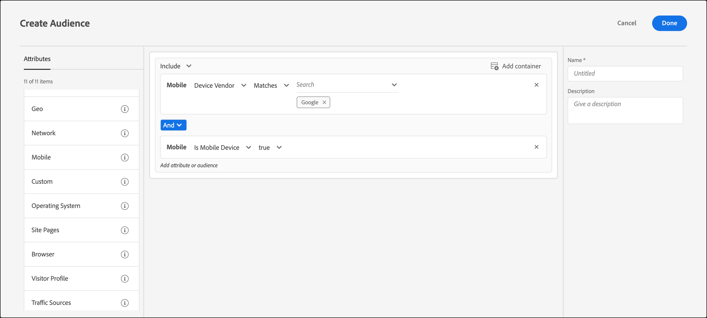

# Mobile

Erstellen Sie Zielgruppen in [!DNL Adobe Target], um Mobilgeräte anhand von Parametern wie Mobilgerät, Gerätetyp, Geräteanbieterfirma, Bildschirmmaße usw. anzusprechen.

Beispielsweise können Sie Benutzern, die Ihre Seite mit einem Smartphone besuchen, andere Inhalte anzeigen als Benutzern, die mit einem Computer kommen. In diesem Fall können Sie die [!UICONTROL Mobile] Zielgruppe und dann die Option **[!UICONTROL Is Mobile Phone]** auswählen. Sie können dann alle spezifischen Details hinzufügen, die für Sie wichtig sind, z. B. den Typ des Telefons, die Größe des Bildschirms (in Pixeln) usw.

Das mobile Targeting wird von [DeviceAtlas](https://deviceatlas.com/device-data/user-agent-tester), einem Service von DotMobi bereitgestellt. DeviceAtlas ist eine umfassende Datenbank mobiler Geräte, die auf Daten beruht, die aus zahlreichen Quellen zusammengefasst wurden, einschließlich von Herstellern und Netzwerkbetreibern. Diese Daten wurden dann geprüft, referenziert und validiert, um eine große, genaue Datenbank der verfügbaren mobilen Geräte zu erstellen.

Für die Geräteerkennung werden die User-Agent-Zeichenfolgen analysiert. Einige Gerätehersteller, z. B. Apple, deaktivieren diese Funktion, indem sie in den User-Agent-Zeichenfolgen keine ausreichenden Informationen bereitstellen.

Apple-Geräte übermitteln beispielsweise in den UA-Daten keine gerätespezifischen Token. Infolgedessen ist es nicht möglich, iPhone-Modelle (wie iPhone 12 Pro, iPhone 12, iPhone 11 Pro Max usw.) mit einer einfachen schlüsselwortbasierten Methode zu erkennen.

Um dieses Problem zu beheben, erfasst [!DNL Target] zusätzliche Daten, um iPhones und andere Apple-Geräte mithilfe der folgenden Parameter genau zu erkennen:

| Parameter | Typ | Beschreibung |
|--- |--- |--- |
| devicePixelRatio | Zeichenfolge | Verhältnis zwischen physischen Pixeln und geräteunabhängigen Pixeln (Dips) im Browser. Beispiel: „1.5“ oder „2“ |
| screenOrientation | Zeichenfolge | Das Gerät und die JavaScript-Engine des Browsers unterstützen die Bildschirmdrehung. Mögliche Werte: Querformat oder Hochformat. |
| webGLRenderer | Zeichenfolge | Browser-Renderer des Grafiktreibers. |

>[!NOTE]
>
>Kundinnen und Kunden, die die Mobile SDK verwenden, müssen nichts tun, um diese Funktion anzuwenden. Kunden, die at.js verwenden, müssen auf at.js Version 1.5.0](https://experienceleague.adobe.com/docs/target-dev/developer/client-side/at-js-implementation/target-atjs-versions.html?lang=de){target=_blank} (oder höher) [ aufrüsten.

Sie können mehr als eine Geräteeigenschaft auswählen. Mehrere Auswahlen werden mit einem OR-Operator verbunden.

Kunden, die eine benutzerspezifische Integration (also weder at.js noch das Mobile SDK) verwenden, können diese Parameter selbst erfassen und als Mbox-Parameter übergeben.

1. Klicken Sie in der [!DNL Target] auf **[!UICONTROL Audiences]** > **[!UICONTROL Create Audience]**.
1. Benennen Sie die Zielgruppe und fügen Sie eine optionale Beschreibung hinzu.
1. Ziehen Sie **[!UICONTROL Mobile]** per Drag-and-Drop in den Bereich Audience Builder .
1. Klicken Sie auf **[!UICONTROL Select]** und wählen Sie dann eine der folgenden Optionen aus:

   * Gerätemarketingbezeichnung
   * Gerätemodell
   * Gerätehersteller
   * Ist Mobilgerät
   * Ist Mobiltelefon
   * Ist Tablet
   * Betriebssystem
   * Bildschirmhöhe (px)
   * Bildschirmbreite (px)

   >[!NOTE]
   >
   >Sie können das Targeting nach Mobilnetzbetreiber mithilfe der [Geo-Einstellungen](/help/main/c-target/c-audiences/c-target-rules/geo.md#concept_5B4D99DE685348FB877929EE0F942670) vornehmen.

1. (Optional) Richten Sie zusätzliche Regeln für die Zielgruppe ein.
1. Klicken Sie auf **[!UICONTROL Done]**.

Die folgende Abbildung zeigt eine Zielgruppe, die Besuchende anspricht, die von Google hergestellte Geräte verwenden, bei denen es sich um Mobilgeräte handelt.

## Zu beachten

Beachten Sie beim Targeting von Mobilgeräten die folgenden Informationen:

### Targeting von Geräten mit iOS 12.2 oder höher

Aufgrund der neuen Änderungen in iOS 12.2 ist die Erstellung einer Zielgruppe mit Regeln, die von [!UICONTROL Device Marketing Name] und [!UICONTROL Device Model] definiert werden und iPhone-Modelle angeben, nicht mehr möglich. [!DNL Target] können keine Benutzer mehr ansprechen, auf denen iPhones mit iOS 12.2 (oder höher) installiert sind. Wenn diese Benutzenden jedoch nicht über iOS 12.2 (oder höher) verfügen, funktioniert das iPhone-Modell-Targeting weiterhin ordnungsgemäß.

Das Update von iOS 12.2 (oder höher) wirkt sich nicht auf die Identifizierung der folgenden Modelle aus, da diese das Upgrade auf iOS 12.2 nicht unterstützen: iPhone, iPhone 3G, iPhone 3GS, iPhone 4, iPhone 4s, iPhone 5, iPhone 5c, iPad, iPad 2, iPad / Retina-Display, iPad Retina (4. Generation), iPod Touch 4 und iPod Touch 5.

### Targeting von Geräten, auf denen Safari 14.0.2 (oder höher) ausgeführt wird

Wenn Sie mobile Regeln verwenden, um Geräte anzusprechen, auf denen Safari Version 14.0.2 (oder höher) auf macOS ausgeführt wird, identifiziert [!DNL Target] Safari aufgrund eines bekannten Problems mit Apples Benutzeragenten und DeviceAtlas auf Mac- und iPad-Geräten fälschlicherweise. Diese Frage wird in Zukunft behandelt.

## Schulungsvideo: Erstellen von Zielgruppen

Dieses Video enthält Informationen zur Verwendung von Zielgruppenkategorien.

* Erstellen von Zielgruppen
* Festlegen von Zielgruppenkategorien

>[!VIDEO](https://video.tv.adobe.com/v/17392)
