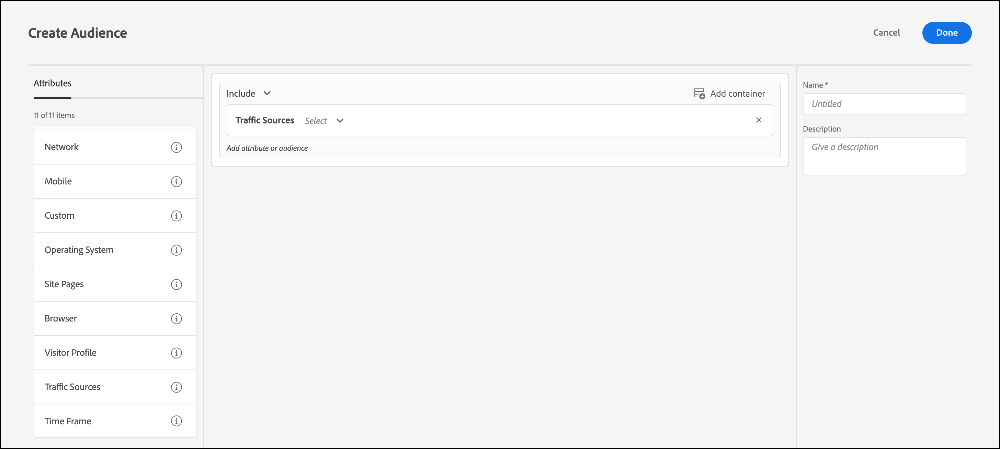

# Traffic-Quelle

Erstellen von Zielgruppen in [!DNL Adobe Target] , um Besucher auf Basis der Suchmaschine oder Landingpage auszuwählen, von der sie auf Ihre Site geleitet werden.

Sie können z. B. das Ziel nach dem Browser des Benutzers, der Suchmaschine oder der verweisenden Landingpage bestimmen. Die verweisende Landingpage ist die Seite, von der der Besucher in dieser Sitzung zur aktuellen Site gelangte. (Wenn der Besucher z. B. auf eine Anzeige in Google geklickt hat und diese Sie ihn zur Homepage `adobe.com` führte, ist die verweisende Landingpage `google.com`.)

Sie können mehrere Traffic-Quellen kombinieren, um eine komplexe Targeting-Regel zu erstellen.

1. Klicken Sie in der [!DNL Target]-Oberfläche auf **[!UICONTROL Zielgruppe]** > **[!UICONTROL Zielgruppe erstellen]**.
1. 
   1. Benennen Sie die Zielgruppe und fügen Sie eine optionale Beschreibung hinzu.
1. Drag &amp; Drop **[!UICONTROL Traffic-Quellen]** in den Audience Builder-Bereich.

   

1. Klicken Sie auf **[!UICONTROL Auswählen]** und wählen Sie anschließend eine der folgenden Optionen aus:

   * **[!UICONTROL Von Baidu]**
   * **[!UICONTROL Von Bing]**
   * **[!UICONTROL Von Google]**
   * **[!UICONTROL Von Yahoo]**
   * **[!UICONTROL Verweis-Landingpage: URL]**
   * **[!UICONTROL Verweis-Landingpage: Domain]**
   * **[!UICONTROL Verweis-Landingpage: Abfrage]**

   Abhängig von Ihrer Auswahl müssen Sie möglicherweise zusätzliche Informationen bereitstellen (Auswerter und/oder Werte).

1. (Optional) Richten Sie zusätzliche Regeln für die Zielgruppe ein.
1. Klicken Sie auf **[!UICONTROL Fertig]**.

Sie können Benutzer, die durch eine bestimmte Suchmaschine oder eine bestimmte Landingpage auf Ihre Site verwiesen werden, als Ziel auswählen.

## Schulungsvideo: Erstellen von Zielgruppen 

Dieses Video enthält Informationen zur Verwendung von Zielgruppenkategorien.

* Erstellen von Zielgruppen
* Festlegen von Zielgruppenkategorien

>[!VIDEO](https://video.tv.adobe.com/v/17392)
