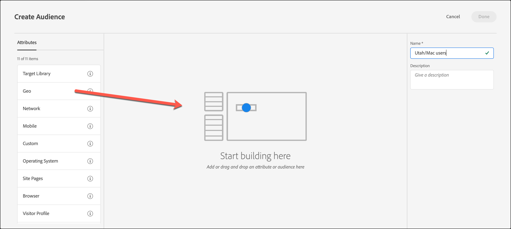

# Erstellen von Zielgruppen in [!DNL Target]

Erstellen Sie benutzerdefinierte Zielgruppen und speichern Sie sie in der [!DNL Adobe Target] [!UICONTROL Audiences]-Bibliothek, um sie in Ihren Aktivitäten zu verwenden. Sie können auch eine vorhandene Zielgruppe kopieren, die Sie dann bearbeiten können, um eine ähnliche Zielgruppe zu erstellen und mehrere Zielgruppen zu kombinieren.

## Zielgruppenüberblick

Zielgruppen werden durch Regeln definiert, die bestimmen, wer in eine [!DNL Target]-Aktivität eingeschlossen und wer davon ausgeschlossen wird. Eine Zielgruppendefinition kann mehrere Regeln enthalten, wobei die einzelnen Regeln wiederum mehrere Parameter aufweisen können. Komplexe Zielgruppendefinitionen greifen auf die booleschen Operatoren „AND“ und „OR“ zurück, um Regeln und Parameter zu kombinieren und Ihnen so weitreichende Kontrolle darüber zu geben, welche Websitebesucher als Aktivitätsteilnehmer gezählt werden.

Wenn Sie Regeln oder Parameter mit UND kombinieren, muss jedes potenzielle Mitglied der Zielgruppe *alle* definierten Bedingungen erfüllen, damit es als Teilnehmer aufgenommen werden kann. Wenn Sie zum Beispiel eine Betriebssystemregel und eine Browserregel definieren, werden nur die Besucher, die sowohl das definierte Betriebssystem *als auch* den definierten Browser verwenden, in die Aktivität aufgenommen.

Wenn Sie Regeln oder Parameter mit „OR“ kombinieren, müssen die Mitglieder der Zielgruppe nur eine der definierten Bedingungen erfüllen, damit sie als Teilnehmer gezählt werden. Wenn Sie zum Beispiel mehrere Regeln für Mobilgeräte definieren, die mit „OR“ verbunden sind, werden Besucher, die *ein beliebiges* Kriterium erfüllen, in die Aktivität eingeschlossen.

Sie können die beiden booleschen Operatoren auch mischen und so komplexe Regeln schaffen, allerdings müssen Operatoren auf derselben Regelebene übereinstimmen. Die Benutzeroberfläche wendet automatisch den richtigen Operator an.

Die folgende Regel richtet sich beispielsweise an Besucherinnen und Besucher, die [!DNL Chrome]- *-*-[!DNL Firefox] auf einem [!DNL Windows] verwenden:

>[!NOTE]
>
>Achten Sie darauf, dass Ihre Regeln nicht alle Mitglieder der Zielgruppe ausschließen. Beispielsweise ist es nicht möglich, dass jemand eine Seite gleichzeitig mit [!DNL Chrome] *und* [!DNL Firefox] besucht.

## Erstellen von Zielgruppen

1. Klicken Sie in der oberen Menüleiste auf **[!UICONTROL Audiences]** .

   

1. Klicken Sie in der [!UICONTROL Audiences] auf **[!UICONTROL Create Audience]**.

   Oder

   Um eine vorhandene Audience zu kopieren, klicken Sie in der Liste &quot;[!UICONTROL Audiences]&quot; auf das **[!UICONTROL More Actions]** (  ) für die Audience, die Sie kopieren möchten, und klicken Sie dann auf **[!UICONTROL Duplicate]**. Sie können die Zielgruppe anschließend bearbeiten, um eine ähnliche Zielgruppe zu erstellen.

1. Geben Sie einen eindeutigen, beschreibenden Zielgruppennamen und eine optionale Beschreibung ein.

   Zielgruppennamen können nicht mit den folgenden Zeichen beginnen:

   `=  +  -  !  @`

   Zielgruppennamen dürfen keine der folgenden Zeichensequenzen enthalten:

   `;=  ;+  ;-  ;@  ,=  ,+  ,-  ,@  ["  "]  ['  ]'`

1. Ziehen Sie die gewünschten Attribute per Drag-and-Drop aus der **[!UICONTROL Attributes]** auf der linken Seite in den Bereich Audience Builder .

   

   Jeder Regeltyp hat eigene Parameter. Weitere Informationen zum Konfigurieren der einzelnen Typen von Zielgruppenregeln finden Sie unter [Kategorien für Zielgruppen](/help/main/c-target/c-audiences/c-target-rules/target-rules.md#concept_E3A77E42F1644503A829B5107B20880D).

1. Definieren Sie die Regelparameter.

   Die folgende Zielgruppe richtet sich beispielsweise unter dem Betriebssystem [!DNL Macintosh] an Besucher aus Utah.

   

1. (Bedingt) Fahren Sie mit dem Hinzufügen und Definieren der gewünschten Attribute fort.

   Um einen weiteren Container zu erstellen, klicken Sie auf **[!UICONTROL Add container]** oder ziehen Sie einfach ein anderes Attribut in den Audience Builder-Bereich. Sie können dann den Operator (UND oder ODER) mithilfe der Dropdown-Liste anpassen.

1. Klicken Sie auf **[!UICONTROL Done]**.

   Neu erstellte Zielgruppen werden erst nach einigen Sekunden Verarbeitungszeit in der Liste angezeigt. Falls die Zielgruppe nicht sofort in der Liste angezeigt wird, können Sie danach suchen oder die Liste aktualisieren.

## Schulungsvideo: Erstellen von Zielgruppen 

Dieses Video enthält Informationen zur Erstellung von Zielgruppen.

* Erstellen von Zielgruppen
* Festlegen von Zielgruppenkategorien

>[!VIDEO](https://video.tv.adobe.com/v/17392)
