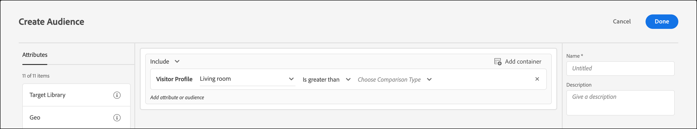

# Erstellen einer Zielgruppe zum Profilattributvergleich

Definieren Sie eine Zielgruppe in [!DNL Adobe Target], um zwei Profilattribute für Ihre [Zielgruppenbibliothek](/help/main/c-target/c-audiences/audiences.md) oder in einer [ Zielgruppe zu vergleichen](/help/main/c-target/creating-activity-only-audience.md). Definieren Sie über Operatoren wie „größer als“, „kleiner als“ oder „gleich“ eine Zielgruppe, um die Werte zweier verschiedener Profilattribute dynamisch miteinander zu vergleichen.

>[!NOTE]
>
>Diese Funktion ist nur für die [[!UICONTROL Visitor Profile]](/help/main/c-target/c-audiences/c-target-rules/visitor-profile.md#concept_E972690B9A4C4372A34229FA37EDA38E) verfügbar.

## Überblick {#section_303CBC78194D49A2A004945D425441E1}

Zielgruppen werden durch Regeln definiert, die bestimmen, wer in eine [!DNL Target]-Aktivität eingeschlossen und wer davon ausgeschlossen wird. Eine Zielgruppendefinition kann mehrere Regeln enthalten, wobei die einzelnen Regeln wiederum mehrere Parameter aufweisen können. Wenn eine der eingeschlossenen Regeln die Kategorie [!UICONTROL Visitor Profile] verwendet, können Sie eine Regel definieren, die auf dem spezifischen Wert eines Besucherprofilattributs basiert, oder den Wert dieses Attributs mit einem anderen Besucherprofilattribut vergleichen.

Nehmen wir beispielsweise an, Sie arbeiten für ein Möbelunternehmen und haben zwei Tendenzwerte für Kunden in [!DNL Target] hochgeladen:

* Wahrscheinlichkeit, in den nächsten 90 Tagen Esszimmermöbel zu kaufen
* Wahrscheinlichkeit, in den nächsten 90 Tagen Wohnzimmermöbel zu kaufen

Sie könnten eine Zielgruppe erstellen, die dadurch definiert ist, dass die Neigung zum Kauf von Esszimmermöbeln größer als die Neigung zum Kauf von Wohnzimmermöbeln ist. [!DNL Target] würden dann die Tendenz-Scores des Esszimmers und des Wohnzimmers für einen bestimmten Besucher dynamisch vergleichen, um zu bestimmen, ob dieser Besucher für diese Zielgruppe geeignet ist.

Weitere Informationen finden Sie unter [Verfahren für die Datenübernahme in Target](https://experienceleague.adobe.com/docs/target-dev/developer/implementation/methods/methods-to-get-data-into-target.html?lang=de){target=_blank}.

## Erstellen einer Zielgruppe zum Profilattributvergleich {#section_7A62FD47D5C74C3EBC3417ACDBB85013}

1. Klicken Sie auf **[!UICONTROL Audiences]** > **[!UICONTROL Create Audience]**.
1. Benennen Sie die Zielgruppe und fügen Sie eine optionale Beschreibung hinzu.
1. Ziehen Sie **[!UICONTROL Visitor Profile]** per Drag-and-Drop in den Bereich Audience Builder .
1. Wählen Sie aus der Dropdown-Liste **[!UICONTROL Visitor Profile]** ein Attribut aus:

   

1. Wählen Sie einen Auswerter aus:

   

1. Wählen Sie in der Dropdown-Liste **[!UICONTROL Choose Comparison Type]** die Option **[!UICONTROL Attribute]** aus.

   Mit dem Vergleichstyp „statischer Wert“ können Sie Ihr Besucherprofilattribut mit bestimmten Werten vergleichen.

   

   >[!NOTE]
   >
   >Wenn Sie eine der standardmäßigen Besucherprofilkategorien (z. B. „Neuer Besucher“ oder „Wiederkehrender Besucher„) verwenden, können Sie nur die Option „Statischer Wert“ auswählen. Die dynamischen Vergleichsoptionen sind nur für Standardkategorien verfügbar. Andere Beispiele, in denen die dynamischen Vergleichsoptionen nicht verfügbar sind, umfassen „Erste Seite der Sitzung“, „Nicht in anderen Tests“, „Nicht die erste Seite der Sitzung“ und „Kategorieaffinität“.

1. Wählen Sie das zusätzliche Attribut aus, das Sie mit dem ursprünglichen Attribut vergleichen wollen.

   

1. Klicken Sie auf **[!UICONTROL Done]**.

## Schulungsvideo  {#section_3BB8DBF3418F4520B3E274B6F40AF8F3}

Das folgende Video enthält weitere Informationen sowie ein Szenario, in dem Sie diese Funktion einsetzen könnten:

>[!VIDEO](https://video.tv.adobe.com/v/328066?captions=ger)
