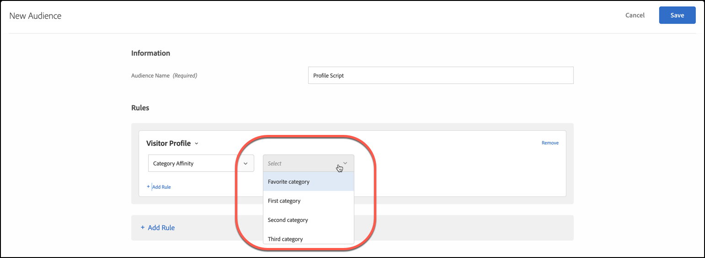

# Kategorieaffinität

Die Funktion zur Kategorieaffinität in [!DNL Adobe Target] erfasst automatisch die Kategorien auf Ihrer Site, die eine Benutzerin oder ein Benutzer besucht, und berechnet dann die Affinität für jede Kategorie, damit sie zielgerichtet eingesetzt und segmentiert werden kann. Mit der Kategorieaffinität können Sie sicherstellen, dass Inhalte auf Besuchende ausgerichtet sind, die am ehesten auf diese Informationen reagieren.

## Übergeben von Kategorieaffinitätsinformationen an [!DNL Target] {#section_B0C8E46EEBAC4549AD90352A47787D04}

Wenn ein Benutzer Ihre Site besucht, werden besucherspezifische Profilparameter in der [!DNL Target]-Datenbank aufgezeichnet. Diese Daten sind an das Cookie des Benutzers gebunden. Ein nützlicher Parameter ist `user.categoryId`, ein mbox-Parameter, der auf einer Produktseite zugewiesen wird. Wenn der Besucher weiter auf der Site surft oder für eine andere Sitzung zurückkehrt, können die Produktkategorien aufgezeichnet werden, die sich ein bestimmter Benutzer ansieht. Sie können Kategorieinformationen auch aufzeichnen, indem Sie sie als Mbox-Parameter `user.categoryId` in einer beliebigen Mbox (einschließlich einer verschachtelten Mbox), als URL-Parameter `user.categoryId` oder in [!DNL Target] Seitenparametern mit einer globalen Mbox übergeben. Weitere Informationen erhalten Sie von Ihrem Kundenbetreuer.

Trennen Sie Kategorien durch ein Komma, um ein Element in mehrere Kategorien einzubeziehen. Beispiel:

* `user.categoryId=clothing,shoes,nike,running,nike clothing,nike shoes,nike running shoes`

Auf Grundlage der Häufigkeit und Neuigkeit der Besuche Ihrer Produktkategorien wird die Kategorieaffinität (falls vorhanden) eines Besuchers erfasst. Kategorieaffinität kann zur zielgerichteten Anwendung auf Zielgruppen für Ihre Aktivitäten verwendet werden.

Sie können `user.categoryAffinities[]` in einem Profilskript verwenden, um ein Array der Affinitäten zurückzugeben, die ein Besucher ausgefüllt hat. Weitere Informationen finden Sie unter [user.categoryAffinties unter Objekte und Methoden in Profilattributen](/help/main/c-target/c-visitor-profile/profile-parameters.md#objects).

>[!IMPORTANT]
>
>Das `user.categoryId` Attribut, das für den Kategorieaffinitätsalgorithmus verwendet wird, unterscheidet sich von dem `entity.categoryId` Attribut, das für die Produkt- und Inhaltsempfehlungen der [!DNL Adobe Target Recommendations] verwendet wird. `user.categoryId` ist erforderlich, um die bevorzugte Kategorie eines Benutzers zu verfolgen. `entity.categoryId` ist erforderlich, um Empfehlungen auf der Basis der Kategorie der aktuellen Seite oder des aktuellen Elements zu erhalten. Übergeben Sie beide Werte an [!DNL Target], wenn Sie beide Funktionen verwenden möchten.

## Business Case für Kategorieaffinität {#section_D6FF913E88E6486B8FBCE117CA8B253B}

Die Aktivität eines Besuchers in einer Sitzung, z. B. welche Kategorie er am häufigsten anzeigt, kann bei nachfolgenden Besuchen für die Zielgruppenbestimmung verwendet werden. Jede Kategorieseite, die sich ein Besucher während seiner Sitzung anzeigen lässt, wird erfasst und seine „Lieblingskategorie“ wird auf Grundlage eines Neuigkeits- und Häufigkeitsmodells berechnet. Anschließend kann bei jedem erneuten Aufrufen der Startseite durch den Besucher der Hero-Image-Bereich angesprochen werden, um Inhalte anzuzeigen, die zu ihrer bevorzugten Kategorie gehören.

## Beispiel für die Verwendung der Kategorieaffinität {#section_A4AC0CA550924CB4875F4F4047554C18}

Stellen Sie sich vor, dass Sie online Musikinstrumente verkaufen und zielgerichtete Verkaufs-Promo-Aktionen für Bassgitarren bei Besuchern durchführen möchten, die bereits in der Vergangenheit Interesse an Gitarren gezeigt haben. Mithilfe der Kategorieaffinität können Sie Angebote erstellen, die ausschließlich Besuchern mit der entsprechenden Kategorieaffinität angezeigt werden.

## Algorithmus der Kategorieaffinität {#section_8B86C7FF50294208866ABF16F07D5EB9}

Der Algorithmus für die Kategorieaffinität funktioniert wie folgt:

* Zehn Punkte für die erste angezeigte Kategorie
* Fünf Punkte für jede Kategorie, die nach dem ersten angeklickt wird
* Wenn auf eine neue Kategorie geklickt wird, wird 1 von allen zuvor angeklickten Kategorien subtrahiert
* Wenn eine Kategorie bereits angeklickt (angezeigt) wurde, wird beim erneuten Klicken 1 nicht von allen anderen Kategorien abgezogen
* Wenn auf eine sechste neue Kategorie geklickt wird, wird die als am niedrigsten eingestufte Kategorie der ersten fünf Kategorien aus der Berechnung entfernt
* Teilen Sie am Ende der Sitzung alle Werte durch 2

>[!NOTE]
>
>Wenn mehrere Kategorien innerhalb eines einzelnen Mbox-Aufrufs übergeben werden, ist die Reihenfolge der Kategorien in `categoryAffinities` nicht garantiert. Eine beliebige Kategorie wird zuerst aufgezeichnet und erhält den Score 10.

### Beispiel: Kategorieaffinitäts-Algorithmus

Wenn jemand z. B. die `mens-clothing`-Kategorie ansieht, dann `accessories`, dann `jewelry`, und dann `accessories` erneut in einer Sitzung aufruft, führt dies zu Affinitäten von:

* `accessories`: 9 (= +5 – 1 + 5)

* `mens-clothing`: 8 (= +10 – 1 – 1)

* `jewelry`: 5 (= +5)

Wenn die Sitzung beendet wird und der Benutzer später zur Site zurückkehrt, werden die Ergebnisse halbiert:

* `accessories`: 4,5 (= 9/2)

* `mens-clothing`: 4 (= 8/2)

* `jewelry`: 2,5 (= 5/2)

Angenommen, der Benutzer sieht sich dann, in dieser Reihenfolge, `jewelry`, `accessories`, `beauty`, `shoes` und `womens-clothing` an:

* `accessories`: 6.5 (= 4.5 + 5 – 1 – 1 – 1)

* `womens-clothing`: 5 (= +5)

* `jewelry`: 4.5 (= 2.5 + 5 – 1 – 1 – 1)

* `shoes`: 4 (= +5 – 1)

* `beauty`: 3 (= +5 – 1 – 1)

* `mens-clothing` wird nach dem letzten Klick auf `womens-clothing` fallengelassen, da es mit einem Wert von 1 (= 4 – 1 – 1 – 1) die Kategorie mit der niedrigsten Bewertung ist

Wenn die Sitzung beendet wird und der Benutzer später zur Site zurückkehrt, werden die Ergebnisse halbiert:

* `accessories`: 3,3 (= 6,5/2)

* `womens-clothing`: 2,5 (= 5/2)

* `jewelry`: 2,3 (= 4,5/2)

* `shoes`: 2 (= 4/2)

* `beauty`: 1,5 (= 3/2)

## Kategorieaffinität für das Targeting verwenden {#concept_5750C9E6C97A40F8B062A5C16F2B5FFC}

Die folgenden Abschnitte enthalten Informationen zur Verwendung einer Kategorieaffinität zum Targeting in einer Aktivität.

### Zielgruppe zur Verwendung der Kategorieaffinität erstellen {#section_A27C600BBA664FE7A74F8FE076B78F40}

1. Klicken Sie in der **[!UICONTROL Audiences]** auf **[!UICONTROL Create Audience]**.

   Oder

   Möchten Sie eine Zielgruppe kopieren, halten Sie in der Zielgruppenliste den Mauszeiger über die gewünschte Zielgruppe und klicken Sie auf das Kopiersymbol. Sie können die Zielgruppe anschließend bearbeiten, um eine ähnliche Zielgruppe zu erstellen.

1. Geben Sie einen beschreibenden Namen für die Zielgruppe ein.
1. Klicken Sie auf **[!UICONTROL + Add Rule]** > **[!UICONTROL Visitor Profile]**.
1. Wählen Sie in der Dropdown-Liste **[!UICONTROL Visitor Profile]** die Option **[!UICONTROL Category Affinity]** aus.

   

1. Wählen Sie die gewünschte Kategorie aus:

   

   Zu den Kategorien gehören:

   * Favoritenkategorie
   * Erste Kategorie
   * Zweite Kategorie
   * Dritte Kategorie
   * Vierte Kategorie
   * Fünfte Kategorie

   Die Optionen „Favoritenkategorie“ und „Erste Kategorie“ sind gleichwertig.

1. Wählen Sie den Evaluator aus:

   * enthält (nicht von Schreibweise abhängig)
   * enthält nicht (nicht von Schreibweise abhängig)
   * Gleich

1. Geben Sie jeden neuen Wert in einer eigenen Zeile an (beispielsweise „Schuhe“).
1. Klicken Sie auf **[!UICONTROL Save]**.

### Verwenden der Kategorieaffinitätszielgruppe in einer Aktivität {#section_91526B942D1B4AEBB8FCDF4EBFF931CF}

Sie können Zielgruppen mit Kategorieaffinität in jeder Aktivität verwenden. Wählen Sie während des Drei-Schritte-Workflows im [!UICONTROL Target] die gewünschte Zielgruppe aus.
