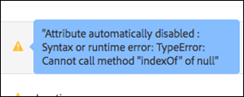

# Profilattribute

Profilattribute in [!DNL Adobe Target] sind Parameter, die speziell für einen Besucher gelten. Diese Attribute werden im Besucherprofil gespeichert. Sie enthalten Informationen über den Besucher, die Sie in Ihren Aktivitäten verwenden können.

Ein Benutzerprofil enthält demografische und Verhaltensinformationen zu einem Website-Besucher. Diese Informationen können Alter, Geschlecht, gekaufte Produkte, den letzten Besuch usw. umfassen. [!DNL Target] verwendet diese Informationen, um den Inhalt zu personalisieren, der diesem Besucher bzw. dieser Besucherin bereitgestellt wird.

Wenn ein Besucher auf Ihrer Website surft oder erneut Ihre Website aufruft, können die gespeicherten Profilattribute im Profil genutzt werden, Inhalte für ihn auszuwählen oder Informationen zur Segmentfilterung zu erfassen.

So richten Sie Profilattribute ein:

1. Klicken Sie auf **[!UICONTROL Audiences]** > **[!UICONTROL Profile Scripts.]**

   

1. Klicken Sie auf **[!UICONTROL Create Script]**.

   

   Die folgenden Typen von Profilattributen sind verfügbar:

   | Parametertyp | Beschreibung |
   |--- |--- |
   | mbox | Direkt über den Seiten-Code beim Erstellen der Mbox weitergegeben Siehe [Übergeben von Parametern an eine globale Mbox](https://experienceleague.adobe.com/docs/target-dev/developer/client-side/global-mbox/pass-parameters-to-global-mbox.html?lang=de){target=_blank} im *Target-Entwicklerhandbuch*.<P>**Hinweis**: [!DNL Target] erlaubt pro Mbox-Aufruf maximal 50 eindeutige Profilattribute. Wenn Sie mehr als 50 Profilattribute an [!DNL Target] übergeben müssen, verwenden Sie dazu die [!UICONTROL Profile Update API]. Weitere Informationen finden Sie unter [Profile aktualisieren](https://experienceleague.adobe.com/docs/target-dev/developer/api/profile-apis/profile-api-overview.html?lang=de){target=_blank} im *Target-Entwicklerhandbuch*. |
   | Profil | Direkt mit einem JavaScript-Code-Snippet definiert. Mit diesen Snippets können laufende Gesamtsummen wie das insgesamt vom Kunden ausgegebene Geld gespeichert werden. Die Skripte werden bei jeder mBox-Anfrage ausgeführt. Siehe *Profilskriptattribute* unten. |

## Profilskriptattribute {#concept_8C07AEAB0A144FECA8B4FEB091AED4D2}

Definieren Sie ein Profilskriptattribut mit dem zu diesem gehörigen JavaScript-Code-Snippet.

Mithilfe von Profilskripten können Sie Besucherattribute über mehrere Besuche hinweg erfassen. Profilskripte sind Code-Snippets, die in [!DNL Target] definiert werden und eine Art von Server-seitigem JavaScript verwenden. Beispielsweise könnten Sie ein Profilskript verwenden, um zu erfassen, wie oft ein Besucher auf Ihre Site kommt und wann der letzte Besuch dieses Besuchers stattfand.

Profilskripte sind nicht das Gleiche wie Profilparameter. Profilparameter zeichnen mithilfe der Implementierung des Mbox-Codes von [!DNL Target] Benutzerdaten auf.

## Profilskripte erstellen {#section_CB02F8B97CAF407DA84F7591A7504810}

Profilskripte sind in der Registerkarte [!UICONTROL Audiences] in der [!DNL Target] verfügbar.

Um ein Profilskript hinzuzufügen, klicken Sie auf die Registerkarte **[!UICONTROL Profile Scripts]** und schreiben Sie **[!UICONTROL Create Script]** das Skript.

Oder

Um ein vorhandenes Profilskript zu kopieren, klicken Sie in der Liste [!UICONTROL Profile Scripts] auf das Auslassungssymbol für das gewünschte Skript und dann auf **[!UICONTROL Duplicate]**.

Sie können die Zielgruppe anschließend bearbeiten, um eine ähnliche Zielgruppe zu erstellen.

Profilskripte führen bei jeder Ortsanfrage Profilattribut-„Fänger“ aus. Wenn eine Ortsanfrage eingeht, bestimmt [!DNL Target], welche Aktivität ausgeführt werden soll, und zeigt Inhalte an, die für diese Aktivität und das jeweilige Erlebnis geeignet sind. [!DNL Target] verfolgt auch den Erfolg der Aktivität und führt dafür relevante Profilskripte aus. Auf diese Weise können Sie Informationen über den Besuch erfassen, z. B. Ort des Besuchers, Tageszeit und Anzahl der Besuche auf der Site, ob zuvor ein Kauf getätigt wurde usw. Diese Informationen werden dann zum Benutzerprofil hinzugefügt, sodass Sie die Besucheraktivitäten auf Ihrer Site besser verfolgen können.

Profilskriptattribute haben das `user.`-Tag vor dem Attributnamen eingefügt. Beispiel:

```
if (mbox.name == 'Track_Interest') { 
    if (profile.get('model') == "A5" &&; profile.get('subcat') == "KS6") { 
        return (user.get('A5KS6') || 0) + 1; 
    } 
}
```

Berücksichtigen Sie Folgendes:

* Verweisen Sie auf Profilskriptattribute (einschließlich es selbst) im Code mit `user.get('parameterName')`.
* Speichern Sie Variablen, die beim nächsten Ausführen des Skripts (bei der nächsten Mbox-Anfrage) aufgerufen werden können, mit `user.setLocal('variable_name', 'value')`. Verweisen Sie auf die Variable mit `user.getLocal('variable_name')`. Dies ist hilfreich in Situationen, in denen Sie einen Verweis für Datum und Uhrzeit der letzten Anfrage setzen möchten.

  Diese Werte bleiben wie ein Profilskript erhalten, Sie haben jedoch nur Zugriff auf sie innerhalb des Skripts, in dem sie festgelegt wurden.

* Bei Parametern und Werten wird zwischen Groß- und Kleinschreibung unterschieden. Achten Sie auf die Groß- und Kleinschreibung der Parameter und Werte, die Sie während der Aktivität oder des Tests empfangen.
* Weitere JavaScript-Syntax finden Sie im Abschnitt „JavaScript-Referenz für Skript-Profilparameter“.
* Der Parameter verbleibt auch nach der Deaktivierung des Skripts im Profil. Benutzer, deren Profil bereits einen Parameter enthält, der in der Zielgruppe einer Aktivität verwendet wird, sind in dieser Aktivität qualifiziert.
* Profilskripte können nicht gelöscht werden, während sie in einer Aktivität verwendet werden.
* Eine Erstellung abhängiger Profilskripte, die das Ergebnis eines Profilskripts in einem anderen Profilskript verwenden, wird nicht empfohlen. Die Reihenfolge der Ausführung von Profilskripten ist nicht garantiert.

## Anzeigen der Karten mit Profilskriptinformationen {#section_18EA3B919A8E49BBB09AA9215E1E3F17}

Sie können Popupkarten mit Profilskriptinformationen (ähnlich den Karten mit Angebotsinformationen) anzeigen. Auf diesen Karten mit Profilskriptinformationen können Sie die Liste der Aktivitäten, die auf das ausgewählte Profilskript verweisen, sowie weitere nützliche Metadaten anzeigen.

Beispielsweise kann die folgende Profilskript-Informationskarte durch Klicken auf das [!UICONTROL Info] für das gewünschte Profilskript in der Liste geöffnet werden ([!UICONTROL Audiences] > [!UICONTROL Profile Scripts]).

Die Registerkarte [!UICONTROL Script Info] enthält die folgenden Informationen: Name, Beschreibung und Skript-Code.


Klicken Sie auf **[!UICONTROL View full details]** , um die Zielgruppen und Aktivitäten anzuzeigen, die auf das ausgewählte Profilskript verweisen.


>[!NOTE]
>
>Auf der Registerkarte [!UICONTROL Script Usage] werden in den folgenden Situationen keine Aktivitäten angezeigt, die auf das ausgewählte Profilskript verweisen:
>
> * Die Aktivität befindet sich im Status [!UICONTROL Draft] .
> * Die in der Aktivität verwendeten Inhalte oder Angebote verwenden Skriptvariablen (entweder ein Inline-Angebot innerhalb der Aktivität oder ein Angebot in der Angebotsbibliothek).

## Target deaktiviert in bestimmten Situationen Profilskripte {#section_C0FCB702E60D4576AD1174D39FBBE1A7}

[!DNL Target] deaktiviert in bestimmten Situationen automatisch Profilskripte, beispielsweise wenn diese für die Ausführung zu lang sind oder über zu viele Anweisungen verfügen.

Wird ein Profilskript deaktiviert, erscheint in der Target-Benutzeroberfläche neben dem betroffenen Skript ein gelbes Warnsymbol, wie unten dargestellt:


Halten Sie den Mauszeiger darüber, werden Fehlerdetails angezeigt, wie unten dargestellt:



Typische Gründe für die Deaktivierung von Profilskripten durch das System sind unter anderem folgende:

* Es wird eine nicht definierte Variable referenziert.
* Ein ungültiger Wert wird referenziert. Dieser Fehler tritt häufig aufgrund des Bezugs auf URL-Werte und anderer vom Benutzer eingegebener Daten auf, die nicht ordnungsgemäß validiert wurden.
* Zu viele JavaScript-Anweisungen wurden verwendet. [!DNL Target] erlaubt einen Maximalwert von 2.000 JavaScript-Anweisungen pro Skript. Dieser Maximalwert kann jedoch nicht einfach durch manuelles Lesen von JavaScript festgestellt werden. Rhino beispielsweise behandelt alle Funktionsaufrufe und „neuen“ Aufrufe als 100 Anweisungen. Jeder Aufruf einer Funktion verbraucht 100 Anweisungen. Außerdem kann sich die Größe der eingegebenen Daten (beispielsweise der URL-Werte) auf die Anzahl der Anweisungen auswirken.
* Nichtbefolgen der unten beschriebenen [Best Practices](/help/main/c-target/c-visitor-profile/profile-parameters.md#section_64AFE5D2B0C8408A912FC2A832B3AAE0).

## Best Practices {#best}

Die folgenden Richtlinien helfen Ihnen dabei, vereinfachte Profilskripte zu verfassen, die möglichst fehlerfrei sind. Sie können Code schreiben, der so fehlschlägt, dass die Skripts ohne erzwungenes Beenden des Skripts durch das System verarbeitet werden. Diese Leitlinien sind das Ergebnis der Best Practices, die für eine effiziente Funktionsweise nachgewiesen wurden. Diese Richtlinien gelten neben den Grundsätzen und Empfehlungen der Rhino-Entwicklungsgemeinde.

* Setzen Sie den aktuellen Skriptwert auf eine lokale Variable im Benutzerskript, und legen Sie einen Failover im leeren String fest.
* Validieren Sie die lokale Variable, indem Sie sicherstellen, dass sie kein leerer String ist.
* Verwenden Sie die String-basierten Manipulationsfunktionen oder regulären Ausdrücke.
* Verwenden Sie limited for- bzw. open ended for-Schleifen oder while-Schleifen.
* Halten Sie die Vorgabe von maximal 1.300 Zeichen bzw. 50 Schleifeniterationen ein.
* Überschreiten Sie nicht die Maximalzahl von 2.000 JavaScript-Anweisungen. [!DNL Target] verfügt über einen Maximalwert von 2.000 JavaScript-Anweisungen pro Skript, dieser Maximalwert kann jedoch nicht einfach durch manuelles Lesen des JavaScript bestimmt werden. Rhino beispielsweise behandelt alle Funktionsaufrufe und „neuen“ Aufrufe als 100 Anweisungen. Außerdem kann sich die Größe der eingegebenen Daten (beispielsweise der URL-Werte) auf die Anzahl der Anweisungen auswirken.
* Berücksichtigen Sie nicht nur die individuelle Skriptperformance, sondern auch die Performance aller Skripte. Als Best Practice empfiehlt [!DNL Adobe] insgesamt weniger als 5.000 Anweisungen. Die Anzahl der Anweisungen kann nicht einfach gezählt werden. Beachten Sie aber, dass Skripte mit einer Größe von über 2,000 Anweisungen automatisch deaktiviert werden. Die Anzahl der aktiven Profilskripte sollte 300 nicht überschreiten. Jedes Skript wird mit jedem einzelnen Mbox-Aufruf ausgeführt. Führen Sie also nur so viele Skripte aus wie nötig.
* Bei einem Regex ist fast nie Punkt-Stern am Beginn erforderlich (z. B.: `/.*match/`, `/a|.*b/`). Die Regex-Suche beginnt auf allen Positionen in einer Zeichenfolge (außer wenn durch `^` begrenzt), sodass Punkt-Stern bereits vorausgesetzt wird. Die Skriptausführung kann unterbrochen werden, wenn ein solcher Regex mit langen Eingabedaten abgeglichen wird (kann auch mehrere hundert Zeichen lang sein).
* Schlägt alles fehl, verpacken Sie das Skript in einer try/catch-Anweisung.
* Die folgenden Empfehlungen sollen Ihnen helfen, die Verwendung von Profilskripten zu vereinfachen. Profilskripte können nur eine begrenzte Anzahl von Anweisungen ausführen.

  Als Best Practice gilt:

   * Halten Sie Profilskripte klein und so einfach wie möglich.
   * Vermeiden Sie reguläre Ausdrücke oder verwenden Sie nur einfache reguläre Ausdrücke. Sogar einfache Ausdrücke können viele Anweisungen benötigen, die evaluiert werden müssen.
   * Vermeiden Sie Rekursionen.
   * Profilskripte sollten vor dem Hinzufügen zu [!DNL Target] getestet werden. Alle Profilskripte werden bei jeder Mbox-Anfrage ausgeführt. Wenn Profilskripte nicht ordnungsgemäß ausgeführt werden, dauert die Ausführung von Mbox-Anfragen länger, was sich auf den Traffic und die Konversion auswirken kann.
   * Wenn Profilskripte zu komplex werden, sollten Sie stattdessen [Antwort-Token](/help/main/administrating-target/response-tokens.md) verwenden.

* Weitere Informationen finden Sie in der JS Rhino Engine-Dokumentation.

## Profilskripte debuggen {#section_E9F933DE47EC4B4E9AF2463B181CE2DA}

Folgende Methoden können Sie zum Debugging von Profilskripten verwenden:

>[!NOTE]
>
>Die Verwendung von [!DNL console.log] in einem Profilskript gibt nicht den Profilwert aus, da Profilskripte Server-seitig ausgeführt werden.

* **Fügen Sie Profilskripte als Antwort-Token hinzu, um die Profilskripte zu debuggen:**

  Klicken Sie [!DNL Target] auf **[!UICONTROL Administration]**, klicken Sie auf **[!UICONTROL Response Tokens]** und aktivieren Sie dann das Profilskript, das Sie debuggen möchten.

  Jedes Mal, wenn Sie eine Seite Ihrer Site laden, in der [!DNL Target] enthalten ist, beinhaltet die Antwort von [!DNL Target], wie unten gezeigt, Ihren Wert für das entsprechende Profilskript:

  

* **Verwenden Sie das mboxTrace-Debugging-Tool, um Profilskripte zu debuggen:**

  Diese Methode erfordert ein Autorisierungs-Token, das Sie generieren können, indem Sie im Abschnitt **[!UICONTROL Target]** auf **[!UICONTROL Administration]** > **[!UICONTROL Implementation]** > **[!UICONTROL Generate Authorization Token]** > [!UICONTROL Debugger tools] klicken.

  Fügen Sie anschließend diese beiden Parameter Ihrer Seiten-URL nach dem „?“ hinzu: `mboxTrace=window&authorization=YOURTOKEN`.

  Durch Hinzufügen dieser Parameter erhalten Sie etwas mehr Informationen als durch das Antwort-Token, da Sie hiermit einen Snapshot Ihres Profils vor und nach der Ausführung erhalten. Darüber hinaus zeigt es alle Ihre verfügbaren Profile an.

  

## Häufig gestellte Fragen zu Profilskripten {#section_1389497BB6D84FC38958AE43AAA6E712}

**Kann ich mit Profilskripten Informationen von einer Seite erfassen, die sich im Daten-Layer befindet?**

Profilskripte können die Seite nicht direkt lesen, da sie serverseitig ausgeführt werden. Die Daten müssen über eine Mbox-Anfrage oder andere (Methoden [ Einlesen von Daten in Target) ](https://experienceleague.adobe.com/docs/target-dev/developer/implementation/methods/methods-to-get-data-into-target.html?lang=de){target=_blank} werden. Sobald die Daten in [!DNL Target] verfügbar sind, können sie von Profilskripten als Mbox- oder Profil-Parameter ausgelesen werden.

## JavaScript-Referenz für Skript-Profilparameter

Zur effektiven Nutzung von Skript-Profilparametern sind einfache JavaScript-Kenntnisse erforderlich. Dieser Abschnitt dient als kurze Referenz, um Sie in wenigen Minuten mit dieser Funktionalität vertraut zu machen.

Skript-Profilparameter befinden sich auf der Registerkarte „mboxes/profile“. Sie können Javascript-Programme schreiben, die einen beliebigen Javascript-Typ (Zeichenfolge, Ganzzahl, Array usw.) zurückgeben.

### Beispiele für Skript-Profilparameter {#examples}

**Name:** *user.recency*

```
var dayInMillis = 3600 * 24 * 1000;
if (mbox.name == 'orderThankyouPage') {
    user.setLocal('lastPurchaseTime', new Date().getTime());
}
var lastPurchaseTime = user.getLocal('lastPurchaseTime');
if (lastPurchaseTime) {
    return ((new Date()).getTime() - lastPurchaseTime) / dayInMillis;
}
```

Erstellt eine Variable für den Tag in Millisekunden. Wenn der Mbox-Name `orderThankyouPage` lautet, richten Sie ein lokales (unsichtbares) Benutzerprofilattribut mit dem Namen `lastPurchaseTime` ein, um den Wert des aktuellen Datums und der aktuellen Uhrzeit anzuzeigen. Der Wert der letzten Kaufzeit wird gelesen. Wenn definiert, gibt [!DNL Target] die Zeit zurück, die seit dem letzten Kauf vergangen ist, dividiert durch die Anzahl der Millisekunden eines Tages (was die Anzahl der Tage seit dem letzten Kauf ergibt).

**Name:** *user.frequency*

```
var frequency = user.get('frequency') || 0;
if (mbox.name == 'orderThankyouPage') {
    return frequency + 1;
}
```

Erstellt eine Variable namens `frequency` und initialisiert sie entweder für den vorherigen Wert oder 0, wenn kein vorheriger Wert vorhanden ist. Wenn der mbox-Name `orderThankyouPage` lautet, wird der inkrementierte Wert zurückgegeben.

**Name:** *user.monetaryValue*

```
var monetaryValue = user.get('monetaryValue') || 0;
if (mbox.name == 'orderThankyouPage') {
    return monetaryValue + parseInt(mbox.param('orderTotal'));
}
```

Erstellt eine Variable namens `monetaryValue`, die den aktuellen Wert für einen bestimmten Besucher ermittelt (oder auf 0 setzt, wenn kein vorheriger Wert vorhanden war). Wenn der mbox-Name `orderThankyouPage` lautet, wird der neue Geldwert zurückgegeben, indem der vorherige und der Wert des an die Mbox übergebenen `orderTotal` Parameters hinzugefügt werden.

**Name:** adobeQA

```
if (page.param("adobeQA"))
     return page.param("adobeQA");
else if (page.param("adobeqa"))
     return page.param("adobeqa");
else if (mbox.param("adobeQA"))
     return mbox.param("adobeQA");
```

Erstellt eine Variable namens `adobeQA` zum Tracken eines Benutzers für [Aktivitäts-QA](/help/main/c-activities/c-activity-qa/activity-qa.md).

### Objekte und Methoden {#objects}

Die folgenden Objekte und Methoden können durch Skript-Profilparameter referenziert werden:

| Objekt oder Methode | Details |
| --- | --- |
| `page.url` | Die aktuelle URL |
| `page.protocol` | Das für die Seite verwendete Protokoll (http oder https). |
| `page.domain` | Die aktuelle URL-Domäne (alles vor dem ersten Schrägstrich). Zum Beispiel `www.acme.com` in `http://www.acme.com/categories/men_jeans?color=blue&size=small`. |
| `page.query` | Die Abfragezeichenfolge für die aktuelle Seite. Alles nach dem „?“. Zum Beispiel `blue&size=small` in `http://www.acme.com/categories/mens_jeans?color=blue&size=small` |
| `page.param('<par_name>')` | Der durch `<par_name>` angegebene Wert des Parameters. Wenn Ihre aktuelle URL die Google-Suchseite ist und Sie `page.param('hl')` eingegeben hatten, erhalten Sie „en“ für die URL `http://www.google.com/search?hl=en& q=what+is+asdf&btnG=Google+Search`. |
| `page.referrer` | Dieselben Schritte wie oben gelten für Referrer und Landingpage (d. h. referrer.url ist die URL-Adresse des Referrers). |
| `landing.url`, `landing.protocol`, `landing.query`, und `landing.param` | Ähnlich wie die Seite, aber für die Landingpage.<P>Damit die Landingpage-URL erwartungsgemäß funktioniert, legen Sie `context` > `browser` > `host` fest. |
| `mbox.name` | Der Name der aktiven Mbox. |
| `mbox.param('<par_name>')` | Ein mbox-Parameter nach dem angegebenen Namen in der aktiven Mbox. |
| `profile.get('<par_name>')` | Der vom Kunden erstellte Benutzerprofilparameter durch den Namen `<par_name>`. Wenn der Benutzende z. B. einen Profilparameter namens „Gender“ festgelegt hat, kann der Wert mit „profile.gender“ extrahiert werden. Gibt den Wert des `profile.<par_name>`-Sets für die aktuelle Besucherin oder den aktuellen Besucher zurück; gibt null zurück, wenn kein Wert festgelegt wurde. Beachten Sie, dass `profile.get(<par_name>)` als Funktionsaufruf qualifiziert ist. |
| `user.get('<par_name>')` | Gibt den Wert des `user.<par_name>`-Sets für die aktuelle Besucherin oder den aktuellen Besucher zurück; gibt null zurück, wenn kein Wert festgelegt wurde. |
| `user.categoryAffinity` | Gibt den Namen der besten Kategorie zurück. |
| `user.categoryAffinities` | Gibt ein Array mit den besten Kategorien zurück. |
| `user.isFirstSession` | Gibt „true“ zurück, wenn es die erste Sitzung des Besuchers ist. |
| `user.browser` | Gibt den Benutzeragenten im HTTP-Header zurück. Beispielsweise können Sie ein Ausdrucksziel erstellen, um nur Safari-Benutzer als Ziel auszuwählen: `if (user.browser != null && user.browser.indexOf('Safari') != -1) { return true; }` |

### Allgemeine Operatoren

Alle standardmäßigen JavaScript-Operatoren sind vorhanden und können verwendet werden. JavaScript-Operatoren können für Zeichenfolgen und Zahlen (sowie andere Datentypen) verwendet werden. Ein schnelles Briefing:

| Benutzerin oder Benutzer | Beschreibung |
| --- | --- |
| `==` | Gibt Gleichheit an. Behält den Wert „true“ bei, wenn Operanden auf beiden Seiten gleich sind. |
| `!=` | Gibt Ungleichheit an. Behält den Wert „true“ bei, wenn Operanden auf beiden Seiten nicht gleich sind. |
| `<` | Gibt an, dass die Variable auf der linken Seite kleiner als die Variable auf der rechten Seite ist. Wird als „false“ bewertet, wenn die Variablen gleich sind. |
| `>` | Gibt an, dass die Variable auf der linken Seite größer als die Variable auf der rechten Seite ist. Wird als „false“ bewertet, wenn die Variablen gleich sind. |
| `<=` | So wie `<`, außer wenn die Variablen gleich sind, dann wird sie als „true“ ausgewertet. |
| `>=` | So wie `>`, außer wenn die Variablen gleich sind, dann wird sie als „true“ ausgewertet. |
| `&&` | Fügt die Ausdrücke links und rechts daneben logisch mit „AND“ zusammen – nur „true“, wenn beide Seiten „true“ sind (andernfalls „false“). |
| `||` | Fügt die Ausdrücke links und rechts daneben logisch mit „OR“ zusammen – nur „true“, wenn beide Seiten „true“ sind (andernfalls „false“). |
| `//` | Prüft, ob die Quelle alle Elemente aus dem Booleschen Zielwert enthält (Array-Quelle, Array-Ziel).<br>`//` extrahiert Unterzeichenfolge aus dem Ziel (entspricht regexp) und dekodiert sie `Array/*String*/ decode(String encoding, String regexp, String target)`.<br>Die Funktion unterstützt auch die Verwendung konstanter Zeichenfolgenwerte, Gruppierung (`condition1 || condition2) && condition3` und reguläre Ausdrücke `/[^a-z]$/.test(landing.referring.url)`). |

## Schulungsvideo: Profilskripte 

In diesem Video erfahren Sie, wie Profilskripte erstellt und verwendet werden.

* Erläuterung von Profilskripten
* Erläuterung der Unterschiede zwischen Profilskripten und Profilparametern
* Erstellen eines einfachen Profilskripts
* Verwenden des Menüs „Verfügbare Token“ für den Zugriff auf verfügbare Optionen
* Aktivieren und Deaktivieren von Profilskripten

>[!VIDEO](https://video.tv.adobe.com/v/17394)
