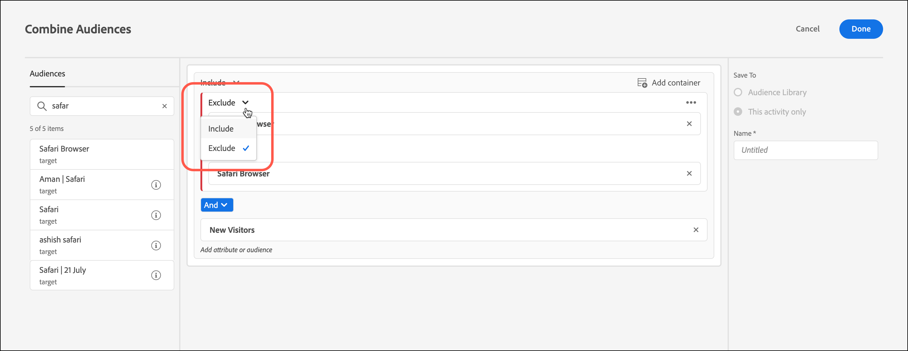
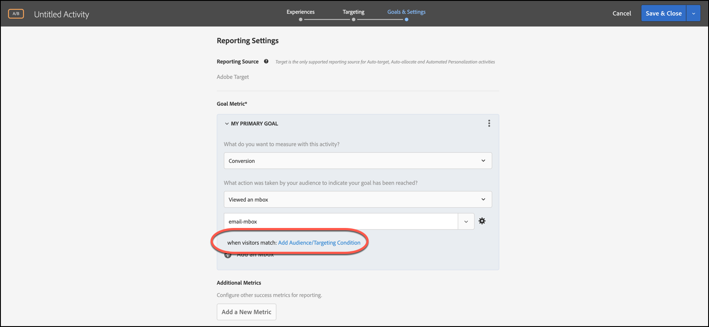
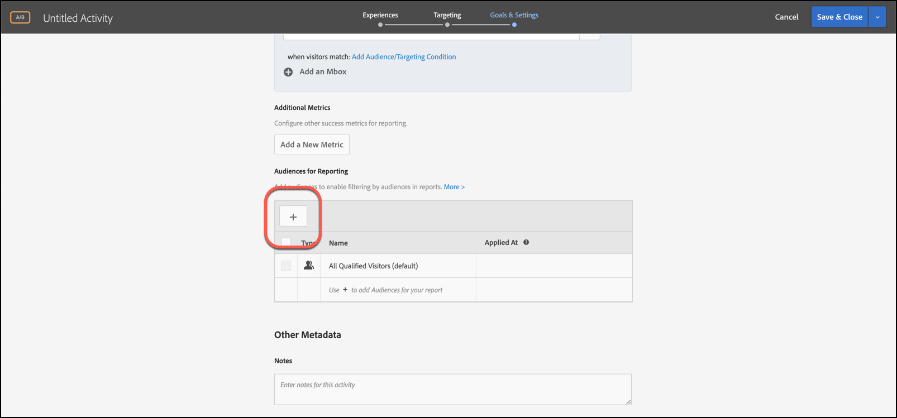

# Kombinieren mehrerer Zielgruppen

Kombinieren Sie mehrere Zielgruppen (einschließlich [!DNL Adobe Experience Cloud], [!DNL Adobe Experience Platform] und [!DNL Target] Zielgruppen) spontan, um Ad-hoc-Zielgruppen zu erstellen. Sie können auch Ausschlussregeln erstellen und darüber Zielgruppen ausschließen.

>[!NOTE]
>
>Die [!DNL Adobe Experience Platform] steht allen Kundinnen und Kunden zur Verfügung, [!DNL Target] die [Adobe Experience Platform Web SDK](https://experienceleague.adobe.com/docs/target-dev/developer/client-side/aep-web-sdk.html?lang=en){target=_blank} verwenden. Zielgruppen, die im [!DNL Adobe Experience Platform] verfügbar sind, können unverändert verwendet oder mit bestehenden Zielgruppen kombiniert werden, wie in diesem Thema erläutert.
>
>Weitere Informationen finden Sie unter [Verwenden von Zielgruppen aus Adobe Experience Platform](/help/main/c-target/c-audiences/audiences.md#aep).

Nehmen wir einmal an, Sie hätten die Zielgruppen „Neue Besucher“ und „Chrome-Anwender“ erstellt. Im Falle einer bestimmten Aktivität möchten Sie diese beiden Zielgruppen möglicherweise miteinander kombinieren, um neue Besucher mit dem Browser Chrome anzusprechen. Anstatt eine dritte Zielgruppe zu erstellen und in der [!UICONTROL Audiences]-Bibliothek zu speichern, können Sie diese beiden Zielgruppen bei der Aktivitätserstellung oder beim Bearbeiten einer vorhandenen Aktivität kombinieren.

Ein weiteres Beispiel: Sie können alle Kundinnen und Kunden ansprechen, die am Kundenbindungsprogramm teilnehmen. Sie können beispielsweise eine bestimmte [!DNL Audience Manager] Zielgruppe für den Treuestatus einbeziehen und sie mit einer [!DNL Target] Zielgruppe kombinieren, die sich aus Personen zusammensetzt, die sich während der aktuellen Sitzung für Ihr Treueprogramm angemeldet haben. Die Kombination dieser beiden Zielgruppen ist einfacher als die Erstellung einer dritten, permanenten Zielgruppe.

Sie können mithilfe der AND- und OR-Operatoren bis zu 20 Zielgruppen kombinieren.

Sie können kombinierte Zielgruppen an verschiedenen Stellen der [!DNL Target]-Oberfläche verwenden.

## Kombinierte Zielgruppe beim Erstellen einer Aktivität erstellen {#section_2F1CE9434CC04174B4BA2BFC89B85D77}

Sie können während des dreistufigen Workflows auf der Seite [!UICONTROL Target] der Aktivität eine kombinierte Ad-hoc-Zielgruppe erstellen.

1. Klicken Sie beim Erstellen [Aktivität](/help/main/c-activities/activities.md#concept_D317A95A1AB54674BA7AB65C7985BA03) auf der **[!UICONTROL Targeting]** Seite auf die drei vertikalen Ellipsen und dann auf **[!UICONTROL Replace Audience]**.

   

1. Aktivieren Sie auf der Seite **[!UICONTROL Choose Audience]** die Kontrollkästchen neben den gewünschten Zielgruppen, die Sie als Bausteine für Ihre kombinierte Zielgruppe verwenden möchten.

   Verwenden Sie das [!UICONTROL Search Audiences], um die Suche auf die gewünschte Zielgruppe einzugrenzen.

   

1. Klicken Sie oben rechts auf **[!UICONTROL Combine Multiple Audiences]** .

   

1. (Bedingt) Bearbeiten Sie die neue kombinierte Zielgruppe nach Wunsch.

   Im Dialogfeld [!UICONTROL Edit Audience] können Sie zusätzliche Bausteine für die Zielgruppe per Drag-and-Drop von der linken Seite in die neue kombinierte Zielgruppe ziehen. Sie können auch Ausschlussregeln hinzufügen und Zielgruppen ausschließen.

   1. Verwenden Sie die Drag-and-Drop-Funktion zum Hinzufügen von Audiences innerhalb eines vorhandenen Abschnitts als Baustein der Ebene 2.

      Nehmen wir beispielsweise an, dass Sie im vorhin beschriebenen Szenario auch Safari-Anwender in die kombinierte Zielgruppe aufnehmen möchten. Suchen Sie nach der Zielgruppe „Safari Browser“ und ziehen Sie sie in das Feld „Firefox Browser“ rechts, wie unten dargestellt:

      

      In diesem Fall lautet der Operator für die beiden Browsertypen „AND“. Wählen Sie die Dropdown-Liste &quot;[!UICONTROL And]&quot; aus und ändern Sie sie in „ODER“, um eine neue kombinierte Zielgruppe für neue Besucher zu erstellen, indem Sie entweder Firefox oder Safari verwenden. Achten Sie darauf, dass Ihre Regeln nicht alle Mitglieder der Zielgruppe ausschließen. So ist es beispielsweise nicht möglich, dass ein Besucher eine Seite mit Safari und gleichzeitig mit Firefox besucht.

      >[!NOTE]
      >
      >Der Operator (AND oder OR) muss beim Kombinieren von Zielgruppen gleich bleiben. Sie können Operatoren nicht mischen und passend machen.

   1. Um einen Ausschluss zu einer Regel hinzuzufügen, klicken Sie auf **[!UICONTROL Exclude]**.

      

      Zielgruppe per Drag-and-Drop ablegen.

      Um beispielsweise Besucher aus den USA von neuen Besuchern auszuschließen, könnten Sie die Zielgruppe Markt: Vereinigte Staaten in die Box ziehen.

      Diese kombinierte Zielgruppe enthält alle neuen Besucher Ihrer Site (außer denen aus San Francisco), die Safari oder Firefox verwenden.

   1. Um eine Zielgruppe aus einer Regel auszuschließen, klicken Sie auf **[!UICONTROL Exclusion]** > **[!UICONTROL Exclude this Audience.]**.

      Sie können z. B. eine kombinierte Zielgruppe erstellen, die alle neuen Besucher Ihrer Site enthält, ausgenommen diejenigen, die Firefox verwenden. Das Ausschließen der Besucher, die Firefox verwenden, ist leichter, als das Erstellen einer kombinierten Zielgruppe, die explizit mehrere Browser, außer Firefox, einschließt (Safari, Chrome und Internet Explorer).

1. Geben Sie einen beschreibenden Namen für die kombinierte Zielgruppe ein und klicken Sie dann auf **[!UICONTROL Done]**.

## Kombinierte Zielgruppe zur Verwendung beim Metrik-Targeting erstellen {#section_A42E795AFCBD4575809C5942039910F0}

Sie können auf der Seite &quot;[!UICONTROL Goals & Settings]&quot; der Aktivität eine kombinierte Ad-hoc-Zielgruppe erstellen, die beim Metrik-Targeting verwendet werden kann. So erstellen Sie beispielsweise ein Targeting basierend auf Konversionen mithilfe einer kombinierten Zielgruppe:

1. Wählen Sie beim Bearbeiten oder Erstellen [Aktivität](/help/main/c-activities/activities.md#concept_D317A95A1AB54674BA7AB65C7985BA03) auf der Seite **[!UICONTROL Goals & Settings]** die Option **[!UICONTROL Conversion]** für die Erfolgsmetrik und wählen Sie dann **[!UICONTROL Viewed an Mbox]** als Aktion aus.
1. Wählen Sie die gewünschte Mbox im Feld **[!UICONTROL Search mbox]** aus.

   

1. Klicken Sie auf das Zahnradsymbol und dann auf **[!UICONTROL Add Audience Targeting]**.
1. Klicken Sie auf den Link **[!UICONTROL Add Audience/Targeting Condition]** , um das Dialogfeld [!UICONTROL Choose Audience] anzuzeigen.

   

1. Fahren Sie mit [Schritt 2](/help/main/c-target/combining-multiple-audiences.md#section_2F1CE9434CC04174B4BA2BFC89B85D77) unter „Erstellen einer kombinierten Zielgruppe bei Erstellung einer Aktivität“ fort, um die kombinierte Zielgruppe zu erstellen.

## Kombinierte Zielgruppe zur Verwendung in Berichten erstellen {#section_4682D342EFBB43C38E54B99B3A1E14CD}

Sie können eine kombinierte Ad-hoc-Zielgruppe auf der [!UICONTROL Goals & Settings] der Aktivität erstellen, die in Berichten verwendet werden soll.

1. Klicken Sie beim Bearbeiten oder Erstellen [Aktivität](/help/main/c-activities/activities.md#concept_D317A95A1AB54674BA7AB65C7985BA03) auf der **[!UICONTROL Goals & Settings]** Seite unter [!UICONTROL Audiences for Reporting] auf das **[!UICONTROL Add Audience]**, um die [!UICONTROL Choose Audience] anzuzeigen.

   

1. Fahren Sie mit [Schritt 2](/help/main/c-target/combining-multiple-audiences.md#section_2F1CE9434CC04174B4BA2BFC89B85D77) unter „Erstellen einer kombinierten Zielgruppe bei Erstellung einer Aktivität“ fort, um die kombinierte Zielgruppe zu erstellen.

## Kombinierte Zielgruppe beim Bearbeiten einer Aktivität erstellen {#section_364A12CE96E04B61B7C18113AA586C2C}

Sie können eine kombinierte Ad-hoc-Zielgruppe erstellen, während Sie eine bestehende Aktivität bearbeiten.

1. Bewegen Sie auf der Seite [!UICONTROL Activities] den Mauszeiger über die gewünschte Aktivität und klicken Sie dann auf das Symbol **[!UICONTROL Edit]** .

   Oder

   Klicken Sie auf die gewünschte Aktivität, um sie zu öffnen, und klicken Sie dann auf **[!UICONTROL Edit Activity]**.

1. Klicken Sie auf **[!UICONTROL Configure]** > **[!UICONTROL Audiences]** > **[!UICONTROL Multiple Audiences]**.

   

1. Klicken Sie auf das Symbol Mehr Optionen (drei vertikale Auslassungspunkte) neben der aktuellen Audience der Aktivität und dann auf **[!UICONTROL Change Audience]**.

   

1. Fahren Sie mit [Schritt 2](/help/main/c-target/combining-multiple-audiences.md#section_2F1CE9434CC04174B4BA2BFC89B85D77) unter „Erstellen einer kombinierten Zielgruppe bei Erstellung einer Aktivität“ fort, um die kombinierte Zielgruppe zu erstellen.
