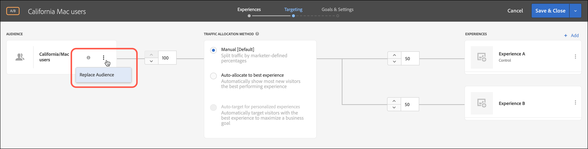
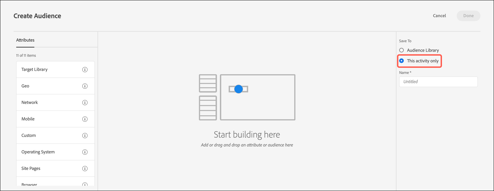

# Erstellen einer Zielgruppe „Nur Aktivität“

Erstellen Sie beim Erstellen einer Aktivität Zielgruppen „Nur Aktivität“ aus dem [!DNL Adobe Target] dreistufigen Workflow. Diese Ad-hoc-Zielgruppen können an anderen Stellen innerhalb derselben Aktivität verwendet werden, werden jedoch nicht in der [!UICONTROL Zielgruppenbibliothek] zur Verwendung in anderen Aktivitäten gespeichert.

Zielgruppen „Nur Aktivität“ bieten die folgenden Vorteile:

* Sie können Zielgruppen nur für Aktivitäten verwenden, um eine Zielgruppe zu erstellen, die Sie nur einmal verwenden möchten und nicht in der [!UICONTROL Zielgruppenbibliothek“ &#x200B;]. Zielgruppen auf Aktivitätsbasis verhindern, dass die [!UICONTROL Zielgruppenbibliothek] mit Zielgruppen überladen wird, die Sie nie wieder verwenden möchten.
* Zielgruppen, die nur eine Aktivität aufweisen, sind in der [!UICONTROL Zielgruppenbibliothek“ nicht &#x200B;]. Da diese Zielgruppen in der Bibliothek nicht sichtbar sind, werden sie von unerwünschten Änderungen durch andere Personen in Ihrer Organisation abgeschirmt.

1. Klicken Sie beim Erstellen [Aktivität](/help/main/c-activities/activities.md#concept_D317A95A1AB54674BA7AB65C7985BA03) auf der Seite **[!UICONTROL Targeting]** auf die drei vertikalen Ellipsen und dann auf **[!UICONTROL Zielgruppe ersetzen]**.

   

1. Klicken Sie auf **[!UICONTROL Zielgruppe erstellen]**.

1. Klicken Sie **[!UICONTROL Nur diese Aktivität]**.

   

1. Geben Sie einen beschreibenden Namen für die Zielgruppe ein.
1. Ziehen Sie die gewünschten Attribute per Drag-and-Drop in den Audience Builder.

   Regeln ermöglichen es, Ihre Zielgruppe auf eine Untergruppe Ihrer Site-Besucher zu beschränken. Jeder Regeltyp hat eigene Parameter. Weitere Informationen zum Konfigurieren der einzelnen Typen von Zielgruppenregeln finden Sie unter [Kategorien für Zielgruppen](/help/main/c-target/c-audiences/c-target-rules/target-rules.md#concept_E3A77E42F1644503A829B5107B20880D).

1. Klicken Sie auf **[!UICONTROL Fertig]**.

## Zu beachten

Berücksichtigen Sie beim Arbeiten mit Zielgruppen „Nur Aktivität“ folgende Informationen:

* Zielgruppen nur für Aktivitäten können im [!UICONTROL Visual Experience Composer] (VEC) oder im [!UICONTROL formularbasierten Experience Composer) &#x200B;]. Diese Funktion ersetzt Verfeinerungsregeln in früheren Versionen von [!DNL Target].
* Sie können eine Aktivität erstellen, die in der [!UICONTROL Zielgruppenbibliothek“ gespeichert &#x200B;] für die Wiederverwendung in anderen Aktivitäten verwendet wird, oder eine Zielgruppe, die nur für Aktivitäten erstellt wird. Wenn Sie die Zielgruppe gespeichert haben, können Sie den Zielgruppentyp nicht mehr ändern.
* Verfeinerungen für vorhandene Aktivitäten werden in Zielgruppen „Nur Aktivität“ migriert.
* Zielgruppen, die nur eine Aktivität enthalten, haben den Status [!UICONTROL Verwendet] oder [!UICONTROL Nicht verwendet]. Nicht verwendete Zielgruppen „Nur Aktivität“ werden angezeigt, bis die Aktivität gespeichert wird. Wenn Sie sie nicht verwenden und versuchen, die Aktivität zu speichern, wird Ihnen ein Warnhinweis angezeigt, der Sie darauf hinweist, dass die nicht verwendete Zielgruppe „Nur Aktivität“ gelöscht wird.
* Sie können die Details zur Zielgruppendefinition über Pop-up-Karten in der Zielgruppenauswahl anzeigen, ohne die Zielgruppe zu öffnen.
* Sie können [mehrere Zielgruppen kombinieren](/help/main/c-target/combining-multiple-audiences.md#concept_A7386F1EA4394BD2AB72399C225981E5), um „Nur Aktivität“-Zielgruppen zu erstellen.
* Reine Aktivitäts-Zielgruppen unterstützen keine Ausschlussregeln.

  Sie können die folgenden Alternativen verwenden, um Ausschlussregeln zu verwenden:

   * [Erstellen und Verwenden einer Bibliotheks](/help/main/c-target/c-audiences/create-audience.md)-Zielgruppe anstelle einer Zielgruppe, die nur für die Aktivität verwendet wird.
   * [Kombinieren Sie &#x200B;](/help/main/c-target/combining-multiple-audiences.md#concept_A7386F1EA4394BD2AB72399C225981E5) (bis zu 20) Bibliotheks-Zielgruppen zu einer Zielgruppe, die nur für Aktivitäten vorgesehen ist. Beim Kombinieren von Zielgruppen können die Regeln zum Ein- und Ausschließen in einzelnen Bibliotheks-Zielgruppen auch dann verwendet werden, wenn die kombinierte Zielgruppe als reine Aktivitäts-Zielgruppe gespeichert wird.
